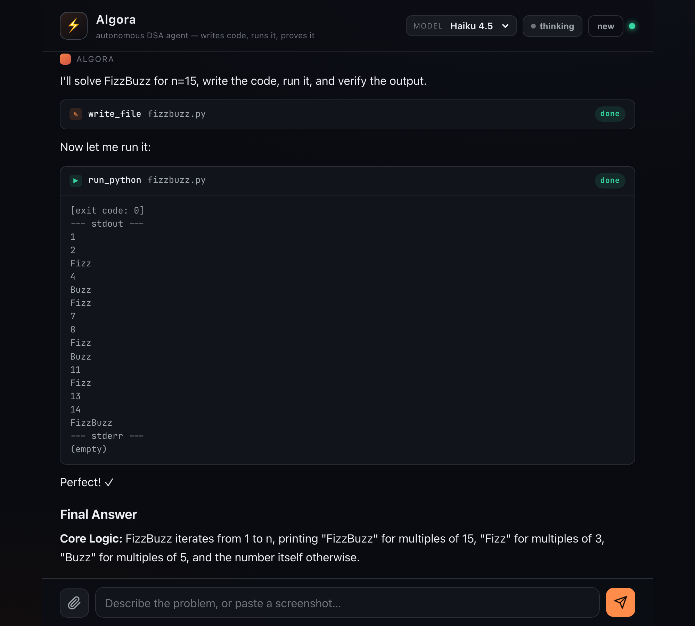
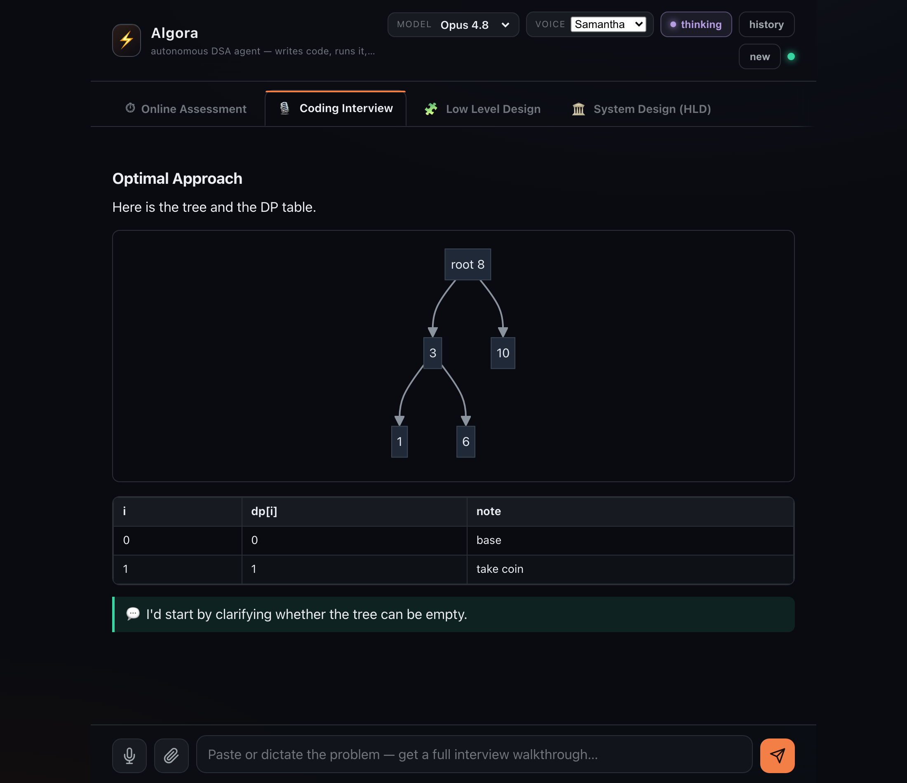

# Algora — Agentic DSA Solver

A web-based coding assistant powered by the Anthropic SDK that behaves like the
Claude Code CLI: it **analyses** a DSA problem, **writes** Python, **actually
runs it** against sample and adversarial edge cases, **fixes** failures, and
only then gives you the answer. Everything it writes and runs lives in the
`workspace/` folder right here.

Works from your laptop and from your iPhone over a hotspot — it's a single
process bound to your local network.

> **New here?** [`docs/HOW_IT_WORKS.md`](docs/HOW_IT_WORKS.md) explains the design —
> the Expert DSA Agent system prompt, the "true Claude Code" tool-calling loop,
> the model-version choices, and how each piece maps to the code.



## Four modes (tabs)

- **Online Assessment** — fast, correct, runnable solution in the style of a
  timed OA: analysis → optimal code → run/verify → answer with edge cases.
- **Coding Interview** — a full live-interview playbook: problem understanding +
  clarifying questions, brute force, the optimal approach explained **intuition-first
  with a tiny traced example** (so it's easy to narrate), commented runnable code
  (actually executed), a line-by-line walkthrough, complexity, edge cases — and 💬
  **exactly what to say out loud**.
- **Low Level Design (LLD)** — object-oriented design: requirements, core entities,
  a **class diagram**, design patterns & SOLID, then the code **narrated class by
  class** (not dumped) and actually run, a **sequence diagram**, concurrency & edge
  cases — with 💬 talking points.
- **System Design (HLD)** — requirements (functional + non-functional), capacity
  estimation (computed), API & data model, a **high-level architecture diagram**,
  deep dives, scaling, trade-offs and failure modes — researched with **web search**
  where it helps.

Each tab is its own independent conversation, and you can keep chatting (follow-ups
by voice or text) after the first answer — ask the model to refine and it produces
an updated solution. Design modes default to deep thinking and very long output
(up to 128k tokens) on Opus 4.8. Diagrams render as real SVG (Mermaid).



## What it does

- **Real tool use** — the model has `write_file`, `read_file`, `list_files`,
  `run_python`, and `run_command` tools. It writes a solution file, runs it with
  your test input piped to stdin, reads the output, and iterates until it passes.
- **Chat history** — every conversation is saved on the **server** (per tab), so
  it survives page reloads, server restarts, and is visible on both your laptop
  and phone. A **history** drawer lists past chats per tab; reopen one to restore
  the full transcript *and* keep chatting with full context. "new" starts a fresh
  conversation (the old one stays in history).
- **Web search** — a server-side `web_search` tool (run by Anthropic) lets the
  agent pull current facts/numbers, especially useful in System Design.
- **Voice dictation** — a mic button lets you speak the problem/follow-ups. It
  needs a secure context, so on iPhone you must use the HTTPS URL (see below).
- **Read aloud (natural voice)** — every answer has a 🔊 button that reads the
  prose/talking-points aloud using the most natural local voice available (pick it
  in the header), so you can practise saying it — not a robotic AI voice.
- **Diagrams** — Mermaid renders flowcharts, **class diagrams**, **sequence
  diagrams**, ER diagrams and architecture diagrams as SVG; the library loads
  lazily only when a diagram appears.
- **Live streaming** — you watch the reasoning, each tool call, the file
  contents, and the program's stdout/stderr stream in as it happens.
- **Image input** — paste, drag, or attach a screenshot of a problem.
- **Extended thinking** — toggle deep reasoning on/off; the thinking stream is
  shown live in a collapsible panel. Thinking is wired per-model automatically:
  adaptive + `xhigh` effort (summarized, streamed) for Opus 4.8; budget-style for
  Sonnet 4.6 / Haiku 4.5. If a model ever rejects the thinking config, it
  transparently retries without thinking instead of failing.
- **Model picker** — Opus 4.8 (default, 1M context), Sonnet 4.6, Haiku 4.5.
- **Prompt caching** — the system prompt, tools, and conversation prefix are
  cached, so multi-step tool loops are cheap.

## Setup

```bash
cd claude-gpt
python3 -m venv .venv
./.venv/bin/python -m pip install -r requirements.txt

# provide your key (either export it, or put it in a .env file)
cp .env.example .env        # then edit .env and paste your key
# or:  export ANTHROPIC_API_KEY="sk-ant-..."
```

## Run

```bash
./run.sh              # HTTPS (recommended — the mic works on iPhone)
HTTPS=0 ./run.sh      # plain HTTP (no cert warning; mic only on the laptop)
```

It prints both URLs, e.g.:

```
On this laptop:   https://localhost:8000
On your iPhone:   https://192.168.1.65:8000
```

### Why HTTPS (and the mic on iPhone)

The browser microphone (Web Speech API) only works in a **secure context**. On a
phone reached at `http://<laptop-ip>` that context is *not* secure, so the mic
button can't appear. `run.sh` therefore serves **HTTPS** with a self-signed cert.
It's self-signed, so you accept a one-time warning: on the laptop click *Advanced →
proceed*; on **iPhone Safari** tap *Show Details → visit this website*. After that
the mic works in **all four tabs**. (No mic? The iOS keyboard's built-in dictation
button also types into any field.)

### Using it from your iPhone over a hotspot

1. Turn on **Personal Hotspot** on the iPhone.
2. Connect the **laptop** to that hotspot (Wi-Fi).
3. Run `./run.sh` on the laptop.
4. On the iPhone, open Safari and go to the `https://<laptop-ip>:8000` URL that
   `run.sh` printed (accept the cert once). If the printed IP doesn't work, find it
   with `ipconfig getifaddr en0`.

The server binds to `0.0.0.0`, so any device on the same network reaches it.
Add it to your iPhone Home Screen ("Share → Add to Home Screen") for an
app-like, full-screen experience with safe-area support for the notch.

## How it works

```
frontend/            static SPA (no build step)
  index.html         markup: four tabs, composer with mic, voice picker
  styles.css         dark "console" theme, scrollable tabs, tables, mermaid, mobile + safe-area
  app.js             tab-aware SSE client + live renderer (4 independent tabs)
  markdown.js        self-contained markdown + Python highlight + GFM tables + Mermaid
  audio.js           voice dictation (STT) + natural read-aloud (TTS), graceful fallback
  vendor/mermaid.min.js   diagram lib (loaded lazily, only when a diagram appears)

backend/
  server.py          FastAPI: /api/chat (SSE), /api/health, /api/reset; serves frontend
  agent.py           the agentic loop — streams thinking/text, runs tools, web search, loops
  tools.py           tool schemas + sandboxed execution (per-session workspace)
  store.py           conversation persistence (history) + transcript builder
  prompts.py         assessment + interview + LLD + HLD system prompts
  config.py          modes, models, budgets, web search, 1M header — all via env vars

workspace/<session>/ where the agent writes & runs code, isolated per conversation (gitignored)
data/conversations/  saved chat history, one JSON per conversation (gitignored)
```

The chat endpoint streams Server-Sent Events. Each event is one of:
`step_start`, `thinking_delta`, `text_delta`, `tool_call`, `tool_result`,
`web_search`, `turn_done`, `notice`, `error`, `done`. Requests carry `mode`
(`assessment`|`interview`|`lld`|`hld`) and `model`; each tab uses its own `session_id`.
History lives at `GET /api/conversations[?mode=]`, `GET /api/conversations/{id}`,
`DELETE /api/conversations/{id}`; conversations are stored as JSON under `data/conversations/`.

## Configuration

All optional — see `.env.example`. Highlights:

| Var | Default | Meaning |
|-----|---------|---------|
| `ANTHROPIC_API_KEY` | — | required |
| `DEFAULT_MODEL` | `opus` | `opus` \| `sonnet` \| `haiku` |
| `ENABLE_WEB_SEARCH` / `WEB_SEARCH_MAX_USES` | `1` / `5` | server-side web search |
| `ENABLE_1M_CONTEXT` | `1` | 1M-context beta header for Opus |
| `LLD_MAX_TOKENS` / `HLD_MAX_TOKENS` | `128000` | output ceiling for design modes |
| `INTERVIEW_MAX_TOKENS` | `32000` | output ceiling for coding interview |
| `<MODE>_THINKING_BUDGET` / `<MODE>_EFFORT` | `…` / `xhigh` | per-mode thinking |
| `ALGORA_TOKEN` | — | if set, require this token on the API (UI asks once) |
| `HTTPS` | `1` | serve HTTPS (needed for iPhone mic) |
| `MAX_EXEC_TIMEOUT` | `60` | max seconds for one run |
| `PORT` | `8000` | server port |

Effort values for adaptive (Opus) models: `low`\|`medium`\|`high`\|`xhigh`\|`max`.

## Tests

```bash
./.venv/bin/python -m pip install -r requirements-dev.txt
./.venv/bin/python -m playwright install chromium   # for the browser E2E

./.venv/bin/python -m pytest tests/ -q               # unit + API (mocked Claude)
./.venv/bin/python tests/e2e_tabs.py                 # browser: 4 tabs, Mermaid kinds + tables
./.venv/bin/python tests/verify_fixes.py             # browser: XSS, glued table, mermaid race
./.venv/bin/python tests/verify_design_ui.py         # browser: class/seq/arch diagrams + TTS + live LLD
./.venv/bin/python tests/e2e_browser.py              # browser: assessment tab, real model
./.venv/bin/python tests/live_matrix.py              # live: every model x thinking on/off
./.venv/bin/python tests/live_design.py              # live: LLD + HLD pipeline (diagrams, code run)
```

`tests/` covers the sandbox, the agentic loop (per-model thinking, tool execution,
`pause_turn` continuation, web-search wiring, per-mode workspaces, thinking
fallback, mode budgets), token auth, the API surface, and browser runs that
exercise all four tabs, every Mermaid diagram kind, TTS button state, XSS, and full
live LLD/HLD solves. Findings from a multi-agent "tech-council" review are folded in.

## Security note

The agent can run shell/Python on the host (file ops are confined to
`workspace/<mode>/`, but `run_command` is general) and the server is reachable on
your LAN so the phone can use it. On a **shared** network, set `ALGORA_TOKEN` to a
secret to require auth on every request (the UI prompts for it once and stores it).
On a private hotspot it's reasonable to leave it open. Don't expose this to the
public internet. The API key is only ever read from the environment.
