# Design a Web Crawler

> 🎙️ "Here's how I'll structure this: I'll lock the requirements and rough scale, sketch the API and data model, draw the high-level design one requirement at a time — frontier, fetch, parse-and-dedup, store, schedule — then go deep on the two or three hardest parts: the URL frontier with politeness, dedup at billions scale, distributed coordination, and freshness. I'll check in with you as I go. Sound good?"

The core tension of a crawler is this: we want to fetch billions of pages **as fast as possible**, but every external site forces us to fetch **as politely as possible** — and those two goals fight each other. The whole design is really about resolving that fight at scale.

> 🏢 I'll target an **Amazon-style senior (SDE-3 / L5)** bar — cost and operations are first-class, I work backwards from the consumer of the crawl (the search index / ML pipeline), and I decide and move rather than studying reversible choices forever. Tell me if you'd rather I tilt elsewhere.

---

## 1. Requirements (Functional + Non-Functional)

The crawler is a pipeline: **seed URLs → frontier → fetch → parse → dedup → store → re-schedule.** I'll frame the requirements around that loop.

### Functional (the core flows — "above the line")

**FR1 — Fetch a page given a URL, respecting robots.txt and politeness.**
The crawler pulls a URL off the frontier, checks the site's rules, and downloads the HTML.
- 🗣️ **Plain words:** "We go to a web address and download the page, but only after we've checked the site's 'rules of the house' file and made sure we're not hammering them too fast."
- ⚡ **Why it's hard:** we may want 12 thousand fetches a second globally, but a single site might only tolerate one request a second — so we can't just fire requests; we have to pace per-site without idling our fleet.

**FR2 — Extract links and feed new URLs into the frontier (the discovery loop).**
Parse the downloaded page, pull out every outbound link, normalize it, and enqueue the ones we haven't seen.
- 🗣️ **Plain words:** "Every page we download has links to other pages. We collect those links so we know what to crawl next — that's how the crawl grows from a few seeds to billions of pages."
- ⚡ **Why it's hard:** one page yields ~60 links, so we discover ~700 thousand URLs a second — the vast majority already seen. We must answer "have I seen this URL?" billions of times a second without a database round-trip on each.

**FR3 — Deduplicate URLs and near-duplicate content.**
Never enqueue a URL we've already crawled; never store a page that's a near-copy of one we already have.
- 🗣️ **Plain words:** "The web is full of the same thing many times — the same article on five mirror sites, the same page with a tracking tag tacked on. We avoid wasting time and storage on copies."
- ⚡ **Why it's hard:** URL dedup is exact-match over 100 billion strings; content dedup is *fuzzy* — "almost the same" — which an exact hash can't catch. Two different problems, two different tools.

**FR4 — Store the crawled content and its metadata for downstream consumers.**
Persist the raw HTML (compressed) plus a per-URL record: status, fetch time, content hash, next-recrawl time.
- 🗣️ **Plain words:** "We keep a copy of every page we download, plus a little index card per page saying when we got it and whether it changed, so search and ML teams can use it."
- ⚡ **Why it's hard:** ~2.3 PB of content and 100 billion metadata rows — the storage tier and the metadata store have completely different access patterns and can't be the same database.

**FR5 — Re-crawl pages on a freshness schedule (recrawl / staleness).**
Pages aren't crawled once; news sites change hourly, archives change yearly. We re-queue URLs based on observed change rate.
- 🗣️ **Plain words:** "A news homepage is stale in minutes; a 2009 blog post never changes. We revisit fast-changing pages often and slow-changing pages rarely, instead of treating everything the same."
- ⚡ **Why it's hard:** if we recrawl everything uniformly we either waste 90% of our fetch budget on dead pages or let the news index go stale — we need a per-URL adaptive schedule.

### Below the line (out of scope for this session)
- Rendering JavaScript / headless-browser crawling (we fetch raw HTML; JS-rendering is a separate fetcher pool we can bolt on).
- Full-text search / ranking / the index itself (we are the *producer*; search is the *consumer*).
- Focused/vertical crawling, sentiment, entity extraction, image/video crawling.
- Authentication / crawling behind logins or paywalls.
- Legal/PII redaction policy (we honor robots + a blocklist; policy is a separate concern).

### Non-Functional (talkable targets)

**NFR1 — Politeness is sacred.** Never exceed a site's `Crawl-delay` (default ~1 request/sec/domain), always honor robots.txt, and back off on 429/503.
- 🗣️ **Plain words:** "We are guests on every site we visit — we never knock more than the site says it can handle."
- 💥 **What breaks without it:** we DDoS sites, get our IP ranges permanently blocked, and possibly face legal action — a crawler that's banned everywhere crawls nothing.

**NFR2 — Throughput ~12K pages/sec sustained (~1B pages/day), ~23K/s at peak.**
- 🗣️ **Plain words:** "Steady state, we download about twelve thousand pages every second — a billion a day — and we can burst to twice that."
- 💥 **What breaks without it:** a full refresh of 30B pages would take months instead of weeks, and the index goes permanently stale.

**NFR3 — Robustness / no-poison: survive crawler traps, malformed pages, infinite redirect loops, and giant responses.**
- 🗣️ **Plain words:** "Some sites generate infinite fake pages on purpose, or serve a 10 GB file to choke us. We must not get stuck or fall over."
- 💥 **What breaks without it:** one calendar-generating site (next-day-forever links) silently eats our entire frontier and the crawl stalls.

**NFR4 — Availability of the pipeline ~99.9% (the crawl loop keeps making progress).** Individual fetches can fail freely; the *system* must keep advancing.
- 🗣️ **Plain words:** "It's fine if any one page fails — the web is flaky. What can't happen is the whole crawl grinding to a halt."
- 💥 **What breaks without it:** if the frontier coordinator goes down with no failover, the entire fleet idles and we burn money fetching nothing.

**NFR5 — Durability of the frontier and metadata (RPO near zero for what-to-crawl-next).** We can re-fetch a lost *page*; we must not lose the *queue of work* or the seen-set.
- 🗣️ **Plain words:** "If we crash, we can always re-download a page — but we must not forget what we've already done and what's left to do."
- 💥 **What breaks without it:** lose the seen-set and we re-crawl the entire web from scratch, wasting weeks of fetch budget.

> ⚠️ **Gaps I'd flag out loud:** "Content dedup is *fuzzy*, so 'duplicate' is a tunable threshold, not a yes/no — I'll surface where I draw that line in the deep dive rather than pretend it's exact."

> 💬 "The headline tension is throughput versus politeness — I want billions of pages fast, but every site caps me. Everything downstream — the frontier shape, dedup, scheduling — falls out of resolving that one tension."

> 🎙️ **Script:** "So this is a pipeline: seed URLs flow into a frontier, fetchers pull from it politely, we parse out new links, dedup both the URLs and the content, store what's new, and reschedule pages for recrawl based on how often they change. The five core flows are fetch-politely, discover-links, dedup, store, and recrawl. The non-functionals that drive everything are politeness — which is non-negotiable — and throughput of about twelve thousand pages a second. The one weakness I'll call out early is that content dedup is fuzzy, so I'll have to defend the threshold I pick."

---

## 2. Clarifying Questions & Assumptions

**Q1 — "Are we crawling the open web broadly, or a focused vertical like just news or just e-commerce?"**
- 🗣️ **Why I'm asking:** "If it's the whole open web, dedup and the frontier are the hard part; if it's a focused vertical, the hard part shifts to relevance and seed selection."
- ↔️ **Design fork:** If broad → general frontier + huge dedup + freshness scheduling (the design I'll build). If focused → add a classifier/scorer at parse time to drop off-topic links before they hit the frontier.
- **Assumption:** Broad open-web crawl feeding a general search/ML corpus.

**Q2 — "What's the target corpus size and how fresh does it need to be?"**
- 🗣️ **Why I'm asking:** "The corpus size sets storage and dedup memory; the freshness target sets the recrawl budget — and freshness, not size, is usually what forces the hard scheduling work."
- ↔️ **Design fork:** If 'crawl once, rarely refresh' → freshness is trivial, skip §6.5. If 'keep ~30B pages fresh on a ~30-day cycle' → adaptive recrawl scheduling becomes a core flow.
- **Assumption:** ~30B pages, full refresh cycle ~30 days, with hot pages (news) refreshed far more often.

**Q3 — "Do we render JavaScript, or is fetching raw HTML enough?"**
- 🗣️ **Why I'm asking:** "Rendering JS needs a headless browser per fetch — roughly 50x the CPU and memory — so it completely changes the fetcher fleet sizing."
- ↔️ **Design fork:** If raw HTML → lightweight async fetchers, ~100 workers. If JS-render → a separate, much larger headless pool, and we'd tier URLs into render-needed vs not.
- **Assumption:** Raw HTML for the main fleet; JS-rendering is a pluggable secondary pool, out of scope here.

**Q4 — "How strict is politeness — do we honor Crawl-delay and adapt to 429s, and is there a global per-domain QPS cap?"**
- 🗣️ **Why I'm asking:** "Politeness is the single constraint that forces the frontier to be per-domain queues instead of one big queue — I want to confirm it's hard, not best-effort."
- ↔️ **Design fork:** If strict → per-domain politeness queues + a host-rate-limiter are mandatory (my design). If best-effort → a simpler global priority queue could work, but I wouldn't recommend it.
- **Assumption:** Strict — honor robots `Crawl-delay`, default 1 req/sec/domain, exponential backoff on 429/503.

**Q5 — "Is duplicate detection exact, or do we need near-duplicate (same article, different URL) detection too?"**
- 🗣️ **Why I'm asking:** "Exact dup is a cheap checksum; near-dup needs a similarity fingerprint like simhash, which is a different and harder mechanism."
- ↔️ **Design fork:** If exact only → a content checksum in the metadata store. If near-dup → simhash + a banding/LSH index for similarity lookups.
- **Assumption:** Both — exact URL dedup via Bloom filter, near-duplicate content dedup via simhash.

> 🤝 **Checkpoint:** "I'm going to assume a broad open-web crawl of about 30 billion pages on a 30-day refresh, raw-HTML fetching, strict politeness, and both exact-URL and near-duplicate content dedup. If any of those is wrong — especially strict politeness or the freshness target — tell me now, because those two choices shape the whole architecture."

---

## 3. Scale & Capacity (talkable numbers)

I computed these by writing and running `capacity.py` — only the rounded results are below.

*Glossary as we go:* **QPS** — queries (here, fetches) per second. **Frontier** — the queue of URLs waiting to be crawled. **Bloom filter** — a tiny probabilistic set that answers "have I seen this?" using bits, not the full strings. **FP** — false positive, a wrong "yes". **Politeness delay** — the minimum gap between two fetches to the same site.

| Metric | Derivation (step-by-step) | Rounded | Talkable phrase | Decision it drives |
|---|---|---|---|---|
| Fetch QPS (steady) | 30B pages ÷ (30 days x 86,400 s) = 11,574/s | ~12K/s | "about twelve thousand fetches a second" | Fetcher fleet size + bandwidth |
| Fetch QPS (peak) | 12K x 2 diurnal factor | ~23K/s | "burst to about twenty-three thousand" | Headroom in fleet + queues |
| URLs discovered/s | 12K fetch/s x 60 links/page | ~700K/s | "seven hundred thousand links a second to check" | Dedup must be in-memory, not DB |
| New URLs enqueued/s | 700K/s x 2% new (post-dedup) | ~14K/s | "about fourteen thousand new URLs a second" | Frontier write throughput |
| URL dedup Bloom RAM | 100B URLs, 1% FP → 9.6 bits/url → ~960 Gbit | ~120 GB | "roughly a hundred-and-twenty gigs of bits" | Sharded distributed Bloom filter |
| URL dedup vs exact set | exact = 100B x 16B hash = 1.6 TB; Bloom = 120 GB | ~13x smaller | "Bloom is about thirteen times leaner" | Why Bloom, not a hash set |
| Content fingerprints | 30B docs x 8B simhash | ~240 GB | "a couple hundred gigs of fingerprints" | Simhash index sizing |
| Content storage | 30B x 25 KB compressed x3 replication | ~2.3 PB | "a couple of petabytes" | Object store, not a DB |
| URL metadata store | 100B rows x 1 KB x3 replication | ~300 TB | "a few hundred terabytes of index cards" | Sharded wide-column store |
| Ingress bandwidth | 12K/s x 80 KB x 8 bits | ~8 Gbps | "about eight gigabits a second of download" | Multi-region egress IP pool |
| **Active domains needed** | **12K fetch/s ÷ (1 fetch/s/domain) = 11,574** | **~12K** | **"twelve thousand sites crawling in parallel"** | **THE frontier shape decision** |

### The ONE decision-forcing number
**~12K fetches/sec, but politeness caps each domain at ~1 fetch/sec → we need ~12,000 *different* domains being crawled in parallel at all times.**

That single fact kills the obvious design (one global priority queue) dead: if the top of a global queue happened to be 100 URLs from `cnn.com`, we'd either violate politeness or stall 11,900 idle workers. So the frontier **must** be sharded into per-domain queues with a round-robin selector across hot domains.

- 🗣️ "The math that forces my whole frontier design is this: I want twelve thousand fetches a second, but I'm only allowed one a second per site — so I need twelve thousand sites going at once. That means I can't have one queue; I need a queue per domain."
- **Flip threshold:** if average politeness loosened to 1 fetch every 10 s (more conservative), we'd need ~115K active domains in parallel — even *more* reason for per-domain sharding. The decision never flips toward a global queue; it only gets more extreme.

> 🎙️ **Script:** "The number that matters is twelve thousand fetches a second against a one-per-second-per-site cap — so I need roughly twelve thousand sites crawling at the same time. That single ratio is why the frontier is per-domain queues, not one global queue. Storage is a couple of petabytes and metadata a few hundred terabytes — big but boring; I won't spend airtime there. The interesting spend is on the frontier and dedup."

---

## 4. Core Entities

*(First draft of the nouns — full fields come in §7.)*

**URL Record** — the canonical entry per normalized URL: its status (seen / queued / fetched / failed), last-fetch time, content hash, priority/score, and next-recrawl time.
- 🗣️ **Analogy:** "Think of it like an index card per web address — where it is, when we last visited, what we found, and when to go back."
- ⚠️ **Probe:** "How do you avoid two URLs that are really the same page?" → URL normalization (lowercase host, strip default ports, sort query params, drop tracking tags) produces one canonical key before it ever touches dedup.

**Frontier** — the prioritized, politeness-aware set of per-domain queues holding URLs waiting to be fetched.
- 🗣️ **Analogy:** "Like a deli with one ticket line per counter — each counter (domain) serves one customer at a time, and a manager decides which counters to staff right now."
- ⚠️ **Probe:** "What stops a domain with a million links from starving everyone else?" → per-domain queues are independent; the selector round-robins across domains, so one big domain just makes its own queue long, not everyone's.

**Domain (Host) Policy** — per-domain state: cached robots.txt rules, Crawl-delay, last-fetch timestamp, current backoff, and politeness budget.
- 🗣️ **Analogy:** "The 'rules of the house' sticky note for each site — how often we're allowed in and which doors are off-limits."
- ⚠️ **Probe:** "robots.txt changes — how fresh is your copy?" → cached with a 24h TTL; on miss or expiry we fetch it first and block that domain until it returns.

**Document (Crawled Content)** — the stored page body (compressed HTML) plus its content fingerprints (exact checksum + simhash).
- 🗣️ **Analogy:** "The photocopy of the page we keep in the filing cabinet, with a fingerprint stapled on so we can tell if we've filed a near-copy before."
- ⚠️ **Probe:** "Two URLs, identical content — store twice?" → no; the content checksum/simhash dedups at store time, and both URL records point at the same Document id.

**Crawl Job / Schedule** — the recrawl scheduling state: change-rate estimate and the computed next-fetch time per URL.
- 🗣️ **Analogy:** "A reminder calendar — 'check the news homepage again in 10 minutes, that old blog post in a year.'"
- ⚠️ **Probe:** "How do you learn the change rate?" → compare content hash across fetches; if it changed, shorten the interval, if not, lengthen it (adaptive, à la "if-modified-since").

> 🎙️ **Script:** "The nouns are the URL Record — the index card per address; the Frontier — the per-domain queues of what to fetch next; the Domain Policy — each site's rules and our politeness state; the Document — the stored page plus its fingerprints; and the Schedule — when to revisit. The one to watch is the URL Record, because URL normalization is what makes dedup actually work. I'll flesh out fields and stores in the data model."

---

## 5. API / Interface

A crawler is mostly internal, so the "API" is the contract between pipeline stages plus a small control/admin surface. I'll default to a mix of an internal queue protocol and a thin REST control plane. Security note up front: **internal services authenticate via mTLS/JWT; nothing trusts a client-supplied priority or a raw URL without normalizing and re-checking robots server-side.**

**5.1 Submit seed URLs (FR1/FR2) — `POST /v1/seeds`**
POST because it creates new frontier state.
- `urls: string[]` — seed addresses to start/expand the crawl.
- `priority: int` (optional, server-clamped) — hint only; the server re-scores so a caller can't starve others.
- `source: string` — who submitted (audit + rate-limit by source).
- *Server-set, not in request:* the normalized canonical URL, the dedup decision, the assigned domain shard.
```
// Request
POST /v1/seeds
{ "urls": ["https://news.example.com", "http://Example.com:80/a?utm_source=x"], "priority": 5, "source": "ops-console" }

// Response 202
{ "accepted": 2, "enqueued": 1, "deduped": 1, "normalized": ["https://news.example.com/", "http://example.com/a"] }
```
- **Key decision:** returns **202 Accepted**, not 200 — enqueue is async, and we report how many were *new* vs deduped so the caller sees the dedup working. Notice `utm_source` was stripped server-side.

**5.2 Fetcher pulls work (FR1) — `POST /v1/frontier/lease`**
POST (not GET) because leasing *mutates* state: it hands out a batch and marks it in-flight with a lease timeout.
- `workerId: string` — who's leasing (for lease ownership + crash recovery).
- `maxBatch: int` — how many URLs to take.
- *Server-set:* which domains this worker may touch (the selector enforces politeness, the worker never picks).
```
// Request
POST /v1/frontier/lease
{ "workerId": "fetcher-07", "maxBatch": 50 }

// Response 200
{ "lease": "lz_9f3", "urls": [ {"url":"https://a.com/p1","domain":"a.com","crawlDelayMs":1000}, ... ], "leaseExpiresAt": "2026-06-21T10:00:30Z" }
```
- **Key decision:** **lease, not dequeue.** If a fetcher crashes mid-batch, the lease expires and the URLs return to the frontier — no work is lost and nothing is double-counted permanently (idempotent on re-lease).

**5.3 Report fetch result (FR1/FR3/FR4) — `POST /v1/frontier/complete`**
POST to commit the result and release the lease.
- `lease: string` — proves ownership; an expired lease is rejected (the work was already requeued).
- `results: [{url, statusCode, contentRef, contentHash, fetchedAt}]` — outcome per URL.
- *Server-set:* next-recrawl time (computed from change rate), final dedup verdict.
```
// Request
POST /v1/frontier/complete
{ "lease":"lz_9f3", "results":[ {"url":"https://a.com/p1","statusCode":200,"contentRef":"s3://raw/ab/cd123","contentHash":"sha256:...","fetchedAt":"2026-06-21T10:00:12Z"} ] }

// Response 200
{ "committed": 1, "newDocs": 1, "recrawlAt": {"https://a.com/p1":"2026-06-22T10:00:12Z"} }
```
- **Key decision:** idempotency — the `lease` + `url` is the natural idempotency key. A retried `complete` (network blip) is a no-op that returns the same `recrawlAt`, so a double-report never double-schedules.

**5.4 Read crawl status / metadata (FR4) — `GET /v1/urls?url=...`**
GET because it's a pure read for downstream consumers / debugging.
```
// Request
GET /v1/urls?url=https%3A%2F%2Fa.com%2Fp1

// Response 200
{ "url":"https://a.com/p1", "status":"FETCHED", "lastFetched":"2026-06-21T10:00:12Z", "contentHash":"sha256:...", "recrawlAt":"2026-06-22T10:00:12Z", "docRef":"s3://raw/ab/cd123" }
```
- **Key decision:** read-only, eventually consistent — fine, because consumers tolerate a few seconds of lag on metadata.

> 💬 "Notice the fetcher never *picks* a URL — it *leases* whatever the politeness-aware selector hands it. That keeps politeness logic in one place, not smeared across thousands of workers."

> 🎙️ **Script:** "There are really two surfaces. One is the work protocol: a fetcher leases a batch, fetches politely, then reports completion — and because it's a lease with a timeout, a crashed fetcher just loses its lease and the work flows back. The other is a thin control plane to seed URLs and read status. The security point I'd make is that the server normalizes every URL and re-checks robots itself — it never trusts a caller's priority or a raw URL."

---

## 6. High-Level Design (one functional requirement at a time)

Color legend (same in every diagram): blue = clients/seeds, green = our services, amber = queues/streams, grey = datastores, purple = external (the web).

### 6.1 "Fetch a page, respecting robots.txt and politeness"

The slice: a fetcher must download a URL only after confirming the site's rules and that we're not fetching too fast.

**Architecture decisions:**

| Component | What it is (plain English) | Why THIS choice | What we DIDN'T pick & why not | Trade-off accepted |
|---|---|---|---|---|
| Fetcher fleet | A pool of async workers that open thousands of sockets and download pages | Fetch is I/O-bound, not CPU-bound — async lets ~500 fetches run per worker, so ~100 workers cover 23K/s peak | Not thread-per-fetch (threads idle on network, 12K threads thrash); not one giant fetcher (no fault isolation) | Async code is harder to debug than blocking |
| Host Rate Limiter | A per-domain token bucket that releases at most 1 fetch/sec/domain | Politeness must be enforced centrally so no two workers hit the same site at once | Not per-worker limits (workers don't know about each other → combined rate violates politeness) | A central rate-limiter is one more thing to keep available |
| robots.txt cache | A KV store of parsed robots rules per domain, 24h TTL | We'd otherwise fetch robots.txt before *every* page — doubling our request load on every site | Not "fetch robots each time" (rude + slow); not "ignore robots" (gets us banned) | Up to 24h stale rules — acceptable, robots rarely changes hourly |

> 🎙️ **Narration:** "The fetcher fleet is async because fetching is mostly waiting on the network — one worker can juggle hundreds of in-flight downloads, so a hundred workers cover our peak. I considered a thread per fetch but threads just sit idle on the network and you can't run twelve thousand of them. Politeness lives in a central Host Rate Limiter — a token bucket per domain — because individual workers don't know about each other, so only a shared limiter can guarantee one-per-second-per-site. And I cache robots.txt for a day, because otherwise I'd double every site's load just checking the rules."

> **🗣️ Key terms for this slice:**
> **Async fetcher** — a worker that issues many network requests and handles whichever finishes first, instead of waiting on each. Here it's what lets ~100 machines hit 23K fetches/sec.
> **Token bucket** — a rate-limit trick: tokens drip into a bucket at a fixed rate, each request spends one, no token means wait. Here it enforces 1 fetch/sec/domain.
> **robots.txt** — a file at a site's root listing what crawlers may and may not fetch. Here we cache and obey it before every fetch.
> **TTL (time-to-live)** — how long a cached value stays valid. Here, 24h on robots rules.

**Fetch-one-page flow:**
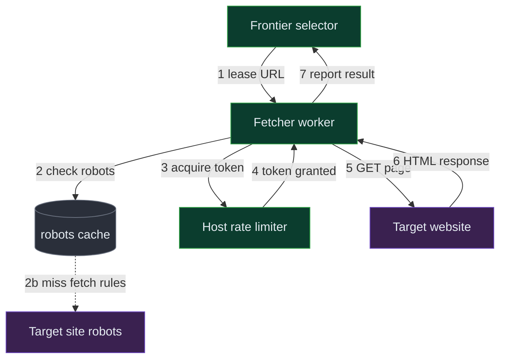
↳ reuses existing: Frontier selector (introduced here, expanded in §6.2).

**Numbered narration:**
1. **Lease a URL** — the fetcher asks the frontier selector for work. *Why selector:* it owns politeness ordering, so the worker can't pick a rude URL. *State:* URL marked in-flight with a lease. *What if it crashes:* lease expires, URL requeues.
2. **Check robots** — look up cached rules for the domain. *Why cache:* avoid re-fetching robots per page. *State:* none if hit. *If miss:* fetch robots first, cache it, block the domain until it returns; on robots fetch failure, conservatively skip the domain.
3-4. **Acquire a politeness token** — ask the Host Rate Limiter for this domain. *Why:* central enforcement. *State:* token consumed, last-fetch time advanced. *If no token:* the URL is deferred, not dropped — the selector hands out a *different* domain's URL meanwhile.
5-6. **GET the page** — download with a timeout and a max-size cap. *Why caps:* a crawler trap can serve a 10 GB body. *State:* bytes in memory. *If timeout / 429:* exponential backoff recorded on the Domain Policy.
7. **Report result** — return status + content reference. *State:* lease released, result handed to the parse/store path.

> 💬 "The whole trick of this slice is that the *worker* never decides who to be polite to — a central token bucket does, so politeness is correct no matter how many workers we run."

> 🎙️ **Script:** "A fetcher leases a URL, checks our cached copy of the site's robots rules, then asks a central rate limiter for permission — a token bucket that only releases one request per second per site. If there's no token, it just gets a different site's URL instead of waiting. Then it downloads with a size and time cap so a malicious site can't choke it, and reports back. The key decision is putting politeness in one central place, because thousands of independent workers could never coordinate it themselves."

### 6.2 "Extract links and feed new URLs into the frontier"

The slice: turn a downloaded page into new work — parse, normalize, dedup, enqueue.

**Architecture decisions:**

| Component | What it is (plain English) | Why THIS choice | What we DIDN'T pick & why not | Trade-off accepted |
|---|---|---|---|---|
| Parser workers | Services that extract links + text from HTML and normalize each URL | CPU-bound work kept separate from I/O-bound fetching so each scales independently | Not parsing inside the fetcher (CPU spikes would stall fetch sockets) | An extra hop and a queue between fetch and parse |
| Link queue (Kafka) | A durable log buffering discovered links between parse and dedup | ~700K links/sec is bursty; a log absorbs spikes and gives at-least-once replay | Not direct DB writes (700K writes/s would melt any DB); not in-memory (lost on crash) | Adds a few seconds of pipeline lag |
| URL dedup (Bloom) | A sharded Bloom filter answering "seen this URL?" from bits in RAM | 700K membership checks/sec can't hit a database — only in-memory bits keep up | Not a DB lookup (700K random reads/s); not an exact hash set (1.6 TB vs 120 GB) | ~1% false positives → we occasionally skip a genuinely new URL |

> 🎙️ **Narration:** "I split parsing off the fetchers because parsing is CPU work and I don't want a CPU spike to stall network sockets. Discovered links — about seven hundred thousand a second — go into Kafka, a durable log, because no database can take that write rate and the log lets me replay if a consumer dies. Then the killer: dedup. I can't do seven hundred thousand database lookups a second, so I keep a Bloom filter in memory — a bit-array that tells me 'probably seen' or 'definitely not seen' using a fraction of the space. The cost is about a one percent false-positive rate, meaning I rarely skip a genuinely new URL, which for a crawler is totally fine."

> **🗣️ Key terms for this slice:**
> **URL normalization** — rewriting an address to one canonical form (lowercase host, drop default port, sort query params, strip tracking tags). Here it ensures the same page maps to one key before dedup.
> **Kafka** — a durable append-only log that buffers a firehose of events so nothing's lost if a consumer lags. Here it holds discovered links between parse and dedup.
> **Bloom filter** — a compact bit-array set: it can say "definitely new" or "probably seen," never a false "new." Here it dedups 100B URLs in ~120 GB instead of 1.6 TB.
> **Sharded** — split across many machines by a key (here, URL hash) so the load and memory divide. Here it lets the Bloom filter exceed one machine's RAM.

**Link-discovery flow:**
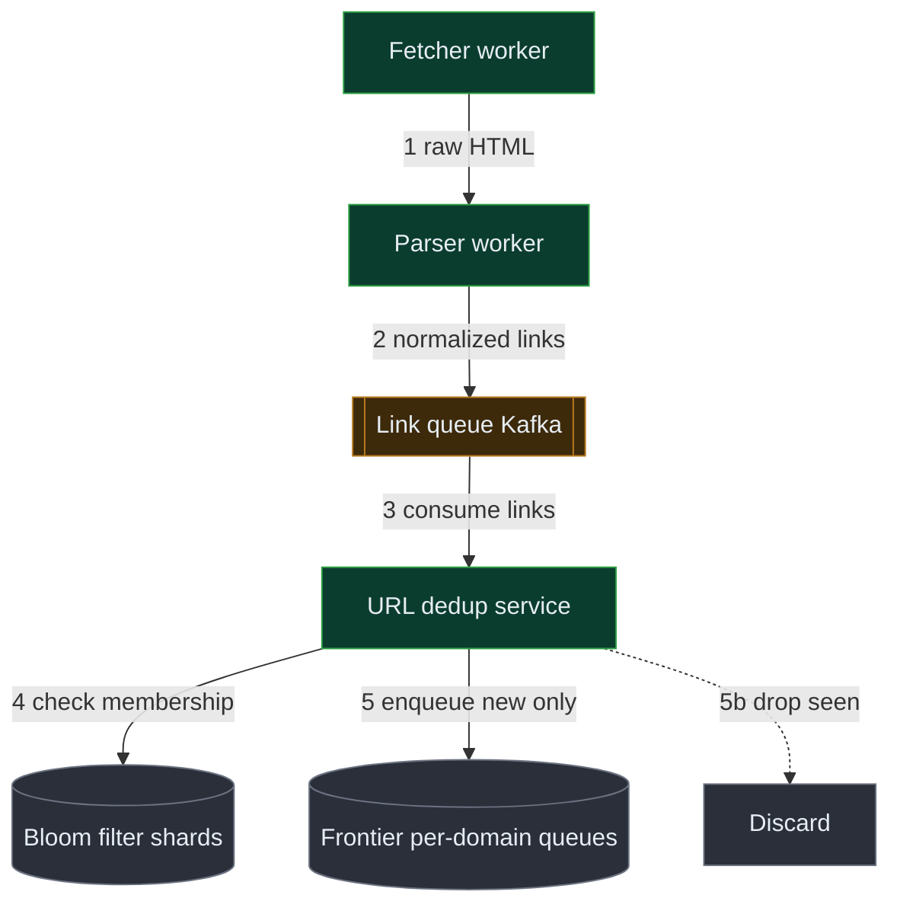
↳ reuses existing: Fetcher worker (§6.1), Frontier (§6.1 selector's backing store).

**Numbered narration:**
1. **Raw HTML to parser** — the fetcher hands content to a parser worker. *Why:* keep CPU off the fetch path. *State:* HTML in the parser. *If malformed:* parse leniently, skip junk links.
2. **Normalize links** — extract and canonicalize every outlink. *Why:* dedup only works if the same page has one key. *State:* a list of canonical URLs. *If a URL is a trap pattern:* drop it here (see §8 traps).
3. **Buffer in Kafka** — push links to the durable log. *Why:* absorb the 700K/s burst. *State:* links durably queued. *If a consumer dies:* offsets replay, no loss.
4. **Bloom membership check** — for each link, "seen?". *Why:* in-memory speed. *State:* none on a "seen". *If false positive (~1%):* we skip a real new URL — acceptable.
5. **Enqueue new only** — definitely-new URLs go to the per-domain frontier queue (and into the Bloom). *State:* frontier grows; Bloom updated. *If a domain queue is huge:* fine — it just makes its own queue long, not others'.

> 💬 "Seven hundred thousand link-checks a second is the moment people reach for a database and die — the answer is bits in RAM, a Bloom filter, trading a sliver of accuracy for three orders of magnitude of speed."

> 🎙️ **Script:** "Every page gives us about sixty links, so at twelve thousand pages a second we discover seven hundred thousand URLs a second. Almost all are already seen. Parsers normalize each link to a canonical form, drop them in Kafka to absorb the burst, and a dedup service checks each against a Bloom filter — a bit-array that fits a hundred billion URLs in a hundred-twenty gigs. Only genuinely new URLs get enqueued. The trade-off is a one-percent chance of skipping a new URL, which doesn't matter when you're crawling billions."

### 6.3 "Deduplicate URLs and near-duplicate content"

The slice: two kinds of dup — exact URL (handled in 6.2) and *near-duplicate content* (same article, different wrapper).

**Architecture decisions:**

| Component | What it is (plain English) | Why THIS choice | What we DIDN'T pick & why not | Trade-off accepted |
|---|---|---|---|---|
| Content checksum | A SHA-256 of the page body for exact-dup detection | Catches byte-identical mirrors instantly with a single equality check | Not only this (misses near-dups — one extra space changes the whole hash) | Useless for "almost the same" |
| Simhash + LSH index | A 64-bit fingerprint where *similar* pages get *similar* hashes; LSH groups candidates | Detects near-dups (same article, different ads/URL) by Hamming distance, not exact match | Not full-text diff (compare 30B docs pairwise = impossible); not MinHash shingling alone (heavier) | A tuned threshold → some false merges/splits |
| Dedup metadata table | Stores checksum + simhash per content id | One place to ask "have I stored something like this?" | Not recomputing on read (would re-scan PB of content) | Extra write per stored doc |

> 🎙️ **Narration:** "Exact dups are easy — a SHA-256 of the body, and identical bytes collide. The hard case is near-dups: the same news article on a mirror with different ads and a different URL. For that I use simhash — a fingerprint designed so that *similar documents produce similar fingerprints*, so 'almost identical' shows up as a tiny bit-distance. I find candidates with LSH, locality-sensitive hashing, which buckets likely-similar fingerprints together so I don't compare every doc to every other doc. The trade-off is a threshold — too tight and I store dups, too loose and I drop distinct pages — so I pick a Hamming distance of about 3 and accept a small error."

> **🗣️ Key terms for this slice:**
> **SHA-256 checksum** — a fixed-length fingerprint of bytes; identical input → identical output, one bit different → totally different output. Here it catches byte-exact duplicates.
> **simhash** — a similarity-preserving 64-bit fingerprint: near-identical documents get near-identical hashes (small Hamming distance). Here it catches near-duplicate content.
> **Hamming distance** — the number of bit positions where two fingerprints differ. Here, distance ≤ ~3 means "near-duplicate."
> **LSH (locality-sensitive hashing)** — bucketing so similar items land together, turning "compare to everything" into "compare to a few." Here it makes near-dup search feasible at 30B docs.

**Content dedup mechanism:**
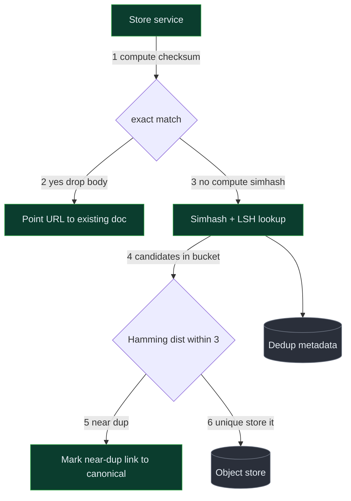
↳ reuses existing: Store service (introduced here, expanded §6.4); Object store (§6.4).

**Numbered narration:**
1-2. **Exact checksum** — SHA-256 the body; if it matches a stored doc, drop the body and point this URL at the existing doc. *State:* URL record references an existing content id; no new bytes stored.
3-4. **Simhash + LSH** — if not exact, compute simhash and look up its LSH bucket for candidates. *Why bucket:* avoids 30B comparisons. *State:* a small candidate list.
5. **Near-dup check** — if any candidate is within Hamming distance ~3, mark this as a near-dup of the canonical doc. *If false merge:* we lose one distinct page — tunable risk.
6. **Unique → store** — otherwise persist the body and index its fingerprints. *State:* object store + dedup metadata updated.

> 💬 "URL dedup and content dedup are two different problems — exact strings versus fuzzy similarity — so I use two different tools: a Bloom filter for URLs and simhash for content."

> 🎙️ **Script:** "Dedup is really two problems. URLs I've handled with a Bloom filter. Content has an easy case and a hard case: exact byte-copies I catch with a SHA-256 checksum, but the real win is near-duplicates — the same article on a mirror — which I catch with simhash, a fingerprint where similar pages get similar bits. I use LSH to only compare a page against a handful of likely-similar candidates instead of all thirty billion. The honest trade-off is the similarity threshold; I set it conservatively and accept a small error rate."

### 6.4 "Store the crawled content and metadata"

The slice: persist ~2.3 PB of bodies and 100B metadata rows, with completely different access patterns.

**Architecture decisions:**

| Component | What it is (plain English) | Why THIS choice | What we DIDN'T pick & why not | Trade-off accepted |
|---|---|---|---|---|
| Object store (S3) | A bucket for blobs addressed by content hash | Cheap, durable (11 nines), infinite scale for write-once-read-many bodies | Not a relational DB (PB of blobs in rows is absurd); not HDFS (we'd operate it ourselves) | Higher per-GET latency than local disk — fine for batch consumers |
| Metadata store (Cassandra/Bigtable) | A wide-column store of 100B URL records, sharded by URL hash | We need fast point-writes/reads by URL at 14K writes/s, no joins | Not Postgres (100B rows in one DB won't shard cleanly); not pure KV (we want range scans for recrawl) | Eventual consistency on metadata — acceptable |
| Content-addressed keys | The object key IS the content hash | Free dedup at the storage layer and idempotent writes | Not random ids (would re-store identical content) | Can't mutate a stored body (immutable — which we want) |

> 🎙️ **Narration:** "Two stores because two access patterns. The page bodies — a couple of petabytes — go in an object store like S3, keyed by their content hash, which gives me free dedup and eleven-nines durability for almost nothing. The metadata — a hundred billion little index cards — goes in a wide-column store like Cassandra, sharded by URL hash, because I need fast point lookups and writes by URL at fourteen thousand a second and there are no joins. I rejected a single relational DB because a hundred billion rows won't live in one Postgres, and I rejected putting blobs in rows because that's just wrong. The trade-off is eventual consistency on metadata, which is fine — nobody needs a URL's status to be strongly consistent."

> **🗣️ Key terms for this slice:**
> **Object store (S3)** — a service for storing large blobs by key, cheaply and durably, with no schema. Here it holds compressed page bodies.
> **Wide-column store (Cassandra / Bigtable)** — a database of huge sparse tables, sharded by a partition key, built for high write throughput. Here it holds 100B URL records.
> **Content-addressed storage** — the key is a hash of the content, so identical content maps to one object. Here it dedups bodies for free.
> **Partition/shard key** — the field that decides which machine owns a row. Here, URL hash, so load spreads evenly.

**Store flow:**
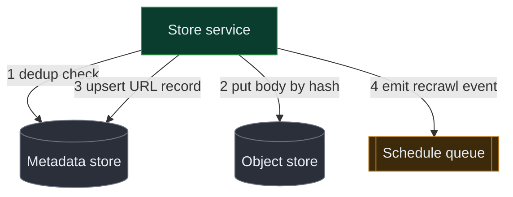
↳ reuses existing: Store service (§6.3), Metadata + Object stores (§6.3).

**Numbered narration:**
1. **Dedup check** — see §6.3; decide store vs link. *State:* none yet.
2. **Put body by hash** — write compressed body to the object store, key = content hash. *Why hash key:* idempotent, dedup-free. *If already present:* the put is a no-op.
3. **Upsert URL record** — write/update the metadata row: status, fetch time, content ref, hash. *State:* the URL is now FETCHED. *If write fails:* retry; body is already durable so no data lost.
4. **Emit recrawl event** — push a "schedule next crawl" event. *Hands off to §6.5.*

> 💬 "Keying blobs by their content hash means storage dedup is free and writes are idempotent — the same page can't cost me twice."

> 🎙️ **Script:** "I split storage in two. Page bodies are write-once, read-many blobs, so they go in S3 keyed by content hash — that's cheap, durable, and dedups for free. The metadata, a hundred billion little records, goes in a wide-column store sharded by URL hash because I need fast point access at high write rates with no joins. After storing, I emit an event so the scheduler can decide when to revisit."

### 6.5 "Re-crawl pages on a freshness schedule"

The slice: revisit pages adaptively — fast for things that change, slow for things that don't.

**Architecture decisions:**

| Component | What it is (plain English) | Why THIS choice | What we DIDN'T pick & why not | Trade-off accepted |
|---|---|---|---|---|
| Scheduler service | Computes next-recrawl time per URL from observed change rate | Spends our fetch budget where pages actually change, not uniformly | Not uniform recrawl (wastes 90% on dead pages); not manual tiers (can't tune 30B pages by hand) | Needs change-rate state per URL |
| Recrawl timer (time-bucketed queue) | A store of URLs bucketed by next-fetch time | Efficiently asks "what's due now?" without scanning 100B rows | Not a single global sorted set (too big, hot tail); not per-URL cron (absurd) | Coarse buckets → recrawl is approximate, not to-the-second |
| Change-rate estimator | Compares content hash across fetches to adapt the interval | If-modified-since style learning halves or doubles the interval cheaply | Not a heavy ML model (overkill); not fixed intervals (ignores reality) | A simple heuristic, not perfectly optimal |

> 🎙️ **Narration:** "Freshness is a budgeting problem. I can fetch twelve thousand pages a second — where do I spend it? Not uniformly: a news homepage changes every few minutes, a 2009 blog post never does. So the scheduler computes a next-recrawl time per URL from its observed change rate — if the content hash changed since last time, I shorten the interval, like an exponential backoff in reverse; if it didn't, I lengthen it. I store URLs in time-bucketed queues so I can cheaply ask 'what's due in the next minute?' without scanning a hundred billion rows. I rejected uniform recrawl because it burns ninety percent of the budget re-fetching dead pages."

> **🗣️ Key terms for this slice:**
> **Adaptive recrawl** — adjusting how often we revisit a page based on how often it actually changes. Here it focuses fetch budget on volatile pages.
> **If-modified-since / ETag** — an HTTP header letting a server reply "not changed" cheaply. Here it lets us detect no-change without downloading the body.
> **Time-bucketed queue** — URLs grouped by their due-time so we pull "what's due now" without a full scan. Here it schedules 100B recrawls efficiently.

**Recrawl scheduling flow:**
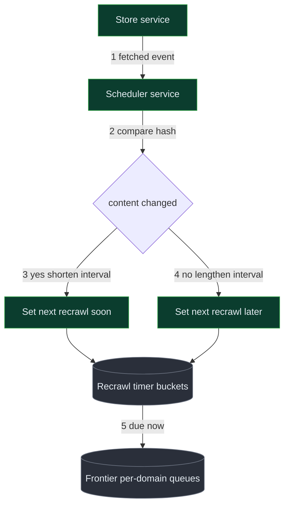
↳ reuses existing: Store service (§6.4), Frontier (§6.1/6.2).

**Numbered narration:**
1. **Fetched event** — the scheduler hears a page was crawled. *State:* none yet.
2-4. **Estimate change rate** — compare new content hash to last; adapt the interval. *State:* a new next-recrawl time. *If a page flaps:* clamp min/max intervals so it doesn't recrawl every second.
5. **Re-enqueue when due** — when the timer bucket fires, the URL re-enters the frontier. *State:* URL back in flight. *If frontier is backed up:* due URLs wait their turn; freshness degrades gracefully, never crashes.

> 💬 "Freshness is really 'where do I spend my fetch budget' — and the answer is: where pages actually change, learned from the content hash, not guessed."

> 🎙️ **Script:** "Recrawl is a budgeting problem. After each fetch the scheduler compares the new content hash to the old one — changed means shorten the interval, unchanged means lengthen it, with min and max clamps so nothing flaps. URLs sit in time-bucketed queues so I can pull 'what's due now' cheaply, and due URLs flow right back into the frontier. That keeps the news index fresh without wasting fetches on pages that never change."

### Final (high-level)

The reconciled union of all slices — every component appears once with its consistent name.

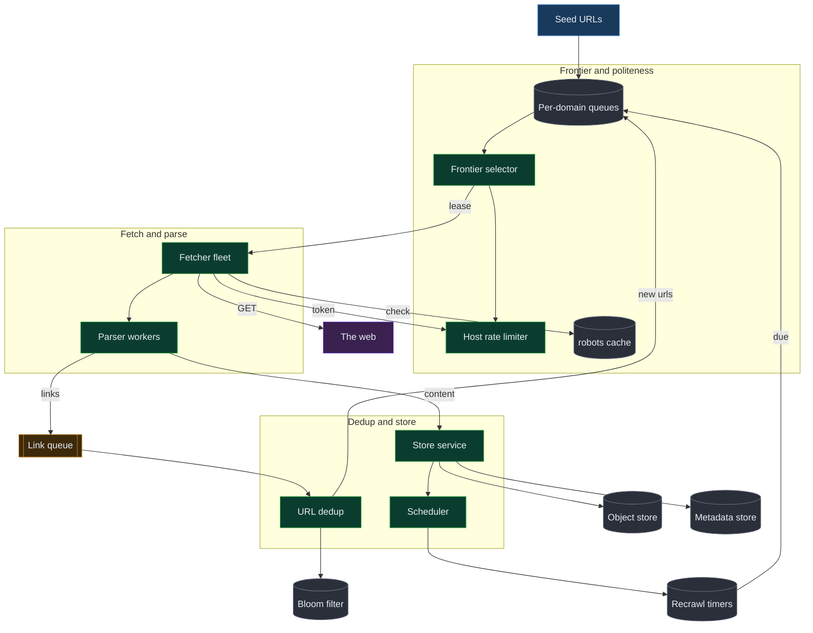

> 🎙️ **Script:** "End to end: seeds and recrawl-due URLs land in the frontier — per-domain queues with a selector and a central rate limiter enforcing politeness. Fetchers lease work, check cached robots, spend a politeness token, download, and hand HTML to parsers. Parsers extract links into Kafka, where a dedup service Bloom-filters out everything we've seen and enqueues only the new. In parallel the store service dedups content with checksum-plus-simhash, writes bodies to the object store and records to the metadata store, then tells the scheduler, which sets an adaptive recrawl time and feeds the URL back in when due. The one idea that ties it together is: politeness caps each site, so everything is shaped around keeping twelve thousand sites busy at once."

> 🤝 **Checkpoint:** "That's the full skeleton. The two richest places to go deep are the frontier-plus-politeness design and dedup at billions scale — but I can also dig into distributed coordination or freshness. Which is most interesting to you?"

---

## 7. Data Model & Storage

### PART A — Entity table

| Entity | Key fields (PK / shard key) | Chosen store | Partition key | Consistency |
|---|---|---|---|---|
| URL Record | **url_hash (PK, shard)**, url, status, last_fetched, content_hash, simhash, priority, recrawl_at | Wide-column (Cassandra) | url_hash | Eventual |
| Domain Policy | **domain (PK, shard)**, robots_rules, crawl_delay_ms, last_fetch_ts, backoff_until | KV / wide-column | domain | Eventual, read-repair |
| Frontier entry | **domain (shard)**, url, score, enqueued_at | Sharded queue (Kafka/Redis) | domain | At-least-once |
| Document | **content_hash (PK)**, body_compressed, fetched_at, mime | Object store (S3) | content_hash prefix | Strong (immutable blob) |
| Dedup index | **simhash_band (PK)**, content_hash, checksum | Wide-column + LSH buckets | simhash band | Eventual |
| Bloom shard | bit-array segment | In-memory + RDB snapshot | url_hash range | Probabilistic |
| Schedule entry | **time_bucket (shard)**, url_hash, recrawl_at | Time-bucketed queue | time bucket | At-least-once |

### PART B — Storage decision cards

**🗄️ Cassandra / Bigtable (wide-column) — used for: URL Record, Domain Policy, Dedup index**
1. **What it is:** a database of very large, sparse tables spread across many machines by a partition key, optimized for fast writes and point reads — no joins, no global transactions.
2. **Why — the access pattern:** we have 100B URL records and write ~14K/s; we only ever read/write by URL hash (a point key) and occasionally range-scan by recrawl time. A wide-column store nails high-throughput point access and scales horizontally by just adding nodes.
3. **Considered & rejected:**
   - **PostgreSQL** — 100B rows won't fit one instance and manual sharding of a relational DB for pure point access buys us nothing we'd use.
   - **DynamoDB** — works, but vendor lock-in and cost at 100B items; Cassandra/Bigtable give the same model with more control.
   - **A pure KV store (plain Redis)** — no range scans for "what's due to recrawl," and 300 TB in RAM is absurdly expensive.
4. **Trade-off:** eventual consistency and no joins — so we denormalize (e.g. store recrawl_at on the URL row) and tolerate a few seconds of metadata staleness.
5. **🗣️ How to say it:** "For the hundred billion URL index cards I'd use a wide-column store like Cassandra, sharded by URL hash, because all my access is point reads and writes by URL at high throughput. I looked at Postgres but a hundred billion rows don't live in one box, and a plain KV store can't do the range scans I need for recrawl scheduling."

**🗄️ Object store (S3) — used for: Document bodies**
1. **What it is:** a service that stores arbitrarily large blobs by a key, cheaply and with eleven-nines durability, with no schema.
2. **Why — the access pattern:** page bodies are write-once, read-many blobs totaling a couple of petabytes; we never query *inside* them, only fetch by id. Keying by content hash makes storage idempotent and dedups bodies for free.
3. **Considered & rejected:**
   - **Storing bodies in the metadata DB** — multi-KB blobs in a wide-column store bloat it and wreck cache locality.
   - **Self-managed HDFS** — we'd own the operational burden; S3 is cheaper per GB at this scale and we don't run a Hadoop cluster otherwise.
4. **Trade-off:** higher per-object GET latency than local disk — irrelevant, since consumers read in batch, not interactively.
5. **🗣️ How to say it:** "Bodies go in S3 keyed by their content hash — write-once, read-many, eleven-nines durable, and the content-hash key dedups for free. I wouldn't put multi-kilobyte blobs in the metadata database; it would bloat it and kill cache locality."

**🗄️ Kafka (durable log) — used for: Link queue, fetched events**
1. **What it is:** a distributed append-only log that buffers a firehose of events and lets consumers replay from any offset.
2. **Why — the access pattern:** parsers emit ~700K links/sec in bursts; no DB takes that, and we need at-least-once delivery so a crashed dedup consumer can replay.
3. **Considered & rejected:**
   - **Direct DB writes** — 700K writes/s would melt any store and there's no replay on crash.
   - **RabbitMQ** — fine for lower volume, but Kafka's partitioned log handles this firehose and retention better.
4. **Trade-off:** adds a few seconds of pipeline lag and at-least-once means consumers must be idempotent (the Bloom check naturally is).
5. **🗣️ How to say it:** "Discovered links go through Kafka because seven hundred thousand a second is a firehose no database can take, and the log lets a crashed consumer replay. The cost is a little lag and the need for idempotent consumers, which dedup already is."

**🗄️ In-memory Bloom shards (+ RDB snapshot) — used for: URL dedup**
1. **What it is:** a sharded bit-array set living in RAM, periodically snapshotted to durable storage so it survives restarts.
2. **Why — the access pattern:** ~700K membership checks/sec is only feasible from RAM, and 100B URLs need only ~120 GB as bits versus 1.6 TB as exact hashes.
3. **Considered & rejected:**
   - **Exact hash set in a DB** — 700K random reads/s and 1.6 TB; far slower and bigger.
   - **No dedup** — we'd re-crawl the web forever; non-starter.
4. **Trade-off:** ~1% false positives → occasionally skip a genuinely new URL, and it's append-only (can't delete a URL from a Bloom filter) — both acceptable for a crawler.
5. **🗣️ How to say it:** "URL dedup is a Bloom filter in memory — a bit-array that says 'definitely new' or 'probably seen.' It fits a hundred billion URLs in about a hundred-twenty gigs and answers in nanoseconds. The price is a one-percent false positive, meaning I rarely skip a new URL, which doesn't matter at this scale."

### PART C — Per-operation consistency table

| Operation | Store | Consistency | Why that level is right |
|---|---|---|---|
| Enqueue new URL | Frontier (Kafka/Redis) | At-least-once | Duplicate enqueue is harmless — Bloom catches it; losing one is bad |
| URL membership check | Bloom shards | Probabilistic | ~1% false-positive skip is acceptable; never a false "new" |
| Write page body | Object store | Strong (immutable) | Content-addressed, idempotent; once written it's correct |
| Upsert URL metadata | Cassandra | Eventual | A few seconds stale status is fine for downstream consumers |
| Lease / complete work | Frontier coordinator | At-least-once + lease | Crashed worker's lease expires and requeues — no work lost |
| robots.txt read | robots cache | Eventual (24h TTL) | Rules rarely change; staleness bounded by TTL |

> 🎙️ **Script:** "The storage tier is three workhorses. A wide-column store like Cassandra holds the hundred billion URL records, sharded by URL hash, because it's all high-throughput point access. S3 holds the page bodies keyed by content hash, which dedups them for free. Kafka buffers the link firehose. The one place I deliberately avoid a database is URL dedup — that's a Bloom filter in RAM, because no database does seven hundred thousand lookups a second. I considered Postgres for metadata but a hundred billion rows don't belong in one relational box."

---

## 8. Deep Dives — Bad → Good → Great

> 🆘 **If you get stuck:** go back to the one binding constraint — "twelve thousand fetches a second against one-per-second-per-site" — and re-derive forward; almost every hard question traces to that.

### How do we design the URL frontier with politeness?

**#### Bad: One global priority queue**
- 🗣️ **Plain words:** "Throw every URL into one big to-do list sorted by importance and have workers grab from the top."
- **Approach:** a single priority queue; workers pop the highest-priority URL.
- **Why people try this:** it's the obvious "queue of work" and prioritization seems easy.
- ⚠️ **What breaks:** politeness. The top 100 URLs might all be `cnn.com`; popping them fires 100 simultaneous hits at one site — an instant DDoS and a ban. To stay polite, 11,900 of our 12K workers idle waiting on the one hot domain. **At 12K/s target with a 1/s/domain cap, a global queue can't keep more than a handful of domains busy.**
- 🔁 **Forces upgrade:** the moment two workers pull URLs from the same domain at once.

**#### Good: Per-domain queues with a round-robin selector**
- ↩️ **What Bad got wrong:** a global queue couples unrelated domains — one hot domain stalls everyone. Good *decouples* by giving each domain its own queue.
- 🗣️ **Plain words:** "One to-do list per website, and a manager who walks the lists round-robin, taking one item from each site that's allowed a turn."
- **Approach:** shard the frontier by domain. A **selector** keeps a set of "ready" domains (those whose politeness token is available) and round-robins across them; each domain's own queue can be priority-ordered internally. The Host Rate Limiter gates each domain at 1/s.
- ⚠️ **What breaks:** with ~600M domains but only ~12K crawlable at once, naively scanning all domain queues to find "who's ready" is wasteful; and a single coordinator holding all queues becomes a hot spot at 14K enqueues/s + 12K leases/s.
- 🔁 **Forces upgrade:** when one coordinator can't hold the queue state or the ready-set scan dominates CPU.

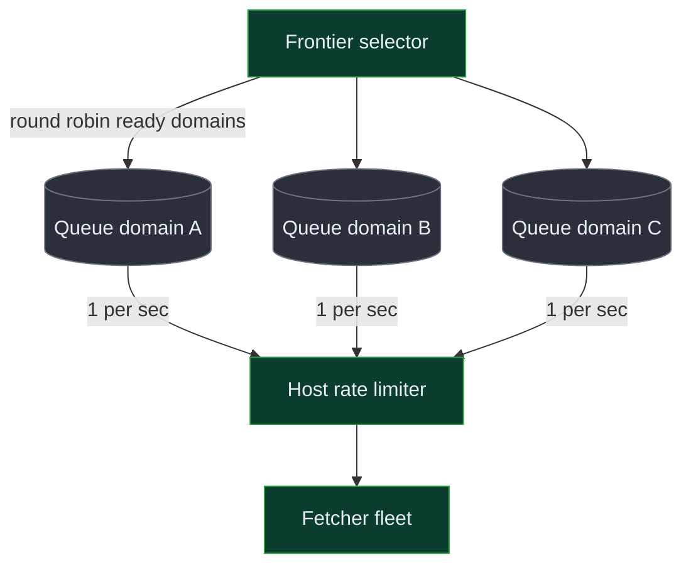

**#### Great: Two-stage frontier — prioritizer front, politeness back, sharded by domain hash**
- ↩️ **What Good got wrong:** a single selector/coordinator is a throughput ceiling and a single point of failure. Great *partitions* the frontier itself.
- 🗣️ **Plain words:** "Split the manager's job in two — one stage decides *which URLs matter most*, a second stage holds *one ready-line per site* — and spread both across many machines by hashing the domain name, so no one machine is the bottleneck."
- **Approach (Mercator-style):** a **front set** of priority queues (by URL score) feeds a **back set** of per-domain FIFO queues. A **min-heap of next-ready times** per domain tells the selector exactly which domain is due next — no scanning. The whole frontier is **sharded by domain hash** across N coordinator nodes, so a given domain always lives on one node (politeness state is local, never contended) and load spreads evenly. Workers lease from their assigned shard.
- 🔢 **Decision-forcing math:** 14K enqueues/s + 12K leases/s = ~26K ops/s on the frontier. One coordinator node tops out ~50K ops/s, so we're fine at ~1-2 nodes today — but sharding by domain hash across, say, 8 nodes gives ~10x headroom and isolates a hot domain to one shard. The min-heap turns "find ready domain" from O(600M scan) into O(log domains-active) ≈ O(log 12K) ≈ 14 comparisons.
- ✅ **Failure matrix:**

| Scenario | What happens |
|---|---|
| Coordinator node dies | Its domain shards reassign (consistent hashing); in-flight leases expire and requeue |
| Hot domain (1M URLs) | Confined to one back-queue on one shard; its own queue is long, others unaffected |
| Worker crashes mid-lease | Lease TTL expires → URLs requeue → at-least-once, Bloom dedups any double |
| Frontier snapshot lost | Rebuild from metadata store (URLs with status QUEUED) — slow but no permanent loss |

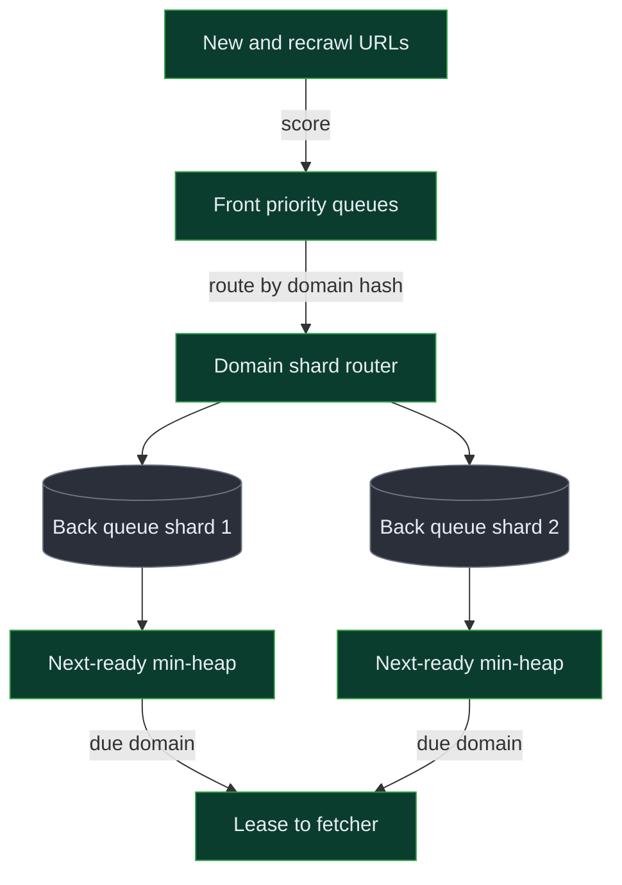

> 🎙️ **Script:** "The frontier is the heart of this. A naive global priority queue dies on politeness — the top of the queue is all one site, so you either DDoS it or idle your fleet. So I go per-domain: one FIFO queue per site, gated by a token bucket at one a second. The senior version splits the job in two — a front set that prioritizes by URL score and a back set of per-domain ready-lines — and shards the whole thing by domain hash, so each site's politeness state lives on exactly one machine and can never be contended. A min-heap of next-ready times means I find the due site in log time instead of scanning six hundred million domains."

> 🧠 **If they ask "how does the selector pick fairly without scanning all domains?":** "A min-heap keyed by each domain's next-ready timestamp — the root is always the soonest-due domain, so picking is O(log n) and I never scan idle domains."

### How do we dedup URLs and content at billions scale?

**#### Bad: Database lookup per URL**
- 🗣️ **Plain words:** "Before crawling a URL, ask the database 'seen this?'"
- **Approach:** a `seen_urls` table; `SELECT` before each enqueue.
- **Why people try this:** it's exact and simple.
- ⚠️ **What breaks:** 700K lookups/s against a 100B-row table — random reads at that rate need an absurd, expensive cluster, and each adds latency to the discovery loop. The DB becomes the bottleneck, not the network.
- 🔁 **Forces upgrade:** the first time discovery QPS exceeds what the DB can serve — immediately.

**#### Good: In-memory Bloom filter**
- ↩️ **What Bad got wrong:** the DB can't do 700K random reads/s. Good moves membership into RAM as bits.
- 🗣️ **Plain words:** "Keep a giant array of bits in memory; each URL flips a few bits, and to check 'seen?' we look at those bits — it can say 'definitely new' or 'probably seen.'"
- **Approach:** a Bloom filter — hash each URL with k functions, set/check k bits. 100B URLs at 1% FP needs ~120 GB and ~7 hash functions (computed). Checks are nanoseconds, in RAM.
- ⚠️ **What breaks:** 120 GB exceeds one machine's comfortable RAM, and a single Bloom filter is a single point of failure; also it's append-only (can't remove a URL) and FP rate creeps as it fills past the design size.
- 🔁 **Forces upgrade:** when the filter outgrows one box or we need durability/scaling.

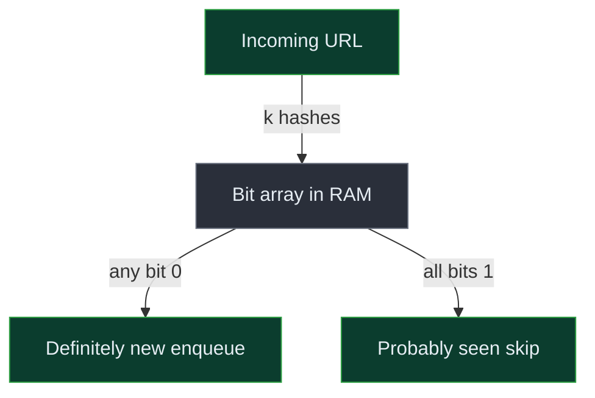

**#### Great: Sharded Bloom + content simhash, with snapshots**
- ↩️ **What Good got wrong:** one Bloom filter is a SPOF and outgrows RAM; and it only handles *URL* dedup, not near-duplicate *content*. Great shards it and adds content dedup.
- 🗣️ **Plain words:** "Split the bit-array across machines by URL hash so it scales and survives a node loss, snapshot it so a restart doesn't forget, and add a separate similarity-fingerprint for catching the same article on different URLs."
- **Approach:** shard the Bloom by URL-hash range across N nodes (each ~15-30 GB, fits RAM); periodically snapshot each shard to S3 so a crashed node reloads instead of re-crawling the web. For content, compute SHA-256 (exact) + simhash (near-dup); index simhashes in LSH bands so near-dup lookup is O(bucket), not O(30B).
- 🔢 **Decision-forcing math:** exact hash set = 100B x 16B = 1.6 TB; Bloom at 1% FP = 120 GB → ~13x smaller. Tightening to 0.1% FP costs 180 GB — the price of skipping 10x fewer real URLs. Content simhash = 30B x 8B = 240 GB of fingerprints, easily indexed.
- ✅ **Failure matrix:**

| Scenario | What happens |
|---|---|
| Bloom shard node dies | Reload its range from the latest S3 snapshot; URLs since snapshot may re-enqueue (harmless, re-checked) |
| False positive (~1%) | Skip a genuinely new URL — accepted; never a false "new" so we never re-crawl wrongly |
| Filter fills past design size | FP rate climbs → rotate to a fresh larger filter (scalable/rotating Bloom) |
| Near-dup threshold too loose | Two distinct pages merged → lose one; tunable Hamming distance controls the rate |

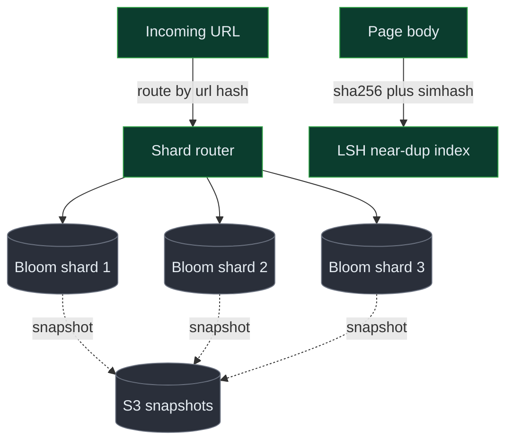

> 🎙️ **Script:** "Dedup at billions scale: a database lookup per URL dies instantly at seven hundred thousand checks a second, so URL dedup is a Bloom filter in RAM — a hundred-twenty gigs for a hundred billion URLs, thirteen times leaner than an exact set. I shard it by URL hash so it scales past one machine and snapshot each shard to S3 so a crash doesn't make me re-crawl the web. Content dedup is a separate problem: a checksum catches exact copies, and simhash plus LSH catches the same article on a different URL by bit-similarity. The honest trade-off is a one-percent false positive on URLs and a tunable similarity threshold on content."

> 🧠 **If they ask "what about deleting a URL from the Bloom filter?":** "You can't — Bloom filters don't support deletes. If we ever need it I'd switch to a counting Bloom or just rotate to a fresh filter periodically; for a crawler, append-only is fine."

### How do we coordinate the distributed fleet without a single point of failure?

**#### Bad: One master assigning every URL**
- 🗣️ **Plain words:** "One brain hands every worker its next URL."
- **Approach:** a central master pops the frontier and pushes URLs to workers.
- ⚠️ **What breaks:** the master is a throughput ceiling (~26K ops/s) and a SPOF — it dies, the whole fleet idles. **NFR4 (availability) violated outright.**
- 🔁 **Forces upgrade:** the first master crash, or the first time it can't keep the fleet fed.

**#### Good: Sharded coordinators + leases**
- ↩️ **What Bad got wrong:** one master is a SPOF and a ceiling. Good partitions coordination by domain and uses leases so crashes self-heal.
- 🗣️ **Plain words:** "Many managers, each owning a slice of the sites, and every handed-out task has a timer so if a worker vanishes the task comes back automatically."
- **Approach:** shard coordination by domain hash (matches the frontier shards); workers lease batches with a TTL; a crashed worker's lease expires and requeues. Coordinators are stateless over the sharded frontier store.
- ⚠️ **What breaks:** we still need *something* to track shard ownership and reassign on node death — that's a coordination problem of its own.
- 🔁 **Forces upgrade:** when a coordinator node dies and we must reassign its shards safely.

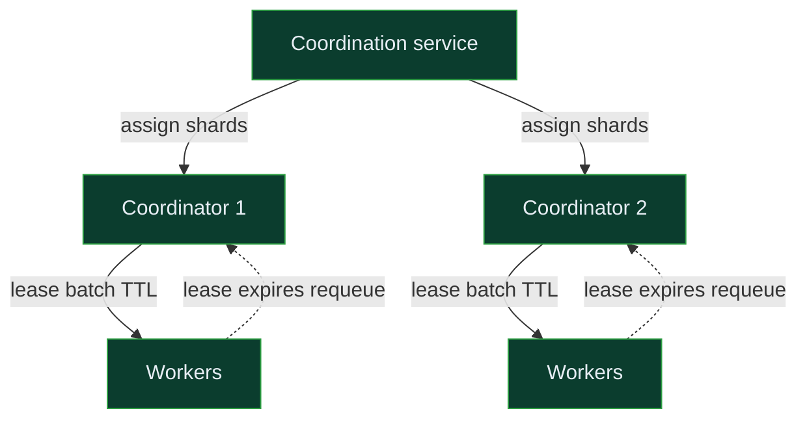

**#### Great: Consistent hashing + ZooKeeper-style membership + idempotent leases**
- ↩️ **What Good got wrong:** shard reassignment on death needs a reliable membership/ownership authority, or two nodes claim the same domain and break politeness. Great adds consensus-backed ownership.
- 🗣️ **Plain words:** "A small, reliable referee tracks who's alive and who owns which sites; if a manager dies, its sites move to neighbors automatically by a hashing rule, and tasks are safe to retry because they're idempotent."
- **Approach:** use a consensus service (ZooKeeper/etcd — a small, strongly-consistent store that does leader election and liveness) to track coordinator membership. Domains map to coordinators via **consistent hashing** so a node death moves only its slice (~1/N of domains) to neighbors, not a full reshuffle. Leases are **idempotent** (lease+url key), so a requeued-then-completed task can't double-store — the Bloom and content-hash key absorb duplicates.
- 🔢 **Decision-forcing math:** consistent hashing means a node failure among N=8 reassigns only ~1/8 of domains; a naive hash-mod-N would reshuffle ~7/8 of all domains on a single node change — a stampede. The consensus service handles only membership changes (rare, a few/hour), never the 26K ops/s data path, so it's never the bottleneck.
- ✅ **Failure matrix:**

| Scenario | What happens |
|---|---|
| Coordinator dies | ZK detects via session timeout → its domain slice rehashes to neighbors → leases expire and requeue |
| Network partition | Minority side loses ZK leadership and stops leasing (fences itself) → no double-crawl |
| Two nodes claim a domain | Consistent hashing + ZK ownership makes this impossible; only the owner leases |
| Consensus service down | Data path keeps running on last-known assignment; only *rebalancing* pauses |

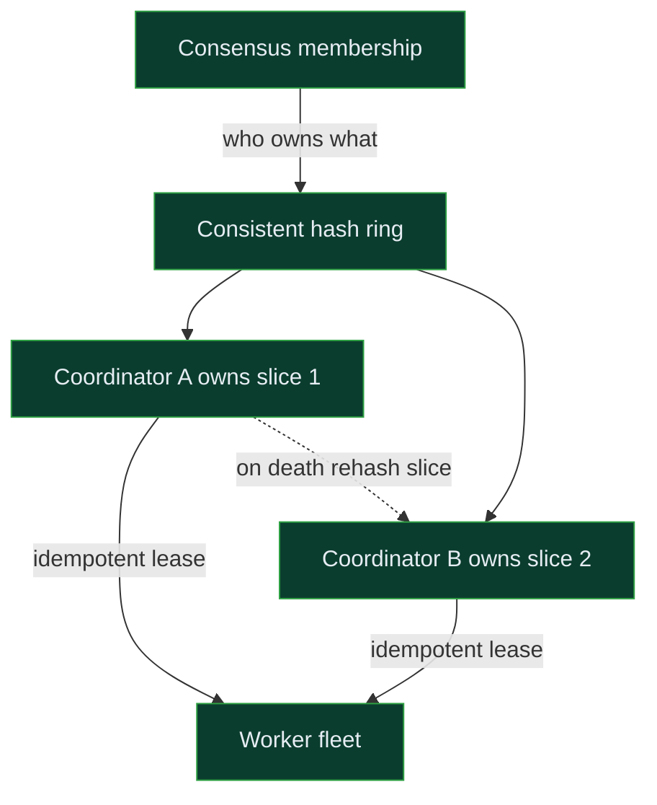

> 🎙️ **Script:** "Coordination can't be one master — that's a single point of failure that idles the whole fleet. So I shard coordination by domain hash with leased work, so a crashed worker just loses its lease and the URLs flow back. The senior piece is the ownership authority: a small consensus service like ZooKeeper tracks who's alive, and consistent hashing means a dead node hands only its one-eighth of domains to its neighbors instead of reshuffling everything. The consensus service only handles membership changes, which are rare, so it never touches the hot path and never becomes the bottleneck."

> 🧠 **If they ask "why not just retry to a new master?":** "A single master, even with retry, caps throughput and reshuffles everything on failover. Consistent hashing plus consensus localizes the blast radius to one node's slice and keeps the data path fully distributed."

### How do we keep the corpus fresh and avoid crawler traps?

**#### Bad: Uniform recrawl + trust every link**
- 🗣️ **Plain words:** "Recrawl everything on the same fixed cycle and follow every link we find."
- ⚠️ **What breaks:** uniform recrawl wastes ~90% of fetch budget re-downloading dead pages while news goes stale; trusting every link lets a calendar trap (`?date=next-day` forever) generate infinite fake URLs that silently consume the entire frontier. **NFR3 (robustness) violated.**
- 🔁 **Forces upgrade:** the first trap, or the first stale-news complaint.

**#### Good: Adaptive recrawl + basic trap limits**
- ↩️ **What Bad got wrong:** uniform recrawl ignores reality and unbounded link-following gets trapped. Good adapts the interval and bounds per-domain crawling.
- 🗣️ **Plain words:** "Revisit pages as often as they actually change, and cap how deep and how many pages we'll take from any one site so a trap can't run away."
- **Approach:** adaptive recrawl from content-hash change rate (shorten on change, lengthen on no-change, with min/max clamps); per-domain page-count and URL-depth caps; budget per domain.
- ⚠️ **What breaks:** a clever trap stays under the caps but still wastes budget with low-value pages; and freshness estimation cold-starts poorly (no history on a new URL).
- 🔁 **Forces upgrade:** when traps get adversarial or we want optimal budget allocation.

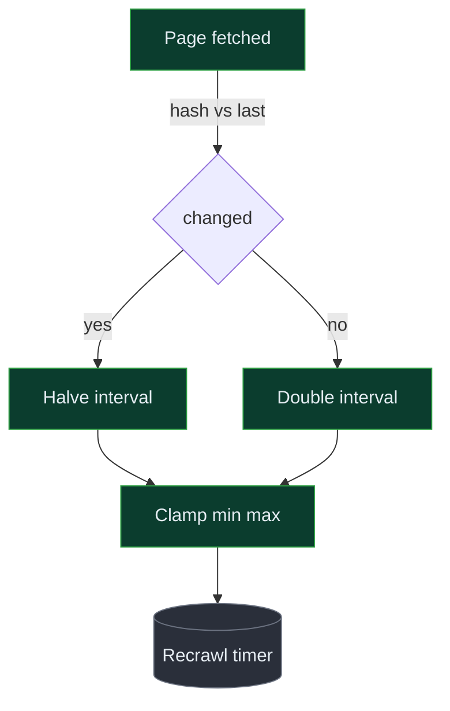

**#### Great: Change-rate model + trap scoring + URL budgets**
- ↩️ **What Good got wrong:** fixed caps are blunt and cold-start is bad. Great scores both freshness and trap-likelihood and budgets fetches by expected value.
- 🗣️ **Plain words:** "Predict how often each page changes and how 'valuable versus trap-like' each URL is, then spend the limited fetch budget on the highest expected value, starving traps automatically."
- **Approach:** estimate per-URL change rate (Poisson-style from observed history; seed cold-start from the domain's average). Score URLs by quality signals (depth, query-param entropy, duplication rate of the domain, content uniqueness) — high-entropy auto-generated URL families get a low score and a per-pattern budget, so a calendar trap throttles itself. The scheduler's front-set priority is `freshness_value x quality_score`.
- 🔢 **Decision-forcing math:** if 10% of the corpus changes daily and 90% is stable, an adaptive schedule spends ~10x more on the volatile slice — recovering most of the wasted 90% from uniform recrawl. A trap generating 1M URLs under a per-pattern budget of, say, 1K gets 0.1% of the budget instead of 100%.
- ✅ **Failure matrix:**

| Scenario | What happens |
|---|---|
| New URL, no history | Cold-start from domain average change rate; refine after 2-3 fetches |
| Calendar / infinite trap | High query-param entropy → low score + per-pattern budget caps it to a trickle |
| Page change rate spikes (breaking news) | Hash-changed-every-fetch shrinks interval to the min clamp |
| Quality model wrong | Bounded blast radius — a misranked URL still gets *some* budget, just less |

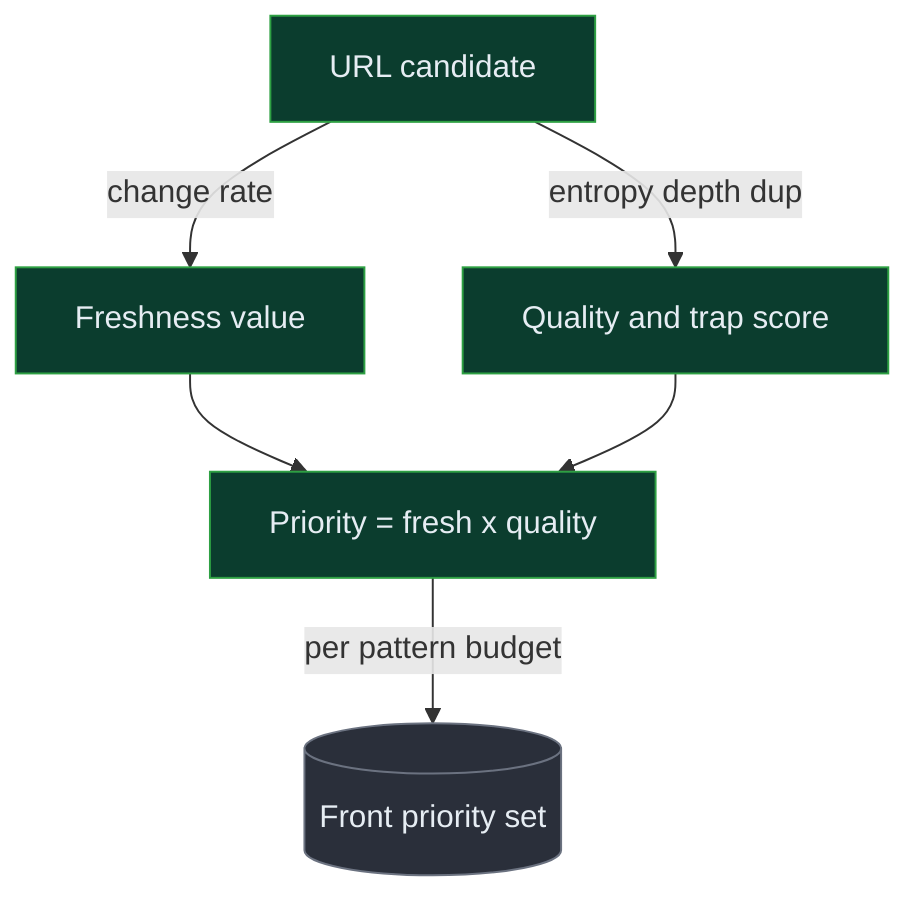

> 🎙️ **Script:** "Freshness is budget allocation. Uniform recrawl wastes ninety percent of fetches on pages that never change while news goes stale, so I learn each page's change rate from its content hash — shorten the interval when it changes, lengthen when it doesn't. Traps are the dark side: a calendar generating infinite next-day URLs can eat the whole frontier, so I score URLs by quality signals like query-param entropy and depth, give auto-generated families a per-pattern budget, and prioritize by freshness-value times quality. That way the news stays fresh and the trap starves itself."

> 🧠 **If they ask "how do you detect a trap you've never seen?":** "Structural signals, not a blocklist — high entropy in the query string, exploding URL count from one pattern, and near-duplicate content across that family. Those score it down and the per-pattern budget caps it before it does damage."

---

## 9. Reliability, Failure Modes & Cost

### 9A — Availability targets

| Path | Target | Human terms | Mechanisms |
|---|---|---|---|
| Crawl loop (system makes progress) | 99.9% | ~8.7h/yr the pipeline could stall | Sharded stateless coordinators, leased work, multi-AZ |
| Individual fetch | Best-effort (no target) | Any single page may fail freely | Retry with backoff, requeue, move on |
| Metadata / consumer reads | 99.9% | ~8.7h/yr | Replicated Cassandra, read-repair |

The crawl loop's availability is about *forward progress*, not any single fetch. **Multi-AZ** *(running the fleet across multiple data centres in one region so one building's power loss doesn't stop us)* plus stateless, sharded coordinators mean no single node failure idles the fleet — a dead node's domain slice rehashes to neighbors and leased work requeues.

### 9B — Per-dependency failure table

| Component | What breaks | How it degrades gracefully (what the system/operator sees) | Recovery |
|---|---|---|---|
| Bloom filter shard | Can't dedup that URL range | Conservatively treat as "new" → some re-crawl (wasteful, not wrong) | Reload from S3 snapshot |
| Frontier coordinator | Can't lease that domain slice | Slice rehashes to neighbor coordinators; brief lease pause | Consistent-hash rebalance via consensus |
| Kafka link queue | Discovered links buffer/stall | Parsers backpressure; fetch continues; links replay on recovery | Kafka multi-broker replication |
| Object store (S3) | Can't persist bodies | Hold completed fetches in a local spool, retry writes | S3 is 11-nines; transient retries succeed |
| Metadata store (Cassandra) | Status writes lag | Crawl continues; recrawl scheduling delayed, not lost | Replication + hinted handoff |
| Consensus service (ZK) | No rebalancing | Data path runs on last assignment; only failover paused | ZK quorum self-heals |
| robots cache | Can't read rules for a domain | Skip that domain conservatively (don't crawl without rules) | Re-fetch robots on recovery |

### 9C — RPO / RTO per data class

**RPO (Recovery Point Objective)** = how much data we'd lose if we crashed right now. RPO≈0 means we lose nothing. **RTO (Recovery Time Objective)** = how long until we're working again after a crash.

| Data class | RPO | RTO | Mechanism |
|---|---|---|---|
| Frontier (what to crawl next) | Near 0 | Minutes | Sharded, replicated; rebuild QUEUED URLs from metadata if lost |
| Seen-set (Bloom) | Snapshot interval (~minutes of re-crawl) | Minutes | Periodic S3 snapshots; gap re-crawls harmlessly |
| URL metadata | Seconds | Minutes | Multi-replica Cassandra, hinted handoff |
| Crawled content (bodies) | Hours OK | N/A | Re-fetchable from the web; S3 durable anyway |

The key insight: **a lost *page* is cheap (re-fetch it); a lost *frontier or seen-set* is expensive (re-crawl the web).** So we spend durability budget on the queue and the seen-set, not on the bodies.

### 9D — Cost breakdown (monthly order-of-magnitude)

1. **Proxy / IP egress for anti-block (~$1.2M/mo)** — to crawl politely across millions of sites without getting our datacenter IPs blocked, we route through a large IP/proxy pool; at ~2.5M GB/mo of fetched data this is the single biggest line item — *not* inbound bandwidth (which is typically unmetered).
2. **Object storage of the corpus (~$46K/mo)** — 2.3 PB compressed x3 replication at ~$20/TB-month. Grows linearly with corpus size.
3. **Fetcher + parser compute (~$5K/mo)** — ~100 async workers; cheap because fetch is I/O-bound, not CPU-bound.

**Biggest optimization:** aggressive content dedup and adaptive recrawl directly cut the proxy/egress bill — every duplicate or pointless recrawl we *don't* do is data we don't pay to fetch. Tightening dedup and freshness is the lever, not buying bigger machines.

> 🎙️ **Script:** "When something fails, the user-facing consumer mostly sees *staleness*, not an outage — if a Bloom shard dies we re-crawl a slice wastefully but correctly; if a coordinator dies its sites rehash to neighbors and leased work flows back automatically. The principle is that a lost page is cheap because we re-fetch it, but a lost frontier or seen-set is expensive because we'd re-crawl the web — so that's where the durability budget goes. And the surprising cost story is that the big bill is the proxy and IP pool for staying un-blocked, not bandwidth or storage."

---

## 10. Trade-off Ledger

**🔀 Decision: Bloom filter (probabilistic) vs exact hash-set dedup**
1. **Chose & why:** Bloom filter — 120 GB vs 1.6 TB and nanosecond in-RAM checks at 700K/s.
2. **Gave up:** exactness — ~1% false positives mean we occasionally skip a genuinely new URL, and we can't delete entries.
3. 🗣️ **Plain words:** "Like a bouncer who remembers faces roughly — he'll never wave through a stranger thinking they're a regular wrongly in the 'new' direction, but he'll occasionally turn away a real newcomer."
4. **Reverses when:** if missing even 1% of new URLs became unacceptable (e.g. a legal/compliance crawl needing completeness) — then we'd pay for an exact sharded hash store.
5. 🗣️ **How to say it:** "I'd use a Bloom filter — thirteen times leaner and fast enough — and accept a one-percent chance of skipping a new URL, which is fine for a billions-scale crawl but I'd flip to exact if completeness were a hard requirement."

**🔀 Decision: Per-domain queues vs one global priority queue**
1. **Chose & why:** per-domain queues — the only structure that lets ~12K sites crawl in parallel under a 1/s/domain cap.
2. **Gave up:** simple global prioritization — cross-domain priority is now approximate (front-set scores, not one perfect order).
3. 🗣️ **Plain words:** "One line per shop instead of one mega-line, so a busy shop can't block everyone behind it."
4. **Reverses when:** if politeness were dropped entirely (impossible in practice) or we only ever crawled a handful of domains — then a global queue is simpler.
5. 🗣️ **How to say it:** "Politeness forces per-domain queues — twelve thousand sites at once at one a second each — and I accept that global priority becomes approximate rather than perfect."

**🔀 Decision: Adaptive recrawl vs uniform recrawl**
1. **Chose & why:** adaptive — spend the fetch budget where pages actually change, recovering most of the 90% uniform wastes.
2. **Gave up:** simplicity and predictability — we now carry per-URL change-rate state and a cold-start heuristic.
3. 🗣️ **Plain words:** "Check the busy noticeboard often and the dusty archive rarely, instead of checking everything daily."
4. **Reverses when:** if the corpus were static (crawl-once) or fetch budget were effectively unlimited — then uniform is simpler and fine.
5. 🗣️ **How to say it:** "I learn each page's change rate from its content hash and revisit accordingly; if it were a one-shot crawl I'd drop all that and just crawl uniformly."

**🔀 Decision: Sharded coordinators + consensus vs single master**
1. **Chose & why:** distributed coordination — no single point of failure and no throughput ceiling on the fleet.
2. **Gave up:** operational simplicity — we run a consensus service (ZK/etcd) and consistent-hash rebalancing.
3. 🗣️ **Plain words:** "Many managers with a referee tracking who's alive, instead of one boss whose absence stops everyone."
4. **Reverses when:** if the fleet were small (a few workers, one region) — then a single coordinator with a hot standby is simpler and sufficient.
5. 🗣️ **How to say it:** "I shard coordination by domain hash with a consensus service for ownership, because a single master is both a bottleneck and a single point of failure — but for a small crawler I'd just run one coordinator with a standby."

> 🎙️ **Script:** "The decisions I'm least dogmatic about: I chose a Bloom filter over exact dedup, trading a one-percent miss for thirteen-times less memory — I'd flip that only for a completeness-critical crawl. Per-domain queues are forced by politeness, full stop. Adaptive recrawl I'd drop if the crawl were one-shot. And distributed coordination I'd simplify to a single coordinator-plus-standby if the fleet were small. Each one traces straight back to the opening constraint — throughput against politeness at billions scale."

---

## 11. Likely Interviewer Questions & Answers

### Core algorithm / hardest part

**❓ "Twelve thousand fetches a second but one per second per site — how does that even work?"**
*Mechanism:* the frontier is sharded into per-domain queues; a selector keeps a min-heap of each domain's next-ready time and round-robins across ~12K *different* ready domains at once, so global throughput is high while each domain stays at 1/s. A central token bucket enforces the per-domain rate.
🗣️ *Plain words:* "We're polite to each site one at a time, but we're polite to twelve thousand sites simultaneously."
💬 *One-liner:* "High throughput comes from breadth across domains, not speed at any one domain."

**❓ "How do you check 'have I seen this URL?' seven hundred thousand times a second?"**
*Mechanism:* a sharded in-memory Bloom filter — k hash functions flip/check bits; ~120 GB for 100B URLs at 1% FP. No database is touched on the hot path.
🗣️ *Plain words:* "We keep a giant array of bits in memory that can say 'definitely new' or 'probably seen' instantly."
💬 *One-liner:* "Bits in RAM, not rows in a database — that's the only thing fast enough."

**❓ "How do you catch the same article on two different URLs?"**
*Mechanism:* simhash — a 64-bit fingerprint where similar documents land at small Hamming distance — indexed via LSH so we compare against a handful of candidates, not 30B docs; distance ≤ ~3 means near-dup.
🗣️ *Plain words:* "We fingerprint pages so near-identical ones get near-identical fingerprints, then group similar fingerprints together."
💬 *One-liner:* "Exact copies are a checksum; near-copies are simhash plus LSH."

### Failure scenarios

**❓ "A fetcher crashes mid-batch — do we lose those URLs?"**
*Mechanism:* work is leased with a TTL, not dequeued; the crashed worker's lease expires and the URLs requeue. At-least-once delivery, and the Bloom filter dedups any double-enqueue.
🗣️ *Plain words:* "Every task has a timer; if the worker disappears, the task quietly comes back."
💬 *One-liner:* "Leases with timeouts mean a crash just requeues — no work lost."

**❓ "The Bloom filter node dies — do we re-crawl the web?"**
*Mechanism:* each shard snapshots to S3 periodically; a dead node reloads its range from the latest snapshot. The gap since the snapshot causes some harmless re-crawl, never permanent loss.
🗣️ *Plain words:* "We save the memory of what we've seen to disk regularly, so a crash only forgets the last few minutes."
💬 *One-liner:* "Snapshots bound the loss to minutes of re-crawl, not the whole web."

**❓ "Kafka goes down — what happens to discovered links?"**
*Mechanism:* Kafka is multi-broker replicated; transient broker loss is absorbed by replicas. If the cluster is fully down, parsers backpressure and fetching continues; links replay from offsets on recovery.
🗣️ *Plain words:* "The link buffer is replicated, and if it stalls we just slow down link discovery, not crawling."
💬 *One-liner:* "Replicated log plus replay means links wait, they don't vanish."

### Scale / hot-spot

**❓ "What if one domain has a million URLs — does it starve everyone?"**
*Mechanism:* per-domain queues are independent and live on one shard; that domain's own back-queue just gets long, while the selector round-robins across all other ready domains. Politeness caps it at 1/s regardless.
🗣️ *Plain words:* "A huge site only makes its own line long; everyone else's line is untouched."
💬 *One-liner:* "Per-domain isolation means a giant domain hurts only itself."

**❓ "How do you handle a sudden surge of new domains?"**
*Mechanism:* consistent hashing spreads domains evenly across coordinator shards; adding coordinators rebalances ~1/N of domains. The frontier scales horizontally by adding shards.
🗣️ *Plain words:* "New sites get spread evenly across our managers automatically."
💬 *One-liner:* "Consistent hashing keeps the load even as domains grow."

### Consistency / correctness

**❓ "Can the same page be stored twice?"**
*Mechanism:* bodies are content-addressed in S3 (key = content hash), so an identical body maps to one object — a duplicate write is a no-op. URL records pointing at the same content share one doc id.
🗣️ *Plain words:* "We file pages by their fingerprint, so the same page can only have one slot."
💬 *One-liner:* "Content-hash keys make storage idempotent — no doubles."

**❓ "After a fetch completes, is the URL's status immediately readable?"**
*Mechanism:* metadata is eventually consistent — a successful `complete` upserts the row, but a downstream read might see the old status for a second or two. That's acceptable because consumers tolerate lag; nothing depends on read-your-own-writes here.
🗣️ *Plain words:* "Status updates show up within a second or two, which is fine for a crawler."
💬 *One-liner:* "Eventual consistency on metadata is fine — nobody needs it instant."

### Security / abuse

**❓ "How do you avoid getting your crawler banned or sued?"**
*Mechanism:* strict robots.txt honoring (cached 24h), per-domain Crawl-delay, exponential backoff on 429/503, a clear User-Agent with contact info, and a global blocklist. We re-check robots server-side and never trust a caller-supplied URL blindly.
🗣️ *Plain words:* "We always obey the site's rules file, slow down when asked, and identify ourselves honestly."
💬 *One-liner:* "Politeness isn't optional — it's what keeps us crawling at all."

**❓ "Can someone poison your frontier by submitting malicious seeds?"**
*Mechanism:* seeds are rate-limited and audited by source, priority is server-clamped (a caller can't starve others), and every submitted URL is normalized and robots-checked server-side. Trap-scoring caps any URL family that explodes.
🗣️ *Plain words:* "Callers can suggest URLs but can't jump the line or force us to crawl rudely."
💬 *One-liner:* "We treat all submitted URLs as untrusted — normalize, clamp, and budget them."

### Cost

**❓ "What's the most expensive part of this system?"**
*Mechanism:* not bandwidth (inbound is usually unmetered) and not storage (~$46K/mo for 2.3 PB) — it's the proxy/IP pool to stay un-blocked across millions of sites, ~$1.2M/mo at our fetch volume.
🗣️ *Plain words:* "The surprise is that staying un-blocked costs more than storing everything."
💬 *One-liner:* "The big bill is anti-block IP egress, not storage or bandwidth."

**❓ "How would you cut cost the most?"**
*Mechanism:* tighten content dedup and adaptive recrawl — every duplicate or pointless re-fetch avoided is data we don't pay the proxy pool to fetch. The lever is fetching *less redundantly*, not buying bigger machines.
🗣️ *Plain words:* "The cheapest fetch is the one we don't make — better dedup and smarter recrawl save the most."
💬 *One-liner:* "Don't fetch what you already have or what hasn't changed."

### Extensibility

**❓ "How would you add JavaScript rendering?"**
*Mechanism:* add a separate headless-browser fetcher pool and tag URLs needing render; the frontier routes render-needed URLs to that pool while the lightweight pool handles raw HTML. Storage, dedup, and scheduling are unchanged.
🗣️ *Plain words:* "We'd bolt on a second, heavier fetcher for the pages that need a real browser, and route only those to it."
💬 *One-liner:* "Render is a second fetcher pool behind the same frontier."

**❓ "How would you support a focused/vertical crawl, say just shopping sites?"**
*Mechanism:* add a classifier/scorer at parse time that scores each discovered link's topical relevance; low-relevance links get dropped or deprioritized in the front-set before hitting the frontier. The rest of the pipeline is identical.
🗣️ *Plain words:* "We'd add a filter that only keeps links about the topic we care about."
💬 *One-liner:* "Focused crawling is just a relevance score on the front-set."

> 🎙️ **60-second verbal summary:** "A web crawler is a pipeline that downloads billions of pages, follows their links, and keeps the result fresh and deduplicated. The design splits into two halves. The read-and-fetch half is a sharded URL frontier of per-domain queues feeding an async fetcher fleet — the whole shape is forced by one number, twelve thousand fetches a second against a one-per-second-per-site politeness cap, which means twelve thousand sites crawling at once. The processing-and-store half parses links and dedups them through an in-memory Bloom filter — a hundred-twenty gigs of bits standing in for a one-point-six-terabyte hash set — while content is deduped with checksum-plus-simhash and stored content-addressed in S3, with metadata in a wide-column store. The two halves connect through Kafka and an adaptive scheduler that learns each page's change rate and feeds it back into the frontier when it's due. Every hard decision traces to one principle: throughput comes from breadth across domains, never speed at any single one."
