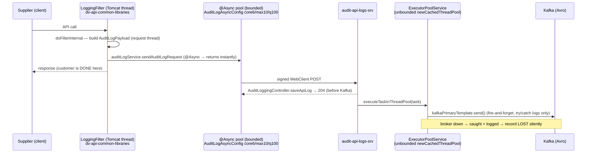
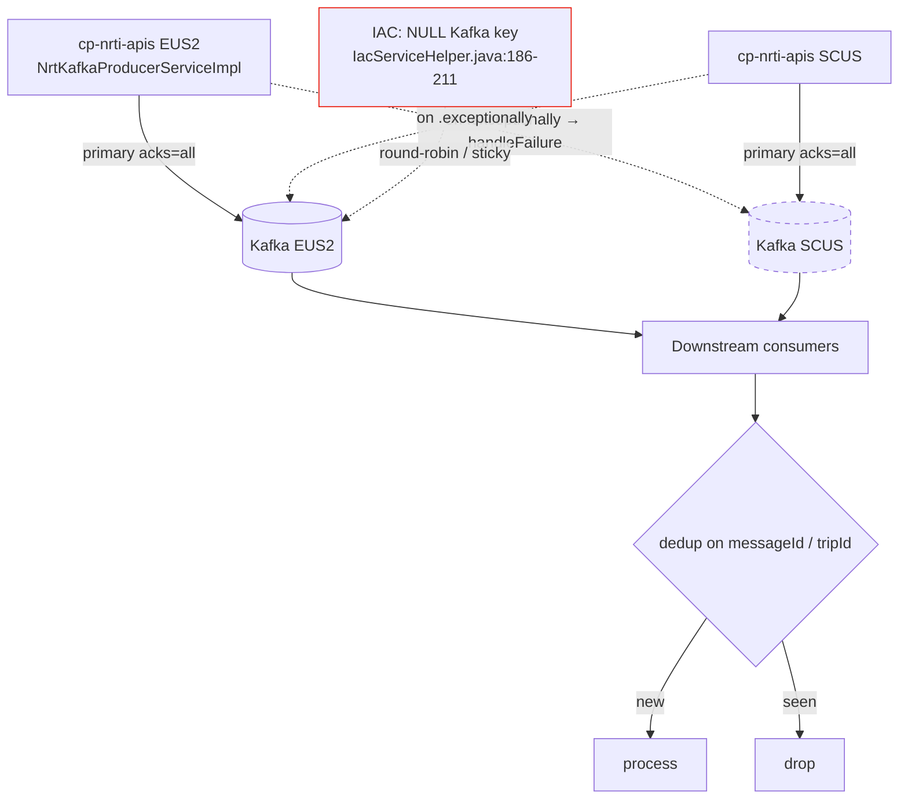
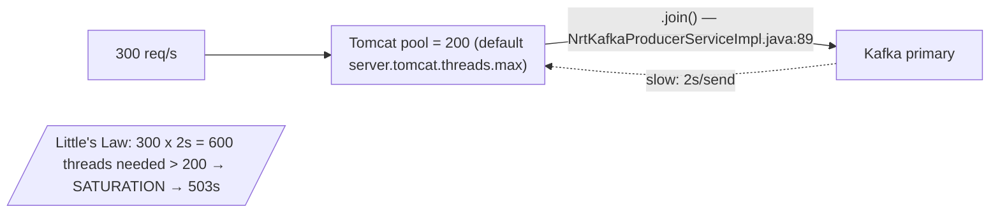
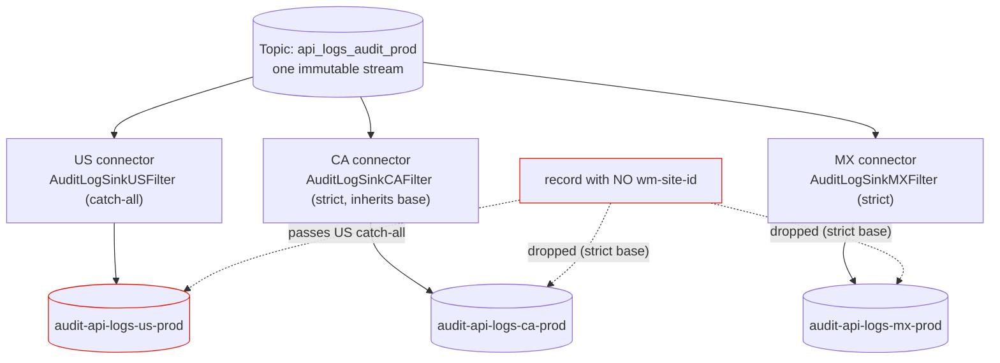

# 19 — Full Role-Play: Principal Interviewer vs. Candidate (Complete Transcripts)

> **Format:** I play *both* sides. 🟥 **PE** = the 10-year principal engineer drilling you. 🟩 **You** = the candidate giving the answer you should aspire to — deep, honest, mechanism-level. These are full transcripts of the chains from doc 18, written the way a *great* candidate actually talks: **concede fast, go to mechanism, end every gap on a fix.**
>
> **What changed vs. the old version of this file:** every 🟩 answer now ends with an **`— anchored in:`** line citing the real `file:line / class.method`, so this is a *code-anchored drill*, not a script. Three new transcripts were added: **T8** the rapid-fire sniper round (doc 18 Chain 7), **T9** the DSC-201-vs-IAC-500 asymmetry, **T10** the ops/sizing takedown, **T11** a system-design whiteboard, and **T12** a behavioral "hard tradeoff" grounded in real code. Each transcript is tagged with **[GRADING]** (what the interviewer is secretly scoring) and **[THE MOVE]** (the single sentence that saved it).
>
> Diagrams are Mermaid — they render on GitHub, VS Code (Mermaid extension), or the companion `chains-and-design.html`.
>
> **The single source of truth lives in the source tree under `~/Desktop/walmart`.** Two Kafka systems, never conflate them: **AUDIT** (`audit-api-logs-srv` Avro producer → `audit-api-logs-gcs-sink` Lenses Kafka-Connect sink) and **NRTI** (`cp-nrti-apis` JSON producer). Capture-side library = `dv-api-common-libraries`.

---

## TRANSCRIPT 1 — The 204 / Data-Loss Corner

🟥 **PE:** Walk me through what happens when a supplier hits an audited API.

🟩 **You:** A servlet filter — `LoggingFilter` in the shared `dv-api-common-libraries`, registered `@Order(Ordered.LOWEST_PRECEDENCE)` so it runs closest to the controller and sees the final response — wraps the request and response in `ContentCachingRequestWrapper`/`ResponseWrapper`, builds the payload *on the request thread*, then hands it to an `@Async` method. The customer's response returns the instant that `@Async` call is submitted to the pool. On a pool thread we sign and `WebClient`-POST to the central `audit-api-logs-srv`, which returns **204 No Content** immediately and *then*, on its own pool, publishes an Avro `LogEvent` to Kafka.
> — anchored in: `LoggingFilter.java:35` (`@Order(LOWEST_PRECEDENCE)`), `:37` (`extends OncePerRequestFilter`), `:83-86` (ContentCaching wrappers), `:111` (`auditLogService.sendAuditLogRequest`); the `@Async` pool is `AuditLogAsyncConfig.taskExecutor()`.

🟥 **PE:** You said 204 immediately. Immediately after *what*? What's the last thing that touches the customer's thread, and which pool is it?

🟩 **You:** Two *different* pools — and I want to be precise because they're often blurred. On the **capture side**, in the common library, it's a *bounded* `ThreadPoolTaskExecutor` — core 6, max 10, queue 100, prefix `Audit-log-executor-`. That's the pool the customer's thread submits to and is then done. On the **producer side**, inside `audit-api-logs-srv`, the controller returns 204 and a *separate, unbounded* `newCachedThreadPool` runs the Avro serialize + `kafkaPrimaryTemplate.send()`. So the customer never waits on signing, the network POST, or Kafka.
> — anchored in: capture pool `AuditLogAsyncConfig.java:19-24` (`setCorePoolSize(6)/setMaxPoolSize(10)/setQueueCapacity(100)`); producer pool `ExecutorPoolService.java:10` (`Executors.newCachedThreadPool()`), `:12-14` (`executeTaskInThreadPool`); the 204 is `AuditLoggingController.saveApiLog` returning `new ResponseEntity<>(HttpStatus.NO_CONTENT)` at `AuditLoggingController.java:58-61` (the sibling `saveRequest`/`v1/logRequest` also returns `NO_CONTENT` at `:42-47`).

🟥 **PE:** So the customer gets a 204 before the record is on Kafka. Broker's down. What does the customer see?

🟩 **You:** Still success. The producer send is genuinely fire-and-forget: it's wrapped in a `try/catch` that only logs `"Send failure falling into exception and Auditing"` — it doesn't observe the returned future, so an *async* broker failure isn't even caught there; only a synchronous throw from `.send()` is. The customer's call is completely decoupled from audit durability. That's the deliberate trade: audit must never degrade the supplier's actual API call.
> — anchored in: `KafkaProducerService.publishMessageToTopic` `KafkaProducerService.java:44-52` — `kafkaPrimaryTemplate.send(kafkaMessage)` inside a `try/catch` that logs only and discards the `CompletableFuture`.

🟥 **PE:** So your "audit logging system" can silently drop records and nobody knows. In a compliance context — defend that or fix it.

🟩 **You:** I'll scope it first: this feed is supplier *debugging convenience* replacing Splunk — the system of record is GCS Parquet + BigQuery, not Kafka. For that purpose best-effort is acceptable. But you're right that the real problem is "silent," not "lossy." Cheap fix: attach `.whenComplete()` to the send future, emit an `audit_publish_failed` counter, alert on the rate, and add a producer-side DLQ so failures are recoverable. That removes the "find out from a data gap" failure mode without touching the customer path.
> — anchored in: the fix lands in `KafkaProducerService.java:47` (replace the fire-and-forget `send` with a `.whenComplete` metric + DLQ).

🟥 **PE:** An outbox/durable write adds latency to every call. You just told me the whole point was zero latency impact. Fast or durable — pick one.

🟩 **You:** Correct, and the resolution isn't "both for free" — it's moving durability off the *network* critical path. If durability became a hard requirement I'd write to a **local append-only log on the same pod** synchronously — microseconds, no network round-trip, so the customer still doesn't pay — and a separate shipper drains that WAL to Kafka asynchronously. Durable *and* off the hot path. The current design picked latency because the requirement was convenience-audit; the WAL is how I'd honor both without hand-waving.

🟥 **PE:** *(nods)* Good. You knew it was a choice and you knew the alternative.

> **[GRADING]** Do you understand your design is a *choice with a cost*, and can you name the two distinct pools without blurring them? **[THE MOVE]** Separating the bounded capture pool from the unbounded producer pool *before* being asked — that's the line that proves you read the code, not the diagram.

---

## TRANSCRIPT 2 — The "<5ms" Boundary Interrogation

🟥 **PE:** You claim <5ms P99 overhead. How'd you measure it?

🟩 **You:** Audited endpoint, audit-on vs audit-off, P99 delta in stage via the perf suite and Dynatrace. The only hot-path work is building the payload and the `@Async` submit — everything else is on a pool thread — so the delta is small.
> — anchored in: hot-path work is `LoggingFilter.doFilterInternal` up to `:111` (`sendAuditLogRequest`, which is `@Async`); the network POST and Kafka send are off-thread per T1.

🟥 **PE:** Building the payload copies the request and response bodies into memory. 5MB response — still <5ms?

🟩 **You:** No, honestly. `ContentCachingRequestWrapper`/`ResponseWrapper` buffer the full body, and `getServiceHeaders` plus the byte-length calls touch the whole thing — so capture cost scales with body size, and there's no size cap. For typical inventory JSON, kilobytes, it's sub-millisecond. For a 5MB or multipart body it would blow the budget and pressure the heap.
> — anchored in: `LoggingFilter.java:83-86` (ContentCaching wrappers buffer the full body), `:93-95` (`getContentAsByteArray` → `convertByteArrayToString`); `AuditLogFilterUtil.java:85-86` (response byte-length on the full body).

🟥 **PE:** So the claim only holds for small payloads. What's your P99 when someone uploads 50MB to an audited endpoint?

🟩 **You:** Far worse, and under concurrency it could OOM. The mitigating fact is audit is **opt-in per endpoint** via a CCM allow-list — we don't enable it on large-body endpoints. So the claim is true for the endpoints we audit, but I should state that scope, not imply it's universal.
> — anchored in: `LoggingFilter.shouldNotFilter` `:123-128` — `auditLoggingConfig.enabledEndpoints().stream().noneMatch(servletPath::contains)`; that allow-list is the only thing keeping large bodies out.

🟥 **PE:** Convenient scoping. How do you stop the next engineer from flipping audit on for a file-upload endpoint and taking the service down?

🟩 **You:** Today, nothing automated — it's config discipline, a real weakness. The fix makes safety a property of the code: a guard in `doFilterInternal` that skips capture above a configurable body-size threshold and emits an `audit_skipped_large_body` metric. Then it fails safe regardless of who toggles the flag, and we still see it happened.
> — anchored in: the guard goes in `LoggingFilter.java:82` (alongside the existing `shouldNotFilter` check).

🟥 **PE:** Your supplier queries the audit data 30 seconds after the call and it's not there. Explain.

🟩 **You:** Right — and this is the distinction I should never let slide. The **<5ms is hot-path overhead** I add to the audited call, *not* end-to-end freshness. The sink batches to GCS on a 600-second flush interval, so the record isn't queryable in BigQuery for up to ~10 minutes. Two completely different numbers; the moment someone hears "<5ms" as freshness, I've mis-sold it.
> — anchored in: `env_properties.yaml:183` (`'flush.interval'='600'` seconds = 10 min), `:182` (`'flush.count'='5000'`), `:181` (`'flush.size'='50000000'` ≈ 50MB) — whichever trips first.

🟥 **PE:** Good. You separated overhead from freshness. Most people conflate them.

> **[GRADING]** Do you know the *boundary conditions* of your own number, or did you memorize a resume stat? **[THE MOVE]** Volunteering the freshness-vs-overhead split with the `flush.interval=600` anchor — proves "<5ms" is a measured scope, not a slogan.

---

## TRANSCRIPT 3 — Exactly-Once Is Impossible In Your Topology

🟥 **PE:** What's your IAC partition key?

🟩 **You:** There isn't one. `IacServiceHelper.prepareIacActionKafkaMessage` sets `KafkaHeaders.TOPIC` and a `MESSAGE_ID` *custom* header, but it never sets `KafkaHeaders.KEY`. So IAC records go out with a **null key** — the producer uses the sticky/round-robin partitioner and there is **no per-key ordering at the broker at all**. By contrast DSC *does* key, on `tripId`, set on `KafkaHeaders.KEY`. So for IAC, the whole idempotence-and-reorder discussion is almost academic — there's no ordering contract to break in the first place.
> — anchored in: `IacServiceHelper.java:188` (`KafkaHeaders.TOPIC`), `:189` (`AppConstants.MESSAGE_ID` header — *not* `KafkaHeaders.KEY`); contrast `DscServiceHelper.java:264` (`.setHeader(KafkaHeaders.KEY, buildTripId(dscRequest))`).

🟥 **PE:** Fine. Now explain the failover, and show me the config that guarantees "zero data loss."

🟩 **You:** Each region writes to its *local* Kafka as primary with `acks=all`. `kafkaPrimaryTemplate.send()` returns a `CompletableFuture`; in its `.exceptionally` I call `handleFailure`, which re-sends to the *other* region's secondary template, and for IAC I `.join()` so the HTTP response reflects the real outcome. On the config: `acks=all` + RF3 + `retries=10` means an acknowledged record is replicated to the in-sync replicas before the ack. But `enable.idempotence=false`, so it's **at-least-once**, not exactly-once. I'd reframe the resume wording to "no loss of an *acknowledged* event under single-region failure" — that's what the config actually buys.
> — anchored in: tuning is read in `NrtKafkaProducerConfig.populateConfigProperties` `:116` (`ACKS_CONFIG` ← `getNrtAcksConfig`), `:120` (`RETRIES_CONFIG` ← `getNrtKafkaRetriesConfig`), `:121` (`ENABLE_IDEMPOTENCE_CONFIG` ← `getNrtKafkaIdempotenceConfig`); values resolve from `nrtKafkaConfig.json` — `nrtKafkaAcksConfig:"all"`, `nrtKafkaRetriesConfig:"10"`, `nrtKafkaIdempotenceConfig:"false"`. The failover chain is `NrtKafkaProducerServiceImpl.java:76-89`.

🟥 **PE:** `acks=all` with idempotence off. Give me a concrete sequence where you lose ordering — for DSC, since IAC has no key anyway.

🟩 **You:** With `max.in.flight.requests` defaulting to 5 and `retries=10`: batch 1 for a given `tripId` fails transiently and is queued for retry; batch 2, sent after, succeeds and is written first; then batch 1's retry lands — now they're out of order on the partition. `enable.idempotence=true` would prevent that with a PID and per-partition sequence numbers; we don't have it, so consumers must be order-tolerant.
> — anchored in: `enable.idempotence=false` at `NrtKafkaProducerConfig.java:121` + `nrtKafkaConfig.json` `nrtKafkaIdempotenceConfig:"false"`; `retries=10` at `:120`.

🟥 **PE:** Your dedup — where does it run, and how does it fail?

🟩 **You:** Consumer-side, in downstream services — we're producer-only, no `@KafkaListener` in `cp-nrti-apis`. Failure mode: `messageId` is **client-supplied** (it comes straight off the request), so two genuinely different events with a colliding ID would make the consumer drop a legitimate one. Mitigation: namespace the dedup key by `supplierId + messageId`, or mint it server-side.
> — anchored in: `messageId` flows from the request into the header at `IacServiceHelper.java:73` (`.messageId(request.getMessageId())`) and `:189`; there is no consumer class in the repo.

🟥 **PE:** You don't own the consumers. So how do you actually *know* dedup happens? Maybe downstream double-counts inventory.

🟩 **You:** Fair — I can't claim a guarantee I don't own. What I own is the producer contract: a stable `messageId` and at-least-once delivery. Whether dedup is correct is a cross-team contract; the honest move is to *verify* it with a consumer integration test and a documented idempotency requirement, not assume it. End-to-end "zero loss" is only as strong as that downstream contract.

🟥 **PE:** Then why build at-least-once plus shaky dedup instead of exactly-once?

🟩 **You:** Because exactly-once isn't available in this topology. Kafka EOS — idempotent plus transactional producer — is **per-cluster**. We're writing to two *independent* clusters on failover (EUS2 and SCUS, broker URLs swapped per deployment), and a transaction can't span two clusters. So end-to-end EOS was off the table the moment we chose dual-cluster active/active. The realistic alternatives were at-least-once + idempotent consumers (the standard multi-cluster pattern), or MirrorMaker2 with offset translation — which gives platform-managed replication but trades away my sub-second in-app failover. I chose dual-write for failover speed and control, and accepted the dedup contract as its cost.
> — anchored in: two broker lists in `nrtKafkaConfig.json` (`nrtKafkaPrimaryBrokerUrls` = `*.eus.*` EUS2, `nrtKafkaSecondaryBrokerUrls` = `*.scus.*` SCUS); selected by the `primaryServer` flag in `NrtKafkaProducerConfig.populateConfigProperties:108-110`.

🟥 **PE:** *(leans back)* That's the difference between someone who configured Kafka and someone who understands it. EOS is per-cluster — most people don't know that.

> **[GRADING]** Do you understand *why* exactly-once is impossible here, and do you lead with the null-key fact instead of theorizing about reordering? **[THE MOVE]** "There isn't one — IAC has a null key" in sentence one. It collapses the entire ordering debate for IAC and shows you read `IacServiceHelper` line by line.

---

## TRANSCRIPT 4 — The Load-Math Takedown

🟥 **PE:** Your IAC publish calls `.join()`. What thread is that on?

🟩 **You:** The Tomcat worker thread handling the HTTP request. `IacControllerV1.createInventoryActions` calls `nrtiStoreService.handleInventoryActionsEvent`, which calls `publishIacKafkaMessage`, which `.join()`s the send future synchronously. So the publish is synchronous from the request's point of view.
> — anchored in: `NrtKafkaProducerServiceImpl.java:76-89` (the `.thenAccept(...).exceptionally(...).join()` chain), invoked synchronously at `NrtiStoreServiceImpl.java:409` (`publishIacKafkaMessage`), which is called from `IacControllerV1.java:153`.

🟥 **PE:** So the request thread blocks on Kafka. What's your Tomcat max threads?

🟩 **You:** 200 — the Spring Boot default `server.tomcat.threads.max`. To be precise, that's a *default*, not a value set in our repo, so I'd verify it in the running config, but 200 is what we'd inherit.
> — anchored in: Spring Boot default; *not* set in `cp-nrti-apis` config — stated as a default, not a configured value.

🟥 **PE:** Primary Kafka degrades to 2 seconds per send. You're at 300 req/s. Do the math, out loud.

🟩 **You:** Little's Law — concurrent threads needed equals arrival rate times service time: 300 × 2s = 600 threads. I have 200. So the pool saturates, new requests queue, the queue backs up, and we start returning 503s and timing out. HTTP availability is now coupled to Kafka latency — a Kafka slowdown becomes a full outage.

🟥 **PE:** And `request.timeout.ms` is 5 minutes. Worst case, a thread is stuck for how long?

🟩 **You:** Up to 5 minutes. On a black-hole failure — no TCP reset — the send future doesn't complete exceptionally until that timeout, so `.exceptionally`/failover can't even *fire* for 5 minutes, and each stuck request holds a thread the whole time. The service falls over long before failover triggers. That's the real defect: failover latency is bounded by `request.timeout.ms`, not by my `.exceptionally`.
> — anchored in: `request.timeout.ms=300000` (5 min) — `NrtKafkaProducerConfig.java:119` (`REQUEST_TIMEOUT_MS_CONFIG`) ← `nrtKafkaConfig.json` `nrtKafkaRequestTimeoutMsConfig:"300000"`; the blocking `.join()` is `NrtKafkaProducerServiceImpl.java:89`.

🟥 **PE:** You designed this. Why didn't you catch it?

🟩 **You:** Because both the happy path and the *fast*-fail path — connection refused completes instantly — look fine in testing. The black-hole/slow-primary case only appears under a partial network fault, which we didn't game-day. That's the gap. Three fixes: `future.orTimeout(2, SECONDS)` to bound failover regardless of failure mode; a Resilience4j circuit breaker so a sick primary trips fast instead of timing out per request; and a bulkhead — a separate bounded pool for publishing — so Kafka latency can never consume the servlet pool.
> — anchored in: `orTimeout` would wrap the future at `NrtKafkaProducerServiceImpl.java:76`; the bulkhead replaces the implicit "publish on the Tomcat thread" at `:69`.

🟥 **PE:** Circuit breaker opens. You're not writing to primary. Where do those events go?

🟩 **You:** Straight to the secondary region — the breaker's fallback is exactly my existing `handleFailure` path. If both breakers are open, fail fast with 503 so the supplier retries, instead of holding a thread for 5 minutes. The breaker converts a slow cascading failure into a fast clean one — strictly better for availability, even though some events take the secondary path during the trip.
> — anchored in: existing fallback is `NrtKafkaProducerServiceImpl.handleFailure(iacTopicName, iacKafkaMessage, messageId)` `:159-175`, which re-sends via `kafkaSecondaryTemplate`.

🟥 **PE:** *(writes something down)* You reasoned about it under load with numbers and a partial fault. That's senior.

> **[GRADING]** Can you reason about your system *under load and partial failure with real numbers*, or only on the happy path? **[THE MOVE]** Naming that failover latency is bounded by `request.timeout.ms=300000`, not by your `.exceptionally` — that's the non-obvious bug a happy-path engineer never finds.

---

## TRANSCRIPT 5 — Did You Actually Do The Migration?

🟥 **PE:** First, set the stage — what version did you migrate to?

🟩 **You:** I'll be precise because my resume rounds it. `cp-nrti-apis` is on Spring Boot parent **3.5.14** / BOM 3.5.7 / **Java 17** / Jakarta. So the honest framing is: I led the 2.7→3.x jump and stayed current to 3.5. And to pre-empt two traps — there's **no `RestTemplate`** in `cp-nrti-apis` (it already uses `WebClient`), so I'd never claim a "RestTemplate→WebClient migration," and there's **no Spring Security** in the repo; auth is gateway `WM_SEC.*` headers plus custom servlet filters. I won't claim a security-framework migration that didn't happen.
> — anchored in: parent/BOM in `cp-nrti-apis/pom.xml`; no `RestTemplate` and no `spring-boot-starter-security` anywhere in `cp-nrti-apis/src`.

🟥 **PE:** Hardest single bug in the migration?

🟩 **You:** A Hibernate 6 enum mapping. Under Hibernate 5 the enum persisted and read fine. Hibernate 6 rewrote its type system to be strict about JDBC types, and the enum started mapping differently — reads came back wrong. Not an exception — a *wrong 200*. Fixed with `@JdbcTypeCode(SqlTypes.NAMED_ENUM)` so it maps to the native Postgres enum type explicitly.

🟥 **PE:** A wrong-200. Your canary gate is 5xx-rate. So the canary would have happily promoted that bug to 100%. How did you actually catch it?

🟩 **You:** Exactly the limitation. The Flagger canary in `kitt.yml` has exactly one metric — a 5xx-rate check, `threshold: 1` meaning 1% over a 2-minute window, with `stepWeight: 10` and `maxWeight: 50` before promoting to 100%. There is **no latency metric and no semantic/contract metric** in `canaryAnalysis`. So it's structurally blind to a wrong-200. It was caught in **stage**, before canary, by R2C contract tests comparing response bodies against the expected contract. That's why I attribute "zero customer impact" to the staged soak and contract tests, not to the canary.
> — anchored in: `cp-nrti-apis/kitt.yml:727` (`stepWeight: 10`), `:728` (`maxWeight: 50`), `:729` (`interval: 2m`), `:734-735` ("Check for Internal Server Error (5XX)", `threshold: 1`); the PromQL at `:736-748` is purely a 5xx ratio — no `request-duration`, no body check.

🟥 **PE:** So your canary is blind to correctness. Why canary at all?

🟩 **You:** Because canary defends a different axis — infra and availability regressions, 5xx spikes, crashes — on *real production traffic* that stage can't fully reproduce. Correctness is caught earlier in the test pyramid. They're complementary layers; expecting the canary to catch a logic bug is the wrong mental model. If I wanted the canary to catch latency regressions too, I'd add a `request-duration` metric to `canaryAnalysis` — it isn't there today.

🟥 **PE:** Spring Kafka's `send()` return type changed in 3.x. From what to what, and what of *your* code broke?

🟩 **You:** `ListenableFuture` → `CompletableFuture`. My failover was written in the old `addCallback(onSuccess, onFailure)` style. I rewrote it to the functional chain — `.thenAccept(...).exceptionally(...).join()`. So the migration directly reshaped the failover logic; it's a concrete thing I changed, not a version number I watched go by.
> — anchored in: the current `CompletableFuture` chain is `NrtKafkaProducerServiceImpl.java:67` (`CompletableFuture<SendResult<...>>`), `:76-89`.

🟥 **PE:** The Jakarta rename. Your common-libraries JAR is still `javax.servlet`, the app is `jakarta`. How does a `javax.servlet.Filter` even load in a jakarta container? Be precise or tell me you don't know.

🟩 **You:** It wouldn't, if it were registered as a container filter — `javax.servlet.Filter` and `jakarta.servlet.Filter` are different types and the container won't recognize the old one. And here's the deeper reason it's fragile: `dv-api-common-libraries` is **Spring Boot 2.7.11, Java 11** — the one outlier in the stack — and `LoggingFilter` still imports `javax.servlet.*`. It works only because the consuming app does not register that JAR's filter — it provides its own jakarta filters and uses only the non-servlet pieces, and excludes the JAR's webflux starter so the old reactive stack doesn't leak onto the classpath. The correct fix is a jakarta-targeted rebuild of the library. I'd flag it as tech debt, not present it as clean.
> — anchored in: `dv-api-common-libraries/pom.xml` parent `spring-boot-starter-parent` `2.7.11`, `<java.version>11`; `LoggingFilter.java:15-18` imports `javax.servlet.*`.

🟥 **PE:** While we're on that JAR — you call it a "common starter." Is it actually a Spring Boot starter?

🟩 **You:** No, and I should be careful with the word. It's a shared Maven library, not a true auto-configuring starter — there's no `src/main/resources` at all, so no `spring.factories` and no `AutoConfiguration.imports`. Consumers can't just add the dependency; they have to `@ComponentScan com.walmart.dv.*` and provide their own `WebClient` bean. There's also a real PII hazard I'd own: the capture util copies **every** request header into the audit payload — it iterates `request.getHeaderNames()` with no allow-list and no masking — so `WM_SEC.*` and `Authorization` go in unmasked. And there's version drift: the JAR is `0.0.45` in-repo but consumed at `0.0.61`.
> — anchored in: no `dv-api-common-libraries/src/main/resources` directory (no `spring.factories`); `AuditLogFilterUtil.getServiceHeaders` `:94-108` copies all headers unmasked; in-repo version `pom.xml:7` (`0.0.45`).

🟥 **PE:** Most people bluff the Jakarta one. You didn't — and you volunteered the header leak.

> **[GRADING]** Did you *do* the migration (specific bug, specific type change, specific compatibility hazard), and do you correct your own resume's "3.2" and "starter" before being caught? **[THE MOVE]** Pre-empting the false-claim traps — "no RestTemplate, no Spring Security, not a real starter" — turns a potential gotcha into a credibility deposit.

---

## TRANSCRIPT 6 — Residency Is A Hope, Not A Guarantee

🟥 **PE:** Why filter by country in the sink instead of at produce time?

🟩 **You:** One immutable topic keeps the producer dead simple, and residency is enforced at the storage boundary where the per-country GCS buckets live. There are **three connector instances**, each on Kafka Connect, each `tasks.max=1`, each with an SMT chain: `InsertRollingRecordTimestampHeaders` then a country `Filter` on the `wm-site-id` header.
> — anchored in: `kc_config.yaml:63-115` — three connectors (`audit-log-gcs-sink-connector`, `-ca`, `-mx`), each `tasks.max: 1`, `transforms: InsertRollingRecordTimestamp, FilterUS|CA|MX`.

🟥 **PE:** Three connectors each read the whole topic. That's 3x broker read traffic. Justify it.

🟩 **You:** Each connector is effectively its own consumer group, so the topic is read three times — 3x read amplification, by design. It buys isolation — one country can lag or be paused without affecting the others — and dead-simple per-country config. At our current volume the egress cost is acceptable. At roughly 10x I'd collapse it to a single connector that branches to per-bucket sinks to kill the amplification.
> — anchored in: three independent connectors at `kc_config.yaml:63/81/99`, each `tasks.max: 1` → 3 consumer tasks reading the same topic.

🟥 **PE:** Record arrives with no `wm-site-id`. Which bucket, and is that a residency violation?

🟩 **You:** US bucket — and this is the gotcha where you have to read the code, not the Javadoc. The base filter `BaseAuditLogSinkFilter.verifyHeader` is **strict**: an `anyMatch` that the header exists *and* equals the country's site-id, else drop. The US subclass **overrides** `verifyHeader` to add `|| noneMatch(header.key()=="wm-site-id")` — i.e. it also passes header-*less* records. CA and MX only override `getHeaderValue`; they inherit the strict base. So if a non-US service forgot the header, its data silently lands in the **US** bucket — a residency leak. And the dangerous part: the CA/MX Javadoc *claims* "passed if the header is missing," but the code doesn't do that. The comment is lying; the base class is the truth.
> — anchored in: strict base `BaseAuditLogSinkFilter.java:52-64` (`anyMatch` header==`wm-site-id` && value match); US override `AuditLogSinkUSFilter.java:42-49` (adds the `|| noneMatch(...)` catch-all); CA `AuditLogSinkCAFilter.java:23-26` overrides only `getHeaderValue` and inherits the strict base — its class Javadoc `:8-11` falsely claims header-less pass.

🟥 **PE:** So your residency guarantee depends on every producer remembering a header. That's a hope. Make it structural.

🟩 **You:** Agreed — header-driven routing is best-effort. Three structural options. One: route to **per-country topics at produce time**, so the topic itself is the residency boundary and there's nothing to forget. Two: make the header **mandatory** — quarantine header-less records to a dedicated bucket instead of defaulting to US, so a mistake fails loud. Three, strongest: derive the country *server-side* from the authenticated supplier identity, so we never trust a client header at all. I'd favor three because it removes client trust from the residency decision entirely.

🟥 **PE:** Option one means a topic per country. Earlier you praised "one immutable topic." Your two instincts contradict. Which principle wins, and why?

🟩 **You:** They optimize different things, and the tie-breaker is the requirement, not a favorite principle. "One topic" optimizes producer simplicity and operational surface. "Topic per country" optimizes residency enforcement and removes the read amplification. Residency here is a *legal/compliance* constraint — real money and legal risk — so enforcement dominates simplicity, and per-country topics win. If residency were a soft preference, simplicity would win. The skill isn't holding one principle; it's knowing which requirement is load-bearing for *this* decision.

🟥 **PE:** That's the answer. You adjudicated, you didn't recite.

> **[GRADING]** Can you hold two competing principles and adjudicate with a requirement, and do you know the override-vs-base behavior cold? **[THE MOVE]** "The comment is lying; the base class is the truth" — citing the US `verifyHeader` override against the inherited strict base. That's the difference between reading the README and reading the code.

---

## TRANSCRIPT 7 — The Ownership Closer

🟥 **PE:** What about this system keeps you up at night?

🟩 **You:** The audit producer's silent-drop path. The producer service uses an *unbounded* `newCachedThreadPool`, and the capture library uses an `@Async` pool whose rejection policy is the **default — `AbortPolicy`, never overridden** in `AuditLogAsyncConfig`. Send failures are only logged. So under a real burst the unbounded pool can grow threads until it OOMs, *and* the bounded capture pool — core 6, max 10, queue 100 — silently rejects once it's saturated. Either way we'd discover it from a gap in the data, not an alert.
> — anchored in: unbounded producer pool `ExecutorPoolService.java:10` (`Executors.newCachedThreadPool()`); bounded capture pool `AuditLogAsyncConfig.java:19-24` (core 6 / max 10 / queue 100) with **no** `setRejectedExecutionHandler(...)` anywhere in the class → Spring's default `AbortPolicy`; send failures logged-only at `KafkaProducerService.java:48-51`.

🟥 **PE:** You knew that. Why isn't it fixed?

🟩 **You:** Honestly, because it's never failed in prod, so it stayed below the line against feature work — classic "works until it doesn't." That's exactly the kind of latent risk I'd rather retire proactively than post-incident. Bounding the producer pool, adding an explicit `RejectedExecutionHandler` + dropped-audit metric on the capture pool, and observing the send future is roughly a half-day change that eliminates a whole class of failure — silent data loss plus OOM.

🟥 **PE:** If it's a half-day fix for a serious risk and you know exactly what to do, the fact that it's not done is a prioritization failure. Whose?

🟩 **You:** Partly mine. Knowing a cheap fix for a real risk and not making the case loudly enough is on me, not "the backlog." The senior move isn't spotting the gap — it's quantifying the blast radius (silent compliance-data loss + an OOM that takes the pod down) so the team can make an informed call, and writing the one-day fix as a ready-to-merge PR so "no time" stops being a valid reason. I'd own driving it.
> — anchored in: PR touches `ExecutorPoolService.java:10` (bound the pool), `AuditLogAsyncConfig.java:24` (add `executor.setRejectedExecutionHandler(...)` + metric), `KafkaProducerService.java:47` (observe the future).

🟥 **PE:** *(closes laptop)* That's the hire signal. You turned "I know a gap" into "I drive the fix, and it's partly on me."

> **[GRADING]** Do you take responsibility and turn "I know a gap" into "I drive the fix," or blame the backlog? **[THE MOVE]** Naming *both* failure modes — unbounded pool OOM *and* default-AbortPolicy drop on the bounded pool — with the precise "never overridden" caveat so you don't imply AbortPolicy was a deliberate choice.

---

## TRANSCRIPT 8 — Sniper Round (Rapid Fire)

> No chains here — single shots that instantly reveal depth. The bar is **answer in one breath, with the mechanism.** This renders doc 18 Chain 7.

🟥 **PE:** Your `@Async` bean — JDK proxy or CGLIB, and how would I tell?
🟩 **You:** CGLIB by default in Spring Boot (`proxyTargetClass=true`). Check `bean.getClass().getName()` — you'll see `$$SpringCGLIB$$` (older: `$$EnhancerBySpringCGLIB$$`).

🟥 **PE:** Mark the `@Async` method `final`. What happens?
🟩 **You:** CGLIB can't override a `final` method, so the advice doesn't apply — it runs **synchronously**, silently, no error. Worst kind of bug.
> — anchored in: the `@Async` target is `AuditLogService.sendAuditLogRequest`, advised by `@EnableAsync` in `AuditLogAsyncConfig.java:14`.

🟥 **PE:** Call your `@Async` method from another method in the *same* class. Async?
🟩 **You:** No — self-invocation goes through `this`, not the proxy, so the advice is bypassed. Runs on the caller thread.

🟥 **PE:** Where does the JDBC connection live during a `@Transactional` method?
🟩 **You:** Bound to the thread via `TransactionSynchronizationManager` — a `ThreadLocal`. That's exactly why a transaction doesn't follow an `@Async` thread hop.

🟥 **PE:** `ThreadPoolTaskExecutor` core 6, max 10, queue 100 — when does it create thread #7?
🟩 **You:** Only after the queue (100) is full. Order is **core → queue → max → reject**. Most people say core → max → queue, which is wrong. So with our config, threads 7–10 only appear once 100 tasks are already queued; task 111 hits `AbortPolicy`.
> — anchored in: `AuditLogAsyncConfig.java:20-22` (core 6, max 10, queue 100).

🟥 **PE:** Your filter is `OncePerRequestFilter`. When would a plain `Filter` run twice?
🟩 **You:** On internal `forward`/`include` dispatches and async dispatches, the request re-enters the chain. The base class uses a request-attribute flag to dedupe, so we don't double-record the audit.
> — anchored in: `LoggingFilter.java:37` (`extends OncePerRequestFilter`).

🟥 **PE:** Why a `Filter` and not a `HandlerInterceptor` for body capture?
🟩 **You:** Only a `Filter` sees the raw servlet request early enough to wrap it in `ContentCachingRequestWrapper`. The body stream is read-once; a `HandlerInterceptor` runs after the body's already consumed, so it can't buffer it.
> — anchored in: `LoggingFilter.java:83-86` wraps before `filterChain.doFilter`.

🟥 **PE:** Avro value, String key — why isn't the key Avro too?
🟩 **You:** The key is a routing/partitioning token — `serviceName + "/" + endpoint` for audit. It needs determinism, not schema evolution. Avro on the key adds Schema Registry overhead for zero benefit.
> — anchored in: audit key via `AuditKafkaPayloadKey.getKafkaKey`, set as a `String` on `KafkaHeaders.KEY` at `KafkaProducerService.java:89`; value serializer is `KafkaAvroSerializer` at `KafkaProducerConfig.java:90`.

🟥 **PE:** `enable.idempotence=true` — what does the broker do differently?
🟩 **You:** The producer gets a PID and per-partition sequence numbers; the broker rejects duplicates and out-of-order sequences, dedups retries and pins order, and caps in-flight at 5. We have it **off** in NRTI, which is why we're at-least-once.
> — anchored in: `NrtKafkaProducerConfig.java:121` reads `getNrtKafkaIdempotenceConfig` → `"false"` in `nrtKafkaConfig.json`.

🟥 **PE:** `acks=all` — all of *what*?
🟩 **You:** All **in-sync replicas** (`min.insync.replicas`), not all replicas. If the ISR shrinks below `min.insync`, the producer gets an error instead of a false ack — that's the durability point. NRTI sets `acks=all`; the audit producer never sets acks, so it's at the client default **acks=1**.
> — anchored in: NRTI `acks=all` at `NrtKafkaProducerConfig.java:116`; audit producer sets *no* acks in `KafkaProducerConfig.populateConfigProperties:85-119` → default acks=1.

> **[GRADING]** Speed and precision — can you produce the mechanism in one sentence without hedging? **[THE MOVE]** On the `final @Async` and self-invocation questions: saying "silently, no error" / "bypasses the proxy" instantly. Those two separate "used the annotation" from "understands the proxy."

---

## TRANSCRIPT 9 — The DSC/IAC Asymmetry (own the smell)

🟥 **PE:** Same producer service, two paths. IAC fails hard on total failure but DSC returns 201 on total failure. Show me where, and tell me if that's intentional.

🟩 **You:** It's real and it's asymmetric, and I'll own it as a smell rather than spin it. The IAC publish is *blocking*: `publishIacKafkaMessage` builds the chain `.thenAccept(...).exceptionally(...).join()`, and the secondary-failure path inside `handleFailure` rethrows `new CompletionException(new NrtiUnavailableException())`, which the outer `catch (CompletionException)` converts to `NrtiUnavailableException`. That bubbles up through `handleInventoryActionsEvent` and resolves to **HTTP 500** — `NrtiUnavailableException` is `@ResponseStatus(INTERNAL_SERVER_ERROR)` and its `@ExceptionHandler` in `NrtiRestExceptionHandler` is also `INTERNAL_SERVER_ERROR`, so the literal failure status is **500, not 503**. The DSC publish has **no `.join()`** — it fires `.thenAccept(...).exceptionally(...)` and returns immediately, and `handleDscEvent` wraps the call in a `try/catch` that only logs. So DSC returns **201 Created regardless**, even if both regions are down.
> — anchored in: IAC blocking + rethrow — `NrtKafkaProducerServiceImpl.java:89` (`.join()`), `:90-92` (`catch (CompletionException) → NrtiUnavailableException`), `:173` (`throw new CompletionException(new NrtiUnavailableException())`); status is **500** via `NrtiUnavailableException.java:14` (`@ResponseStatus(INTERNAL_SERVER_ERROR)`) + `NrtiRestExceptionHandler` `@ExceptionHandler(NrtiUnavailableException.class)` (`INTERNAL_SERVER_ERROR`). DSC fire-and-forget — `NrtKafkaProducerServiceImpl.java:113-126` (no `.join()`), swallowed at `NrtiStoreServiceImpl.java:784-788`, controller `@ResponseStatus(HttpStatus.CREATED)` at `NrtiStoreControllerV1.java:451` and `.status(HttpStatus.CREATED)` at `:483`.

🟥 **PE:** Hold on — your IAC controller says `@ResponseStatus(HttpStatus.OK)`, not 201. Which is it?

🟩 **You:** Good catch, and this is another resume-vs-code gap I'll correct. The IAC controller actually returns **200 OK** (`@ResponseStatus(HttpStatus.OK)`); the `201` is only in the Swagger `@ApiResponse` annotation, which is documentation, not the runtime status. The *failure* status is **500** via `NrtiUnavailableException` (annotated `INTERNAL_SERVER_ERROR`) — not 503, though I'd argue it *should* be a 503 + `Retry-After` since it's a retryable unavailability. DSC genuinely returns 201. So precisely: IAC = 200 success / **500** on failure (blocking), DSC = 201 success / **still 201** on failure (fire-and-forget).
> — anchored in: `IacControllerV1.java:121` (Swagger `responseCode = "201"`) vs `:123` (`@ResponseStatus(HttpStatus.OK)` — the real success status); failure status `NrtiUnavailableException.java:14` (`INTERNAL_SERVER_ERROR` = 500); same Swagger-vs-runtime pattern at `NrtiStoreControllerV1.java:221` vs `:223`.

🟥 **PE:** So a freight notification can be lost and the caller is told "Created." Defend or fix.

🟩 **You:** I won't fully defend it — it's a contract bug. The weak defense is that IAC is an inventory mutation where a silent loss corrupts on-hand counts, so it's correctly blocking-with-failover, whereas DSC is a best-effort freight notification where we chose availability over delivery confirmation. But "201 on total failure" misrepresents the contract. The fix is to make DSC's semantics *explicit*: either also `.join()` and surface failure, or — better for an async notification — return **202 Accepted** and back it with a DLQ + retry, so the status honestly means "queued, not confirmed delivered." Right now the 201 is writing a check the system doesn't cash.

🟥 **PE:** That's the honest answer. You didn't pretend the asymmetry was a feature.

> **[GRADING]** Will you own a genuine design smell in your own code, and do you know the *actual* status codes (200 success / 500 on failure vs 201) rather than the Swagger annotations? **[THE MOVE]** "The 201 is writing a check the system doesn't cash" — naming the missing `.join()` on the DSC future as the root cause, then proposing 202+DLQ to make the contract honest.

---

## TRANSCRIPT 10 — The Ops / Sizing Takedown

> This is the round that catches people who *coded* the producer but never thought about the *topic*. The trap: every topic property — partitions, RF, min.insync, retention — lives in **KaaS**, not your repo. The senior answer is a formula, never an invented number.

🟥 **PE:** How many partitions does `api_logs_audit_prod` have?

🟩 **You:** I have to be honest about the boundary first: partition count is **not in either repo**. Partitions, replication factor, `min.insync.replicas`, and retention are provisioned through Walmart Kafka-as-a-Service, external to the service code — my repos only set producer-client tuning, the topic name, and the broker URLs. So I won't invent a number. What I *can* give you is the value I'd request and the formula: `partitions = max(ceil(target_peak_eps / per_partition_ceiling), desired_consumer_parallelism)`. Audit runs ~23 eps average, low hundreds at peak, sub-KB Avro — throughput needs one partition. So the binding constraint is consumer parallelism: I'd request **6**, because a consumer group can't exceed partition count and I want room to raise the connectors' `tasks.max` later without a repartition that would reshuffle a keyed topic and break ordering.
> — anchored in: I quote exact lines for everything in my code — `acks` at `NrtKafkaProducerConfig.java:116`, the three connectors at `kc_config.yaml:63-115`; for KaaS-provisioned topic properties I quote the formula, not a number.

🟥 **PE:** Replication factor and `min.insync.replicas`?

🟩 **You:** Also KaaS topic properties, not in repo. But the broker DNS gives me a strong inference: each region's broker list has **3 hostnames**, so the cluster is 3 brokers and RF is almost certainly 3. I'd request **RF=3, min.insync.replicas=2** for both systems — survives one broker loss with quorum. The nuance: for NRTI that pairing *matters* because the producer explicitly sets `acks=all`, so min.insync=2 is what makes "acknowledged" mean "on two replicas." For the **audit** producer it's currently moot — that producer never sets acks, so it runs at the client default **acks=1**, and min.insync doesn't gate the write until I wire acks=all. That acks=1 is the #1 gap I'd fix on the audit side.
> — anchored in: three broker hostnames per region in `nrtKafkaConfig.json` (`nrtKafkaPrimaryBrokerUrls` / `nrtKafkaSecondaryBrokerUrls`); NRTI `acks=all` at `NrtKafkaProducerConfig.java:116`; audit producer sets no acks at `KafkaProducerConfig.java:85-119` → default acks=1.

🟥 **PE:** Retention? And don't tell me "seven days" without justifying it.

🟩 **You:** KaaS topic config, not in repo. I'd request **3–7 days** for audit, and the reasoning is that Kafka is a *transient buffer* here, not the source of truth — the source of truth is GCS Parquet plus BigQuery, and the sink lands data within ~10 minutes by `flush.interval=600`. Seven days lets me replay a full week if a sink connector breaks. The disk math, to show it's not free-handed: ~230 eps peak × ~2KB × 86400s × 7 days × RF3 ≈ **0.8 TB** cluster-wide — trivial. For NRTI I'd size retention to the worst plausible downstream outage window (Enterprise Inventory) plus replay margin.
> — anchored in: `env_properties.yaml:183` (`flush.interval=600`); retention itself is KaaS, quoted as a formula.

🟥 **PE:** How many consumers on the audit topic, and what's the read pattern?

🟩 **You:** Three — and this is in my repo so I'll be exact. The sink is Kafka Connect with **three connector instances**, each `tasks.max=1`, each effectively its own consumer group: US (the catch-all), CA (strict), MX (strict). So the topic is read **three times** — 3x read amplification, deliberate, for per-country isolation and three separate GCS buckets. The consumer is throttled with `consumer.max.poll.records=50`, and the sink runs `errors.tolerance=all` with a DLQ and a GCS-write retry policy of `max.retries=5`.
> — anchored in: `kc_config.yaml:63/81/99` (three connectors, each `tasks.max: 1`), `:49` (`consumer.max.poll.records: 50`), `:69-72` (`errors.tolerance: all`, `connect.gcpstorage.error.policy: RETRY`, `max.retries: 5`).

🟥 **PE:** Your prod HPA. Numbers.

🟩 **You:** NRTI prod is **min 6 / max 12 at 60% CPU** — I want to correct a sloppy number here: a min4/max8 profile exists but that's the *stage* tier, not prod. Audit-srv prod HPA is min 4 / max 8 at 60% CPU. Both scale on CPU, which is fine for the audit producer but slightly wrong for IAC, where the real pressure under a slow primary is *thread-pool occupancy*, not CPU — so CPU-based scaling would lag the actual failure mode (that's the Transcript 4 problem).
> — anchored in: NRTI prod HPA `cp-nrti-apis/kitt.yml:485-487` (`min: 6 / max: 12 / cpuPercent: 60`) and `:593-594`; stage tier is `:157-159` (`min: 4 / max: 8`).

🟥 **PE:** Good. You drew the line between what's in your code and what's in KaaS, and you didn't make up a partition count.

> **[GRADING]** Do you know the boundary between service config and platform-provisioned topic config, and can you defend a sized value with a formula? **[THE MOVE]** "I won't invent a number — here's the formula and the value I'd request" plus correcting the min6/max12-is-prod vs min4/max8-is-stage mix-up before being caught.

---

## TRANSCRIPT 11 — System-Design Whiteboard

> "Design a system that records every API call across our supplier platform — millions a day — for self-serve debugging, with per-country residency." Answer it as the person who shipped it once.

🟥 **PE:** Before you draw anything — what's the one question you ask me?

🟩 **You:** Is this the compliance **system of record**, or a debugging **convenience** feed? Because the answer flips the entire durability design. System of record → synchronous durable capture, WAL or outbox, and I accept latency. Convenience → async fire-and-forget, and latency is the thing I protect. I'll assume convenience, which is what unlocks everything else.

🟥 **PE:** Convenience. Go. Estimate first.

🟩 **You:** Say 5M events/day ≈ 58 eps average, bursty so I design for ~10x peak ≈ 600 eps. Request+response ≈ 5KB. Raw ≈ 25 GB/day; columnar Parquet ~5x ≈ 5 GB/day at rest; 90-day retention ≈ 450 GB. The insight I'd voice immediately: **storage is not the hard part** — object storage laughs at 5 GB/day. The hard constraints are (a) not slowing the customer's API and (b) routing by residency cleanly. I optimize around those two.

🟥 **PE:** Draw the tiers.

🟩 **You:** Three tiers. **Capture:** a servlet filter in a shared library on each service, buffering body via `ContentCaching` wrappers, building the payload on the request thread, then `@Async`-POSTing to a central service — customer response returns at the submit. **Transport:** the central service publishes one Avro `LogEvent` to a single immutable Kafka topic, keyed `serviceName/endpoint` so each API's trail is ordered. **Sink:** Kafka Connect with a per-country Filter SMT on a `wm-site-id` header, writing Parquet to per-country GCS buckets, with BigQuery external tables over them for query.
> — anchored in: this is the real `audit-api-logs-srv` + `audit-api-logs-gcs-sink` topology; key at `KafkaProducerService.java:89`, KCQL `STOREAS PARQUET` + `PARTITIONBY service_name, _header.date, endpoint_name` at `env_properties.yaml:157-158`.

🟥 **PE:** Where's the bottleneck, and where would this fall over in prod?

🟩 **You:** Two places I've actually hit. One: the capture pool. If it's unbounded it OOMs under burst; if it's bounded with default `AbortPolicy` it silently drops — so I'd bound it *and* emit a drop metric, never silent. Two: residency is only as strong as the header. If a producer omits `wm-site-id`, a catch-all filter sends it to the US bucket — a leak. So for a *real* residency requirement I'd derive country server-side from the authenticated identity, or route to per-country topics at produce time, rather than trust a client header.
> — anchored in: unbounded pool `ExecutorPoolService.java:10`; default-AbortPolicy bounded pool `AuditLogAsyncConfig.java:19-24`; catch-all US filter `AuditLogSinkUSFilter.java:42-49`.

🟥 **PE:** Freshness SLA?

🟩 **You:** Minutes, not seconds, and that's a deliberate batching trade. The sink flushes on size/count/interval — `flush.interval=600` — so the data is queryable in BigQuery within ~10 minutes. That's fine for debugging. The capture overhead on the audited call is single-digit ms; those are two different numbers and I keep them separate.
> — anchored in: `env_properties.yaml:181-183` (`flush.size`/`flush.count`/`flush.interval=600`).

🟥 **PE:** Scale it 100x. What breaks first?

🟩 **You:** Read amplification. At 100x the three-connector design (each reading the full topic) is 3x egress I no longer want to pay. I'd collapse to one connector branching to per-bucket sinks, raise partitions for consumer parallelism (sizing by the `max(throughput, parallelism)` formula, not guessing), and consider compaction/tiered storage if any consumer needs longer replay. The capture and produce tiers scale horizontally as-is.

🟥 **PE:** Solid — you designed around the two real constraints, not around storage.

> **[GRADING]** Do you drive requirements (SoR vs convenience), estimate to find the *real* constraint, and know where your own design breaks? **[THE MOVE]** Opening with the SoR-vs-convenience question and immediately declaring "storage is not the hard part" — that reframes the whole problem and signals you've shipped it.

---

## TRANSCRIPT 12 — Behavioral: A Hard Tradeoff / Disagreement

> Grounded in real code, not a story. The interviewer is listening for: a *concrete* tradeoff, your *actual* position, and how you handled disagreement without either steamrolling or caving.

🟥 **PE:** Tell me about a hard technical tradeoff you made or disagreed with.

🟩 **You:** The DSC publish path returning **201 Created on total Kafka failure** while the IAC path blocks and returns 500. Same producer service, opposite contracts. I argued the asymmetry was a latent correctness bug — DSC tells the caller "Created" even when both regions are down, because the DSC future is never `.join()`'d and the service-layer call swallows the exception. The counter-position on the team was that DSC is an intentionally best-effort freight notification, so availability over delivery-confirmation was the *deliberate* choice, and blocking it like IAC would couple a low-criticality path to Kafka latency.
> — anchored in: DSC fire-and-forget `NrtKafkaProducerServiceImpl.java:113-126` (no `.join()`), swallowed at `NrtiStoreServiceImpl.java:784-788`, 201 at `NrtiStoreControllerV1.java:451/483`; IAC blocking → HTTP 500 at `NrtKafkaProducerServiceImpl.java:89/173` + `NrtiUnavailableException.java:14` (`INTERNAL_SERVER_ERROR`).

🟥 **PE:** So who was right?

🟩 **You:** Both, partially — which is why it was worth slowing down. They were right that DSC *should* be async and shouldn't block on Kafka like IAC. I was right that returning **201** is a misrepresentation — "Created" should mean the record exists. The disagreement wasn't actually about blocking-vs-async; it was about what the **status code promises**. Once we framed it that way, the resolution was obvious: keep DSC async, but change the contract to **202 Accepted** backed by a DLQ and retry, so the status honestly means "queued, not yet confirmed." Nobody had to lose the "best-effort" position; we just stopped lying in the response code.

🟥 **PE:** How did you actually drive that, given it wasn't your call alone?

🟩 **You:** I didn't win it by arguing louder. I wrote it up as a small contract document — current behavior with the exact line numbers, the failure scenario (both regions down → caller told 201), and the 202+DLQ proposal as a ready-to-review change — and let the line numbers do the persuading. That's the same pattern I'd apply to the audit producer's silent-drop risk: quantify the blast radius, propose the cheap fix as a near-mergeable PR, and make "no time" the only remaining objection. Disagreement resolves fastest when you turn it from opinion-vs-opinion into code-vs-contract.

🟥 **PE:** That's the move — you reframed the disagreement instead of escalating it.

> **[GRADING]** Is the tradeoff *concrete and yours*, do you steel-man the other side, and do you resolve disagreement with evidence rather than volume? **[THE MOVE]** Reframing "blocking vs async" into "what does the status code promise" — that dissolves the false dichotomy and lets both positions win.

---

## The interviewer's scorecard (what they're secretly grading)

| Signal | Junior tell | Senior tell |
|---|---|---|
| Numbers | recites resume stat ("<5ms", "zero loss") | knows its boundary conditions (<5ms = overhead, not freshness; freshness = `flush.interval=600`) |
| Failure | "it's reliable" | names the exact sequence (retry reorder; `.join()` on Tomcat thread; 5-min `request.timeout.ms` black hole) |
| Trade-offs | "we kept it simple" | adjudicates two principles with a requirement (one-topic vs per-country → compliance is load-bearing) |
| Ownership | "the backlog deprioritized it" | "that's partly on me; here's the PR" |
| Depth | stops at the API | knows the thread, the proxy ($$SpringCGLIB), the wire format (Avro value / String key) |
| Honesty | defends every claim | volunteers the gap first (null IAC key; DSC 201-on-failure; unmasked headers; not a real starter) |
| Citations | "we configured it for reliability" | "`acks=all` at `NrtKafkaProducerConfig.java:116`; audit is acks=1 because it sets none" |

**Your job in every chain: get to the floor answer voluntarily, before they drag you there.** The candidate who says level-5 honesty at level 2 gets the offer.

---

## FLOOR ANSWERS (the minimum bar per transcript)

The single sentence you must be able to say for each. If you can't say at least this, that transcript is your study target.

| # | Transcript | FLOOR ANSWER (say at least this) |
|---|---|---|
| 1 | 204 / data loss | "204 before Kafka; broker-down record is lost silently because the send future is unobserved (`KafkaProducerService.java:44-52`). Best-effort by design; the fix is observe+DLQ+metric." |
| 2 | <5ms boundary | "<5ms is hot-path overhead, not freshness; capture scales with body size (no cap); freshness is ~10 min via `flush.interval=600`." |
| 3 | exactly-once | "IAC has a **null key** (`IacServiceHelper.java:189`), so no ordering anyway; EOS is **per-cluster** and we dual-write to two clusters, so it's at-least-once + consumer dedup." |
| 4 | load math | "`.join()` on the Tomcat thread; Little's Law 300×2s=600 > 200 → 503s; failover is bounded by `request.timeout.ms=300000`, not by `.exceptionally`." |
| 5 | migration | "Stack is 3.5.x/Java17/Jakarta (not 3.2); no RestTemplate, no Spring Security; the JAR is **not a real starter** (no `spring.factories`); hardest bug = Hibernate 6 enum, caught in stage not canary." |
| 6 | residency | "Header-driven = a hope; the US filter's `verifyHeader` **override** passes header-less records to the US bucket (the CA/MX Javadoc lies); fix = server-side country derivation." |
| 7 | ownership | "Unbounded producer pool (OOM) + bounded capture pool with **default AbortPolicy, never overridden** (silent drop); half-day fix; partly my prioritization." |
| 8 | sniper round | "`final @Async` → runs sync silently; self-invocation bypasses the proxy; pool order is core→queue→max→reject; acks=all = all in-sync replicas." |
| 9 | DSC/IAC asymmetry | "DSC has no `.join()` → returns 201 even on total failure; IAC blocks → **500** (`NrtiUnavailableException` = `INTERNAL_SERVER_ERROR`, not 503); IAC success is actually 200 (Swagger says 201). Fix DSC to 202+DLQ." |
| 10 | ops / sizing | "Partitions/RF/min.insync/retention are **KaaS-provisioned, not in repo** — I quote a formula and a requested value; audit is **acks=1** (sets none), NRTI is acks=all." |
| 11 | system design | "Ask SoR-vs-convenience first; storage isn't the constraint, hot-path latency + residency routing are; freshness is minutes by design." |
| 12 | behavioral | "I reframed 'blocking vs async' into 'what the status code promises'; resolved with a code-anchored write-up and a 202+DLQ proposal, not volume." |

---

## How to practice this transcript

1. **Read each 🟩 line aloud once**, including the `— anchored in:` line — the citation is part of the answer now, not a footnote.
2. **Cover the 🟩 lines.** Have someone (or the `chains-and-design.html` page) read the 🟥 prompts; reproduce the answer *and at least one file:line anchor* from memory.
3. **Self-score each answer against this checklist:**
   - [ ] Did I **concede in the first sentence** (no defending)?
   - [ ] Did I **go to mechanism** — a named config, thread, type, or status code?
   - [ ] Did I **cite a real `file:line / class.method`**?
   - [ ] Did I **end on a fix** with a code anchor for where the fix lands?
   - [ ] Did I hit at least the **FLOOR ANSWER** for that transcript?
4. **Drill the sniper round (T8) for speed** — those must come out in one breath. If you hedge, it reads as "used the annotation," not "understands the proxy."
5. The three-beat rhythm — **concede, mechanism, fix** — plus the new fourth beat, **cite the line**, is the whole game.
