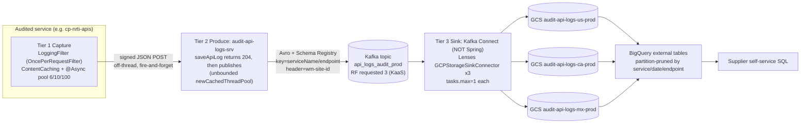
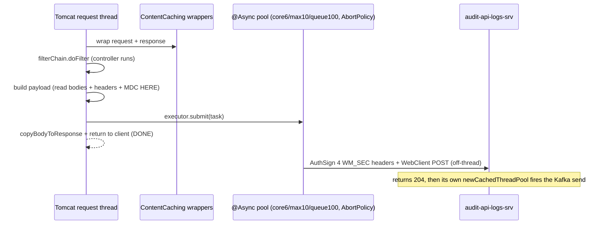
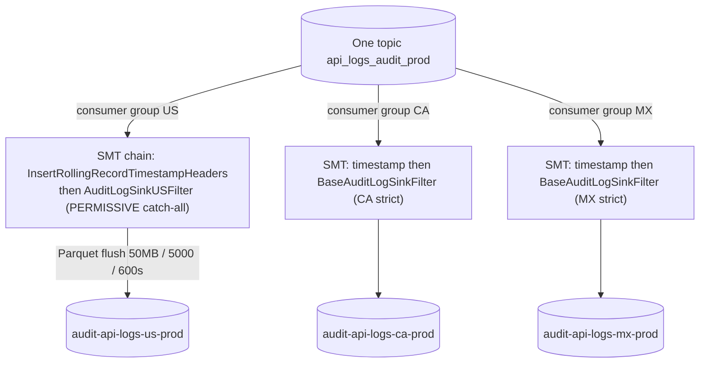
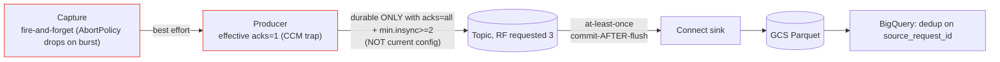

# 20 — System Design Round: "Design an Audit-Logging Platform"

> **The setup:** the interviewer says *"Design a system that records every API call across our supplier platform — millions a day — so suppliers can self-serve debug their requests, with per-country data residency."* This is the round where **the system I actually shipped at Walmart Data Ventures (Luminate Channel Performance) is the textbook answer.** This doc walks the design the way I'd whiteboard it live: drive requirements → estimation → high-level → deep dives → delivery semantics → what-breaks-at-10x/100x → alternatives → wrap-up.
>
> I answer it as the engineer who built it once, knows where every body is buried, and cites real classes and config lines — not a generic SD walkthrough. Mermaid + ASCII diagrams render in `chains-and-design.html`, GitHub, or VS Code.
>
> **Sibling docs to stay consistent with:** `BULLET-1-KAFKA-AUDIT-LOGGING.md`, `07-ARCHITECTURE-AND-NUMBERS-DEFENSE.md`, `09-OPS-CAPACITY-SIZING-QA.md`, `11-WALMART-KAFKA-INTERNALS.md`. Real source on disk at `~/Desktop/walmart` (`audit-api-logs-srv`, `audit-api-logs-gcs-sink`, `dv-api-common-libraries`, `cp-nrti-apis`).

---

## STEP 0 — Canonical numbers + provenance (state this up front; it sets the honest tone)

Before I design anything I pin the numbers I'll defend and **where each comes from** — because half the senior signal in this round is knowing which numbers are in my code, which are derived, and which are provisioned by a platform I don't own.

| Figure | Value | Provenance / honesty |
|---|---|---|
| Volume | **~2M+ events/day ≈ 23 eps average**, design for **~100–230 eps peak** (5–10× business-hours concentration) | Derived: 1 audit record per audited API call × fleet request volume. NOT a metered counter — order-of-magnitude. (`07` B.2, `09` §7.1) |
| Event size | **Avro ~500B–2KB** | Estimate, not measured. At 500B: 23 × 500 ≈ **11.5 KB/s** avg. |
| Kafka retention | **transient buffer, request 3–7 days** | Kafka is NOT the store of record. GCS Parquet + BigQuery is. Don't size 90 days in Kafka. |
| Partitions / RF / min.insync / retention | **NOT in my repo** | These are **KaaS-provisioned** (Walmart Kafka-as-a-Service self-serve), external to the service code. I defend them with a **formula + the value I requested**, never an invented number. RF is *almost certainly 3* (inferred from 3 broker hostnames/region), framed as a sized request, not a known fact. |
| "<5ms P99" | **overhead added to the audited API** (the async hops) | NOT audit end-to-end freshness. Freshness is **minutes**, driven by the sink's `flush.interval=600s`. I never conflate the two. |

> **The one-liner if pushed on "how did you get numbers you can't see in code?":** *"Everything in my code — producer config, HPA, sink flush thresholds — I quote to the line. Topic-level settings that live in KaaS (partitions, RF, min.insync, retention) aren't in my repos; I'm honest about that and defend a value with a formula: partitions from target_eps / per-partition ceiling bounded by consumer parallelism and key cardinality; RF3 + min.insync2 from the durability the workload demands and the 3-broker-per-region topology I can see; retention from replay-need × the disk formula."*

---

## STEP 1 — Drive the requirements (don't wait to be told)

**Functional**
- Capture every API call: caller (`consumer_id`), endpoint, request/response body, status, latency, error reason — the 19-field `log.avsc` contract (`audit-api-logs-srv/src/main/resources/avro/log.avsc`).
- Suppliers query their *own* calls ("show my failed calls yesterday") via SQL, no human in the loop.
- Per-country data residency: US / CA / MX in **separate GCS buckets / BigQuery datasets**.
- Replace an expensive incumbent (Splunk).

**Non-functional (state these explicitly — they drive every later decision)**
- **Negligible latency impact** on the audited APIs — target the single-digit-ms *added overhead* (not freshness).
- **High throughput, bursty** — millions/day, ~10× business-hours peak.
- **Durability tier — ASK:** is this the compliance **system of record**, or a **debugging convenience**? This question flips the entire design (see the senior move below).
- **Freshness:** seconds or minutes? Minutes is fine for debugging → unlocks batching for cheap columnar storage.
- **Cost:** must beat Splunk per-GB indexing.

> **The senior move (the SoR pivot):** I explicitly ask *"is this the legal/compliance system of record, or a debugging convenience?"* The answer flips durability:
> - **If convenience** → async fire-and-forget, `acks=1`-class produce, minutes-fresh — exactly what we built, optimized for caller latency and cost.
> - **If SoR** → synchronous durable capture: a **transactional outbox** (write the audit row in the same DB transaction as the business write, relay to Kafka async) **plus** `acks=all` + `min.insync.replicas=2` + `enable.idempotence=true`. You pay latency and operational cost to buy a real delivery guarantee.
>
> I designed for *convenience* because the durable store of record is GCS/BigQuery downstream, and Kafka is just a replayable transport. If the requirement were SoR I know exactly the four-or-five config lines and the outbox I'd add — I'll come back to that in STEP 7.

---

## STEP 2 — Back-of-envelope estimation (grounded, not invented)

- **Volume:** ~2M+ events/day ÷ 86,400 = **~23 eps average**. Average lies — design for peak: assume 5–10× business-hours concentration ⇒ **~100–230 eps peak**.
- **Bytes/sec:** Avro ~500B–2KB. At 500B: `23 × 500 ≈ 11.5 KB/s` avg, ~115 KB/s at 10× peak. This is *nothing* — a single Kafka partition handles MB/s to tens of MB/s.
- **Kafka disk (NOT the store of record):** `disk = eps × avg_size × retention_sec × RF`. At 3-day retention, RF3, 500B: `23 × 500 × 259,200 × 3 ≈ 8.6 GB` cluster-wide — trivial. **Kafka retention is a 3–7 day replay buffer, not 90-day cold storage.** Long-lived data lives in GCS Parquet + BigQuery.
- **GCS object math (this is the number that actually matters for storage shape):** the sink flushes a Parquet object on the first of `flush.size=50MB` / `flush.count=5000` / `flush.interval=600s` (`audit-api-logs-gcs-sink/env_properties.yaml` prod blocks). At 230 eps split across US/CA/MX × EUS2/SCUS, no single country/region hits 50MB or 5000 records in 10 min ⇒ **the 600s timer dominates.** Objects/day/country/region = `86,400 / 600 = 144`; across 3 countries × 2 regions ≈ **~864 objects/day**, each a 10-min Parquet batch. This is the math that justifies the timer — it caps object count and keeps files MB-sized, dodging the **small-file problem** (tiny files inflate GCS listing + BigQuery external-table scan cost).
- **BigQuery scan cost:** external tables over Parquet are billed on bytes scanned. `PARTITIONBY service_name,_header.date,endpoint_name` ⇒ a supplier query filtered to one service/date/endpoint **partition-prunes** to a single prefix — scans MBs, not the whole table. That's the cost lever versus Splunk's per-GB *index* cost.

> **The insight to voice:** *"The hard constraint here isn't volume — object storage and a single Kafka partition both laugh at 11 KB/s. The two things I actually optimize for are (a) not slowing the customer's API, and (b) routing by residency cleanly without making the producer geo-aware. Storage is an afterthought; latency and residency are the design."*

---

## STEP 3 — High-level architecture (three tiers)



**The three tiers, and why each exists:**
1. **Capture (in-process, async)** — must add ~zero latency, so it runs off-thread on an `@Async` pool. A shared library (`dv-api-common-libraries`) so every team gets it for free as config, not code.
2. **Transport (Kafka)** — decouples capture from storage, absorbs the 10× burst with retention as a buffer, and is replayable (re-run a sink to rebuild a bucket).
3. **Sink + Serve (Connect → GCS Parquet → BigQuery)** — cheap columnar storage + SQL self-service. Connect means no consumer code: declarative KCQL gets me batching, Parquet encoding, offsets, retry, and DLQ for free.

---

## STEP 3.5 — The real artifacts behind each tier (cite these inline; this is what separates me from a textbook answer)

| Tier | Real class / file (`~/Desktop/walmart`) | What it does | The honest catch |
|---|---|---|---|
| 1 | `dv-api-common-libraries/.../filters/LoggingFilter.java` | `OncePerRequestFilter` `@Order(LOWEST_PRECEDENCE)`, wraps `ContentCachingRequest/ResponseWrapper`, builds payload, `@Async` POSTs | Copies **all** request headers (incl. `WM_SEC.*`/`Authorization`) **unmasked** — a real secret leak (STEP 6) |
| 1 | `dv-api-common-libraries/.../AuditLogAsyncConfig.java` | `@Async` pool **core 6 / max 10 / queue 100 / AbortPolicy** | The **correct** bounded pattern — sheds load instead of blocking the business thread |
| 2 | `audit-api-logs-srv/.../controllers/AuditLoggingController.java` `saveApiLog` | returns **HTTP 204** immediately | 204 = "accepted into in-process queue," **not** durability |
| 2 | `.../services/LoggingRequestService.java` | resolves `kafkaProducerService` target, submits to pool | — |
| 2 | `.../services/ExecutorPoolService.java` (~line 10) | `Executors.newCachedThreadPool()` — **UNBOUNDED** | the wrong pool; OOM/thread-exhaustion risk under burst, **invisible to CPU-based HPA** because threads block (STEP 7) |
| 2 | `.../kafka/KafkaProducerService.java` (~line 89) | `key = AuditKafkaPayloadKey.getKafkaKey()` set on `KafkaHeaders.KEY`; `kafkaPrimaryTemplate.send()` in a log-only try/catch | the try/catch wraps an **async** `.send()` → catches almost nothing; broker-side failures complete the future *later* and slip past it |
| 2 | `.../kafka/KafkaProducerConfig.java` `populateConfigProperties()` (~85–119) | sets ONLY bootstrap / serializers / `schema.registry.url` / `auto.register.schemas=false` / optional SSL | sets **NO** acks/idempotence/retries/linger/batch ⇒ client defaults ⇒ **effective acks=1** |
| 2 | `.../models/AuditKafkaPayloadKey.java` (line 27) | `getKafkaKey()` = `serviceName + "/" + endpoint` | mirrors the sink's KCQL `PARTITIONBY` |
| 2 | `.../utils/AvroUtils.java` + `avro/log.avsc` | maps request → 19-field Avro `LogEvent` | `created_ts=now`, `consumer_id` from `wm_consumer.id` else `"NA"` |
| 2 | `.../config/AuditLogsKafkaCCMConfig.java` | `@ManagedConfiguration` interface exposing `brokerUrls/topic/schemaUrl/sslEnabled` | **the CCM trap** — declares tuning it never reads (STEP 4) |
| 3 | `audit-api-logs-gcs-sink/gcs-sink/kc_config.yaml` | 3 connectors, SMT chains, DLQ, RETRY, consumer poll tuning | `security.protocol=PLAINTEXT` — mTLS at the mesh (STEP 5.5) |
| 3 | `.../gcs-sink/env_properties.yaml` | per-env KCQL, bucket/dataset names, flush thresholds | dev uses `flush.size=5MB`, no `flush.count` |
| 3 | `.../converter/BaseAuditLogSinkFilter.java` | strict country filter `apply(r) = verifyHeader(r) ? r : null` | CA/MX inherit strict (missing header → dropped) |
| 3 | `.../converter/AuditLogSinkUSFilter.java` | **permissive catch-all** override (also passes header-less via `noneMatch`) | residency edge case — mis-tagged records land in US (STEP 6) |

---

## STEP 4 — Deep dive: the capture path (the latency-critical part)



**Design decisions to defend:**
- **Why a servlet `Filter`, not an interceptor/aspect?** Only a filter (`LoggingFilter`, `OncePerRequestFilter`, `@Order(LOWEST_PRECEDENCE)`) wraps the raw request early enough to make the read-once body re-readable via `ContentCachingRequest/ResponseWrapper`. Interceptors run after the body is consumed. The filter must also call `copyBodyToResponse()` or the client gets an empty body.
- **Why build the payload on the request thread?** ThreadLocals — request attributes, MDC trace IDs, the servlet request object — don't survive the `@Async` hop, and the request is recycled after commit. So I read everything thread-bound *first*, then hand a plain immutable payload across the boundary.
- **Why `@Async` + a *bounded* pool (core 6 / max 10 / queue 100, AbortPolicy)?** The off-thread hop is the latency win; bounded so a burst can't grow threads unboundedly. Little's Law: `L = λ × W = 23 × 0.03 ≈ 0.7` threads avg, ~7 at 10× peak — core 6 / max 10 covers it. **AbortPolicy is correct here**: when the queue fills it throws `RejectedExecutionException` → the audit event is dropped, the **business request is protected**. For non-critical telemetry, shedding load beats blocking the customer. (Contrast: Tier 2's `ExecutorPoolService` uses `Executors.newCachedThreadPool()` — *unbounded* — which is the wrong pattern; I'd bound it and add a dropped-audit metric. STEP 7.)
- **Why opt-in per endpoint (CCM allow-list + `isAuditLogEnabled()` kill-switch)?** Keeps audit off large-body endpoints where `ContentCaching` buffering (memory ∝ body size × concurrency) would be expensive, and lets teams flip it on with no redeploy.

---

## STEP 5 — Deep dive: transport & serialization (Kafka + Avro)

**Why Kafka, not a direct DB write or a plain queue?**
- Decouples producer from consumer speed — the sink can be slow/batchy (10-min flush) without back-pressuring capture.
- Absorbs the 10× peak with retention as a buffer.
- Replayable — re-run a sink to rebuild a bucket from the topic (within retention).
- Multiple independent consumers (the 3 country sinks, plus a future alerting consumer) off one immutable stream.

**Why Avro + Schema Registry (not JSON)?**
- Compact binary (5-byte magic + schema-id, no field names on the wire) → less broker + storage cost at millions/day.
- **Schema enforcement + governed evolution.** `auto.register.schemas=false` (`KafkaProducerConfig.populateConfigProperties`) means a drifting producer **cannot** silently register an incompatible schema and fork the Parquet/BigQuery contract — schema changes go through an out-of-band governed promotion (BACKWARD compat: only add nullable-with-default fields). Confluent's client caches schema-ids in-process, so steady-state doesn't hit the registry per message.
- Natural pairing: Avro on the wire → Parquet at rest (both schema-driven; the sink's `value.converter=AvroConverter, schemas.enable=true` reads exactly what `KafkaAvroSerializer` wrote).
- **Caveat — Schema Registry is a shared SPOF on both ends** (serialize on produce, deserialize on consume). Combined with the unbounded Tier-2 pool, a registry stall backs up threads *invisibly*. Mitigation: client-side schema-id cache (already there) + serializer-error alerting + a circuit-breaker that spills to an app DLQ instead of dropping.

**Partition key:** `serviceName + "/" + endpoint` (`AuditKafkaPayloadKey.getKafkaKey()` line 27, set on `KafkaHeaders.KEY` in `KafkaProducerService` line 89) → **per-(service,endpoint) ordering**, and it **mirrors the sink's KCQL `PARTITIONBY service_name,_header.date,endpoint_name`** so the on-wire key and on-disk layout agree.
- **Hot-partition caveat:** key cardinality is bounded by #services × #endpoints (modest), so a chatty endpoint pins one partition. Accepted because the sink is batch-oriented and downstream is analytics where global order is irrelevant. **Adding partitions does NOT fix a concentrating key** — the hash still lands the hot key on one partition; the fix is to salt the dominant service (`service/endpoint/{shard}`) or null-key round-robin it. Detect via per-partition messages-in/bytes-in + per-partition lag.
- **Ordering caveat (over-promise trap):** "per-endpoint ordering" is **not absolute today**. With `retries>0`, `enable.idempotence=false`, and default `max.in.flight.requests=5`, a retried earlier batch can land after a later one and reorder *within* a partition. Turning on `enable.idempotence=true` preserves ordering even with retries + in-flight>1 — which is exactly why it's a top recommended change.

**The CCM trap (the most code-specific honesty point about this producer):** the NON-PROD CCM yml *declares* `acks=all`, `retries=10`, `lz4`, `linger.ms=20`, `batch.size=8192`, `request.timeout.ms=300000`, `max.request.size=10000000` — **but** the `AuditLogsKafkaCCMConfig` `@ManagedConfiguration` interface only exposes `brokerUrls/topic/schemaUrl/sslEnabled`, so **those tuning keys are never read and do not take effect.** PROD CCM doesn't even declare them. So the effective config is the Kafka client defaults: **acks=1, default retries, idempotence off.** The honest framing: *"those numbers represent my intended tuning, captured in CCM, that still needs wiring into the producer factory — it's a two-line fix and the single highest-value reliability change."*

**Residency routing rides a header, not the key:** the producer copies `wm-site-id` into a Kafka header (whitelist alongside `wm_consumer.id`, `wm_svc.*`, `wm_qos.correlation_id`). The key is needed for ordering/partitioning; residency is an orthogonal *landing* concern, so it stays a header and the topic remains one immutable stream. (Encoding country in the key would give only 3 hot partitions.)

---

## STEP 5.5 — Deep dive: platform & security model (KaaS / KCaaS + mTLS at Istio)

This is a standard SD probe ("how is the transport secured? who runs the brokers?") with a crisp, differentiated answer.

- **KaaS (Kafka-as-a-Service):** brokers are run by a platform team. We **request a topic** (name, partitions, RF, retention, cleanup.policy) and get broker URLs + secrets injected via CCM. **This is precisely why partitions/RF/min.insync/retention are not in my repo** — my service config carries only the topic *name* (`auditLoggingKafkaTopicName`). For future tasks-parallelism headroom I'd **request 6 partitions** (formula in STEP 8), RF=3, min.insync=2.
- **KCaaS:** the sink is a managed Kafka Connect worker cluster on a `kcaas-base-image` — I ship a plugin JAR (Lenses `GCPStorageSinkConnector` + my 3 SMT filter classes) and a `kc_config.yaml`. **Not a Spring Boot app** (no `main()`, no `Application` class).
- **Cluster + regions:** `kafka-v2-luminate-core-{stg|prod}`, port **9093**, two Azure regions **EUS2 + SCUS**, active/active.
- **mTLS terminated at the Istio mesh:** the app and Connect speak `security.protocol=PLAINTEXT` to their **local Istio sidecar** (`kc_config.yaml`; `auditLoggingKafkaSslEnabled=false` in prod CCM). The sidecar does SPIFFE-based, auto-rotating mTLS to the brokers — the code comment literally says *"mTLS is enforced for Kafka connections."* The in-app JKS keystore/truststore branch is a fallback behind the CCM flag, off in prod. This keeps cert rotation out of the app and is the right platform pattern; I'm just precise that it's **mesh-level, not Kafka-client-level**.

---

## STEP 6 — Deep dive: the residency sink (the clever + risky bit)



**Topology (the precise, code-grounded version):** the sink is **Kafka Connect**, Lenses `io.lenses.streamreactor.connect.gcp.storage.sink.GCPStorageSinkConnector`, on a `kcaas-base-image`. There are **3 connector instances**, each `tasks.max=1` ⇒ 3 sink tasks = 3 consumers, each effectively its own consumer group ⇒ the topic is read **3× (3× read amplification)** by design, for per-country isolation:
- `audit-log-gcs-sink-connector` — **US, the permissive catch-all** (`AuditLogSinkUSFilter` overrides `verifyHeader` to also pass header-less records via `noneMatch`).
- `audit-log-gcs-sink-connector-ca` — **CA, strict** (inherits `BaseAuditLogSinkFilter`; missing header → dropped).
- `audit-log-gcs-sink-connector-mx` — **MX, strict**.

**SMT chain (order matters):**
1. `io.lenses.connect.smt.header.InsertRollingRecordTimestampHeaders` — `date.format=yyyy-MM-dd, timezone=GMT` → writes `_header.date`. **Runs FIRST** so surviving records carry the date stamp; GMT keeps all 3 countries on one consistent day boundary.
2. `com.walmart.audit.log.sink.converter.AuditLogSink{US|CA|MX}Filter` — `apply(r) = verifyHeader(wm-site-id) ? r : null` (null = record dropped). `verifyHeader` is **fail-closed** (any exception → false → drop, never stall the task).

**KCQL + flush (from `env_properties.yaml`):** `INSERT INTO <bucket> SELECT * FROM api_logs_audit_prod PARTITIONBY service_name,_header.date,endpoint_name STOREAS PARQUET PROPERTIES(flush.size=50000000, flush.count=5000, flush.interval=600, key.suffix=_eus2|_scus)`. Whichever flush threshold fires first writes the object; at this volume the **600s timer dominates** (STEP 2 math). Freshness = **minutes by design** — a *different number* from the <5ms capture overhead.

**Consumer tuning (`kc_config.yaml`):** `max.poll.records=50`, `max.poll.interval.ms=300000` (headroom for a 50MB Parquet flush + GCS upload + RETRY), `session.timeout.ms=15000`, `heartbeat.interval.ms=5000`. Rebalancing is **cooperative-sticky** (Connect default `[Range, CooperativeSticky]`) so a worker deploy doesn't stop-the-world all 3 country sinks at once.

**Error handling — two non-overlapping mechanisms:**
- `connect.gcpstorage.error.policy=RETRY`, `max.retries=5`, `retry.interval=5000ms` — handles **transient SINK-side** failures (GCS 5xx, throttling, timeouts) by retrying the GCS write.
- `errors.tolerance=all`, `errors.deadletterqueue.context.headers.enable=true`, DLQ `api_logs_audit_prod_DLQ` — handles **per-RECORD** failures (Avro deserialization / SMT) by routing the bad record to the DLQ with context headers, **without head-of-line-blocking** the feed.
- They don't overlap: RETRY = the write *target*; DLQ = the record *content*. **All 3 connectors share ONE DLQ** — one place to inspect, per-country attribution via the context headers (which is why that flag matters). I'd **alert on DLQ depth** (it can silently divert volume).

**Why 3 connectors, not one branching connector?** Geo isolation + per-country operability: separate consumer groups, offsets, lag, RETRY behavior, failure domains — a bad CA filter or a CA-side GCS outage can't stall US/MX. The Lenses GCS sink also can't cleanly fan one record to 3 different buckets/datasets with 3 KCQLs in one task. **Cost = 3× broker fetch ≈ ~70 reads/sec (~700 peak), negligible for a 3-broker cluster — revisit single-connector-with-routing only at ~100× volume.**

---

## STEP 6.5 — Deep dive: serving layer + the data model

- **Storage:** GCS project `wmt-dv-luminate-prod`, three buckets `audit-api-logs-{us|ca|mx}-prod`, datasets `{us|ca|mx}_dv_audit_log_prod.db/api_logs`. **BigQuery external tables** over the Parquet prefixes — suppliers run SQL ("my failed calls yesterday") with no second copy / ETL and no human pulling logs.
- **Partition pruning:** `PARTITIONBY service_name, _header.date, endpoint_name` means a query filtered to one service/date/endpoint scans only that GCS prefix — cheap. External tables pick up new Parquet objects automatically on query; the trade vs native BQ is slightly slower scans and you own partition hygiene (hence the large flush thresholds to avoid small files).
- **Concrete BigQuery-side model + dedup:** the 19-field `log.avsc` maps 1:1 to Parquet columns. Because the pipeline is at-least-once, I expose suppliers a **deduped view**, not the raw external table:
  ```sql
  -- view: api_logs_deduped
  SELECT * EXCEPT(rn) FROM (
    SELECT *, ROW_NUMBER() OVER (
      PARTITION BY source_request_id ORDER BY created_ts
    ) rn
    FROM `wmt-dv-luminate-prod.us_dv_audit_log_prod.api_logs`
    WHERE _header.date BETWEEN @from AND @to      -- partition prune
  ) WHERE rn = 1;
  ```
- **AuthZ (the serving gap to volunteer):** buckets isolate by **country, not by supplier** — suppliers share a country bucket. So supplier isolation must be enforced at the **query layer**: row-level scoping / per-supplier authorized views keyed on `supplier_company`/`consumer_id`. I'd call that out as a hardening item.
- **The bigger, upstream finding (the #1 thing I volunteer):** Tier-1 capture copies **all** request headers — including `WM_SEC.*` signatures and `Authorization` — **unmasked** (`mask.enable=false`) into the record's `headers` field. That's a real **secret/PII leak into the audit store.** Top hardening item: **mask sensitive headers at capture**, before they ever leave the service.

---

## STEP 7 — Delivery semantics & failure modes (where they'll push)



**End-to-end semantic, stated precisely:** **best-effort-once on produce today** (effective acks=1, so a leader failure between ack and replication loses the record), **at-least-once into GCS** (Connect commits offsets *after* a successful flush, so a crash mid-flush re-delivers a batch → duplicate Parquet rows), **deduped in BigQuery** on `source_request_id`. **NOT exactly-once.** The 204 means "accepted into the in-process queue," not durability.

**Weakest links (own them before they're found):**
- **Tier-1 capture** drops under burst (AbortPolicy) — correct trade for non-critical telemetry, but I'd add a dropped-audit metric.
- **Tier-2 producer is effective acks=1** (the CCM trap). The `"durable once acked"` node above is qualified: a record is durable **only** with `acks=all + min.insync.replicas>=2`, which is *not* the current config. With acks=1, the leader acks before replication.
- **Tier-2 unbounded `newCachedThreadPool`** is the real stability liability: under a downstream Kafka/Schema-Registry slowdown, sends back up, threads spawn without limit → OOM/thread-exhaustion. **Worst part: invisible to CPU-based HPA** because the threads are *blocked*, not burning CPU. Contrast with the Tier-1 pool (core6/max10/queue100/AbortPolicy = the correct pattern). Fix: copy the Tier-1 bounded template into Tier-2.
- **The log-only try/catch** around `kafkaPrimaryTemplate.send()` wraps an *async* call — it catches synchronous serialization/buffer-alloc errors but **not** broker-side failures (those complete the future later). Fix: attach a `whenComplete` callback → failure metric + app DLQ.
- **Poison records** → Connect DLQ after `max.retries=5`. **Schema Registry down** → producer can't serialize → today logged-and-dropped; mitigate with the client-side schema cache + circuit-breaker.

**Hardening list to convert it to SoR (the answer to "make it lossless"):**
1. Bound the Tier-2 pool (`ThreadPoolExecutor` + `RejectedExecutionHandler` + dropped-audit metric).
2. Wire the CCM tuning into the producer factory: `acks=all` + topic `min.insync.replicas=2` + `enable.idempotence=true` + bounded `retries`/`delivery.timeout.ms`.
3. Observe the send future (callback → metric → app DLQ); stop relying on the log-only catch.
4. Mask `WM_SEC.*`/`Authorization` at capture.
5. For hard residency: produce-time per-country topics, or derive country **server-side from the authenticated supplier**, instead of trusting a client header.
6. For true SoR delivery: a **transactional outbox** (audit row committed in the same DB txn as the business write, relayed to Kafka by a background poller).

---

## STEP 7.5 — Active/active + failover (pre-empt the "where's your failover?" probe)

- **Deployment:** active/active across **EUS2 + SCUS** on `kafka-v2-luminate-core-prod`. Broker lists are **swapped per region** (EUS pods use EUS=primary/SCUS=secondary; SCUS pods swap them, via CCM `configOverrides`). Both regions' Connect workers write to the **same shared GCS buckets**, de-conflicted by KCQL `key.suffix=_eus2|_scus` + separate `.indexes-eus2`/`.indexes-scus` index objects — distinct object names, no collisions, no shared mutable state.
- **Honest finding on the audit producer:** `KafkaProducerConfig` builds **both** `kafkaPrimaryTemplate` and `kafkaSecondaryTemplate` and `KafkaProducerService` autowires both — but the send path **only ever calls primary**. The secondary template is **dead code**: there is **no in-service failover in audit-srv**. On a primary-region Kafka outage, EUS pods log-and-drop while the unbounded pool backs up.
- **Where the REAL failover lives:** `cp-nrti-apis` `NrtKafkaProducerServiceImpl` — `kafkaPrimaryTemplate.send()` returns a `CompletableFuture`; `.exceptionally()` → `handleFailure()` re-sends the same message to the other region's `kafkaSecondaryTemplate`; `.join()` blocks until primary-or-secondary resolves; total failure throws `NrtiUnavailableException`. I attribute failover *there*, honestly, and the audit-srv fix is "port that pattern — the secondary template is already wired, it just needs the fallback call on the send-future's failure callback."

---

## STEP 8 — Scaling story (the "what breaks first at 10× / 100×" question)

**Partition-count formula (KaaS-provisioned, defended not invented):**
> `partitions = max( ceil(target_peak_eps / per_partition_ceiling), desired_consumer_parallelism )`
>
> Throughput needs ~1 partition (230 eps ≪ one partition's MB/s ceiling). What actually drives the count is **future consumer parallelism** (a group can't exceed partition count), **broker spread** for RF3, and **headroom** — because repartitioning a *keyed* topic reshuffles key→partition and **breaks ordering**. So I **request 6**: room to raise `tasks.max` toward 6 later with no repartition, laid out as 2 leaders/broker on a 3-broker cluster. Don't over-partition (more partitions = more open Parquet files = smaller GCS objects).

| Lever | At 1× (today) | What breaks / changes at 10× | At 100× |
|---|---|---|---|
| Capture | bounded `@Async` pool 6/10/100 per pod | fine; ensure dropped-audit metric exists | same; pool is already correct |
| Tier-2 pool | **unbounded** (liability) | **first thing to fix** — OOM under burst; bound it | bounded pool mandatory |
| Producer durability | effective acks=1 (CCM trap) | wire acks=all + idempotence before scaling raw throughput | mandatory |
| Topic partitions | request 6 (KaaS) | watch lag first; if a task lags, raise partitions **AND** `tasks.max` together; **repartitioning a keyed topic breaks ordering — over-provision modestly up front, don't repartition reactively** | partitions become a genuine throughput lever |
| Sink fan-out | 3 connectors (3× read ≈ 70 reads/s) | still negligible | **3× amplification now matters** → one demuxing connector or per-country topics |
| Hot partition | modest `service/endpoint` cardinality | a chatty endpoint pins a partition | salt the dominant service's key; adding partitions alone won't fix a concentrating key |
| Storage | Parquet/GCS, 600s timer dominates | flush.size/count may fire before timer → fresher, more files; tune | object storage scales linearly; tune flush |
| Serve | BigQuery external + deduped view | partition + cluster tables; consider materialized rollups | materialized rollups |

**What breaks *first* at 10×:** the **Tier-2 unbounded pool** (OOM), not Kafka. Do reliability + observability (bound the pool, acks=all, dropped-audit metric) **before** raw scaling. **Kafka partition count is the LAST lever, not the first.** (For the cp-nrti side, the *servlet thread pool* breaks first because of the IAC `.join()` / EI `.block()` thread occupancy — a different system, noted for contrast.)

---

## STEP 9 — Alternatives I considered (breadth + real magnitudes)

| Choice | Alternative | Why I picked ours (with the real magnitude/trade-off) |
|---|---|---|
| Kafka backbone | Direct DB write / SQS / direct-to-GCS per service | Decoupling + burst absorption + replay + multi-consumer fan-out. Direct-to-GCS would put creds/retry/Parquet-batching in every service and couple a GCS hiccup into the request path. |
| Avro + Schema Registry | JSON / Protobuf | Compact + governed evolution (`auto.register=false`) at millions/day. JSON is 3–10× bigger, no enforced compat. Protobuf is comparable but Avro is the Walmart streaming default + first-class in Connect's `AvroConverter`. Cost = SR is a shared SPOF on both ends. |
| Kafka Connect (Lenses) sink | Hand-written Spring `@KafkaListener` consumer | Connect gives offsets/rebalance/retry/DLQ/Parquet-batching for free; I own ~75 lines of SMT instead of a whole consumer service. Trade = less control + bound to connector at-least-once. **Knowing what *not* to build is the senior move.** |
| 3 SMT connectors (sink-side geo) | Produce-time per-country topics / 1 branching connector | Simplicity + isolated per-country failure domains now. **3× read amplification ≈ 70 reads/s is negligible at this volume — revisit at ~100×.** Would flip to per-country topics for *hard* residency enforcement. |
| Async fire-and-forget | Synchronous durable (transactional outbox) | The latency requirement. Would flip the instant this became a compliance **system of record** — outbox + acks=all + idempotence. (The SoR pivot from STEP 1.) |
| GCS Parquet + BigQuery | **Splunk / Elasticsearch** | Cost + self-service. Columnar Parquet + partition-pruned external tables beats per-GB log *indexing*; suppliers query in place. Splunk was expensive and not supplier-visible — every "why did my call fail?" was a support ticket. |
| Connect SMT routing | **Kafka Streams / ksqlDB** | Routing is a stateless per-record header filter — exactly an SMT's job. Streams/ksqlDB would add a stateful app to deploy/monitor for zero benefit. |
| Active/active per-region clusters | **MirrorMaker2 / Brooklin** cross-region mirror | App-layer failover (cp-nrti `.exceptionally`→secondary) covers *new* writes; whether the two regional clusters mirror at the broker layer is platform-managed and I don't claim it. MM2 would be the platform answer for cross-cluster topic replication if needed. |
| Pub/Sub instead of Kafka | GCP Pub/Sub | Tempting given the GCS/BigQuery sink, but the org standard is Kafka + KaaS/KCaaS + Schema Registry; Pub/Sub would fragment the platform and lose the replay/ordering semantics and the existing Connect ecosystem. |

---

## STEP 10 — 60-second verbal wrap-up

"It's a three-tier async pipeline. **Tier one** captures every call in a servlet `LoggingFilter`, builds the payload on the request thread — because ThreadLocals and the request object don't survive the async hop — then ships it off-thread on a **bounded** `@Async` pool with AbortPolicy, so the customer's request never pays for audit. **Tier two**, `audit-api-logs-srv`, returns 204 instantly, then publishes a compact Avro record keyed by `service/endpoint` with a `wm-site-id` header, on Kafka for decoupling, burst absorption, and replay; mTLS is terminated at the Istio mesh and topic-level settings are KaaS-provisioned, so I size partitions with a formula and request RF3. **Tier three** is Kafka Connect — Lenses GCS connectors, three of them, each with an SMT chain that stamps a GMT date then geo-filters on `wm-site-id` and writes Parquet to per-country buckets, with BigQuery external tables on top for supplier self-service — which is how we kill the Splunk bill.

The honest trade-offs: it's **best-effort-once on produce today** because the producer's tuning is declared in CCM but never read — so effective acks=1 — and **at-least-once into GCS, deduped in BigQuery on `source_request_id`**; it is **not** exactly-once. If this became a compliance system of record I'd wire `acks=all` + `min.insync.replicas=2` + idempotence, bound the Tier-2 unbounded pool with a dropped-audit metric, observe the send future instead of a log-only catch, mask `WM_SEC.*`/`Authorization` at capture so secrets never reach the store, and move residency enforcement to produce-time topics or server-side identity rather than trusting a client header. I optimized for customer latency and cost, and I know exactly the handful of config lines and the outbox I'd add to buy durability the day the requirement changes."
