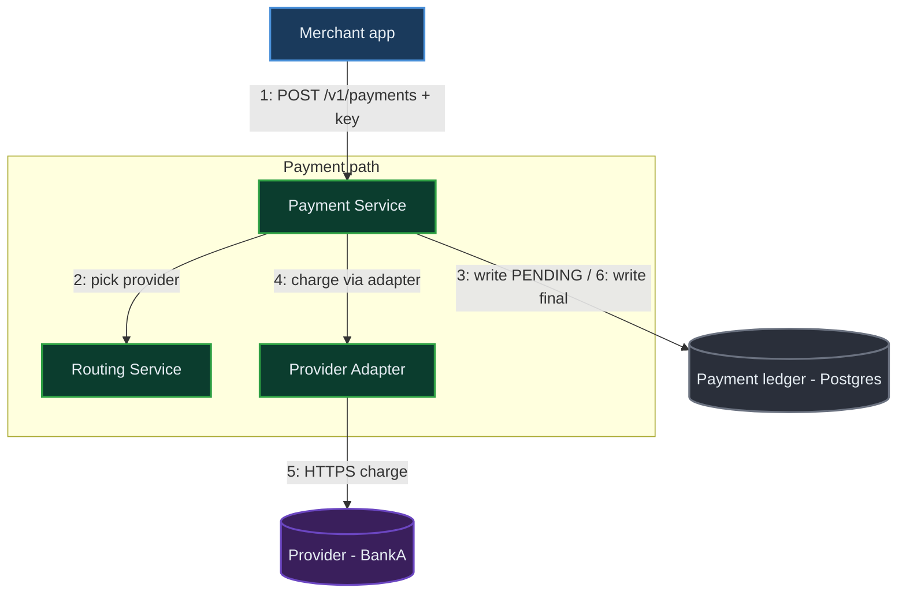
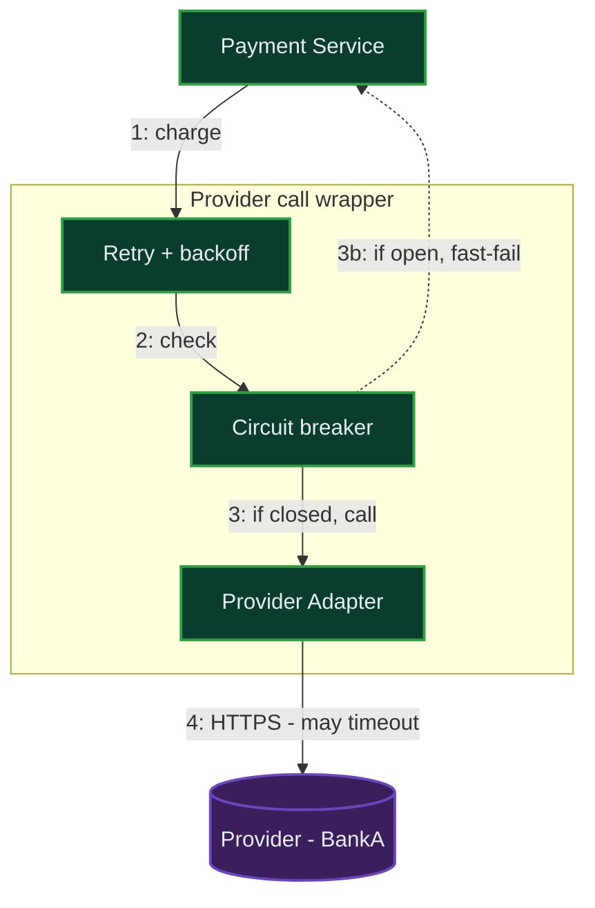
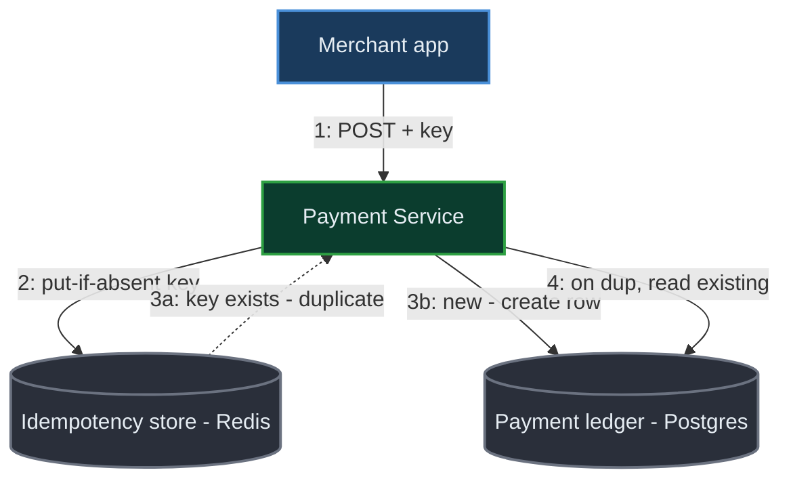
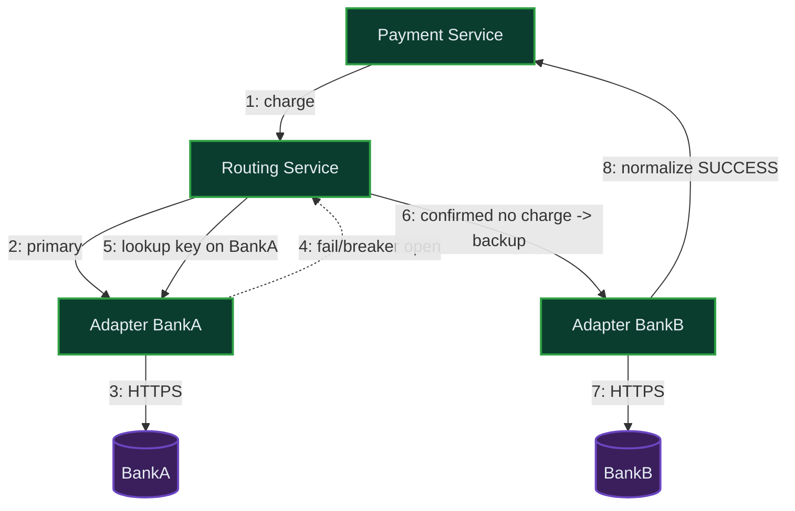
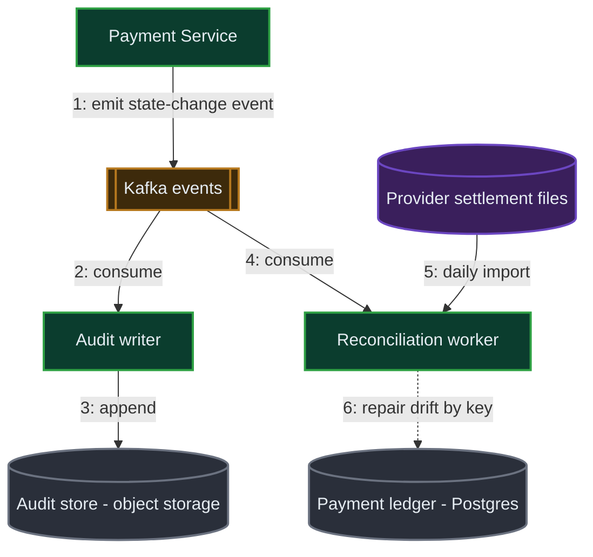
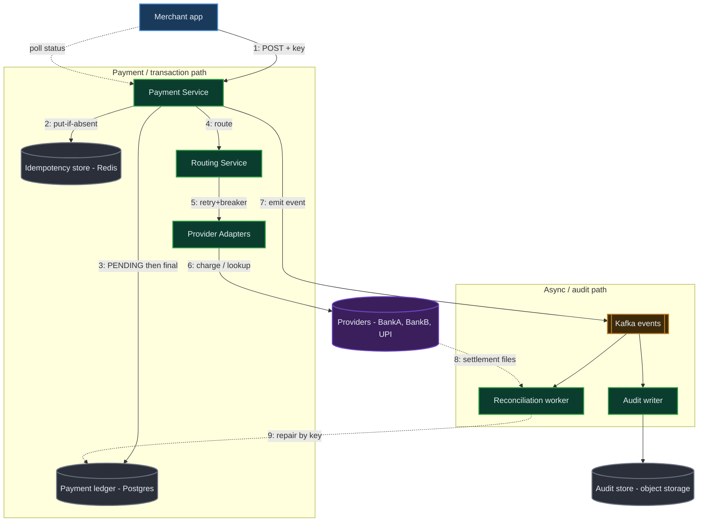
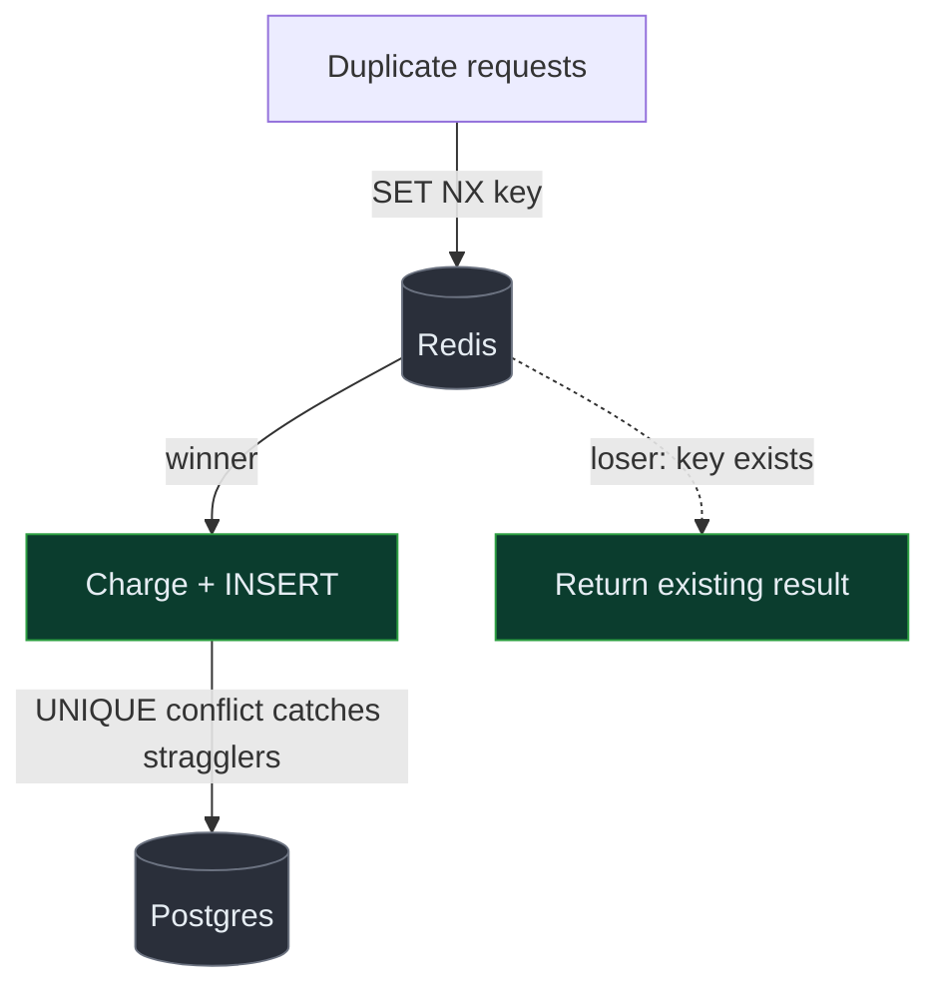
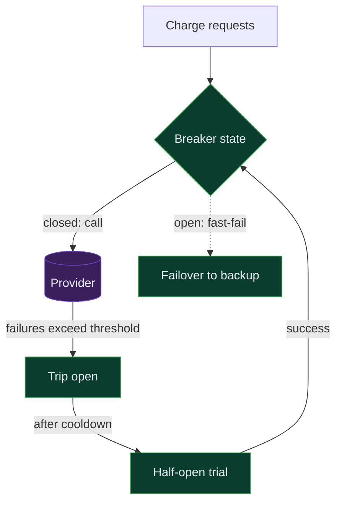

## 1. Requirements (Functional + Non-Functional)

> 🎙️ "Here's how I'll structure this: I'll lock the requirements and rough scale, sketch the API and data model, draw the high-level design one flow at a time, then go deep on the two or three hardest parts — idempotency and provider failover — checking in with you as I go. Sound good?"

The core tension: we're moving **money through third parties we don't control**, so the whole game is *correctness under partial failure* — never charge twice, never lose a payment, and keep succeeding even when a bank times out — at **millions of payments a day** and **100K+ concurrent requests**.

🏢 This is a **payments** problem, so I'll target an **Amazon-style bar** — cost and operations (reconciliation, audit trails, on-call) are first-class, and I'll work backwards from "the merchant got paid and the customer was charged exactly once." Tell me if you'd rather I tilt toward a different company.

**Functional (the core flows — "above the line"):**

- **FR1 — Process a payment request.** A merchant submits `userId`, `merchantId`, `amount`, `paymentMethod` and we route it to the right third-party provider and return a normalized result.
  - 🗣️ **Plain words:** "A shop sends us 'charge this customer ₹500 on their card' and we make the charge actually happen through a bank or card network and tell the shop whether it worked."
  - ⚡ **Why it's hard:** the actual charge happens in a system we don't own and can't roll back ourselves — so our state and the provider's state can drift, and we have to reconcile them.

- **FR2 — Retries with bounded backoff.** Providers fail transiently (timeouts, network blips); we retry up to a bounded count with exponential backoff before giving up.
  - 🗣️ **Plain words:** "If the bank doesn't answer, we don't immediately tell the shop 'failed' — we quietly try a few more times, waiting a little longer each time, before we admit defeat."
  - ⚡ **Why it's hard:** a timeout is *ambiguous* — the charge may have already gone through on the provider's side, so a naive retry can double-charge.

- **FR3 — Idempotency (charge exactly once).** Merchants resend the same request (their own retries, our retries, network duplicates); the same `idempotencyKey` must return the same result and never charge twice.
  - 🗣️ **Plain words:** "If the shop accidentally hits 'pay' twice for the same order, the customer's money only leaves once, and both clicks see the same receipt."
  - ⚡ **Why it's hard:** the dedup decision has to be atomic across a distributed cluster — two copies of the same request can land on two servers in the same millisecond.

- **FR4 — Multi-provider routing + failover + normalization.** Support multiple providers; if the primary fails after retries, fail over to a backup; normalize every provider's response into one common format.
  - 🗣️ **Plain words:** "We talk to several banks; if Bank A is down, we send the payment to Bank B instead, and the shop gets back the same shape of answer no matter which bank actually handled it."
  - ⚡ **Why it's hard:** failover *across* providers re-opens the double-charge risk (did Bank A actually take the money before it went dark?) and every provider speaks a different dialect.

- **FR5 — Audit trail & reconciliation.** Every state change is logged immutably for debugging, dispute resolution, and end-of-day reconciliation against provider settlement files.
  - 🗣️ **Plain words:** "We keep a tamper-proof diary of everything that happened to every payment, so we can prove what occurred and match our records against the bank's at the end of the day."
  - ⚡ **Why it's hard:** the audit log is the source of truth that lets us *detect and repair* the drift FR1–FR4 inevitably create; it must be complete and append-only.

**Below the line (out of scope):** card-detail capture / PCI vaulting (we assume a tokenized `paymentMethod`), KYC/fraud scoring, payouts/settlement to merchant bank accounts, refunds & chargebacks UI, currency conversion, the merchant dashboard itself.

**Non-Functional:**

- **Correctness (exactly-once charge).** A given `idempotencyKey` results in **at most one** successful charge, always.
  - 🗣️ **Plain words:** "No customer is ever charged twice for one order — full stop."
  - 💥 **What breaks without it:** double-charges, angry chargebacks, regulatory exposure, and loss of merchant trust — the single most damaging failure for a payments company.

- **Availability — 99.95% on the payment path.** ~4.4 hours of downtime/year budget.
  - 🗣️ **Plain words:** "The pay button works essentially all the time; we're down less than about four and a half hours across a whole year."
  - 💥 **What breaks without it:** every minute down is lost transactions and revenue for thousands of merchants; checkout abandonment spikes.

- **Latency — p99 < 1s excluding provider time; provider call bounded by a hard timeout (~3s).**
  - 🗣️ **Plain words:** "Our own overhead is well under a second; the only slow part is the bank itself, and we cap how long we'll wait on them."
  - 💥 **What breaks without it:** a slow provider ties up threads and the whole gateway stalls (head-of-line blocking), turning one slow bank into a site-wide outage.

- **Durability — RPO ≈ 0 for payment records.** A committed payment is never lost.
  - 🗣️ **Plain words:** "Once we say a payment is recorded, it survives a crash even if it happened one second ago."
  - 💥 **What breaks without it:** we lose the record of a real charge — money moved but we can't prove it, making reconciliation impossible.

- **Scale — 100M payments/day, 100K+ concurrent in-flight requests, horizontally scalable.**
  - 🗣️ **Plain words:** "We can handle the busy days — sales, festivals — by adding more servers, not rewriting the system."
  - 💥 **What breaks without it:** a flash sale melts the gateway and payments fail at the worst possible moment.

> ⚠️ Gaps I'd flag out loud: true end-to-end exactly-once is impossible because the provider is an external system that can succeed *after* it times out to us — so I'll be explicit that I deliver **exactly-once charging via idempotency + reconciliation**, not magic; some failures resolve asynchronously, not instantly.

> 💬 "The whole problem is correctness under partial failure: the provider can charge the card and then the network dies before it tells us — so my design is built around idempotency keys, bounded retries, and a reconciliation backstop."

🎙️ **Script:** "So we're building a payment gateway: a merchant sends us a charge, we route it to the right bank or card network, retry with backoff if it blips, fail over to a backup provider if the primary stays down, and return one normalized answer. The non-negotiable is correctness — a customer is charged at most once per idempotency key, even though the provider is a system we don't control and a timeout might mean the charge actually went through. So I'll lean hard on idempotency keys, bounded retries, and an audit trail that lets us reconcile. I'll target three-and-a-half nines plus on availability, sub-second overhead excluding the bank, and zero data loss on payment records."

## 2. Clarifying Questions & Assumptions

- **"What's the daily payment volume and the peak multiplier during sales events?"**
  - 🗣️ **Why I'm asking:** "It tells me whether a single region can hold this or I need heavy sharding, and how big my retry amplification gets at peak."
  - ↔️ **Design fork:** If YES, big (100M+/day, 10x peaks) → shard the ledger by merchant, async settlement, dedicated hot-merchant handling. If NO (thousands/day) → a single Postgres + a queue is plenty, don't over-engineer.
  - **Assumption:** ~100M payments/day, ~5x peak (~6K/s), 100K concurrent in-flight.

- **"When a provider times out, do I get a reliable way to query whether the charge actually happened?"**
  - 🗣️ **Why I'm asking:** "This is the whole ballgame for retries — if I can ask the provider 'did you process idempotency-key X?', retries are safe; if I can't, I have to be far more conservative."
  - ↔️ **Design fork:** If YES (provider supports idempotency keys / a status-lookup API) → I pass my key through and retries/failover are safe. If NO → I must treat a timeout as *maybe-charged*, mark it PENDING, and resolve only via reconciliation, never blind-retry.
  - **Assumption:** Major providers accept a client idempotency key and offer a transaction-status lookup (true for Stripe, Razorpay, most card networks).

- **"Is the merchant okay with an asynchronous result, or do they need a synchronous SUCCESS/FAIL in the same HTTP call?"**
  - 🗣️ **Why I'm asking:** "If they can accept a webhook/poll, I can return PENDING immediately and protect my threads; if they demand sync, I have to hold the connection through the provider call."
  - ↔️ **Design fork:** If async OK → return `202 PENDING` + idempotencyKey, finalize via webhook/callback. If sync required → bounded synchronous wait with a hard timeout, fall to PENDING past it.
  - **Assumption:** Sync-preferred with a hard timeout, but PENDING is an accepted terminal-for-now state the merchant polls.

- **"Do we need strict ordering or just exactly-once per key?"**
  - 🗣️ **Why I'm asking:** "Ordering across a merchant's payments is expensive; if we only need each payment correct independently, I avoid a global sequencer."
  - ↔️ **Design fork:** If only per-key exactly-once → independent rows, no ordering coordinator (simpler). If strict ordering → per-merchant sequencing/partitioned log.
  - **Assumption:** Per-key exactly-once only; no global ordering requirement.

- **"What's the retry/timeout budget the business will tolerate — max retries and total latency before we tell the merchant 'failed'?"**
  - 🗣️ **Why I'm asking:** "It bounds my backoff schedule and whether failover to Bank B fits inside the merchant's patience window."
  - ↔️ **Design fork:** If generous (a few seconds) → 3 retries + 1 failover synchronously. If tight (sub-second) → 1 quick retry then async.
  - **Assumption:** Max 3 retries with exponential backoff per provider; total ~ a few seconds; one failover hop allowed.

- **"Are providers region-specific (a UPI provider for India, a card network for the US), or interchangeable?"**
  - 🗣️ **Why I'm asking:** "It decides whether routing is just health-based or also rules-based on method/geo/currency."
  - ↔️ **Design fork:** If interchangeable → route purely on health/cost. If specialized → a routing rules engine keyed on method+geo.
  - **Assumption:** Routing is rule-based (method + geo) first, then health/cost among eligible providers.

🤝 **Checkpoint:** "My assumptions: ~100M/day with 5x peaks, providers support idempotency keys and status lookups, sync-preferred with PENDING as a fallback, per-key exactly-once with no global ordering, 3 retries + 1 failover, and rule-based routing. Want to change any before I size it?"

Let me now compute the few numbers that actually drive the design.

## 3. Scale & Capacity (talkable numbers)

First tool use here — I only compute what forces a decision.

| Metric | Derivation (step-by-step) | Rounded | Talkable phrase | Decision it drives |
|---|---|---|---|---|
| Avg payment rate | 100M ÷ 86,400s ≈ 1,157/s | ~1.2K/s | "about 1,200 payments a second" | Tiny for a stateless tier; not the bottleneck |
| Peak payment rate | 1,157 × 5 ≈ 5,787/s | ~6K/s | "about 6,000/s at peak" | Sets the stateless API + idempotency-store QPS |
| Worst-case provider calls | 6K/s × 4 (3 retries + 1 failover) ≈ 23K/s | ~23K/s | "up to ~23,000 outbound calls/s" | **The amplification number** — drives circuit breakers + connection pools per provider |
| Idempotency store load | ~6K writes/s peak, read-before-write each | ~12K ops/s | "~12K ops/s on the dedup store" | Forces a fast KV (Redis) with atomic put-if-absent, not the SQL DB |
| Idempotency storage (24h TTL) | 100M × 200 bytes ≈ 20 GB/day | ~20 GB | "20 gig of keys, expires daily" | Fits in RAM on a small Redis cluster |
| Ledger storage / year | 100M × 365 × 500 bytes ≈ 18 TB raw; ×4 (replicas+index) ≈ 73 TB | ~73 TB/yr | "tens of terabytes a year" | Forces sharding by merchant_id + cold archival |
| Audit-log volume | 100M × 5 events × 300 bytes ≈ 150 GB/day ≈ 55 TB/yr | ~55 TB/yr | "the audit log is the big table" | Goes to append-only/object storage, not the hot DB |
| Status-check reads | 100M × 3 polls ÷ 86,400 ≈ 3.5K/s avg, ~17K/s peak | ~17K/s | "~17K status reads/s peak" | Cache status in Redis; keep reads off the ledger |

🧠 **QPS** *(queries per second — how many requests hit a tier each second)*. **TTL** *(time-to-live — how long a stored value is kept before it auto-expires; here idempotency keys expire after 24h)*. **KV store** *(key-value store — a simple, very fast "give me the value for this key" database like Redis)*.

**The one number that forces the design:** the **retry amplification — ~23K outbound provider calls/s at peak** from only ~6K real payments. That 4x blow-up is why I need **per-provider circuit breakers and bounded connection pools**: the flip threshold is when a provider's p99 climbs past my ~3s timeout — at that point retries pile up, 23K becomes 50K+ of waiting threads, and one sick provider would exhaust pools and take down healthy traffic. The circuit breaker trips *before* that happens and sheds load to the backup provider.

🎙️ **Script:** "The headline is that the raw payment rate is small — about six thousand a second at peak — but retries and failover amplify that to roughly twenty-thousand-plus outbound calls a second to providers. So my budget goes not into raw throughput but into protecting myself from a slow provider: bounded connection pools and circuit breakers, plus a fast in-memory store doing about twelve-thousand idempotency checks a second. Storage on the payment ledger is tens of terabytes a year so I'll shard it, and the audit log is actually the biggest table, so that goes to cheap append-only storage."

## 4. Core Entities

🎙️ I'd start by talking about the key entities and why each one exists — this is a first draft of the nouns; I'll add full field definitions in the data model.

- **Payment** — the central record of one charge attempt-set: who, how much, which method, current status (PENDING / SUCCESS / FAILED), and which provider ultimately handled it. It owns the *lifecycle* of the money.
  - 🗣️ **Simple analogy:** "Think of it like a single line on a receipt that we keep updating as the charge moves from 'trying' to 'paid'."
  - ⚠️ **Interviewer probe:** "How do you stop two requests creating two Payments for one order?" → the `idempotencyKey` is a unique constraint; the first writer wins and the second reads back the same Payment.

- **IdempotencyKey record** — maps a merchant-supplied key to the one Payment it created and that Payment's final response. It owns *dedup*.
  - 🗣️ **Simple analogy:** "Like a coat-check ticket — hand in the same ticket and you always get back the exact same coat, never a second one."
  - ⚠️ **Interviewer probe:** "What if two identical requests race?" → an atomic put-if-absent on the key; the loser blocks/polls and returns the winner's result.

- **ProviderAttempt** — one individual call to one provider (provider id, attempt number, request/response, latency, outcome). It owns the *retry/failover history*.
  - 🗣️ **Simple analogy:** "Like a call log showing each time we phoned the bank and what they said."
  - ⚠️ **Interviewer probe:** "How do you know if a timed-out attempt actually charged?" → we later query the provider by our idempotency key; the attempt stays `UNKNOWN` until resolved.

- **Provider** — config for a third party: capabilities (methods, geos), credentials, health state, weight/priority. It owns *routing eligibility*.
  - 🗣️ **Simple analogy:** "Like a contact card for each bank, including whether it's currently reachable."
  - ⚠️ **Interviewer probe:** "How do you pick one?" → rules filter eligible providers by method/geo, then health + weight choose among them.

- **AuditEvent** — an immutable, append-only record of every state transition for a Payment. It owns *traceability + reconciliation*.
  - 🗣️ **Simple analogy:** "A tamper-proof diary entry written every time anything happens to a payment."
  - ⚠️ **Interviewer probe:** "Why separate from Payment?" → Payment is mutable current-state; the audit log is immutable history — you need both to reconcile.

🎙️ **Script:** "The key nouns are the Payment itself — the current state of one charge — and the IdempotencyKey record that guarantees one request makes exactly one Payment. Then ProviderAttempt logs each individual call to a bank so I can reason about retries and failover, Provider holds the routing config and health, and AuditEvent is the immutable history I reconcile against. The one I'd flag as most important is the IdempotencyKey record — it's the spine of correctness. I'll firm up the exact fields in the data model."

## 5. API / Interface

Default REST. I'll go one-by-one through the functional requirements.

**FR1/FR3 — Create a payment (the core endpoint):**

- **Method + path:** `POST /v1/payments` — POST because it *creates new state* (a charge) and is the natural place to enforce idempotency.
- **Key request fields:**
  - `idempotencyKey: string` — the dedup key; this is what makes a resend safe. Sent as a header (`Idempotency-Key`) so it's protocol-standard.
  - `merchantId: string` — *whose* payment, used for routing rules and sharding. (Verified against the caller's auth token — we don't trust it blindly.)
  - `amount: { value: int, currency: string }` — integer minor units (paise/cents), never floats, to avoid rounding errors with money.
  - `paymentMethod: { type, token }` — a **tokenized** method; we send the token, never raw card numbers, keeping us out of PCI scope.
  - *Intentionally absent:* no `provider` field — the **server** chooses the provider, so a merchant can't force a bad route; no `status` — the server sets it.

```
// Request
POST /v1/payments
Idempotency-Key: abc-123
{ "merchantId": "M123", "userId": "U456",
  "amount": { "value": 50000, "currency": "INR" },
  "paymentMethod": { "type": "CARD", "token": "tok_visa_x" } }

// Response 200 (or 202 if still PENDING)
{ "transactionId": "T789", "status": "SUCCESS",
  "amount": { "value": 50000, "currency": "INR" },
  "provider": "BankA" }
```

- **One key design decision:** the `Idempotency-Key` makes a retried POST return the *same* `transactionId` with no second charge. If the original is still in flight, the duplicate gets `409 Conflict` / blocks-and-returns the same result — never a new charge.

**FR1 (status) — Read a payment:**

- **Method + path:** `GET /v1/payments/{transactionId}` — GET because it's a pure, cacheable read.
- **Returns:** normalized `status`, `provider`, `amount`, timestamps. Merchants poll this when the create call returned PENDING.
- **Design decision:** this read is served from a status cache (Redis), not the ledger, to keep the ~17K/s peak reads off the system of record.

**FR4 (internal) — Provider adapter interface (normalization):**

```
// Every provider adapter implements:
charge(normalizedRequest, idempotencyKey) -> { status: SUCCESS|FAILED|UNKNOWN, providerTxnId, rawCode }
lookup(idempotencyKey) -> { status, providerTxnId }   // for post-timeout resolution
```
Each adapter translates the common request into the provider's dialect and maps the provider's response codes back into our common `{SUCCESS, FAILED, UNKNOWN}` enum.

**Security:** the caller is identified from the API key / JWT, not from `merchantId` in the body — we verify the token *owns* that merchant. We never trust client-supplied provider, status, or amount-after-the-fact; the amount is bound to the idempotency key on first write, so a retry can't change it.

> 💬 "One create endpoint with an idempotency-key header, one status GET, and a clean internal adapter interface so every bank looks the same to the rest of the system."

🎙️ **Script:** "It's basically one public write — POST /v1/payments with an Idempotency-Key header — that returns a transaction id and a normalized status. If the bank's slow it comes back PENDING and the merchant polls a cacheable GET. Internally, every provider sits behind the same adapter interface with a charge and a lookup method, so the rest of the system never knows or cares which bank it's talking to. And critically, the server picks the provider and binds the amount to the key on first write, so a merchant can't forge the route or change the amount on a retry."

## 6. High-Level Design (built one functional requirement at a time)

### 6.1 "Process a payment request (route to a provider)"

The user is trying to charge a customer; this slice is the happy path — accept, route, call one provider, persist, return.

New components: a stateless **Payment Service**, a **Routing Service** (picks the provider), a **Provider Adapter** layer, and the **Payment ledger** (Postgres).

🧠 **Postgres** *(a relational database that stores data in rows with strict all-or-nothing transactions — here it's the system of record for payments because money needs ACID guarantees)*.

**Architecture decisions table:**

| Component | What it is (plain English) | Why THIS choice | What we DIDN'T pick & why not | Trade-off we accept |
|---|---|---|---|---|
| Payment Service | A stateless app tier that owns the payment lifecycle and orchestrates the charge | Stateless = scale by adding pods; horizontally absorbs the 6K/s peak | Not a monolith with the merchant app (couples failure domains); not serverless (cold starts hurt the connection-pool-heavy provider calls) | Orchestration logic lives in code we must keep correct |
| Routing Service | Picks an eligible provider by rules + health | We need method/geo rules AND failover; centralizing keeps routing consistent | Not hard-coded routing (can't fail over); not client-chosen (security + can't react to outages) | One more hop; mitigated by caching provider config |
| Payment ledger | Postgres, source of truth for Payment rows | Money needs atomic writes + a unique constraint on idempotencyKey to prevent dupes | Not DynamoDB (conditional writes work but cross-row money invariants and audits are clunkier); not Mongo (weaker multi-row transactions) | Must shard by merchant_id as volume grows |

🎙️ **Narration:** "The Payment Service is just a stateless app tier — I scale it by adding pods, and I keep it separate from the merchant's own app so a bug there can't take down payments. Routing I centralize in its own service because I need rule-based eligibility plus health-based failover, and I can't let the client choose the provider for security reasons. The ledger is Postgres because this is money — I want an atomic write and a unique constraint on the idempotency key so two requests can't create two charges. I considered Dynamo, which would work, but the money invariants and audit joins are cleaner in a relational DB."

**🗣️ Key terms for this slice:**

> **Stateless service** — an app server that keeps no per-request memory between calls, so any pod can handle any request. Here it lets us scale the payment tier just by adding machines.
> **ACID transaction** — a database guarantee that a multi-step write either fully happens or fully rolls back. Here it ensures a Payment row and its first state are written together or not at all.
> **Unique constraint** — a database rule that forbids two rows with the same value (the idempotencyKey). Here it's the last line of defense against a duplicate charge.

**Diagram — happy-path charge:**



**Numbered step narration:**

1. **Merchant POSTs** the payment with an `Idempotency-Key`. *Why here:* the Payment Service is the single entry point that owns the lifecycle. *State:* nothing yet. *What could go wrong:* duplicate request — handled by §6.3's idempotency check before anything else.
2. **Payment Service asks Routing** for an eligible provider. *Why:* routing centralizes rules + health. *State:* none yet. *Goes wrong:* no eligible provider → return a clean `FAILED` with reason.
3. **Write the Payment row as PENDING** in Postgres before calling the bank. *Why:* we must have a durable record *before* money can move, so a crash mid-call is recoverable. *State:* Payment exists, status=PENDING. *Goes wrong:* DB write fails → reject before charging, nothing lost.
4. **Call the chosen provider through its adapter.** *Why:* the adapter normalizes the dialect. *State:* a ProviderAttempt is logged. *Goes wrong:* provider slow → hard timeout (§6.2).
5. **Adapter makes the HTTPS charge** carrying our idempotency key. *State:* money may move on the provider side. *Goes wrong:* timeout → outcome UNKNOWN, resolved by lookup/reconciliation.
6. **Write the final status** (SUCCESS/FAILED) and return the normalized response. *State:* Payment is terminal. *Goes wrong:* crash after provider success but before our write → reconciliation repairs it (§8).

**💬 Say-while-drawing:** "Notice I write PENDING *before* I call the bank — that durable record is what lets me recover if anything dies mid-charge."

🎙️ **Script:** "The happy path is: merchant posts a payment, the Payment Service asks Routing for a healthy provider, writes a PENDING row to Postgres so there's always a durable record before money moves, then calls that provider through an adapter that normalizes the response. On success we flip the row to SUCCESS and return a clean, provider-agnostic answer. The one decision that makes this safe is persisting PENDING first — it means a crash mid-charge is always recoverable instead of a silent lost payment."

### 6.2 "Retries with bounded backoff"

Same path, but now the provider call from step 4–5 can fail transiently. This slice wraps that call in a bounded retry loop.

New components: a **Retry/Backoff wrapper** and a **per-provider Circuit Breaker** around the adapter.

🧠 **Exponential backoff** *(waiting longer between each retry — 100ms, 200ms, 400ms — so we don't hammer a struggling provider)*. 🧠 **Circuit breaker** *(a switch that "trips open" after too many failures and stops sending calls to a sick provider for a cooldown, instead of piling up timeouts)*.

**Architecture decisions table:**

| Component | What it is | Why THIS choice | What we DIDN'T pick | Trade-off |
|---|---|---|---|---|
| Retry wrapper | Bounded loop (max 3) with exponential backoff + jitter | Smooths transient blips without infinite hammering; jitter avoids thundering-herd | Not unbounded retries (amplifies load 10x+); not zero retries (loses recoverable txns) | Adds latency on the unhappy path |
| Circuit breaker | Per-provider failure detector that sheds load when a provider is sick | At 23K calls/s a hung provider would exhaust pools in seconds — breaker trips first | Not retry-only (doesn't stop the pile-up); not manual disable (too slow to react) | A tripped breaker may reject a few requests that would've succeeded |

🎙️ **Narration:** "I wrap the provider call in a bounded retry — max three attempts, exponential backoff with jitter so I don't synchronize a herd of retries. But retries alone are dangerous: at peak a hung provider would have tens of thousands of threads waiting and exhaust my connection pool in seconds. So each provider also sits behind a circuit breaker that trips open after a failure threshold and fast-fails to the backup instead of waiting. The trade-off is the breaker might reject a request that would've squeaked through, but that's far better than a site-wide stall."

**🗣️ Key terms for this slice:**

> **Jitter** — adding a small random delay to each retry so thousands of clients don't all retry at the exact same instant. Here it prevents a synchronized retry storm.
> **Connection pool** — the fixed set of open network connections an app reuses (typically 50–200). Here it's the scarce resource a hung provider would exhaust.

**Diagram — retry + breaker around the provider call:**


↳ reuses existing: Payment Service, Provider Adapter, Provider (from §6.1)

**Numbered step narration:**

1. **Payment Service issues the charge** through the retry wrapper. *State:* attempt counter = 0.
2. **Retry wrapper checks the circuit breaker** before each attempt. *Why:* never call a provider already known to be down. *Goes wrong:* breaker open → skip to failover (§6.4).
3. **If closed, call the adapter;** on a transient error, back off (100→200→400ms + jitter) and retry up to 3 times. *State:* each attempt logged as a ProviderAttempt. *Goes wrong:* a timeout is ambiguous — we do **not** blindly retry a charge that might have succeeded; we retry only idempotent calls (the provider dedups on our key) or fall to lookup.
4. **The HTTPS charge** either succeeds, fails cleanly, or times out (UNKNOWN). *State:* breaker records success/failure to update its trip state.

**💬 Say-while-drawing:** "Retries handle the blip, but the circuit breaker is what stops one slow bank from drowning the whole gateway in waiting threads."

🎙️ **Script:** "Around every provider call I put a bounded retry — three tries, exponential backoff with jitter — because most failures are transient timeouts. But the real protection is the per-provider circuit breaker: if a provider starts failing, the breaker trips and we stop calling it, fast-failing to the backup instead of stacking up timeouts. The subtle part is that a timeout is ambiguous — the charge may have gone through — so I only ever retry when the provider can dedup on my idempotency key; otherwise I treat it as unknown and resolve it by lookup rather than risk a double-charge."

### 6.3 "Idempotency — charge exactly once"

This slice sits *in front of* everything in 6.1: before we create a Payment, we atomically claim the idempotency key.

New component: an **Idempotency store** (Redis with atomic put-if-absent), backed by the unique constraint in Postgres.

🧠 **Redis** *(an in-memory key-value store that's extremely fast and supports atomic operations — here it's the dedup gate doing put-if-absent on the idempotency key)*. 🧠 **Put-if-absent (SETNX)** *(an atomic "create this key only if it doesn't already exist" operation — the winner proceeds, the loser is a duplicate)*.

**Architecture decisions table:**

| Component | What it is | Why THIS choice | What we DIDN'T pick | Trade-off |
|---|---|---|---|---|
| Idempotency store | Redis doing atomic put-if-absent on the key, 24h TTL | Need a ~12K-ops/s atomic dedup gate; in-memory is fast and the key set is only ~20GB | Not a DB-only check (a race between read and insert can let two through under load); not app-level locks (don't span the cluster) | Redis is a dependency on the hot path; backed by the DB unique constraint as ground truth |
| DB unique constraint | A unique index on idempotencyKey in Postgres | The durable, authoritative dedup even if Redis is lost | — | Insert conflict must be caught and turned into "return existing" |

🎙️ **Narration:** "Before I touch a provider, I claim the idempotency key with an atomic put-if-absent in Redis. The winner creates the Payment; any duplicate sees the key already exists and gets back the original result instead of a new charge. Redis is fast enough for twelve-thousand checks a second, and the key set is only about twenty gig with a 24-hour expiry. But Redis can lose data, so the real ground truth is a unique constraint on the idempotency key in Postgres — if a duplicate somehow slips past Redis, the database insert fails and I return the existing payment. Two layers, same guarantee."

**🗣️ Key terms for this slice:**

> **Idempotency key** — a unique token the merchant attaches to a request so that resending it is recognized as the same request, not a new one. Here it's the identity of a payment intent.
> **TTL (time-to-live)** — an auto-expiry on a stored key. Here idempotency keys expire after 24h since retries don't happen days later.

**Diagram — idempotency gate:**


↳ reuses existing: Merchant app, Payment Service, Payment ledger (from §6.1)

**Numbered step narration:**

1. **Merchant POSTs with the key.** *State:* none yet.
2. **Atomic put-if-absent in Redis.** *Why:* this is the single atomic point that decides winner vs duplicate across the whole cluster. *Goes wrong:* Redis down → fall back to relying on the DB unique constraint (degraded but correct).
3. **If the key is new (3b)** create the Payment and proceed to charge; **if it exists (3a)** it's a duplicate. *State:* exactly one Payment per key.
4. **On duplicate, read and return the existing Payment's result** — same `transactionId`, no second charge. *Goes wrong:* original still PENDING → return PENDING / 409 so the merchant polls, never re-charges.

**💬 Say-while-drawing:** "This atomic put-if-absent is the exact moment we decide 'first time' versus 'duplicate' — everything downstream trusts it."

🎙️ **Script:** "Idempotency is the spine. The very first thing a request does is an atomic put-if-absent on its key in Redis. Whoever wins creates the payment and charges; any duplicate just reads back the original transaction id and result, so the customer's money leaves exactly once. Redis gives me the speed, and a unique constraint on the key in Postgres is the durable backstop if Redis ever loses the entry. If the original is still in flight, the duplicate gets a PENDING/409 and polls rather than charging again."

### 6.4 "Multi-provider routing, failover & normalization"

When retries on the primary (§6.2) are exhausted or its breaker is open, we fail over to a backup provider and still return one normalized answer.

New components: the **Routing Service** gains a **failover policy**; the **Adapter layer** does normalization (already introduced, now central).

**Architecture decisions table:**

| Component | What it is | Why THIS choice | What we DIDN'T pick | Trade-off |
|---|---|---|---|---|
| Failover policy | Ordered list of eligible providers; advance on breaker-open/exhausted-retries | Keeps payments succeeding when one provider is down | Not single-provider (one outage = full outage); not parallel-to-all (double-charge risk + cost) | Failover re-opens the "did the primary actually charge?" question — must lookup first |
| Normalization adapters | Per-provider translators to a common request/response schema | Merchants get one stable contract regardless of provider | Not pass-through raw responses (leaks provider quirks to merchants) | Must maintain an adapter per provider |

🎙️ **Narration:** "Routing keeps an ordered list of eligible providers for this payment. If the primary's retries are exhausted or its breaker is open, I advance to the next provider. The critical subtlety is correctness: before I charge Bank B, I must be sure Bank A didn't already take the money — so if Bank A's outcome is UNKNOWN, I do a lookup by my idempotency key first, and only fail over if it confirms no charge. Every provider's response is normalized through an adapter so the merchant always gets the same shape — they never see Bank A versus Bank B's quirks."

**🗣️ Key terms for this slice:**

> **Failover** — automatically switching to a backup provider when the primary is unavailable. Here it keeps the payment-success rate up during a provider outage.
> **Normalization** — mapping each provider's unique response codes into one common format. Here it gives merchants a single stable API contract.

**Diagram — failover from BankA to BankB:**


↳ reuses existing: Payment Service, Routing Service, Adapters, Providers (from §6.1–6.2)

**Numbered step narration:**

1. **Payment Service requests a charge** via Routing. *State:* PENDING row exists (from 6.1).
2. **Routing picks the primary (BankA)** by rules + health. *Goes wrong:* none eligible → clean FAILED.
3. **Adapter calls BankA.** *State:* ProviderAttempt logged.
4. **BankA fails or its breaker is open.** *State:* attempt marked failed/unknown.
5. **Before failover, Routing does a lookup** on BankA by the idempotency key. *Why:* to rule out a silent success. *Goes wrong:* lookup also times out → keep PENDING, hand to reconciliation, do **not** fail over.
6. **Confirmed no charge → advance to BankB.** *State:* provider field updates to BankB.
7. **Adapter calls BankB**, which succeeds.
8. **Normalize and return SUCCESS** with `provider: "BankB"`. *State:* Payment terminal, provider recorded for audit.

**💬 Say-while-drawing:** "Failover is easy to draw and dangerous to get right — the lookup in step 5 is the line between 'resilient' and 'double-charge'."

🎙️ **Script:** "Routing holds an ordered list of providers; when the primary's retries are spent or its breaker is open, we move to the backup. The part interviewers love is correctness on failover — I never charge Bank B until I've confirmed Bank A didn't already succeed, which I do with a status lookup by my idempotency key. If even the lookup is unclear, I leave the payment PENDING and let reconciliation settle it rather than risk charging twice. Everything comes back through an adapter that normalizes the response, so the merchant just sees SUCCESS and which provider handled it."

### 6.5 "Audit trail & reconciliation"

Every transition emits an immutable event; a reconciliation job matches our records against provider settlement files to catch drift.

New components: an **event stream** (Kafka), an **Audit store** (append-only / object storage), and a **Reconciliation worker**.

🧠 **Kafka** *(a durable, replayable log that buffers a firehose of events so nothing is lost if a consumer is slow — here it carries every payment state-change event to audit and reconciliation)*.

**Architecture decisions table:**

| Component | What it is | Why THIS choice | What we DIDN'T pick | Trade-off |
|---|---|---|---|---|
| Event stream | Kafka topic of payment state-change events | Decouples writing audit/recon from the hot path; replayable | Not synchronous DB writes (couples latency); not direct-to-warehouse (no buffering) | Eventual, not instant, audit visibility |
| Audit store | Append-only object storage (e.g. S3 + a queryable index) | 55TB/yr, write-once, cheap, immutable for compliance | Not the hot Postgres (would bloat it); not a mutable table (audit must be tamper-evident) | Querying is slower than a hot DB (acceptable for forensics) |
| Reconciliation worker | Batch job matching our ledger to provider settlement files | Catches UNKNOWN/timeout drift the synchronous path can't | Not real-time only (some truth only arrives in end-of-day files) | Some discrepancies resolve hours later |

🎙️ **Narration:** "Every state change publishes an event to Kafka, which fans out to an append-only audit store and a reconciliation worker. I use Kafka so audit and recon don't slow the payment path and so I can replay if a consumer falls behind. The audit log is write-once and lives in cheap object storage because it's the biggest table — fifty-plus terabytes a year — and it must be immutable for compliance. Then a reconciliation job compares our ledger against the providers' end-of-day settlement files to catch anything that drifted — like a charge that succeeded at the bank after timing out to us — and repairs it by idempotency key."

**🗣️ Key terms for this slice:**

> **Append-only log** — storage you can only add to, never edit or delete. Here it makes the audit trail tamper-evident for disputes and compliance.
> **Reconciliation** — comparing our records against the provider's authoritative settlement file and fixing mismatches. Here it's the backstop that makes "exactly-once" true even after ambiguous timeouts.

**Diagram — audit + reconciliation:**


↳ reuses existing: Payment Service, Payment ledger (from §6.1)

**Numbered step narration:**

1. **Payment Service emits an event** on every transition (created, attempted, retried, settled). *State:* event durably in Kafka.
2. **Audit writer consumes** the stream. *Why:* off the hot path. *Goes wrong:* writer down → Kafka buffers, replay on recovery.
3. **Append to immutable audit store.** *State:* permanent record.
4. **Reconciliation worker also consumes** the same stream.
5. **Daily it imports provider settlement files** — the providers' authoritative truth.
6. **It repairs any drift by idempotency key** — e.g. a payment we marked FAILED that the bank actually settled gets corrected, with a compensating action. *State:* ledger converges to provider truth.

**💬 Say-while-drawing:** "This is the safety net under exactly-once — the synchronous path does its best, and reconciliation guarantees we eventually match the bank."

🎙️ **Script:** "Every state change emits an event to Kafka, which feeds two consumers: an audit writer that appends to immutable object storage, and a reconciliation worker. Reconciliation pulls the providers' end-of-day settlement files and compares them to our ledger, repairing anything that drifted — that's how a charge that succeeded at the bank but timed out to us eventually gets marked SUCCESS instead of stuck. The audit log being append-only and in cheap storage matters because it's our biggest dataset and our compliance record."

**Final (high-level):**



Schema columns that carry weight: **Postgres** `payments(idempotency_key UNIQUE, transaction_id PK, merchant_id [shard key], amount_minor, currency, status, provider, created_at)`; **Redis** key `idem:{key}` → `{transaction_id, status}` with 24h TTL.

🎙️ **Script:** "End to end, on the write path: a merchant posts with an idempotency key, we atomically claim it in Redis, write a PENDING row to Postgres, route to a provider, and charge it behind a retry-plus-circuit-breaker wrapper, failing over to a backup if needed — always confirming the primary didn't already charge. On the async path, every transition emits a Kafka event that feeds an immutable audit store and a reconciliation worker that matches us against the providers' settlement files and repairs drift. The merchant reads status from a cache. So the synchronous path is fast and best-effort-correct, and reconciliation is the backstop that makes exactly-once actually hold."

🤝 **Checkpoint:** "That's the skeleton end to end. The two hardest parts are idempotency under a race plus ambiguous timeouts, and provider failover without double-charging — which do you want me to go deep on first?"

## 7. Data Model & Storage

**PART A — Entity table:**

| Entity | Key fields | Chosen store | Shard/partition key | Consistency |
|---|---|---|---|---|
| Payment | `transaction_id` (PK), `idempotency_key` (UNIQUE), `merchant_id`, `amount_minor`, `currency`, `status`, `provider`, `created_at` | Postgres (sharded) | `merchant_id` | Strong (ACID) |
| IdempotencyKey | `idem:{key}` → `{transaction_id, status, response}`, 24h TTL | Redis (+ DB unique constraint) | key hash | Strong on the atomic put-if-absent |
| ProviderAttempt | `attempt_id` (PK), `transaction_id` (FK), `provider`, `attempt_no`, `outcome`, `latency_ms`, `provider_txn_id` | Postgres | `transaction_id` | Strong |
| Provider | `provider_id` (PK), `methods[]`, `geos[]`, `weight`, `health`, `credentials_ref` | Postgres + config cache | — (small, replicated) | Strong; cached eventual |
| AuditEvent | `event_id`, `transaction_id`, `type`, `payload`, `ts` | Object storage (append-only) + Kafka | `transaction_id` | Eventual, immutable |

**PART B — Storage decision cards:**

**🗄️ Postgres — used for: Payment, ProviderAttempt, Provider config**
1. **What it is (plain words):** a relational database that stores rows with strict rules and guarantees a multi-step write either fully succeeds or fully rolls back.
2. **Why we picked it — the access pattern that forces it:** we need an atomic create with a **unique constraint on `idempotency_key`** so two racing requests can't both create a charge, plus strong reads of a payment's current state. Only a relational DB gives this cleanly with a single insert.
3. **What we considered instead and why we rejected each:**
   - **DynamoDB** — conditional writes could enforce idempotency, but cross-row money invariants, attempt history joins, and ad-hoc reconciliation queries are clunky and lock us to a vendor.
   - **MongoDB** — flexible schema is nice, but its multi-row transactions are weaker and less battle-tested for money than Postgres.
   - **MySQL** — equivalent here; Postgres wins on richer constraints and JSON support, and it's the modern default.
4. **Trade-off we accept:** we must shard by `merchant_id` as volume grows (cross-shard joins disappear; we denormalize), and manage replicas ourselves or via a managed offering.
5. **🗣️ How to say it out loud:** "For payments I'm using Postgres because this is money — I want an atomic insert with a unique constraint on the idempotency key so a duplicate can't create a second charge. I looked at Dynamo; it can do conditional writes but the reconciliation and attempt-history queries are much cleaner in SQL. The cost is I have to shard by merchant id, which is fine since each shard is independent."

**🗄️ Redis — used for: idempotency gate + status cache**
1. **What it is (plain words):** an in-memory key-value store that's extremely fast and supports atomic operations.
2. **Why we picked it:** the dedup gate needs ~12K atomic put-if-absent ops/s and sub-millisecond latency on the hot path; the key set is only ~20GB with a 24h TTL, so it fits in RAM. It also absorbs the ~17K/s status reads off the ledger.
3. **What we considered instead:**
   - **DB-only dedup** — a read-then-insert race under load can let two requests through before the unique index catches it; Redis gives a single atomic gate first.
   - **Memcached** — no built-in persistence/replication or atomic semantics as rich as Redis.
4. **Trade-off we accept:** Redis is a hot-path dependency and can lose recent keys on failover — so the Postgres unique constraint is the durable ground truth behind it.
5. **🗣️ How to say it out loud:** "Redis is my dedup gate — an atomic put-if-absent on the idempotency key, fast enough for the peak. But Redis can lose data, so I back it with a unique constraint in Postgres; if a duplicate slips past Redis, the DB insert fails and I return the existing payment."

**🗄️ Object storage (append-only) — used for: AuditEvent**
1. **What it is (plain words):** cheap, durable storage where you write files once and never edit them.
2. **Why we picked it:** the audit log is ~55TB/year, write-once, and must be immutable for compliance and dispute resolution — exactly object storage's sweet spot.
3. **What we considered instead:**
   - **Postgres** — putting 55TB of immutable events in the hot DB would bloat it and slow payments.
   - **A mutable audit table** — audit must be tamper-evident; mutability defeats the purpose.
4. **Trade-off we accept:** querying audit is slower than a hot DB; acceptable since it's for forensics/recon, not the live path (we keep a queryable index for lookups).
5. **🗣️ How to say it out loud:** "The audit trail is my biggest dataset and it has to be immutable, so it goes to append-only object storage, not the hot database. I keep an index for lookups, but I'm not putting fifty terabytes of events in Postgres."

**🗄️ Kafka — used for: state-change event stream**
1. **What it is (plain words):** a durable, replayable log that buffers events so a slow consumer never loses data.
2. **Why we picked it:** it decouples audit and reconciliation from the payment hot path and lets us replay events if a consumer falls behind or we add a new one.
3. **What we considered instead:**
   - **Synchronous writes to audit** — couples payment latency to audit availability.
   - **A simple SQS queue** — works, but Kafka's retention + replay + multiple independent consumers fit audit-and-recon better.
4. **Trade-off we accept:** audit/recon are eventually consistent (seconds), and Kafka is another system to operate.
5. **🗣️ How to say it out loud:** "I emit every state change to Kafka so audit and reconciliation run off the hot path and I can replay. A plain queue would work, but Kafka's replay and multiple-consumer model fit having both an audit writer and a recon worker on the same stream."

**PART C — Per-operation consistency summary:**

| Operation | Store | Consistency level | Why that level is right |
|---|---|---|---|
| Claim idempotency key | Redis (+ DB constraint) | Strong (atomic) | A race must have exactly one winner — correctness-critical |
| Create/finalize Payment | Postgres | Strong (ACID) | Money; a half-committed charge is unacceptable |
| Read payment status | Redis cache | Eventual (ms stale) | Display/poll tolerates slight staleness; keeps reads off the ledger |
| Read-your-own-write (merchant polls right after create) | Postgres on cache miss | Strong via read-through | After create, the merchant must see their own payment; on cache miss read primary |
| Audit / reconciliation | Kafka → object storage | Eventual, immutable | Forensics tolerate seconds-to-hours; must be complete & tamper-evident |

🎙️ **Script:** "The dominant store is Postgres for payments and attempts, because money demands ACID and a unique idempotency-key constraint. Redis is the fast atomic dedup gate and the status cache, but I treat it as a cache, not the source of truth — the DB constraint is the real guarantee. Audit events are huge and immutable, so they go to append-only object storage fed by Kafka, which also drives reconciliation. I considered DynamoDB for the ledger and rejected it because the reconciliation and attempt-history queries are far cleaner in SQL, even though it means I shard Postgres by merchant id."

## 8. Deep Dives — Bad → Good → Great

🆘 **If you get stuck:** go back to "the provider is an external system that can succeed *after* it times out to us," and reason forward — every hard decision here is about that ambiguity.

### How do we guarantee exactly-once charging under duplicate requests and races?

**#### Bad: check-then-insert in the application.**
🗣️ **What this is in plain words:** "Look up whether we've seen this key; if not, charge."
**Approach:** `SELECT by idempotency_key; if none, charge and INSERT`.
**Why people try this:** it's the obvious first instinct.
**⚠️ What breaks:** it's a race. Two duplicates arriving in the same millisecond both `SELECT` nothing, both charge, both insert — **double charge**. At 6K/s with retries, simultaneous duplicates are common, not rare.
**🔁 What forces the upgrade:** any concurrency at all breaks it.

**#### Good: atomic put-if-absent + DB unique constraint.**
↩️ **What the previous tier got wrong:** the gap between check and insert let two writers through; we close it by making the claim a single atomic operation.
🗣️ **What this is in plain words:** "Claim the key in one indivisible step — only one request can win."
**Approach:** Redis `SET key NX` (set-if-not-exists) is atomic, so exactly one request becomes the owner and proceeds; the rest are duplicates. The Postgres `UNIQUE(idempotency_key)` is the durable backstop — even if Redis loses the key, the insert conflict catches the dup.
**Why reasonable:** one atomic gate fixes the race cheaply.
**⚠️ What breaks:** the owner can crash *mid-charge* after claiming the key — now the key is "taken" but the payment is stuck PENDING, and the provider may or may not have charged. Also a timeout leaves the outcome UNKNOWN.
**🔁 What forces the upgrade:** ambiguous provider outcomes need explicit resolution, not just a dedup gate.



**#### Great: idempotency state machine + provider key pass-through + reconciliation.**
↩️ **What the previous tier got wrong:** it deduped the request but didn't resolve what happens when the *charge itself* is ambiguous or crashes mid-flight.
🗣️ **What this is in plain words:** "Give every payment a status that can only move forward, pass our key to the bank so the bank also dedups, and use end-of-day matching to settle anything ambiguous."
**Approach:** the Payment is a state machine: `PENDING → (SUCCESS | FAILED)`, with `PENDING` recoverable. We pass our idempotency key *to the provider*, so the **provider itself dedups** — a retried charge with the same key returns the original result, never a second charge. If a call times out (UNKNOWN), we don't guess: a resolver calls the provider's `lookup(key)`; if still unclear, the payment stays PENDING and **reconciliation** against the settlement file finalizes it. A crash after the provider succeeded but before our write is repaired the same way — the bank's settlement file says SUCCESS, we converge.
**🔢 Decision-forcing math:** with 100M/day and even a 0.1% timeout rate, that's **100K ambiguous payments/day** — far too many to resolve by hand, which is *why* automated lookup + reconciliation is mandatory, not optional.

**✅ Failure matrix:**

| Scenario | What happens | Resolution |
|---|---|---|
| Duplicate request | Loser sees key claimed | Returns original `transactionId`, no charge |
| Provider success, our commit OK | Normal | SUCCESS returned |
| Provider success, our process crashes before commit | Payment stuck PENDING | Reconciliation matches settlement file → mark SUCCESS, no double-charge (provider deduped on key) |
| Provider timeout (UNKNOWN) | Outcome unknown | `lookup(key)`; if unclear stay PENDING → reconcile |
| Retry of a maybe-charged call | Provider dedups on our key | Returns original outcome, no second charge |
| Failover after primary UNKNOWN | Risk of double-charge | Lookup on primary first; only fail over if confirmed no charge |

🎙️ **Script:** "Exactly-once is layered. First, an atomic put-if-absent claims the key so duplicates can't both proceed, backed by a unique constraint in Postgres. Second — and this is the key insight — I pass my idempotency key down to the provider, so even the bank dedups; a retried charge returns the original result instead of charging again. Third, for the genuinely ambiguous cases — a timeout, or a crash after the charge — the payment stays PENDING and reconciliation against the bank's settlement file finalizes it. At a hundred million a day, even a tenth of a percent ambiguous is a hundred thousand payments, so this has to be automated."
🧠 **If they ask "isn't true exactly-once impossible across systems?":** "Correct — across an external system it is. What I actually deliver is exactly-once *charging*: idempotency keys make duplicates and retries safe, and reconciliation guarantees we eventually match the provider's truth. Some resolutions are async, and I'm explicit about that."

### How do we stop one slow provider from taking down the whole gateway?

**#### Bad: synchronous unbounded retries, shared thread pool.**
🗣️ **In plain words:** "Keep trying the bank on the same threads until it answers."
**Approach:** retry in a loop on the request thread.
**⚠️ What breaks:** at peak, a provider hanging at 3s ties up threads. **6K/s × 3s = ~18K threads waiting**, the connection pool (50–200) exhausts in well under a second, and *healthy* providers' requests can't get a thread either — one sick bank = full outage (head-of-line blocking).

**#### Good: bounded retries + timeouts + bulkheads.**
↩️ **What the previous tier got wrong:** unbounded waiting on a shared pool; we bound both the time and the blast radius.
🗣️ **In plain words:** "Cap how long and how many times we wait, and give each provider its own pool so one can't starve the others."
**Approach:** hard per-call timeout (~3s), max 3 retries with exponential backoff + jitter, and a **bulkhead** — a separate, bounded connection pool per provider so BankA's trouble can't consume BankB's capacity.
**⚠️ What breaks:** even bounded, a fully-down provider wastes the full timeout on every request before failing — latency and waste pile up.
**🔁 What forces the upgrade:** we need to stop calling a known-dead provider *immediately*.

**#### Great: per-provider circuit breaker + health-aware routing + failover.**
↩️ **What the previous tier got wrong:** it still pays the timeout cost on every doomed call; the breaker fast-fails instead.
🗣️ **In plain words:** "When a bank starts failing, flip a switch that stops calling it for a cooldown and send traffic to the backup."
**Approach:** a circuit breaker per provider tracks the recent failure rate; past a threshold it **trips open** and fast-fails (no call, no wait), routing shifts to the backup; after a cooldown it allows a few trial calls (half-open) and closes if they succeed. Routing is health-aware so it preempts sick providers.
**🔢 Decision-forcing math:** breaker trip in ~1s vs. paying 3s timeout × thousands of requests — the breaker converts a multi-minute brownout into a sub-second blip.



**✅ Failure matrix:**

| Scenario | Impact | Mitigation |
|---|---|---|
| Provider slow (high p99) | Threads pile up | Hard timeout + bulkhead isolates it |
| Provider fully down | Every call wastes timeout | Breaker trips → fast-fail → failover |
| Transient blip | Occasional error | Bounded retry with backoff |
| All providers down | Can't charge | Return clean FAILED + retry-after; queue for later if async allowed |
| Breaker flaps | Unstable routing | Half-open trial + hysteresis on thresholds |

🎙️ **Script:** "The danger is head-of-line blocking — one slow bank consuming every thread. So three layers: hard timeouts and bounded retries cap the waiting; a bulkhead gives each provider its own connection pool so one can't starve the others; and a per-provider circuit breaker trips when failures spike, fast-failing to the backup instead of paying the timeout on every doomed call. That turns a multi-minute provider brownout into a sub-second failover."
🧠 **If they ask "what if all providers are down?":** "Then I fail cleanly with a retry-after, and if the merchant accepts async I queue the payment for retry — I never hang the caller or pretend success."

### How do we keep the system correct when a process crashes mid-payment?

**#### Great: write-ahead PENDING + idempotent provider calls + a sweeper.**
🗣️ **In plain words:** "Always record 'I'm about to charge' before charging, so a crash leaves a clue we can resolve."
**Approach:** we persist the PENDING row *before* the provider call (write-ahead). If we crash after the call, the row is still PENDING and the provider deduped on our key — a background **sweeper** finds stale PENDING rows, calls `lookup(key)`, and finalizes them; anything still unclear waits for reconciliation. Because both the provider charge and our DB write are keyed by the same idempotency key, re-driving is always safe.
**🔢 Decision-forcing math:** a sweeper scanning PENDING rows older than, say, 60s catches crash-orphaned payments within a minute; at 0.01% crash-orphan rate that's ~10K/day handled automatically.

**✅ Failure matrix:**

| Scenario | Impact | Mitigation |
|---|---|---|
| Crash before provider call | PENDING row, no charge | Sweeper retries safely (key not yet used) |
| Crash after provider success | PENDING row, money moved | Sweeper `lookup` → SUCCESS; provider deduped |
| Crash after our commit | Terminal | Nothing to do |
| Redis lost the key | Possible re-entry | DB unique constraint blocks the dup |

🎙️ **Script:** "Crash-safety comes from writing PENDING before I ever call the bank, so a crash always leaves a recoverable record. A sweeper picks up stale PENDING rows, asks the provider what happened by idempotency key, and finalizes them — and since both the charge and my write are keyed by that same key, re-driving can never double-charge. Anything the sweeper can't resolve waits for reconciliation."
🧠 **If they ask "why not a distributed transaction across us and the bank?":** "We don't control the bank, so a two-phase commit isn't possible — that's exactly why I use idempotency keys plus a sweeper and reconciliation instead, which is the standard saga-style approach for external systems."

## 9. Reliability, Failure Modes & Cost

**9A — Availability targets (what the "nines" mean):**
The **payment write path** targets **99.95%** — *three-and-a-half nines is about 4.4 hours of downtime per year total.* The **status read path** targets **99.99%** (~52 min/yr) since it's cheap and cache-served. Mechanisms: stateless API pods behind a load balancer, **multi-AZ** *(multiple data centres in one region so if one building loses power the others take over automatically)* Postgres with a synchronous standby, a Redis cluster with replicas, and provider failover so no single bank is a hard dependency.

**9B — Per-dependency failure table:**

| Component | What breaks if it's down | Graceful degradation (what the user sees) | Recovery action |
|---|---|---|---|
| A provider (BankA) | Can't charge via it | Failover to BankB; merchant sees SUCCESS via backup, maybe slightly slower | Circuit breaker auto-recovers via half-open trial |
| All providers | Can't charge at all | Merchant gets clean FAILED + retry-after (not a hang) | Alert on-call; queue for retry if async |
| Redis (idempotency/cache) | Dedup gate + status cache gone | Fall back to Postgres unique constraint (correct, slightly slower); status reads hit DB | Redis cluster failover to replica |
| Postgres (ledger) | Can't record payments | Reject new payments (we never charge without a durable record) — degraded, not wrong | Multi-AZ standby promotes; RPO≈0 |
| Kafka (events) | Audit/recon lag | Payments still succeed; audit visibility delayed | Buffer + replay on recovery |
| Reconciliation worker | Drift not auto-repaired | No user impact short-term | Backfill on restart from Kafka + settlement files |

**9C — RPO / RTO per data class:**
*RPO (Recovery Point Objective) = how much data we can afford to lose if we crash right now; RPO≈0 means we lose nothing because writes are synchronously replicated before we acknowledge. RTO (Recovery Time Objective) = how long until service is back after a crash.*

| Data class | RPO | RTO | Mechanism |
|---|---|---|---|
| Payments / ledger | ≈0 | < 1–2 min | Synchronous multi-AZ replication; standby auto-promote |
| Idempotency keys (Redis) | seconds | seconds | Replica failover; DB unique constraint is the durable backstop |
| Audit events | ≈0 (in Kafka) | minutes | Kafka replication factor 3; replay to object storage |
| Provider config | minutes | minutes | Small, replicated, rebuildable from source |

**9D — Cost breakdown:**
Top drivers: (1) **Postgres at tens of TB/year sharded with replicas** — the system of record is the biggest hot-DB line item; (2) **audit storage ~55TB/yr** — cheap per-GB on object storage but huge volume, so it adds up; (3) **provider/network egress + per-transaction provider fees** — at 100M/day the *provider fees* themselves usually dwarf infra cost. Rough infra order-of-magnitude: low-to-mid **tens of thousands of dollars/month** for compute + DB + Redis + Kafka; provider fees are a separate, larger pass-through. The biggest infra optimization: **tier the audit log to cold object storage after 90 days** and archive old ledger shards, since most data is never read again.

🎙️ **Script:** "What the user experiences when things fail: if a bank goes down, they don't notice — we fail over to the backup and the payment still succeeds, maybe a touch slower. If Redis dies, payments keep working because the Postgres unique constraint still prevents duplicates. If Postgres itself is unreachable we reject new payments rather than charge without a record — degraded, never wrong — and the multi-AZ standby promotes in a minute or two with zero data loss. The audit pipeline lagging is invisible to merchants; it just delays reconciliation. Cost-wise, the audit log and the ledger are the big infra items, but honestly the provider fees dwarf both."

## 10. Trade-off Ledger

**🔀 Decision: Idempotency + reconciliation (saga-style) vs distributed transaction with the provider**
1. **What we chose and why:** idempotency keys + sweeper + reconciliation, because we don't control the provider and can't run a real two-phase commit across it.
2. **What we gave up:** instant, synchronous certainty — some ambiguous payments resolve asynchronously (PENDING → reconciled).
3. **🗣️ Plain words:** "We can't make the bank join our transaction, so instead we make every action safe to repeat and double-check against the bank's records at the end of the day."
4. **When this reverses:** if we *owned* the payment processor in-house, we could do a true atomic commit and drop the reconciliation backstop.
5. **🗣️ How to say it:** "Since the provider is external, exactly-once has to come from idempotency plus reconciliation, not a distributed transaction — and I'm explicit that some cases settle async."

**🔀 Decision: SQL (Postgres, sharded) vs NoSQL (DynamoDB) for the ledger**
1. **What we chose and why:** Postgres, for ACID writes and a unique idempotency constraint enforced in one insert.
2. **What we gave up:** effortless horizontal scaling — we must shard by merchant_id and lose cross-shard joins.
3. **🗣️ Plain words:** "We picked the strict, reliable filing cabinet over the infinitely-stretchy one because money can't tolerate a half-filed record."
4. **When this reverses:** if write volume outgrows what sharded Postgres comfortably handles and we can push money invariants into application logic, a NoSQL store with conditional writes becomes attractive.
5. **🗣️ How to say it:** "Postgres for the money because I want the unique constraint and ACID; I'd revisit Dynamo only if sharding Postgres stopped keeping up."

**🔀 Decision: Synchronous charge with PENDING fallback vs fully async charge**
1. **What we chose and why:** synchronous with a hard timeout, falling to PENDING, because merchants prefer an immediate answer when the bank is fast.
2. **What we gave up:** thread efficiency — we hold a connection during the provider call.
3. **🗣️ Plain words:** "We wait for the bank for a few seconds so the shop gets an instant yes/no, but we don't wait forever."
4. **When this reverses:** if provider latencies become routinely high or volume makes held connections too costly, we go fully async (return PENDING immediately, finalize by webhook).
5. **🗣️ How to say it:** "I keep it synchronous within a hard timeout for UX, but PENDING plus polling is my pressure-release valve when the bank is slow."

**🔀 Decision: Microservices (Payment / Routing / Adapters / workers) vs a monolith**
1. **What we chose and why:** separate services so provider-integration churn and async workers don't destabilize the core payment path.
2. **What we gave up:** simplicity — more deployment and network overhead.
3. **🗣️ Plain words:** "We keep the money-critical part small and stable, and let the messy provider-integration code live elsewhere."
4. **When this reverses:** at low volume / early-stage, a single well-structured service is simpler and faster to ship — I'd start there and split later.
5. **🗣️ How to say it:** "I split out routing and adapters so the bank integrations, which change constantly, can't destabilize the core; at startup scale I'd just keep it a modular monolith."

🎙️ **Script:** "The calls I'd flag: exactly-once via idempotency-plus-reconciliation instead of a distributed transaction, because the provider is external — that's the big one. Postgres over Dynamo for the money, accepting manual sharding. Synchronous charging with a PENDING fallback for good UX without hanging threads. And splitting out routing and adapters so volatile bank integrations can't shake the core. Every one of these flips if a key assumption changes — owning the processor, outgrowing Postgres, chronically slow providers, or being early enough that a monolith is simpler."

## 11. Likely Interviewer Questions & Answers

**❓ "Two identical requests with the same idempotency key arrive at the exact same millisecond on two servers — who wins and what does the loser see?"**
**The mechanism:** both hit an atomic put-if-absent (`SET NX`) on the key in Redis; exactly one succeeds and becomes the owner that charges. The loser sees the key already claimed and either returns the owner's finished result or, if still in flight, a PENDING/409. The Postgres `UNIQUE` constraint is the durable backstop if Redis dropped the key.
**🗣️ In plain words:** "Only one of them is allowed to 'open' the payment; the other one is told 'this is already being handled' and gets the same answer, never a second charge."
**💬 One-liner:** "Atomic claim on the key — one winner, the loser returns the same transaction, never a new charge."

**❓ "A provider times out. Did the charge go through? What do you do?"**
**The mechanism:** a timeout is ambiguous, so we mark the attempt UNKNOWN, never blind-retry a non-idempotent call. We call the provider's `lookup(idempotencyKey)`; if it confirms a charge we finalize SUCCESS, if it confirms none we can safely retry/fail over, and if it's still unclear the payment stays PENDING for reconciliation.
**🗣️ In plain words:** "We don't guess — we ask the bank 'did this specific payment go through?' and only act once we know; if we still can't tell, we wait and match it against the bank's end-of-day records."
**💬 One-liner:** "A timeout means 'ask, don't assume' — lookup by key, else reconcile."

**❓ "Bank A is your primary and it goes fully down during a sale. Walk me through what happens."**
**The mechanism:** Bank A's circuit breaker trips after its failure rate crosses the threshold, so we stop calling it and fast-fail to Bank B via health-aware routing — no waiting on timeouts. Before failing over a payment that was UNKNOWN on A, we lookup on A first to avoid a double-charge. Merchants keep seeing SUCCESS, just via `provider: BankB`.
**🗣️ In plain words:** "We notice Bank A is sick, stop sending it traffic, and route everyone to Bank B instead — and we double-check Bank A didn't already take the money before we re-charge."
**💬 One-liner:** "Breaker trips, routing fails over to B, lookup-before-failover prevents double-charge."

**❓ "How do you handle a flash sale — 10x traffic — without falling over?"**
**The mechanism:** the API and Payment Service are stateless, so we autoscale pods horizontally; Redis absorbs the dedup and status load in memory; Postgres is sharded by merchant_id so a big merchant's load spreads. The binding constraint is provider call amplification (~23K/s), bounded by per-provider connection pools and circuit breakers so a struggling provider sheds rather than cascades.
**🗣️ In plain words:** "We add more servers because they hold no state, spread the load across database shards, and protect ourselves from any single bank getting overwhelmed."
**💬 One-liner:** "Stateless tier autoscales, ledger shards by merchant, breakers cap provider amplification."

**❓ "Can the same customer ever be charged twice?"**
**The mechanism:** three guards: the atomic key claim stops duplicate requests; passing our key to the provider makes the *bank* dedup retries; and reconciliation catches any drift from crashes or timeouts. Failover only proceeds after a lookup confirms the primary didn't charge.
**🗣️ In plain words:** "No — every layer is designed so the same payment can't be charged twice, and we reconcile against the bank to be sure."
**💬 One-liner:** "Three layers — atomic claim, provider-side dedup on our key, and reconciliation."

**❓ "What stops a malicious merchant from tampering with the amount or forging another merchant's payment?"**
**The mechanism:** the caller is authenticated by API key/JWT and we verify the token *owns* the `merchantId` — we never trust the body's merchant id. The amount is bound to the idempotency key on first write, so a retry can't mutate it, and the server picks the provider, so a merchant can't force a bad route.
**🗣️ In plain words:** "We check who's really calling, lock the amount to the original request, and don't let merchants choose the bank — so they can't tamper."
**💬 One-liner:** "Auth-verified merchant, amount bound to the key, server-chosen provider — nothing trust-from-client."

**❓ "What's the most expensive part of this system and how would you cut cost?"**
**The mechanism:** infra-wise, the Postgres ledger (tens of TB/yr, replicated) and the ~55TB/yr audit log dominate; the largest *overall* cost is per-transaction provider fees. We cut infra cost by tiering audit to cold storage after 90 days and archiving old ledger shards.
**🗣️ In plain words:** "Storing every payment and every audit record forever is the big infra cost; we move old data to cheap cold storage. The bank's per-transaction fees are actually the biggest cost overall."
**💬 One-liner:** "Audit + ledger storage dominate infra; tier old data cold — but provider fees dwarf it all."

**❓ "If Redis crashes, are you still correct?"**
**The mechanism:** yes — Redis is a fast cache and atomic gate, but the Postgres `UNIQUE(idempotency_key)` is the durable source of truth. With Redis down we fall back to the DB: the insert conflict catches duplicates and status reads hit the DB. Slower, still correct.
**🗣️ In plain words:** "Redis going down makes us a bit slower, not wrong — the database still refuses to create a duplicate payment."
**💬 One-liner:** "Redis is speed; the DB unique constraint is the correctness guarantee."

**❓ "How would you add a new payment provider, say a new UPI service?"**
**The mechanism:** implement the common adapter interface (`charge`, `lookup`) for it and register it in Provider config with its methods/geos/weight — nothing in the core payment, idempotency, or audit layers changes. Routing picks it up via rules.
**🗣️ In plain words:** "We just write a small translator for the new bank and add it to the list; the rest of the system doesn't change."
**💬 One-liner:** "New provider = one adapter + a config row; the core is untouched."

**❓ "How do you support refunds later without redesigning?"**
**The mechanism:** a refund is a new mutating operation with its own idempotency key referencing the original `transactionId`, routed to the same provider that charged, logged as its own audit events and reconciled the same way. The state machine and ledger already model transitions, so it's an additive flow.
**🗣️ In plain words:** "A refund is just another money movement with its own safe-to-repeat key, pointing back at the original payment."
**💬 One-liner:** "Refund = an idempotent reverse-operation on the same rails — additive, not a redesign."

**❓ "How does a merchant see their own payment immediately after creating it (read-your-own-writes)?"**
**The mechanism:** the create path writes Postgres synchronously, and the status cache is populated on write; if a poll hits a cache miss we read-through to the primary (not a lagging replica), so the merchant always sees their just-created payment.
**🗣️ In plain words:** "Right after they pay, if our cache hasn't caught up we read straight from the main database, so they always see their own payment."
**💬 One-liner:** "Read-through to primary on miss guarantees you see your own write."

**❓ "What's the single binding bottleneck at peak?"**
**The mechanism:** not our throughput — it's outbound provider call amplification (~23K calls/s from retries+failover) against finite provider capacity and connection pools. Relief is bulkheads + circuit breakers per provider; the new ceiling becomes the providers' own rate limits, which we respect with per-provider rate limiting.
**🗣️ In plain words:** "The limit isn't us — it's how fast the banks can take calls, so we carefully cap and isolate how hard we hit each one."
**💬 One-liner:** "Provider amplification is the bottleneck; bulkheads + breakers + per-provider rate limits relieve it."

🎙️ **60-second verbal summary:** "This is a payment gateway that takes a merchant's charge, routes it to the right bank or card network, and returns one normalized result — charging the customer exactly once even though the bank is a system we don't control. The design splits into two halves. The synchronous payment half is a stateless service that claims an idempotency key atomically in Redis, writes a PENDING row to Postgres before any money moves, then charges a provider behind bounded retries and a per-provider circuit breaker, failing over to a backup if needed — always confirming the primary didn't already charge. The hardest problem is the ambiguous timeout, where the bank may have charged after going dark; I solve it by passing my idempotency key to the provider so it dedups, and by leaving the payment PENDING for resolution. The async half connects through a Kafka event stream feeding an immutable audit log and a reconciliation worker that matches us against the providers' settlement files and repairs any drift. Every hard decision traces back to one principle: the provider is an external system that can succeed after it times out to us, so correctness comes from idempotency plus reconciliation, never from assuming a call's outcome."
