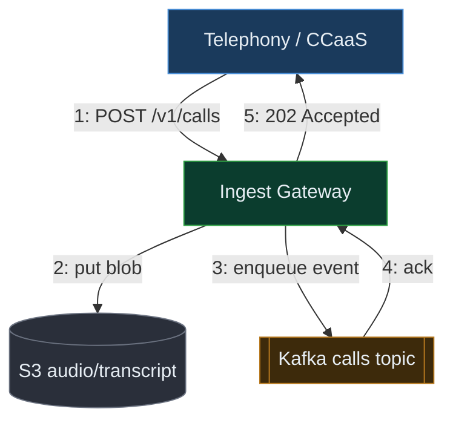
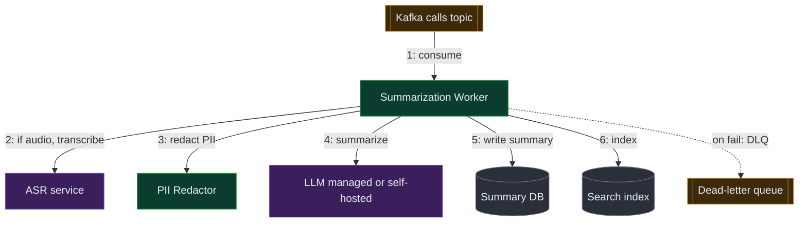
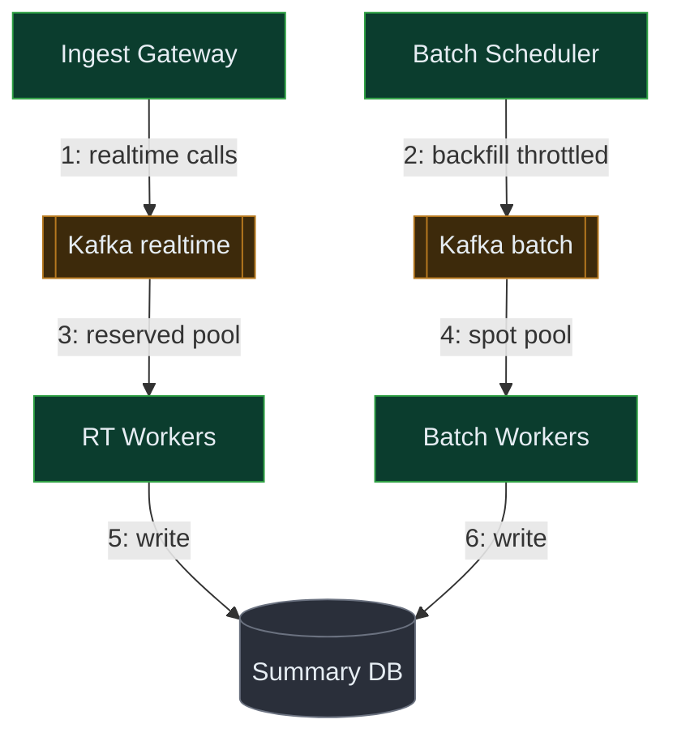
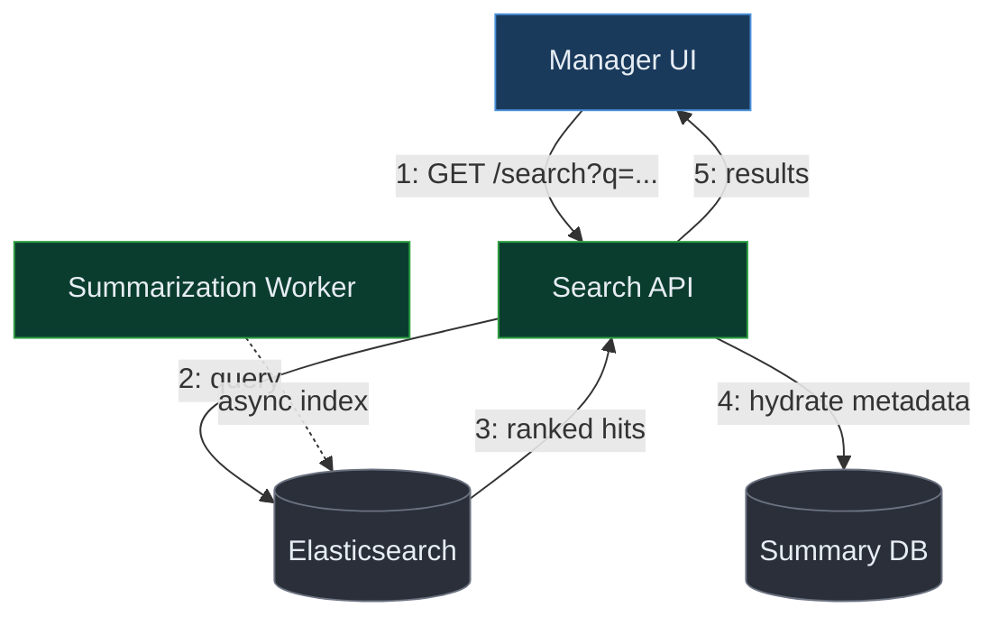
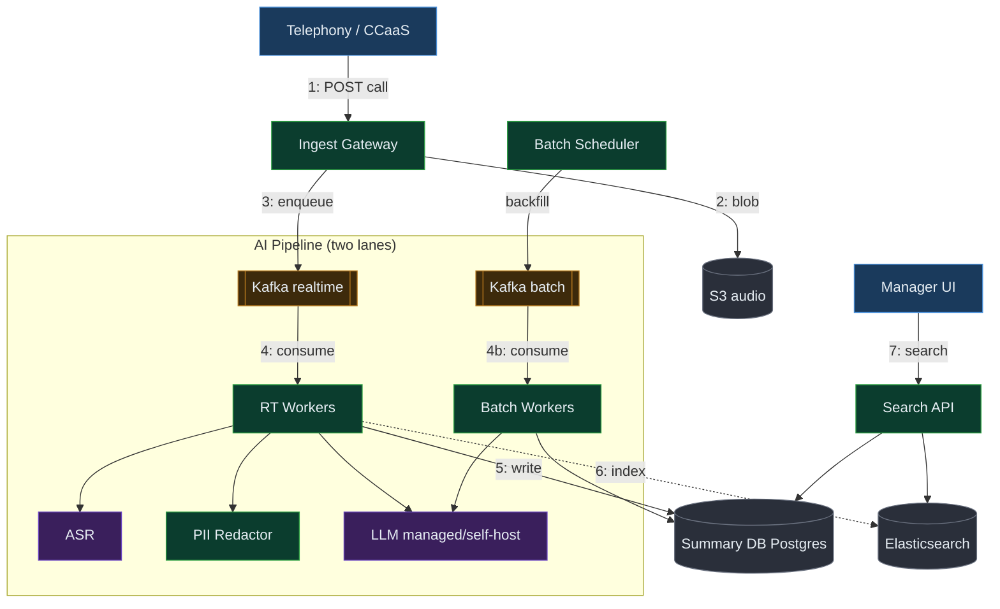
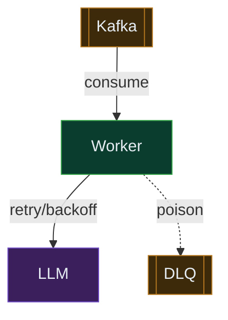

## 1. Requirements (Functional + Non-Functional)

> 🎙️ "Here's how I'll structure this: I'll lock the requirements and rough scale, sketch the API and data model, draw the high-level design one requirement at a time, then go deep on the two or three hardest parts — the LLM summarization pipeline, real-time vs batch, and the search layer — checking in with you as I go. Sound good?"

The core tension: we're taking a firehose of thousands of concurrent calls, running each through an expensive, slow, sometimes-flaky LLM, and we still need a clean summary in a manager's hands seconds after the call ends — without dropping calls when the model is slow or down. I'll target an **Amazon-style bar — cost and operations are first-class**, because LLM inference is the dominant line item here and this is exactly a "work backwards from the manager/agent customer" problem.

**Functional (the core flows — "above the line"):**

**F1. Ingest transcripts or audio from thousands of concurrent calls.**
- 🗣️ Plain words: "When a call ends — or while it's still going — we pull in either the text transcript or the raw audio recording so the system has something to summarize."
- ⚡ Why it's hard: audio isn't summarizable directly — it needs a speech-to-text (ASR) step first, which is itself slow and expensive, and we must absorb spiky concurrency (a shift change can double live calls in minutes) without dropping anything.

**F2. Process text through an LLM/NLP pipeline to extract key points and generate a concise summary.**
- 🗣️ Plain words: "We feed the conversation text to an AI model and get back a short paragraph plus the important bits — reason for the call, what was resolved, next steps."
- ⚡ Why it's hard: LLM calls are slow (hundreds of ms to several seconds), rate-limited, and occasionally return garbage or fail — so the pipeline must retry, validate output, and stay within a token/cost budget per call.

**F3. Support both real-time (post-call, seconds) and batch (bulk, overnight) summarization.**
- 🗣️ Plain words: "Some summaries are needed the instant a call ends; others — like re-summarizing a million old calls with a new prompt — can run overnight in bulk."
- ⚡ Why it's hard: the two modes want opposite things — real-time wants low latency and reserved capacity; batch wants high throughput and cheap spare capacity — and they share the same model fleet, so one can starve the other.

**F4. Store summaries and let managers search and view summaries of past calls.**
- 🗣️ Plain words: "A manager can type 'angry customers about billing last week' and instantly get a list of matching call summaries to read."
- ⚡ Why it's hard: managers want full-text and semantic search over tens of millions of summaries with sub-second latency, plus filters (agent, date, queue, sentiment) — a plain SQL `LIKE` can't do that at scale.

**Below the line (out of scope for this pass):** live agent-assist suggestions during the call, automated QA scoring/coaching, multi-language translation, PII redaction UI (we'll redact in-pipeline but won't build the review tool), real-time dashboards/BI.

**Non-Functional:**

**N1. Post-call summary latency: p95 under ~30s from call-end to summary-available.**
- 🗣️ Plain words: "For 95 out of 100 calls, the summary is ready within half a minute of the agent hanging up."
- 💥 What breaks without it: a manager doing a live wrap-up review after a heated call sees a spinner; the feature feels broken and agents stop trusting it.

**N2. Availability: 99.9% for ingest, 99.5% for the summarization pipeline.**
- 🗣️ Plain words: "Ingest is down less than ~9 hours a year; the summary pipeline less than ~44 hours a year — and even then we never lose a call, we just delay it."
- 💥 What breaks without it: if ingest drops calls, those conversations are gone forever — there's no replay of a finished phone call — so ingest must be the most durable tier.

**N3. Durability / no data loss on ingest: RPO ≈ 0 for raw transcripts/audio.**
- 🗣️ Plain words: "Once we've accepted a call's data, we promise never to lose it, even if a server dies one second later."
- 💥 What breaks without it: a compliance audit asks for a call from last March and it's simply missing — a regulatory and legal problem in finance/healthcare contact centers.

**N4. Cost: keep blended cost per summarized call within a tight budget (target ~$0.01–0.03/call).**
- 🗣️ Plain words: "Each summary should cost a cent or two, not a dollar — at millions of calls a day the model bill is the whole game."
- 💥 What breaks without it: LLM token cost silently balloons 10x; the feature's unit economics go negative and it gets cancelled.

**N5. Scalability: absorb 3x peak bursts without dropping or unboundedly delaying calls.**
- 🗣️ Plain words: "When call volume spikes — a product outage floods the lines — the system slows gracefully and catches up, it doesn't fall over."
- 💥 What breaks without it: the exact moment summaries are most valuable (an incident) is the moment the system collapses.

> 💬 "The whole design hinges on one idea: ingest must be bulletproof and instant, but summarization is allowed to be a few seconds behind — so I'll decouple them with a durable queue and treat the LLM as an unreliable, expensive downstream I have to protect against."

> 🎙️ Script: "So at the core, this is a streaming-ingest plus async-AI-pipeline problem. We've got four real flows: pull in transcripts or audio from thousands of live calls, run each through an LLM to get a concise summary with key points, support both real-time-after-call and bulk-overnight modes, and then store everything so managers can search it fast. The hard constraints are: never lose a call, get the summary out within about thirty seconds for the real-time path, and keep cost to a cent or two per call because the model bill dominates everything. I'll design ingest to be bulletproof and let the AI part run a little behind."

## 2. Clarifying Questions & Assumptions

**Q1.** "Roughly how many calls a day, and what's the peak concurrency — are we talking thousands of simultaneous live calls, or tens of thousands?"
- 🗣️ Why I'm asking: "The whole capacity and cost model swings on this — it decides how big my model fleet is and whether cost is even tolerable."
- ↔️ Design fork: If ~tens of millions/day → must reserve dedicated GPU/model capacity and aggressively batch. If ~hundreds of thousands/day → a managed LLM API with autoscaling is plenty, skip self-hosting.
- Assumption: ~5M calls/day, ~10K concurrent live calls at peak.

**Q2.** "Are we ingesting clean text transcripts already, raw audio we have to transcribe ourselves, or both?"
- 🗣️ Why I'm asking: "Audio adds a whole expensive ASR stage in front of everything; if it's text-only the pipeline is half the size."
- ↔️ Design fork: If audio → add a speech-to-text tier (Whisper/managed ASR) before summarization, doubling latency and cost. If text-only → skip it entirely.
- Assumption: Both, but ~70% arrive as transcripts from the telephony/CCaaS platform; ~30% as audio needing ASR.

**Q3.** "How fresh does the post-call summary need to be — seconds, or is a few minutes fine?"
- 🗣️ Why I'm asking: "Seconds means I reserve hot capacity and pay for idle headroom; minutes means I can queue and batch and save a lot of money."
- ↔️ Design fork: If seconds → priority real-time lane with reserved capacity. If minutes → everything can ride the cheaper batch lane.
- Assumption: p95 < 30s for the real-time lane; bulk re-summarization can take hours.

**Q4.** "Do summaries need to be strongly consistent and immutable for compliance, or can they be regenerated/edited later?"
- 🗣️ Why I'm asking: "If it's a compliance record I need immutability and audit trails; if it's just a convenience view I can overwrite freely."
- ↔️ Design fork: If compliance → write-once store + versioning + audit log. If convenience → mutable row, regenerate at will.
- Assumption: Summaries are versioned and append-only; raw transcript is the immutable source of truth.

**Q5.** "Is there PII in these calls — card numbers, SSNs — that we must redact before it ever reaches an LLM?"
- 🗣️ Why I'm asking: "Sending raw PII to a third-party model is often a hard legal no; redaction has to happen inside our trust boundary first."
- ↔️ Design fork: If yes → add an in-pipeline redaction step before any external model call. If no → send text directly.
- Assumption: Yes — a redaction/PII-scrubbing step runs before summarization, and we prefer a self-hosted or VPC-isolated model for sensitive segments.

**Q6.** "What does 'search' mean for managers — keyword filtering, or natural-language semantic search like 'frustrated customers about refunds'?"
- 🗣️ Why I'm asking: "Keyword is a normal inverted index; semantic search needs embeddings and a vector store, which is a different component."
- ↔️ Design fork: If semantic → add an embedding step + vector index. If keyword/filter only → a single full-text search engine suffices.
- Assumption: Both — full-text + structured filters now, with semantic (vector) search as a fast-follow, so I'll leave a seam for embeddings.

**Q7.** "How long do we retain summaries and raw transcripts — months, years, forever?"
- 🗣️ Why I'm asking: "Retention drives storage cost and whether I need a tiered hot/cold storage strategy."
- ↔️ Design fork: If years → tier old data to cheap object storage, keep recent in hot search index. If months → single hot tier is fine.
- Assumption: Summaries searchable hot for 13 months, then archived; raw audio archived to cold storage after 90 days.

> 🤝 Checkpoint: "Those are my assumptions — about 5M calls a day, mixed audio and text, sub-30-second real-time summaries, PII redaction required, and fast manager search. Anything there you'd want me to change before I size it?"

## 3. Scale & Capacity (talkable numbers)

Glossary as we go: **QPS** = queries per second (requests hitting a tier each second); **DAU** = not relevant here, we count calls; **ASR** = automatic speech recognition (audio→text); **token** = the unit LLMs bill on, roughly ¾ of a word.

| Metric | Derivation (step-by-step) | Rounded | Talkable phrase | Decision it drives |
|---|---|---|---|---|
| Calls/sec (avg) | 5M calls/day ÷ 86,400 s/day ≈ 57.8/s | ~58/s | "about 60 calls a second" | Base summarization throughput |
| Calls/sec (peak) | 58/s × 3 (peak multiplier) ≈ 174/s | ~175/s | "around 175 a second at peak" | Fleet sizing + queue depth |
| Summary LLM QPS | each call = 1 summary request; peak ≈ 175/s | ~175/s | "175 model calls a second" | Model fleet / API concurrency |
| Tokens per call | avg call ~8 min × ~130 words/min ≈ 1,040 words → ~1,400 input tokens + ~250 output ≈ 1,650 tokens | ~1.6K tokens | "about 1,600 tokens a call" | Cost + context-window choice |
| Daily token volume | 5M calls × 1,650 tokens ≈ 8.25B tokens/day | ~8B tokens/day | "roughly 8 billion tokens a day" | Cost driver #1 |
| Cost/call (model) | 1,650 tokens × ~$1.5/1M blended ≈ $0.0025; + ASR on 30% (~$0.006/min × 8 min × 0.3) ≈ $0.014 blended | ~$0.015/call | "about a cent and a half a call" | Whether economics work |
| Daily model spend | 5M × $0.015 ≈ $75K/day | ~$75K/day → ~$2.2M/mo | "a couple million a month" | **The number that forces design** |
| Storage (summaries) | 5M/day × ~2KB × 365 ≈ 3.65TB/yr | ~4TB/yr | "a few TB a year" | Non-issue — half a sentence |
| Storage (raw audio) | 5M/day × 8 min × ~0.5MB/min ≈ 20TB/day | ~20TB/day | "twenty TB a day of audio" | Forces cold object storage + tiering |

The ONE number that forces the design: **~$75K/day in model spend.** Its flip threshold: if blended cost/call drifts above ~$0.05 (e.g. we naively send the full transcript with a huge prompt), daily spend triples toward ~$200K/day and the feature is uneconomic — so token discipline (trim transcript, cap output, batch where possible) is non-negotiable, and ASR-on-audio is the secondary cost lever.

> 🎙️ Script: "The numbers that matter: about 175 calls a second at peak, each one a model call of roughly 1,600 tokens, which lands around a cent and a half per call and something like two million dollars a month. That cost number is the whole ballgame — so my design budget goes into keeping tokens tight and batching the non-urgent work, not into shaving milliseconds. Storage of summaries is a non-issue, a few TB a year; the raw audio is the bulky part and goes straight to cold object storage."

## 4. Core Entities

This is a first draft of the entities — I'll add full field definitions in §7.

**Call** — the source record of one customer-agent interaction; owns metadata (agent, queue, start/end time, channel) and pointers to its transcript and audio.
- 🗣️ Simple analogy: "Think of it like the folder for one phone call — everything about that call hangs off it."
- ⚠️ Interviewer probe: "What's the unique id and when is it created?" → answer: a `call_id` minted by the telephony platform at call start, so we can attach ingest events idempotently even before the call ends.

**Transcript** — the (possibly redacted) text of the conversation, turn by turn; the immutable input to summarization.
- 🗣️ Simple analogy: "Like the script of the call — who said what, in order."
- ⚠️ Interviewer probe: "Audio or text source?" → answer: either; if audio, ASR produces the transcript, and we store both the raw and the redacted version.

**Summary** — the AI-generated output: a concise paragraph plus structured key points (reason, resolution, sentiment, action items); versioned.
- 🗣️ Simple analogy: "Like the sticky note on top of the call folder telling you what happened without reading the whole thing."
- ⚠️ Interviewer probe: "What if the model output is wrong/changes?" → answer: summaries are versioned and append-only, keyed by `(call_id, model_version)`, so a re-run never silently overwrites the record managers already saw.

**SummaryJob** — a unit of work tracking one summarization attempt through the pipeline (state: queued → transcribing → redacting → summarizing → done/failed).
- 🗣️ Simple analogy: "Like the work ticket that follows the call through the assembly line."
- ⚠️ Interviewer probe: "How do you avoid double-processing on retry?" → answer: the job carries an idempotency key = `call_id`, and the summary store rejects a duplicate completed write for the same `(call_id, model_version)`.

> 🎙️ Script: "The core entities are pretty natural: a Call is the folder for one interaction, the Transcript is the text inside it, the Summary is the AI sticky-note on top, and a SummaryJob is the work ticket that tracks one call through the pipeline. The one I'd flag is the Summary — I'm making it versioned and append-only keyed by call plus model version, because the second you let a re-run overwrite, you've got a compliance and trust problem. I'll add full fields in the data model."

## 5. API / Interface

Default REST. The caller is identified by a service token (for ingest, from the telephony platform) or a manager's JWT (for search). We never trust client-supplied summaries or timestamps — the server stamps them.

**1. Ingest a call (satisfies F1)**
- **POST /v1/calls** — POST because it creates new server state (a Call + enqueues a job).
- Key request fields: `call_id: string` — the telephony platform's id, used as the idempotency key so a retried webhook doesn't double-create; `source: enum(transcript|audio)` — tells the pipeline whether to run ASR; `payloadRef: string` — a pointer/URL to the transcript text or audio blob, not the bytes inline, so the request stays small; `endedAt: timestamp` — when the call ended, drives the real-time SLA clock.
- Absent by design: no `summary` field — clients never supply summaries; the server generates them.
```
// Request
POST /v1/calls
{ "call_id": "call_8842", "source": "audio", "payloadRef": "s3://raw/call_8842.wav", "endedAt": "2026-06-19T14:32:00Z", "priority": "realtime" }

// Response 202
{ "call_id": "call_8842", "jobId": "job_a91", "status": "QUEUED" }
```
- Key design decision: returns **202 Accepted**, not a synchronous summary — ingest just durably enqueues and acks fast; the summary is produced async. Idempotent on `call_id`.

**2. Get a summary (satisfies F2/F4)**
- **GET /v1/calls/{call_id}/summary** — GET, read-only.
- Key response fields: `status` — QUEUED/PROCESSING/DONE/FAILED so the UI can show progress; `summary` + `keyPoints` — the actual output; `modelVersion` — which model/prompt produced it, for auditability.
```
// GET /v1/calls/call_8842/summary
// Response 200
{ "call_id": "call_8842", "status": "DONE", "summary": "Customer disputed a $40 late fee...",
  "keyPoints": { "reason": "billing dispute", "resolution": "fee waived", "sentiment": "negative→neutral", "actions": ["follow-up email"] },
  "modelVersion": "summ-v3" }
```
- Design decision: `status` is server-set, never in a request — the client can't forge state.

**3. Search summaries (satisfies F4)**
- **GET /v1/summaries/search** — GET; read-only query.
- Key request fields (query params): `q: string` — free text; `agentId`, `dateFrom/To`, `sentiment` — structured filters; `cursor` — for pagination.
```
// GET /v1/summaries/search?q=late+fee+refund&sentiment=negative&dateFrom=2026-06-12&limit=20
// Response 200
{ "results": [ { "call_id": "call_8842", "snippet": "...disputed a $40 late fee...", "score": 8.7 } ], "nextCursor": "eyJvIjoyMH0" }
```
- Design decision: search hits a dedicated search index, never the primary DB — full-text ranking over tens of millions of rows can't run on Postgres `LIKE`.

**4. Submit a batch re-summarization (satisfies F3)**
- **POST /v1/batch/resummarize** — POST; creates a batch job.
- Key fields: `filter` (date range / queue), `modelVersion` — which new prompt/model to apply. Server-set: the job runs on the cheap batch lane, not the real-time fleet.

> 🎙️ Script: "The API is deliberately boring on the write side: ingest is a POST that returns 202 and an idempotency key, because the work is async — I never block the telephony platform waiting on a model. Reads are a GET for a single summary and a GET for search, and search deliberately goes to a separate search index, not the main database. Everything sensitive — status, timestamps, the summary itself — is server-set so a client can't forge it."

## 6. High-Level Design (built one functional requirement at a time)

Shared palette: clients blue, our services green, async/queues amber, datastores grey cylinders, external/AI purple.

### 6.1 "Ingest transcripts or audio from thousands of concurrent calls"

This slice is about durably accepting a firehose and acking fast — losing a call is unacceptable, so the queue is the star.

**Architecture decisions table**

| Component | What it is (plain English) | Why THIS choice | What we DIDN'T pick & why not | Trade-off we accept |
|---|---|---|---|---|
| Ingest API / Gateway | A thin stateless service that validates the webhook and writes to the queue | Need to ack the telephony platform in <100ms and absorb 3x bursts | Not writing straight to the DB (a DB write per call couples ingest to DB health); not processing inline (would block on the slow LLM) | One extra hop before durability |
| Durable queue (Kafka) | A replicated append-only log that holds events until a consumer processes them, losing nothing if a worker is slow/down | Need RPO≈0 buffering and replay; decouples spiky ingest from the slow pipeline | Not SQS-only (fine, but Kafka gives ordered replay + multiple consumer groups for real-time vs batch); not in-memory queue (loses data on crash) | Operational overhead of running Kafka |
| Object storage (S3) | Cheap, durable bulk storage for big blobs (audio, raw transcripts) | Audio is ~20TB/day — must live somewhere cheap and durable, referenced by pointer | Not storing audio in the DB (blobs bloat and slow it); not local disk (not durable) | Slightly higher read latency for blobs |

> 🎙️ Narration: "Ingest is a thin stateless gateway whose only job is to validate and durably enqueue, so I can ack the phone system in milliseconds. I picked Kafka for the buffer because it's a replicated log — nothing is lost if the pipeline is slow, and I can replay it and fan it out to both a real-time and a batch consumer. I considered just dumping to the database, but that couples my most critical tier to DB health, and I considered SQS but Kafka's ordered replay and multiple consumer groups fit the dual real-time/batch need better. Big blobs like audio go to S3 by reference, not inline, because it's twenty TB a day."

**🗣️ Key terms for this slice:**
> **Kafka** — a durable, replicated commit log that buffers a stream of events so nothing is lost if a consumer is slow. Here it decouples bulletproof ingest from the slow, flaky LLM pipeline and lets real-time and batch consumers read the same stream independently.
> **Object storage (S3)** — cheap, near-infinite, highly durable storage for large files addressed by a key. Here it holds the ~20TB/day of raw audio and transcripts so the database only stores small pointers.
> **RPO≈0** — recovery point objective of zero: if we crash right now we lose no accepted data. Here it's the promise that once ingest acks a call, the data survives.

**Diagram — Ingest path**


**Numbered step narration**
1. Telephony platform POSTs the call (text or audio pointer). It handles ingest because it's the only system that knows when a call ends; if the request is a retry, the `call_id` idempotency key makes it a no-op. What if it retries twice? Same key → same enqueue, deduped downstream.
2. Gateway stores the blob in S3. S3 owns durable bulk storage so the DB stays lean. State change: the raw artifact is now durably persisted. If S3 write fails → return 5xx, telephony retries (it's idempotent).
3. Gateway enqueues a lightweight event (call_id + pointer) to Kafka. Kafka owns durability + decoupling. State: the call is now in the pipeline's work stream. If Kafka is unreachable → ack fails, telephony retries; we never silently drop.
4. Kafka acks the write only after replication to N replicas — that's our RPO≈0 guarantee.
5. Gateway returns 202. The phone system is unblocked in milliseconds; summarization happens later.

> 💬 Say-while-drawing: "The key move here is that ingest does almost nothing — it persists and enqueues, then gets out of the way — because the one thing I can never do is lose a finished phone call."

> 🎙️ Script: "For ingest, the telephony platform posts each call to a thin gateway. The gateway shoves any big audio into S3, drops a tiny event into Kafka, and returns a 202 — all in milliseconds. Kafka is the hero: it's a durable log, so the moment it acks, the call is safe even if the whole pipeline behind it is down. That decoupling is what lets ingest be bulletproof while the expensive AI part runs at its own pace."

### 6.2 "Process text through an LLM to extract key points and generate a summary"

This is the heart: turn raw text into a clean summary, cheaply and reliably, treating the model as slow and flaky.

**Architecture decisions table**

| Component | What it is | Why THIS choice | What we DIDN'T pick & why not | Trade-off |
|---|---|---|---|---|
| Summarization workers | Stateless consumers that pull from Kafka and orchestrate ASR→redact→LLM→write | Need horizontal scale tied to queue depth; autoscale on lag | Not a synchronous service (LLM too slow to block on); not a monolith with ingest (different scaling profile) | More moving parts |
| ASR service | Speech-to-text (e.g. Whisper) turning audio into text | 30% of calls are audio and can't be summarized as-is | Not skipping audio (loses 30% of calls); not a cheap low-accuracy ASR (garbage in → garbage summary) | Adds latency + cost to audio calls |
| PII redactor | A step that masks cards/SSNs/PHI before any external model sees text | Compliance — raw PII can't leave our trust boundary | Not trusting the LLM to ignore PII (it might echo it); not skipping (legal risk) | A little extra latency per call |
| LLM (managed + self-hosted) | The model that writes the summary; managed API for bulk, VPC/self-hosted for sensitive | Managed = elastic + cheap ops; self-hosted = data isolation for PII-heavy calls | Not 100% self-host (huge GPU capex/ops); not 100% managed (some data can't leave) | Two model paths to operate |

> 🎙️ Narration: "A pool of stateless workers pulls calls off Kafka and runs a little pipeline: if it's audio, transcribe it; redact PII; then call the model with a tight prompt; then write the summary. I keep the workers stateless so I can autoscale them purely on Kafka lag. For the model I run a hybrid — a managed API for the bulk of traffic because elasticity and ops are someone else's problem, and a self-hosted model in our VPC for PII-heavy calls that legally can't leave our boundary. The trade-off is operating two paths, but it's the honest answer to cost plus compliance."

**🗣️ Key terms for this slice:**
> **ASR (Automatic Speech Recognition)** — software that converts spoken audio into text. Here it's the front of the pipeline for the ~30% of calls that arrive as audio.
> **PII redaction** — automatically detecting and masking personal data (card numbers, SSNs) in text. Here it runs before any external model call so sensitive data never leaves our trust boundary.
> **Prompt/token budget** — the cap on how much text we send/receive from the model, since we pay per token. Here we trim the transcript and cap output to hold ~$0.015/call.

**Diagram — Summarization pipeline**

↳ reuses existing: Kafka (from §6.1), S3 pointer read inside step 2.

**Numbered step narration**
1. Worker consumes a call event. Stateless workers own orchestration; scale on lag. If a worker dies mid-call → Kafka offset isn't committed, another worker re-picks it (at-least-once), and the idempotency key prevents a double summary.
2. If audio, transcribe via ASR. ASR owns audio→text. State: transcript now exists. If ASR fails/times out → retry with backoff, then DLQ.
3. Redact PII. The redactor owns compliance. State: text is now safe to send externally. If redaction is uncertain → route to the self-hosted model instead of the external API.
4. Call the LLM with a trimmed prompt + capped output. The model owns generation. If it returns malformed JSON → validate and retry once; if rate-limited → backoff/queue.
5. Write the versioned summary to the Summary DB keyed by `(call_id, model_version)` — append-only, so a retry can't corrupt the record.
6. Index the summary into the search engine so managers can find it. If indexing fails → it's retried async; the DB remains source of truth.

> 💬 Say-while-drawing: "Everything in this pipeline is a ret- riable, idempotent step behind a queue, because the model is the least reliable thing in my whole system and I refuse to lose a call when it hiccups."

> 🎙️ Script: "Workers pull each call off Kafka and run a four-step assembly line: transcribe if it's audio, redact the PII, call the model with a deliberately tight prompt, and write a versioned summary. Because it's all behind a durable queue and every write is idempotent on call-id-plus-model-version, a worker crash or a model timeout just means the call gets re-tried — never lost, never double-summarized. Failures after a few retries go to a dead-letter queue so a human can look, instead of blocking the line."

### 6.3 "Support real-time vs batch processing"

Same pipeline, two lanes with different priority and capacity — the interesting part is keeping batch from starving real-time.

**Architecture decisions table**

| Component | What it is | Why THIS choice | What we DIDN'T pick & why not | Trade-off |
|---|---|---|---|---|
| Priority lanes (two Kafka topics/consumer groups) | Separate `realtime` and `batch` streams with separate worker pools | Real-time needs low latency + reserved capacity; batch wants cheap throughput | Not one shared queue (a batch flood would delay live summaries); not separate clusters (wasteful) | Must manage capacity split |
| Batch scheduler | Reads filters, fans a backfill into the batch topic at a throttled rate | Lets a 1M-call re-summarization run overnight without touching real-time SLA | Not running backfills on the real-time fleet (blows the SLA + cost) | Backfills are slower |

> 🎙️ Narration: "I split the stream into a real-time lane and a batch lane with separate worker pools. Real-time workers get reserved, always-warm capacity so a call that just ended is summarized in seconds. Batch workers run on cheap, preemptible/spare capacity and are rate-limited, so a giant overnight re-summarization can't starve the live path. The trade-off is I have to manage the capacity split, but that's exactly the knob Amazon-style cost-vs-latency tuning wants."

**🗣️ Key terms for this slice:**
> **Consumer group** — a set of workers that jointly read one Kafka stream, each handling a slice. Here separate groups give real-time and batch independent throughput.
> **Preemptible/spot capacity** — cheap compute that can be reclaimed anytime. Here it runs batch work that's fine to interrupt, cutting cost.

**Diagram — Two lanes**

↳ reuses existing: Summarization workers/DB (from §6.2).

**Numbered step narration**
1. Live calls go to the realtime topic at ingest. Owner: gateway, tagged by `priority`. State: call queued in fast lane. If realtime lag spikes → autoscale RT workers first.
2. A scheduler fans backfills into the batch topic, throttled. Owner: scheduler. State: bulk work queued cheaply. If batch backs up → it just takes longer, no SLA impact.
3. Reserved RT workers drain the realtime lane within the 30s budget.
4. Spot batch workers drain the batch lane opportunistically.
5–6. Both write to the same versioned Summary DB; batch writes a new `model_version` rather than clobbering.

> 💬 Say-while-drawing: "One pipeline, two lanes — I physically isolate real-time capacity so a million-call overnight backfill can never make a live summary late."

> 🎙️ Script: "Real-time and batch are the same pipeline split into two lanes. Live calls hit a reserved, always-warm pool that meets the thirty-second budget; bulk re-summarizations ride a throttled batch lane on cheap spot capacity that can never steal from the live path. They share the same versioned summary store, and batch just writes new model versions instead of overwriting — so re-running a new prompt over a year of calls is safe and cheap."

### 6.4 "Store and search summaries for managers"

Managers need fast full-text + filtered search over tens of millions of summaries — that's a search engine's job, not the primary DB's.

**Architecture decisions table**

| Component | What it is | Why THIS choice | What we DIDN'T pick & why not | Trade-off |
|---|---|---|---|---|
| Search index (Elasticsearch/OpenSearch) | A search engine that pre-builds word→document maps for ranked full-text + filtered queries in ms | Need ranked search + filters over ~60M+ summaries in <1s | Not SQL LIKE (scans every row, no ranking, unusable at scale); not building our own index (months, no relevance) | Lags the DB by seconds; eventual consistency |
| Summary DB (Postgres) | Relational source of truth for summaries/metadata | Need durable, queryable system of record + joins on call metadata | Not search engine as system of record (not durable enough for compliance) | Manual sharding at very high scale |

> 🎙️ Narration: "Managers search a dedicated search engine — Elasticsearch — because it pre-builds an inverted index, a word-to-document map, so a ranked query with filters over sixty-million-plus summaries comes back in well under a second. SQL `LIKE` would scan every row with no ranking — unusable. The Postgres summary store stays the durable source of truth for compliance; the search index is a fast, eventually-consistent copy fed by the pipeline. The trade-off is the index lags by a few seconds, which is totally fine for a manager browsing yesterday's calls."

**🗣️ Key terms for this slice:**
> **Elasticsearch (inverted index)** — a search engine that maps every word to the documents containing it, enabling ranked full-text search in milliseconds. Here it powers manager search over millions of summaries.
> **Eventual consistency** — a copy that catches up shortly after the source changes. Here the search index trails the DB by seconds, acceptable for browsing.

**Diagram — Search path**

↳ reuses existing: Summary DB + workers (from §6.2).

**Numbered step narration**
1. Manager UI sends a search query (text + filters), authenticated by JWT. Owner: search API. If unauthorized → 403, scoped to the manager's team.
2. Search API queries Elasticsearch. Owner: ES does ranking. State: none (read).
3. ES returns ranked call_ids + snippets in ms.
4. API hydrates fresh metadata from Postgres if needed (e.g. latest summary version). If ES is stale → DB is the tiebreaker.
5. Results returned, paginated by cursor.

> 💬 Say-while-drawing: "Search and system-of-record are deliberately two different stores — Elasticsearch for fast ranked lookup, Postgres for durable truth — because no single store does both well at this scale."

> 🎙️ Script: "Managers hit a search API backed by Elasticsearch, which pre-builds a word-to-document map so a ranked, filtered query over tens of millions of summaries returns in milliseconds. The pipeline indexes each summary into Elasticsearch asynchronously while Postgres stays the durable source of truth. The index lags a few seconds — fine for browsing — and if there's ever a discrepancy, Postgres wins."

**Final (high-level)**


> 🎙️ Script: "End to end: on the write side, the telephony platform posts calls into a bulletproof ingest gateway that persists audio to S3 and enqueues to Kafka, split into a real-time and a batch lane. On the pipeline side, stateless workers transcribe, redact, and summarize with a hybrid managed/self-hosted model, writing versioned summaries to Postgres and indexing into Elasticsearch. On the read side, managers search Elasticsearch with Postgres as the durable backstop. The whole thing is glued by Kafka so ingest never blocks on the slow model."

> 🤝 Checkpoint: "That's the skeleton end to end. Want me to go deep on the LLM-pipeline reliability and cost, the real-time-vs-batch capacity split, or the search layer?"

## 7. Data Model & Storage

**PART A — Entity table**

| Entity | Key fields (PK / shard key annotated) | Chosen store | Shard/partition key | Consistency |
|---|---|---|---|---|
| Call | `call_id (PK, shard)`, agent_id, queue_id, started_at, ended_at, audio_ref | Postgres | call_id (hash) | Strong |
| Transcript | `call_id (PK→Call)`, version, redacted_text, raw_ref | Postgres + S3 (raw) | call_id | Strong |
| Summary | `(call_id, model_version) (PK)`, summary_text, key_points(jsonb), sentiment, created_at | Postgres (truth) + ES (copy) | call_id | Strong in DB, eventual in ES |
| SummaryJob | `job_id (PK)`, call_id, state, attempts, idempotency_key | Postgres / Redis | call_id | Strong |

**PART B — Storage decision cards**

**🗄️ PostgreSQL — used for: Call, Transcript, Summary (system of record), SummaryJob**
1. What it is: a relational database storing rows and columns with strict schemas and transactions that either fully succeed or fully roll back.
2. Why we picked it — the access pattern that forces it: summaries are a compliance record needing a durable, append-only, versioned write keyed by `(call_id, model_version)`, plus joins on call metadata (agent, queue) — that's relational, transactional work.
3. Considered instead: **DynamoDB** — great KV throughput but versioned writes + metadata joins + ad-hoc manager filters get awkward and you denormalize everything; **MongoDB** — flexible schema, but we want strict immutable audit semantics and battle-tested transactions; **Elasticsearch as truth** — it's a search index, not durable enough to be the system of record.
4. Trade-off: at extreme scale we shard by `call_id` manually; cross-shard analytics need a separate OLAP copy.
5. 🗣️ How to say it: "Summaries are a money-and-compliance record, so the source of truth is Postgres — versioned, append-only, keyed by call plus model version. I looked at Dynamo, but I want clean transactional versioning and metadata joins, so I keep Postgres as truth and push a copy to Elasticsearch for search."

**🗄️ Elasticsearch — used for: Summary (searchable copy)**
1. What it is: a search engine that pre-builds an inverted index (word→documents) for ranked full-text and filtered queries.
2. Why we picked it: managers need ranked search + filters over 60M+ summaries in <1s — only a search engine does that.
3. Considered instead: **Postgres full-text** — works to a few million rows, not 60M+ with ranking; **building our own index** — months of work, no relevance tuning.
4. Trade-off: eventually consistent, lags the DB by seconds; must be rebuildable from Postgres.
5. 🗣️ How to say it: "Search goes to Elasticsearch because it pre-builds a word-to-document map and ranks results in milliseconds. Postgres `LIKE` would scan every row. The index trails by seconds, which is fine, and I can always rebuild it from Postgres."

**🗄️ S3 (object storage) — used for: raw audio, raw transcripts, cold archive**
1. What it is: cheap, near-infinite, highly durable blob storage addressed by key.
2. Why we picked it: ~20TB/day of audio must live somewhere cheap and durable, referenced by pointer from the DB.
3. Considered instead: **DB BLOBs** — bloat and slow the DB; **local disk** — not durable.
4. Trade-off: higher per-fetch latency; we tier to Glacier after 90 days.
5. 🗣️ How to say it: "Audio is bulky, so it goes to S3 by reference and tiers to cold storage after ninety days. The database just holds the pointer."

**🗄️ Redis — used for: idempotency/dedup keys, job state, rate-limit counters**
1. What it is: an in-memory key-value store, extremely fast, with TTLs.
2. Why we picked it: cheap dedup check on `call_id` and worker rate-limiting against the LLM, at sub-ms latency.
3. Considered instead: **DB unique constraint only** — works but adds DB load on the hot path; Redis offloads it.
4. Trade-off: in-memory, so we treat it as a cache with Postgres as the durable backstop.
5. 🗣️ How to say it: "Redis holds short-lived idempotency keys and rate-limit counters so the hot path doesn't hammer Postgres for every dedup check."

**PART C — Per-operation consistency summary**

| Operation | Store | Consistency | Why |
|---|---|---|---|
| Write summary (compliance) | Postgres | Strong | It's an audit record; must be durable & versioned |
| Index for search | Elasticsearch | Eventual | Browsing tolerates seconds of lag |
| Read-your-own-write (manager opens a call just summarized) | Postgres | Strong (read from DB, not ES) | Manager must see the summary immediately after it's done |
| Dedup check | Redis→Postgres | Strong (DB backstop) | Must never double-summarize |

> 🎙️ Script: "The dominant store is Postgres — it's the durable, versioned source of truth for summaries because this is a compliance record. Elasticsearch is a fast, eventually-consistent search copy fed by the pipeline. Bulky audio lives in S3 by reference, and Redis handles short-lived dedup and rate-limit state. The one nuance: when a manager opens a call that was just summarized, I read from Postgres, not the lagging search index, so read-your-own-writes always holds. I considered making Dynamo the system of record but rejected it because the versioned, joinable audit semantics are cleaner in Postgres."

## 8. Deep Dives — Bad → Good → Great

🆘 If you get stuck: go back to the binding constraint — "the model is slow, flaky, and expensive; protect ingest from it and protect cost from the model" — and reason forward.

### How do we make the LLM pipeline reliable and cheap under load?

**#### Bad: Synchronous summarize-on-ingest**
- 🗣️ Plain words: "When a call ends, block the request and call the model right then, returning the summary inline."
- Approach: ingest endpoint calls the LLM and waits for the response before acking.
- Why people try this: simplest possible flow, one request in and out.
- ⚠️ What breaks: the model takes 1–5s and is rate-limited; at 175 calls/s you have hundreds of in-flight blocked requests, the telephony platform's webhook times out, and a single model outage drops every call on the floor — no retry, no buffer.
- 🔁 What forces the upgrade: any model slowdown or rate-limit instantly becomes lost calls.

**#### Good: Async queue + retries + DLQ**
- ↩️ What the previous tier got wrong: Bad coupled ingest to the slow model; so I decouple — ingest just enqueues, workers summarize behind the queue.
- 🗣️ Plain words: "Drop every call into a durable line; a pool of workers pulls from the line and summarizes at its own pace, retrying on failure."
- Approach: Kafka buffers calls; stateless workers consume, call the model with backoff retries; poison messages go to a dead-letter queue (DLQ — a side queue for messages that keep failing, so they don't block the line).
- Why reasonable: decoupling + at-least-once delivery means a model hiccup just delays, never drops.
- ⚠️ What breaks: still expensive — every call is a full-context model call at ~$0.015; during a 3x burst the queue grows and real-time SLA slips because all workers share one lane; duplicate processing on retry without idempotency.
- 🔁 What forces upgrade: cost and the real-time-vs-batch contention.



**#### Great: Priority lanes + idempotency + token discipline + micro-batching**
- ↩️ What the previous tier got wrong: Good let batch starve real-time and paid full price per call; I split lanes, dedup, trim tokens, and micro-batch.
- 🗣️ Plain words: "Two lines — a fast one with reserved staff for live calls and a cheap one for bulk — plus I send the model less text and group small jobs together to cut the bill, and I never summarize the same call twice."
- Approach: (a) separate realtime/batch Kafka topics + worker pools; (b) idempotency key `(call_id, model_version)` with a Redis+DB dedup so retries are safe; (c) token discipline — trim transcript to salient turns, cap output tokens; (d) micro-batching on the batch lane — group N transcripts per model call where the API supports it to amortize overhead; (e) circuit breaker around the model so a provider outage fails fast to a fallback model.
- 🔢 Decision-forcing math: full-context naive ≈ $0.05/call → $250K/day; trimmed + capped ≈ $0.015/call → $75K/day. That ~$175K/day delta is why token discipline isn't optional. And 175 calls/s × 2s/call ÷ 1 = 350 worker-slots needed → autoscale on Kafka lag, not CPU.
- ✅ Failure matrix:

| Failure | Impact | Mitigation |
|---|---|---|
| Model timeout | Call delayed | Retry w/ backoff, then fallback model |
| Model returns bad JSON | No summary | Validate, retry once, then DLQ |
| Worker crash mid-call | Possible re-process | Idempotency key dedups; Kafka redelivers |
| Provider full outage | All summaries stall | Circuit breaker → self-hosted fallback |
| Retry storm | Cost spike | Rate-limit + dedup suppress duplicates |
| Batch flood | RT SLA slip | Physical lane isolation, RT reserved capacity |

- 🎙️ Script: "The great version decouples everything behind Kafka, then splits it into a reserved real-time lane and a cheap batch lane so a backfill can't make a live summary late. Every write is idempotent on call-id-plus-model-version, so a retry or worker crash can never double-summarize. The cost lever is token discipline — I trim the transcript and cap output, which takes the bill from a quarter-million a day to about seventy-five thousand — and a circuit breaker flips to a self-hosted model if the provider goes down."
- 🧠 If they ask "why not just scale workers infinitely?": "Workers are cheap; the model is the bottleneck and the cost. Scaling workers without token discipline and rate-limits just spends money faster and trips the provider's rate limit."

### How do we hit the 30s real-time SLA?

**#### Good: Autoscale workers on queue lag**
- 🗣️ Plain words: "Watch the line length; when it grows, add workers."
- Approach: scale RT workers on Kafka consumer lag. p99 budget: ASR (if audio) ~5s + redact ~0.2s + LLM ~2s + writes ~0.3s ≈ 7.5s for audio; ~2.5s text-only — comfortably under 30s with headroom for retries.
- ⚠️ What breaks: cold-start — scaling from zero takes minutes; a sudden 3x burst blows the SLA before workers warm.

**#### Great: Reserved warm pool + admission control**
- ↩️ What broke: cold-start lag during bursts; fix with always-warm reserved capacity sized to peak.
- Approach: keep a warm RT pool sized to ~175 calls/s peak; if lag still spikes, shed batch capacity into RT first (it's the same fleet, repriorize), and as a last resort degrade gracefully (extractive fallback summary, see §9).
- 🔢 Math: 175/s × ~3s avg = ~525 concurrent → keep ~600 warm RT slots; burst to 3x covered by reclaiming batch slots.
- 🎙️ Script: "I keep a warm real-time pool sized to peak so I'm not cold-starting mid-incident, and the batch lane is my elastic buffer — when live volume spikes I reclaim batch capacity into real-time first, and only if that's not enough do I fall back to a cheaper extractive summary. That keeps p95 under thirty seconds even during a 3x surge."
- 🧠 If they ask "what if the LLM itself is the bottleneck, not workers?": "Then warm workers don't help — I throttle batch to free model quota for real-time and use the fallback model; the lane priority is enforced at the model-quota level too."

### How do we make manager search fast and relevant at scale?

**#### Good: Elasticsearch full-text index**
- 🗣️ Plain words: "Put summaries in a search engine that pre-indexes every word."
- Approach: index summary_text + filters (agent, date, sentiment) into ES; query returns ranked hits in ms.
- ⚠️ What breaks: keyword-only misses intent — "angry about being overcharged" won't match a summary saying "billing dispute, frustrated."

**#### Great: Hybrid lexical + semantic (vector) search**
- ↩️ What broke: keyword misses paraphrases; add embeddings for semantic recall.
- 🗣️ Plain words: "Also store a numeric 'meaning fingerprint' of each summary so a search by idea, not exact words, still finds it."
- Approach: at index time compute an embedding (a vector capturing meaning) per summary; store in a vector index; queries run both lexical (BM25) and vector similarity, then blend scores. Shard ES by time so old data tiers off cheaply.
- 🔢 Math: 60M summaries × ~1.5KB indexed ≈ 90GB + vectors (~768 floats × 4B × 60M ≈ 180GB) → a handful of ES nodes; time-sharding keeps hot shards small.
- 🎙️ Script: "Search starts as a normal Elasticsearch full-text index, which is great for keywords and filters. To catch paraphrases — 'angry about overcharging' matching 'billing dispute' — I add a semantic layer: an embedding per summary in a vector index, blended with the keyword score. I shard by time so a year of calls doesn't bloat the hot shard."
- 🧠 If they ask "isn't embedding every summary expensive?": "It's a tiny model run once per summary at index time, pennies, and it rides the same batch lane — far cheaper than the summarization call itself."

## 9. Reliability, Failure Modes & Cost

**9A — Availability targets.** Ingest path targets **four nines (99.99% ≈ 52 min/yr down)** because a dropped call is unrecoverable; the summarization pipeline targets **three nines (99.9% ≈ 8.7 hr/yr)** because it's allowed to fall behind, not fail. Mechanisms: ingest is stateless behind a load balancer across **multi-AZ** (multiple data centres in one region — if one building loses power the others take over automatically), Kafka replicated across 3 AZs, workers autoscaled and idempotent so any can die.

**9B — Per-dependency failure table**

| Component | What breaks if down | Graceful degradation (what the user sees) | Recovery |
|---|---|---|---|
| Ingest Gateway | Can't accept calls | Telephony retries; multi-AZ replicas keep serving | Auto-failover |
| Kafka | Pipeline stalls | Ingest still acks to replicas; summaries delayed, none lost | Replica leader election |
| LLM provider | No new summaries | Circuit breaker → self-hosted fallback model (slightly lower quality) or extractive summary | Provider recovers, reprocess |
| ASR | Audio calls stall | Text calls unaffected; audio queued until ASR back | Retry from queue |
| Elasticsearch | Search down/stale | Managers see "search temporarily degraded"; can still open known calls from DB | Rebuild index from Postgres |
| Postgres | Can't persist summaries | Workers pause writes, Kafka holds work (no loss) | Failover to replica |

**9C — RPO / RTO.** RPO (Recovery Point Objective) = how much data we'd lose if we crashed now; RTO (Recovery Time Objective) = how long to be back up.

| Data class | RPO | RTO | Mechanism |
|---|---|---|---|
| Raw transcript/audio (ingest) | ≈0 | <5 min | Sync-replicated Kafka + S3 11-nines durability |
| Summary (compliance) | ≈0 | <10 min | Sync commit to Postgres + multi-AZ replica |
| Search index | minutes (rebuildable) | <1 hr | Rebuild from Postgres |

**9D — Cost breakdown.** Top drivers: (1) **LLM inference — ~$2.2M/mo**, the dominant line item, every token billed; cut hardest by token trimming, micro-batching, and routing simple calls to a cheaper/smaller model. (2) **ASR on audio — a few hundred K/mo**, billed per audio-minute; cut by only transcribing audio-sourced calls. (3) **S3 + egress for audio — tens of K/mo**, ~20TB/day; cut by tiering to Glacier after 90 days. The single biggest optimization: a small/cheap model (or extractive method) for routine calls, reserving the large model for complex/escalated ones — easily halves the model bill.

> 🎙️ Script: "When the model provider goes down, managers don't see errors — new summaries just queue and either wait or fall back to a slightly simpler self-hosted model, because nothing is ever lost once ingest accepts a call. If search degrades, they can still open any call directly from the database. The thing that hurts financially isn't the databases — it's model tokens, two-ish million a month, so the entire cost story is about sending the model less and routing easy calls to a cheaper model."

## 10. Trade-off Ledger

**🔀 Decision: Async pipeline vs synchronous summarize-on-call-end**
1. Chose async (queue + workers) — protects ingest from a slow/flaky model.
2. Gave up: summaries aren't instant; there's a few-second-to-30s delay.
3. 🗣️ Plain words: "Like dropping mail in a box that's always collected, versus standing at the counter until it's hand-delivered."
4. When this reverses: if summaries had to appear before the agent's wrap-screen closes (<2s) AND volume were small, a synchronous low-latency path could win.
5. 🗣️ How to say it: "I went async because the model is too slow and flaky to block ingest on — losing a call is worse than a 20-second delay."

**🔀 Decision: Hybrid managed + self-hosted LLM vs all-managed**
1. Chose hybrid — managed for bulk elasticity, self-hosted for PII/compliance and outage fallback.
2. Gave up: operating two model paths and some GPU ops.
3. 🗣️ Plain words: "Rent most of the time, own a backup generator for when you can't send data out or the grid fails."
4. When this reverses: if there were no PII constraint and the provider had a strong SLA, go all-managed for simplicity.
5. 🗣️ How to say it: "Managed handles the bulk cheaply, but I keep a self-hosted model for calls whose data legally can't leave and as a circuit-breaker fallback."

**🔀 Decision: Postgres-as-truth + Elasticsearch-for-search vs single store**
1. Chose two stores — durable truth in Postgres, fast ranked search in ES.
2. Gave up: a sync/index pipeline and eventual consistency in search.
3. 🗣️ Plain words: "A filing cabinet you can trust plus a fast librarian who's a few seconds behind."
4. When this reverses: if scale were small (<5M summaries) Postgres full-text alone would do, dropping ES.
5. 🗣️ How to say it: "Postgres is my compliance source of truth; Elasticsearch is a fast searchable copy. No single store does durable-truth and ranked-search well at this scale."

**🔀 Decision: Separate real-time vs batch lanes vs one shared queue**
1. Chose physical lane isolation — reserved capacity for live calls.
2. Gave up: some capacity efficiency; two pools to manage.
3. 🗣️ Plain words: "An express checkout lane so a giant cart doesn't hold up someone buying one item."
4. When this reverses: if there were no real-time requirement at all, run everything as cheap batch.
5. 🗣️ How to say it: "I isolate real-time from batch so an overnight million-call backfill can never make a live summary late."

> 🎙️ Script: "The decisions I'd flag: async over synchronous, because protecting ingest beats instant summaries; hybrid models, because PII and provider outages force a self-hosted fallback; two stores, because nothing does durable-truth and ranked-search well together at scale; and isolated lanes, because real-time and batch want opposite things. Each one flips if its driving constraint — the PII rule, the scale, the real-time SLA — goes away."

## 11. Likely Interviewer Questions & Answers

**❓ "Two summary attempts run for the same call — how do you avoid two conflicting records or a double charge to the model?"**
The mechanism: every write is keyed by an idempotency key `(call_id, model_version)`; a Redis dedup check plus a Postgres unique constraint mean the second write is a no-op, and a Redis rate-gate suppresses duplicate model calls on retry.
🗣️ In plain words: "Each summary has a fingerprint; if we've already made one for that call and model, we don't make or save another."
💬 One-liner: "Idempotency on call-id-plus-model-version makes retries free and safe."

**❓ "The LLM provider goes down for an hour — what happens?"**
The mechanism: a circuit breaker (a guard that stops calling a failing dependency and fails fast) trips after errors spike, routing traffic to a self-hosted fallback model or a cheaper extractive summary; meanwhile Kafka holds all calls so nothing is lost.
🗣️ In plain words: "We switch to our backup model and queue the rest — no call is dropped, summaries just look slightly simpler for an hour."
💬 One-liner: "Circuit-break to a fallback model; Kafka guarantees we catch up with zero loss."

**❓ "A product outage triples call volume — how does the system hold?"**
The mechanism: ingest is stateless and scales horizontally; Kafka absorbs the burst durably; the real-time worker pool is warm-sized to peak and reclaims batch capacity; if model quota saturates, batch throttles to free quota for live calls.
🗣️ In plain words: "The line just gets longer for a bit, we throw more workers at it and pause bulk jobs, and live calls stay fast."
💬 One-liner: "Burst goes into Kafka, real-time steals batch capacity, SLA holds."

**❓ "Can a summary be silently wrong or overwritten?"**
The mechanism: summaries are append-only and versioned by model_version; the raw transcript is the immutable source of truth; output is schema-validated before write, and re-runs create a new version rather than clobbering.
🗣️ In plain words: "We never erase a summary; a re-run makes a new version, and the original transcript is always kept."
💬 One-liner: "Append-only, versioned summaries over an immutable transcript — full audit trail."

**❓ "There's a credit-card number in a call — how do you keep it out of the model and storage?"**
The mechanism: an in-pipeline PII redactor masks cards/SSNs/PHI before any external model call; uncertain cases route to the VPC-isolated self-hosted model so data never leaves our boundary; raw audio is encrypted at rest and access-controlled.
🗣️ In plain words: "We scrub personal data out before the AI ever sees it, and sensitive calls use a model that stays inside our walls."
💬 One-liner: "Redact before inference; sensitive calls never leave the VPC."

**❓ "Someone forges a manager's request to read another team's calls — how do you stop it?"**
The mechanism: every search request carries a JWT identifying the manager; the search API enforces team-scoped authorization on every query, so results are filtered to calls the caller is allowed to see; we never trust a client-supplied agent or team id.
🗣️ In plain words: "We check who you are on every request and only return calls your team is allowed to see."
💬 One-liner: "Authz on every query, scoped server-side — client ids are never trusted."

**❓ "What's the most expensive part, and how would you cut it?"**
The mechanism: LLM inference (~$2.2M/mo) dwarfs storage and compute; cut it by token trimming, micro-batching the batch lane, and routing routine calls to a small/cheap model while reserving the large model for complex or escalated calls.
🗣️ In plain words: "The AI tokens are the whole bill; we send less text and use a cheaper model for easy calls."
💬 One-liner: "Cost is tokens — trim, batch, and tier to a smaller model halves the bill."

**❓ "How would you add live agent-assist (suggestions during the call), later?"**
The mechanism: the pipeline already streams transcripts through Kafka; agent-assist subscribes to the same live stream with a low-latency model producing incremental suggestions, reusing ASR, redaction, and the real-time lane — it's a new consumer, not a new system.
🗣️ In plain words: "We'd add a new listener on the same live transcript stream that whispers suggestions to the agent."
💬 One-liner: "It's a new Kafka consumer on the existing live stream — the seam is already there."

> 🎙️ 60-second verbal summary: "This is an AI pipeline that turns thousands of live customer calls into searchable summaries within seconds. The design splits into two halves. The read half is a search layer: managers query Elasticsearch, which pre-indexes every summary for ranked, filtered, sub-second search, with Postgres as the durable source of truth behind it. The write half is the AI pipeline: a bulletproof ingest gateway durably enqueues every call into Kafka, then stateless workers transcribe, redact PII, and summarize with a hybrid managed-plus-self-hosted model — and the hardest problem there is cost and reliability, solved by idempotent retries, priority real-time-vs-batch lanes, and strict token discipline that keeps the bill near a cent a call. The two halves connect through that Kafka stream, which also indexes each finished summary into search. Every hard decision traces back to one principle: ingest must be bulletproof and instant, but the slow, expensive model is allowed to run a few seconds behind — so decouple them and protect cost."
