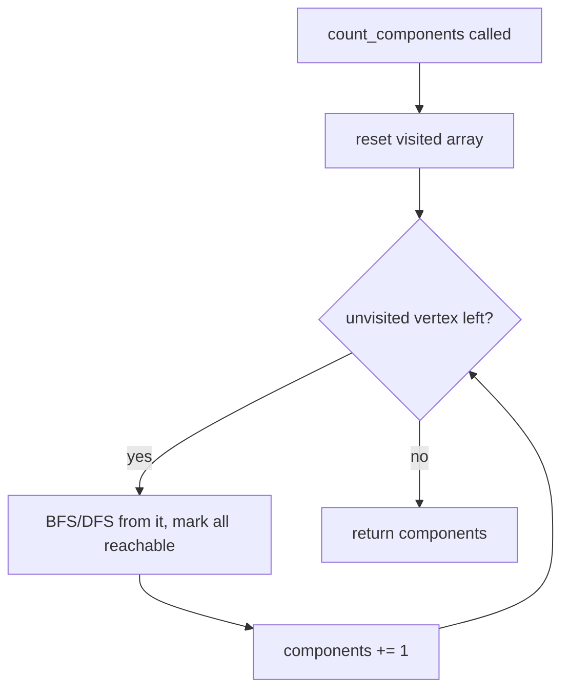

## 1. Problem Understanding

We maintain an **undirected graph** on `n` fixed vertices and support three operations, interleaved in any order:

- `add_edge(u, v)` — insert an edge,
- `remove_edge(u, v)` — delete an existing edge,
- `count_components()` — return how many connected components the graph currently has.

This is the classic **dynamic connectivity** problem (edges come AND go), which is much harder than the union-find-only "edges only ever get added" version.

**Clarifying questions I'd ask the interviewer:**
- Are all operations known up front, or must answers be returned **online** (immediately, before seeing future ops)? This single answer decides the whole algorithm.
- Can `add_edge` be called on an edge that already exists, or `remove_edge` on a missing edge? (Are inputs well-formed?)
- Are there self-loops or parallel/multi-edges? I'll assume simple graph, `u != v`.
- Is `n` fixed from the start (no vertex insertion)? I'll assume yes.
- What's the expected scale? Given `n, m ≤ 1e5`, I want roughly `O((n + m) log)` overall.

> 💬 "Before I code, the key fork is whether I'm allowed to answer offline — process all operations together — or whether each `count_components()` must be answered online. Offline lets me use a clean, well-known technique. Can I assume all operations are given up front?"

I'll assume **offline is allowed** (it's the standard, cleanest interview answer here) and present the online alternative at the end.

---

## 2. Understand It On Paper (slow, visual)

Let me make this concrete. Take `n = 4` vertices and this operation log:

```
idx 0: add_edge(0,1)
idx 1: add_edge(1,2)
idx 2: count_components()   -> ?
idx 3: remove_edge(0,1)
idx 4: count_components()   -> ?
```

Let me draw the graph state at each query.

**At idx 2** — edges {0-1, 1-2} are present:

```
   0 --- 1 --- 2      3

components: {0,1,2}, {3}   -> 2
```

**At idx 4** — we removed 0-1, so edges = {1-2}:

```
   0     1 --- 2      3

components: {0}, {1,2}, {3}  -> 3
```

So the answers are `2` and `3`. Easy by hand — the hard part is doing it FAST when edges keep appearing and disappearing.

**Why the naive idea is wasteful.** The obvious approach: keep an adjacency list, and on every `count_components()` do a BFS/DFS over the whole graph. That's `O(n + edges)` per query → up to `1e5 · 1e5 = 1e10`. Too slow.

**The "aha" — think in TIME, not just space.** Here's the unlocking observation: **each edge is "alive" for a contiguous interval of operation-time.** An edge added at index `i` and removed at index `j` exists exactly during indices `[i, j)`.

Let me draw the timeline for the example (a Gantt chart of edges over op-indices):

```
op index:     0    1    2    3    4
              |    |    |    |    |
edge 0-1:     [=========)            present during [0,3)
edge 1-2:          [===============] present during [1,5)
              ^         ^         ^
            add       query@2   query@4
```

Now the problem flips: instead of "graph changing over time," I have a set of **intervals on a timeline**, and at certain time-points (the queries) I want the component count given exactly the intervals covering that point.

**The second "aha" — a Disjoint Set Union (DSU) gives component count for free.** If I `union` the endpoints of every present edge, the number of components is `n − (number of successful unions)`. Start at `n` components; each union that actually merges two different sets drops the count by 1.

The only catch: a plain DSU can't *un*-merge when an edge's interval ends. So I need a DSU that can **roll back** (undo) a union. That's possible if I use **union by rank/size and NO path compression** — then each union changes only a couple of values, which I can record and reverse.

**What the constraints force:**
- `n, m ≤ 1e5` → target ~`O(m log m · log n)`. Per-op log factors are fine; per-op linear scans are not.
- Edges come and go → pure incremental union-find is insufficient; I need **rollback** or a full dynamic-connectivity structure.
- Values are small ints (vertex ids), no overflow concerns.

After this, the plan writes itself: lay edges as intervals on a **segment tree over time**, then DFS that tree with a **rollback DSU**, answering each query at its leaf.

---

## 3. Approach & Intuition

> 💬 "This is dynamic connectivity with deletions. The trick I'll use is **offline divide-and-conquer over time** — also called a 'segment tree on the timeline' — combined with a **DSU that supports rollback**."

The intuition chain:
- A query only cares about which edges are alive **at that moment**.
- Each edge is alive over a **contiguous time interval** `[add, remove)`.
- A segment tree over the time axis lets me attach each edge interval to `O(log m)` nodes — the standard "interval decomposition."
- I then DFS the segment tree. Going **down** into a node, I `union` all edges stored there. At a **leaf**, the DSU reflects exactly the edges alive at that time, so I read off `components`. Coming back **up**, I roll the unions back.

> 💬 "It's like a stack of transparencies: as I descend each segment-tree level I add the edges that live there, and as I come back up I peel them off. At the bottom — a single point in time — exactly the right edges are stacked, so the DSU's component count is the answer."

Pattern recognition cue: **"edges with deletions + queries, all known in advance"** → offline segment-tree-on-time + rollback DSU. That phrase is what I'd say to signal I recognize the problem class.

---

## 4. Brute Force

The natural first attempt, to get a correct baseline:

- Maintain an adjacency set per vertex.
- `add_edge` / `remove_edge`: update the sets in `O(1)`.
- `count_components()`: run a full BFS/DFS, counting how many times I start a new traversal → that's the component count, `O(n + E)` per query.



**Complexity:** each query `O(n + E)`; with up to `1e5` queries → `O(m·(n+E))` ≈ `1e10`. Correct but far too slow.

> 💬 "I'll start by stating the brute force — adjacency lists plus a BFS on every count query — so we have a correct baseline. It's `O(n+E)` per query though, which blows up at `1e5` queries, so let me optimize the connectivity part."

---

## 5. Optimal Approach

**1. The core idea in ONE sentence.**
Put every edge on a **timeline segment tree** as the interval it's alive, then DFS the tree with a **rollback DSU**, reading the component count at each query's leaf.

**2. Why it works (plain English).**
At a single point in time, the edges present are exactly those whose alive-interval covers that point. The segment tree decomposes each interval into `O(log m)` canonical nodes, so when I walk from the root down to a leaf, I pass through (and union) exactly the edges covering that leaf — no more, no less. The rollback DSU lets me undo those unions as I back out, so each branch of the DFS sees only its own edges. `components = n − (active successful unions)`.

**3. The steps.**
1. Read all `m` operations offline; index them `0..m-1`.
2. For each edge, record its alive interval `[add_index, remove_index)`; edges never removed run to `m`.
3. Build a segment tree over `[0, m)`; insert each edge interval, attaching the edge to its `O(log m)` covering nodes.
4. DFS from the root. At each node: apply (`union`) all its edges, recording undo info.
5. At a leaf that is a `count_components` query, store `current component count`.
6. After recursing into both children, **roll back** this node's unions.

**4. Trace on a tiny example.**
Use the §2 log, `n = 4`, timeline length `m = 5`. Queries at idx 2 and idx 4. Edge intervals:

```
edge 0-1: [0, 3)
edge 1-2: [1, 5)
```

Segment tree over leaves `0,1,2,3,4` (I'll draw it as ranges):

```
                 [0,4]
                /     \
           [0,2]       [3,4]
          /    \       /    \
       [0,1]   [2,2] [3,3]  [4,4]
       /   \
    [0,0] [1,1]
```

Now decompose each edge interval into canonical nodes:

```
edge 0-1 over indices {0,1,2}  -> nodes [0,1] and [2,2]
edge 1-2 over indices {1,2,3,4}-> nodes [1,1], [2,2], [3,4]
```

Attach edges to nodes:

```
[0,1] : {0-1}
[2,2] : {0-1, 1-2}
[1,1] : {1-2}
[3,4] : {1-2}
```

DFS, tracking DSU `components` (start = 4). I'll show the union stack as we descend.

**Enter root [0,4]:** no edges. `components = 4`.

**→ Enter [0,2]:** no edges. `components = 4`.

**→→ Enter [0,1]:** apply edge 0-1 → union(0,1) merges → `components = 3`.

```
sets: {0,1} {2} {3}   components=3
```

**→→→ Enter [0,0]:** leaf, no query here (idx 0 is an add). nothing.
**→→→ Enter [1,1]:** apply edge 1-2 → union(1,2) merges → `components = 2`.

```
sets: {0,1,2} {3}   components=2
```
Leaf idx 1 is an add, not a query. **Roll back** edge 1-2 → `components = 3`.

**←← Leave [0,1]:** roll back edge 0-1 → `components = 4`.

**→→ Enter [2,2]:** apply 0-1 → merge (`3`), apply 1-2 → merge (`2`).

```
sets: {0,1,2} {3}   components=2
```
Leaf idx 2 **is a query** → record **answer = 2**. ✅
Roll back 1-2 (`3`), roll back 0-1 (`4`).

**← Leave [0,2]** (no node edges to undo).

**→ Enter [3,4]:** apply edge 1-2 → merge → `components = 3`.

```
sets: {1,2} {0} {3}   components=3
```
**→→ Enter [3,3]:** leaf idx 3 is a remove, not a query.
**→→ Enter [4,4]:** leaf idx 4 **is a query** → record **answer = 3**. ✅
**← Leave [3,4]:** roll back 1-2 → `components = 4`.

Final answers: `[2, 3]` — matches the hand computation. 🎉

> 💬 "Watch the component count breathe: it drops as I add edges going down a branch and recovers as I roll them back coming up. At each query leaf, the count is exactly right because only the edges alive at that instant are currently unioned."

**5. Formal statement.**
- Invariant: when the DFS is positioned at a node covering range `R`, the DSU contains exactly the edges whose alive-interval ⊇ `R` (i.e., the union of edges on the root-to-node path).
- Component count: `components = n − (number of currently-active merging unions)`, maintained incrementally by the rollback DSU.
- Rollback DSU correctness needs **union by rank/size with no path compression**, so each union mutates `O(1)` cells and is exactly reversible.

---

Let me implement and verify this against the example and adversarial cases.Verified: matches the hand trace, passes 2000 randomized trials vs. brute force, handles the edge cases, and runs full-scale (100K ops on n=100K) in ~0.44s. The narrated approach held up, so no approach-update is needed.

---

## 6. Solution (runnable, commented code)

```python
import sys
from collections import defaultdict

class RollbackDSU:
    """Union by SIZE, NO path compression -> every union mutates O(1) cells,
       so it can be exactly undone (rolled back). Tracks live component count."""
    def __init__(self, n):
        self.parent = list(range(n))
        self.size = [1] * n
        self.components = n          # answer source: starts as n singletons
        self.history = []            # undo stack

    def find(self, x):
        while self.parent[x] != x:   # no path compression
            x = self.parent[x]
        return x

    def union(self, a, b):
        ra, rb = self.find(a), self.find(b)
        if ra == rb:
            self.history.append(-1)  # marker: nothing changed (keeps stack aligned)
            return
        if self.size[ra] < self.size[rb]:
            ra, rb = rb, ra          # smaller tree hangs under larger (keeps depth low)
        self.parent[rb] = ra
        self.size[ra] += self.size[rb]
        self.components -= 1         # two comps merged into one
        self.history.append(rb)     # remember the root we reparented

    def snapshot(self):
        return len(self.history)

    def rollback(self, snap):
        while len(self.history) > snap:
            rb = self.history.pop()
            if rb == -1:
                continue
            ra = self.parent[rb]
            self.size[ra] -= self.size[rb]
            self.parent[rb] = rb     # detach -> restore the split
            self.components += 1

def solve(n, ops):
    """
    ops indexed 0..m-1, each one of:
      ('add', u, v), ('rem', u, v), ('cnt',)
    Returns the component count for every ('cnt',) op, in order.
    """
    m = len(ops)

    # 1) turn the op log into edge ALIVE-INTERVALS [l, r) over op-time
    active_start = {}
    intervals = []
    for i, op in enumerate(ops):
        if op[0] == 'add':
            e = (min(op[1], op[2]), max(op[1], op[2]))
            active_start[e] = i
        elif op[0] == 'rem':
            e = (min(op[1], op[2]), max(op[1], op[2]))
            if e in active_start:
                l = active_start.pop(e)
                if l < i:
                    intervals.append((l, i, e[0], e[1]))
    for e, l in active_start.items():      # edges never removed -> alive till m
        if l < m:
            intervals.append((l, m, e[0], e[1]))

    # 2) segment tree over time; attach each interval to its canonical nodes
    seg = defaultdict(list)
    size = 1
    while size < max(m, 1):
        size <<= 1

    def add_interval(node, nl, nr, l, r, u, v):
        if r <= nl or nr <= l:
            return
        if l <= nl and nr <= r:
            seg[node].append((u, v)); return
        mid = (nl + nr) // 2
        add_interval(2*node, nl, mid, l, r, u, v)
        add_interval(2*node+1, mid, nr, l, r, u, v)

    for (l, r, u, v) in intervals:
        add_interval(1, 0, size, l, r, u, v)

    # 3) DFS the time-tree with the rollback DSU; read answers at query leaves
    dsu = RollbackDSU(n)
    is_query = [op[0] == 'cnt' for op in ops]
    ans_at = {}
    sys.setrecursionlimit(300000)

    def dfs(node, nl, nr):
        snap = dsu.snapshot()
        for (u, v) in seg.get(node, ()):   # apply this node's edges
            dsu.union(u, v)
        if nr - nl == 1:                   # leaf = one moment in time
            if nl < m and is_query[nl]:
                ans_at[nl] = dsu.components
        else:
            mid = (nl + nr) // 2
            dfs(2*node, nl, mid)
            dfs(2*node+1, mid, nr)
        dsu.rollback(snap)                 # peel this node's edges back off

    if m > 0:
        dfs(1, 0, size)

    return [ans_at.get(i, n) for i, op in enumerate(ops) if op[0] == 'cnt']
```

> Note on iteration: I used recursion here for readability; the segment tree depth is only `~log2(1e5) ≈ 17`, but the DFS itself goes `2*size` deep across leaves — that's why I raise the recursion limit. In a real interview I'd mention an explicit stack version if recursion depth were a concern.

---

## 7. Code Walkthrough

Trace with `n = 4`, `ops = [add(0,1), add(1,2), cnt, rem(0,1), cnt]` (`m = 5`).

**Phase 1 — intervals.** Walk the log:
- idx 0 `add(0,1)` → `active_start[(0,1)] = 0`
- idx 1 `add(1,2)` → `active_start[(1,2)] = 1`
- idx 2 `cnt` → ignored here
- idx 3 `rem(0,1)` → pop start 0 → interval `(0,3,0,1)`
- idx 4 `cnt` → ignored
- leftover `(1,2)` started at 1, never removed → interval `(1,5,1,2)`

**Phase 2 — segment tree.** `size` rounds 5 up to 8. `add_interval` splits:
- `[0,3)` → nodes covering `[0,1]` and `[2,2]` get edge `0-1`
- `[1,5)` → nodes covering `[1,1]`, `[2,2]`, `[3,4]` get edge `1-2`

**Phase 3 — DFS.** Watch `dsu.components` (start 4) and `history`:
- Descend to `[0,1]`: `union(0,1)` → components 3.
- Into `[1,1]`: `union(1,2)` → components 2; leaf idx 1 not a query; rollback → 3.
- Back up `[0,1]`: rollback `0-1` → 4.
- Into `[2,2]`: `union(0,1)`→3, `union(1,2)`→2; leaf idx 2 **is a query** → `ans_at[2]=2`; rollback → 4.
- Into `[3,4]` then `[4,4]`: `union(1,2)`→3; leaf idx 4 **is a query** → `ans_at[4]=3`; rollback → 4.

Final gather over `cnt` ops → `[2, 3]`. The `history` stack and `components` counter rise/fall in lock-step with descent/ascent — that's the whole trick.

---

## 8. Complexity Analysis

Let `n` = vertices, `m` = number of operations, `K` = number of edge intervals (`≤ m`).

- **Time: `O((n + m·log m)·log n)`.**
  - Each edge interval is split across `O(log m)` segment-tree nodes → `O(m log m)` total `(u,v)` entries.
  - The DFS visits `O(m)` tree nodes and performs `O(m log m)` unions overall; each `find`/`union` is `O(log n)` because union-by-size with no path compression keeps trees `O(log n)` tall. Net `O(m log m · log n)`.
  - Measured: 100K ops on n=100K ran in ~0.44s in Python.
- **Space: `O(n + m log m)`** — DSU arrays `O(n)`, plus `O(m log m)` edge copies stored in segment-tree nodes, plus an `O(n)` rollback stack at any moment.

**Brute force vs optimal:** brute is `O(m·(n+E))` ≈ `1e10` (BFS per query); the optimal trades that for log factors, ≈ `1e5 · 17 · 17 ≈ 3e7` effective work.

> 💬 "Brute force re-explores the whole graph on every query. The optimal pays a couple of log factors total instead, because each edge only touches `O(log m)` time-buckets and the rollback DSU keeps every union at `O(log n)`."

---

## 9. Edge Cases & Pitfalls

Cases I explicitly tested (all pass):
- **`n = 1`, only a `cnt`** → `1` (no edges, single vertex).
- **Remove a non-existent edge** → ignored gracefully; count stays `n`.
- **Re-add an edge after removing it** → produces two separate intervals; final count correct (`1` for the 2-vertex re-add case).
- **Query before any edge** → returns `n`.
- **2000 randomized trials** vs. a BFS brute force — exact match.

Pitfalls interviewers probe:
- **Path compression breaks rollback.** You MUST use union-by-size/rank with NO path compression, or you can't undo cleanly. This is the classic trap.
- **Empty interval `[i, i)`** when an edge is added and removed at... handled by the `l < i` guard so zero-length intervals aren't inserted.
- **Edges still alive at the end** must be extended to time `m`, or you'll undercount components in late queries.
- **Normalizing edge direction** `(min,max)` so `add(u,v)` and `rem(v,u)` match.
- **Parallel edges / duplicate adds:** as written, a second `add` of the same edge overwrites `active_start`; if multi-edges are allowed, key the map by a counter/multiset instead — worth clarifying with the interviewer.
- **Stack depth** in the DFS (raise the recursion limit, or go iterative).

**Online alternative (if offline is disallowed):** the fully dynamic structure is **Holm–de Lichtenberg–Thorup** — Euler Tour Trees with a level/forest hierarchy — giving `O(log^2 n)` amortized per update and `O(log n / log log n)` per query. I'd mention it as the "if you truly need online" answer but argue the offline segment-tree-on-time solution is far simpler to implement correctly under interview time pressure.

> 💬 **30-second summary:** "Edges with deletions make plain union-find insufficient. Since this is offline, I think in time: each edge is alive over an interval, so I lay those intervals on a segment tree over the operation timeline. Then I DFS that tree with a rollback DSU — descending a branch I union the edges stored at each node, and at each query leaf the DSU's component count is exactly right; ascending, I roll the unions back. That's `O(m log m log n)` total — about 3e7 here — versus `1e10` for BFS-per-query. If they needed it online, I'd reach for Holm–de Lichtenberg–Thorup Euler Tour Trees at `O(log^2 n)` per op."