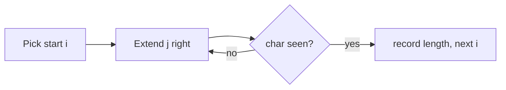

## 1. Problem Understanding

Given a string, find the length of the **longest substring** that contains **no repeating characters**. A substring is contiguous (not a subsequence).

Example: `"abcabcbb"` → answer is `3` (the substring `"abc"`).

**Clarifying questions to ask:**
- What's the character set — ASCII, lowercase only, full Unicode? (Affects the data structure choice.)
- Can the string be empty? What should I return then — `0`?
- Do we return the **length**, or the actual substring?
- Are spaces / punctuation treated as characters?
- How long can the string be? (Tells me the target complexity.)

> 💬 "So I need the longest run of characters with no duplicates inside it, and it has to be contiguous. I'll return the length. Quick check — can I assume ASCII, and should an empty string return 0?"

## 2. Understand It On Paper

The problem in plain words: slide along the string and find the biggest "clean" stretch — clean meaning every character in it is unique. The moment a stretch would repeat a character, it's no longer valid.

Let's make it concrete with `"abcabcbb"`. Index each character:

```
index:  0   1   2   3   4   5   6   7
char:   a   b   c   a   b   c   b   b
```

What are some valid (no-repeat) substrings?
- `"abc"` (indices 0–2) → length 3 ✓
- `"abca"` (0–3) → has two `a`'s ✗
- `"bca"` (1–3) → length 3 ✓
- `"cab"` (2–4) → length 3 ✓

The best you can do here is length **3**.

**Naive idea and why it's wasteful.** The brute force checks *every* substring and tests if it has duplicates. For a string of length n there are about n²/2 substrings, and checking each costs up to n. That's O(n³) — hugely repetitive. Look at the waste:

```
check "a"      -> ok
check "ab"     -> ok   (rechecks 'a' again)
check "abc"    -> ok   (rechecks 'a','b' again)
check "abca"   -> dup! (rechecks everything again)
```

We keep re-scanning characters we already knew were fine.

**The aha.** Instead of restarting, keep a **window** `[left, right]` that always holds a no-repeat stretch. Push `right` forward to grow it. When the new character is already inside the window, shrink from the `left` until the duplicate is gone. Each character enters once and leaves once → O(n).

Picture the window as a frame sliding right, only collapsing from the left when it has to:

```
a  b  c  a  b  c  b  b
[     ]                 window "abc", size 3
   [     ]              had to drop 'a' when second 'a' arrived
```

**Constraint signals:** if n can be 1e5 or more, O(n³) or even O(n²) is too slow — we need O(n). A fixed alphabet (ASCII = 128) means the hashmap uses O(1) extra space.

## 3. Approach & Intuition

This screams **sliding window** because we're looking for the longest *contiguous* segment satisfying a property (uniqueness), and the property is **monotonic** in a useful way: if a window has a duplicate, growing it further on the right won't fix it — we must move the left edge. That "expand right, contract left" rhythm is the sliding-window signature.

We track which characters are currently in the window using a **hash map** from character → its most recent index. That lets us jump the `left` pointer directly past a duplicate instead of crawling.

> 💬 "This is a classic variable-size sliding window. I keep a window that's always duplicate-free. I expand the right edge one char at a time, and whenever I hit a character that's already in my window, I slide the left edge just past its previous position. I track the max window size seen."

## 4. Brute Force

The natural first attempt: generate every substring, check each for duplicates with a set, track the longest valid one.

- For each start `i`, extend `j` to the right, adding chars to a set; stop when you hit a repeat.
- That's O(n²) with the set trick (or O(n³) if you recheck from scratch).

> 💬 "I'll mention the brute force to anchor correctness: try every starting point, extend until a repeat, record the best length. It's O(n²), which works but I can do better with a sliding window in O(n)."



## 5. Optimal Approach

**1. Core idea in one sentence:** Keep a duplicate-free window; move `right` forward always, and jump `left` forward whenever the new char was already inside the window.

**2. Why it works:** A character's last-seen index tells us exactly how far `left` must jump to exclude the duplicate. We never move `left` backward, so each pointer only travels forward across the string — linear total work.

**3. The steps:**
1. Keep `last[char]` = most recent index of each char.
2. Move `right` from 0 to n−1.
3. If `s[right]` was seen at index ≥ `left`, set `left = last[s[right]] + 1`.
4. Update `last[s[right]] = right`.
5. Answer = max over all `right` of `(right − left + 1)`.

**4. Trace on `"abcabcbb"`** — window shown as `[ ]`, `last` map updated each step:

```
right=0 'a'  : not in window     left=0  window=[a]        len=1  best=1
last={a:0}
```
```
right=1 'b'  : not in window     left=0  window=[a b]      len=2  best=2
last={a:0,b:1}
```
```
right=2 'c'  : not in window     left=0  window=[a b c]    len=3  best=3
last={a:0,b:1,c:2}
```
```
right=3 'a'  : seen at 0 (>=left) -> left=1
              window=[b c a]                              len=3  best=3
last={a:3,b:1,c:2}
```
```
right=4 'b'  : seen at 1 (>=left) -> left=2
              window=[c a b]                              len=3  best=3
last={a:3,b:4,c:2}
```
```
right=5 'c'  : seen at 2 (>=left) -> left=3
              window=[a b c]                              len=3  best=3
last={a:3,b:4,c:5}
```
```
right=6 'b'  : seen at 4 (>=left) -> left=5
              window=[c b]                                len=2  best=3
last={a:3,b:6,c:5}
```
```
right=7 'b'  : seen at 6 (>=left) -> left=7
              window=[b]                                  len=1  best=3
last={a:3,b:7,c:5}
```

Final answer: **3**.

> 💬 "Watch index 3: the second 'a'. Its last position was 0, which is inside my window, so I slide left to 1 — now the window is 'bca', still clean. I keep doing this and the best length I ever saw was 3."

**5. Formal invariant:** At every step the window `[left, right]` contains only distinct characters, and `best = max(right − left + 1)`. The guard `last[c] >= left` matters — a stale index from *before* the window must not drag `left` backward.

Now let me implement and verify it.