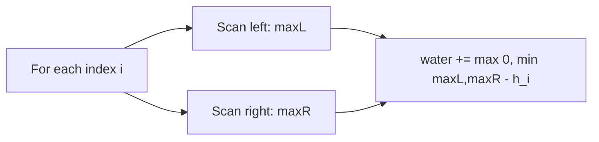

## 1. Problem Understanding

You're given an array of non-negative integers where each value is the height of a vertical bar of width 1. After it rains, water pools in the dips between taller bars. Compute the total units of water trapped.

**Clarifying questions to ask:**
- Can the array be empty or have fewer than 3 bars? (If so, answer is 0 — water needs walls on both sides.)
- Are all heights non-negative integers? Any upper bound on values / length?
- Do you want total trapped water (a single number), not a per-index breakdown?
- Can I modify the input array, or should it stay read-only?

> 💬 "So I'm given bar heights, and I need to figure out how much water sits in the valleys between them after rain. Let me confirm — heights are non-negative, and I just return the total trapped units, right?"

## 2. Understand It On Paper

The core idea: water sits on top of a bar only if there's something taller on **both** its left and right to hold the water in. The water level above any single bar is capped by the **shorter** of the tallest wall to its left and the tallest wall to its right.

Take `heights = [0,1,0,2,1,0,1,3,2,1,2,1]` (the classic example, answer = 6).

Let me draw it:

```
        █
  █     █ █   █
█ █ █ █ █ █ █ █ █
0 1 0 2 1 0 1 3 2 1 2 1   <- heights
```

Now fill in water (`~`) wherever a column is hemmed in by taller bars on both sides:

```
        █
  █~~~~~█~█~~~█
█ █ █ █ █ █ █ █ █
0 1 0 2 1 0 1 3 2 1 2 1
```

Let's compute water at one index to lock in the intuition. Take index 5 (height 0):
- Tallest bar to its left = 2 (at index 3).
- Tallest bar to its right = 3 (at index 7).
- Water level = min(2, 3) = 2. Bar height there = 0.
- Water trapped at index 5 = 2 - 0 = **2**.

That's the whole secret, applied to every index:

```
water[i] = min(maxLeft[i], maxRight[i]) - height[i]    (if positive, else 0)
```

**Why the naive idea is wasteful:** for each index you could re-scan the whole array left and right to find the two maxes — that's O(n) per index, O(n²) total. The "aha" is that you don't need to rescan: you can either precompute the left/right maxes once, or sweep two pointers inward and only ever care about the smaller side.

**Constraint note:** with n up to ~1e5+, O(n²) is too slow — we want O(n). Heights can be large, but Python ints don't overflow (mention overflow if asked in Java/C++).

## 3. Approach & Intuition

This is a classic "for each position, how much can it hold" problem driven by **prefix/suffix maximums**. The pattern signal: the answer at each index depends on a max-so-far from both directions → think running maxes, or a converging two-pointer.

> 💬 "The amount of water above each bar is decided by the shorter of the tallest wall on its left and the tallest wall on its right, minus the bar's own height. So my whole job is, for every index, to know those two maxes efficiently."

The two-pointer optimization: if the tallest-left-so-far is smaller than the tallest-right-so-far, then the left bar is the limiting wall — I can safely settle the water at the left pointer, because whatever is on the far right, the left side is already the bottleneck.

## 4. Brute Force

For each index `i`, scan left to find the max height, scan right to find the max height, then add `min(left, right) - height[i]` if positive.

- **Time:** O(n²) — two scans per index.
- **Space:** O(1).

> 💬 "I'll start with the obvious version: for each bar, look left for the tallest, look right for the tallest, take the min minus this bar's height. It's O(n²), but it gives me a correct baseline I can then optimize."



## 5. Optimal Approach

**1. Core idea in one sentence:** Use two pointers from both ends; at each step, move the side with the smaller wall inward and bank the water it can hold.

**2. Why it works:** If `leftMax < rightMax`, the water above the left pointer is limited only by `leftMax` — a taller wall is guaranteed somewhere on the right, so the left side is the bottleneck. So I can finalize the left column immediately without knowing the exact right max.

**3. The steps:**
1. Set `left = 0`, `right = n-1`, `leftMax = rightMax = 0`, `total = 0`.
2. While `left < right`:
3. If `height[left] < height[right]`: update `leftMax`; add `leftMax - height[left]`; move `left++`.
4. Else: update `rightMax`; add `rightMax - height[right]`; move `right--`.
5. Return `total`.

**4. Tiny trace** on `[3,0,2,0,4]` (answer = 7):

| left | right | h[l] | h[r] | leftMax | rightMax | action | added | total |
|------|-------|------|------|---------|----------|--------|-------|-------|
| 0 | 4 | 3 | 4 | 3 | 0 | h[l]<h[r] → left | 3-3=0 | 0 |
| 1 | 4 | 0 | 4 | 3 | 0 | h[l]<h[r] → left | 3-0=3 | 3 |
| 2 | 4 | 2 | 4 | 3 | 0 | h[l]<h[r] → left | 3-2=1 | 4 |
| 3 | 4 | 0 | 4 | 3 | 0 | h[l]<h[r] → left | 3-0=3 | 7 |
| 4 | 4 | — | — | — | — | left==right, stop | — | 7 |

> 💬 "I keep two running maxes. Whichever side currently has the shorter bar is the one whose water I can safely settle, so I process that side and step inward. I stop when the pointers meet."

**5. Formal invariant:** at every step, for the pointer being processed, the running max on its own side equals the true tallest wall between it and that end, and it is the binding constraint because the opposite side's bar is at least as tall. Thus `runningMax - height[i]` is exactly the water at `i`.

Now let me implement and verify both approaches.