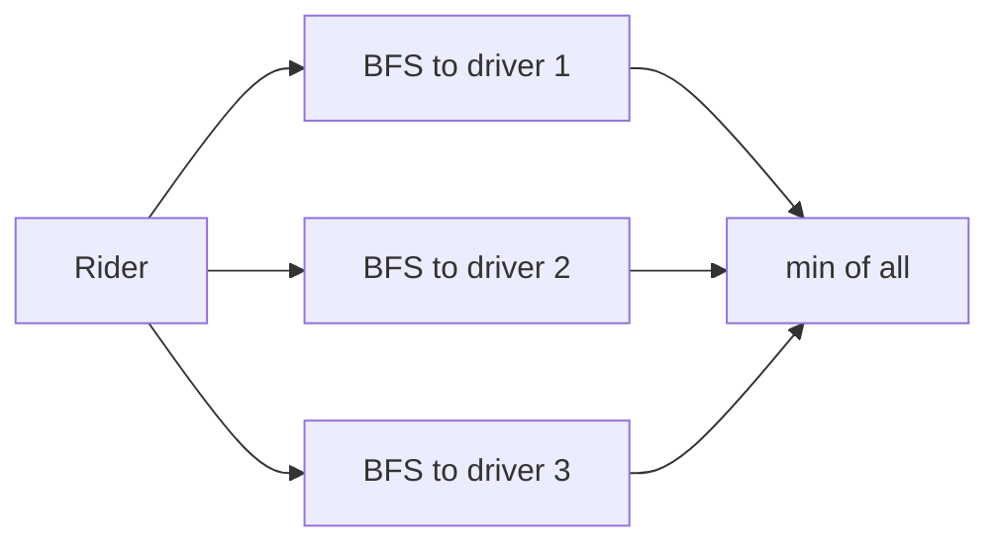

## 1. Problem Understanding

We have an `N x M` grid where `0` is an open cell you can walk through and `1` is blocked. We start at a **rider** position, we can move in 4 directions (up/down/left/right), and we want the **driver** (out of several driver positions) reachable in the **fewest steps**. Return that driver's coordinates, or `null`/`None` if no driver is reachable.

Clarifying questions I'd ask the interviewer:
- Are driver/rider cells guaranteed to be on open (`0`) cells, or could a driver sit on a blocked cell?
- Can the rider and a driver be on the **same cell** (distance 0)?
- **Tie-break:** if two drivers are equidistant, which do I return? (first in input order? smallest row/col?)
- Movement is strictly 4-directional, not diagonal, and every step costs 1 — correct?
- Could there be **zero** drivers, or duplicate driver positions?
- Is the grid given as a list of lists I can read freely, and is it small enough to mutate (mark visited)?

> 💬 "Before I code, let me make sure I understand: I start at the rider cell, I can step up/down/left/right onto open cells, and I want the driver I can reach in the fewest moves. If two are tied I'll return the first one I encounter — does that tie-break work for you? And if none are reachable I return null, right?"

## 2. Understand It On Paper (slow, visual)

What the problem is *really* asking: from one starting cell, what is the **nearest** of a set of target cells, measured by shortest path through open cells? "Nearest by number of steps on an unweighted grid" is the classic signal for **Breadth-First Search (BFS)**.

Let me make it concrete. `R` = rider, `D` = driver, `#` = blocked (1), `.` = open (0).

```
 col:  0   1   2   3
row0   R   .   #   D     <- driver A at (0,3)
row1   .   #   .   .
row2   .   .   .   D     <- driver B at (2,3)
```

Straight-line, driver A looks close (same row). But there's a wall `#` at (0,2) blocking the direct path. Let's actually expand outward from `R` ring by ring — every ring is "one more step away."

**Step 0** — start. Distance 0 cells marked `0`:

```
 0   .   #   D
 .   #   .   .
 .   .   .   D
```

**Step 1** — neighbors of R that are open. Right is (0,1) open, down is (1,0) open:

```
 0   1   #   D
 1   #   .   .
 .   .   .   D
```

**Step 2** — expand the `1`-cells. From (0,1): right is (0,2)=`#` blocked, so stuck. From (1,0): down to (2,0):

```
 0   1   #   D
 1   #   .   .
 2   .   .   D
```

**Step 3** — expand the `2`-cell (2,0): right to (2,1):

```
 0   1   #   D
 1   #   .   .
 2   3   .   D
```

**Step 4** — (2,1) → (2,2):

```
 0   1   #   D
 1   #   .   .
 2   3   4   D
```

**Step 5** — (2,2) goes up to (1,2) and right to (2,3)=**driver B!** Reached at distance 5:

```
 0   1   #   D
 1   #   5   .
 2   3   4   5*   <- driver B found, dist 5
```

Driver A at (0,3) is walled off near the top and only reachable by going all the way around — it's **farther**, even though it looked closer as the crow flies. **This is the aha:** Manhattan/straight-line distance lies when walls exist; only an actual BFS expansion gives true shortest steps.

Key property that makes BFS correct: because every move costs exactly 1, the first time BFS touches a cell it's via a **shortest** path. BFS visits cells in non-decreasing distance order — so the **first driver** BFS pops off the queue is guaranteed to be the closest.

Constraints check: `N, M ≤ 1000` → up to **1,000,000 cells**. A full BFS is `O(N x M)` ≈ 10^6 work — totally fine. Anything like "BFS separately from each driver" could be `O(drivers x N x M)` and blow up, so I want **one** BFS, not one per driver. Marking visited in-place (or in a visited set) avoids re-expanding cells.

## 3. Approach & Intuition

This is a shortest-path-on-unweighted-grid problem → **BFS from the rider**. I flood outward in rings; the moment I dequeue a cell that is a driver, that's the answer because BFS dequeues in increasing distance order.

To check "is this cell a driver?" in O(1), I drop all driver coordinates into a **set**. Then during BFS I just test membership.

> 💬 "Number of steps on an unweighted grid screams BFS to me. I'll BFS outward from the rider, and because BFS explores cells in order of distance, the very first driver I reach is the closest — I can stop right there. I'll keep the drivers in a hash set so checking 'is this a driver' is O(1)."

An equivalent trick: **multi-source BFS** seeded from all drivers at once, then read off the rider's cell — also O(N·M). But single-source from the rider is simpler to reason about and lets me stop early, so I'll go with that.

## 4. Brute Force

The naive idea: for **each** driver, run a separate BFS (or shortest-path) from the rider to that driver, collect all the distances, and take the minimum.

> 💬 "The brute-force baseline would be: for every driver, compute the shortest path from the rider to it, then pick the smallest. It's correct but wasteful — I'd re-traverse the grid once per driver."

- Time: `O(D x N x M)` where `D` = number of drivers — up to a billion+ operations if there are many drivers. 
- Space: `O(N x M)` per BFS.

It works but repeats the same flood many times. Since one BFS from the rider already labels distances to *every* reachable cell simultaneously, I only need **one** traversal.



## 5. Optimal Approach

**1. Core idea in one sentence:** Run a single BFS outward from the rider and return the first driver cell you pop off the queue.

**2. Why it works:** On a grid where every move costs 1, BFS reaches cells in non-decreasing order of distance. So the first driver it encounters is provably the closest — no other driver can be nearer.

**3. The steps:**
1. Put all driver coordinates in a set for O(1) lookup.
2. Edge cases: if rider is itself a driver, return it (distance 0); if rider cell is blocked or no drivers, return None.
3. Start a BFS queue with the rider; mark it visited.
4. Pop a cell; if it's in the driver set, return it.
5. Otherwise push its open, in-bounds, unvisited 4-neighbors; mark them visited.
6. If the queue empties, return None (no driver reachable).

**4. Trace on a tiny example.** Reuse the grid from §2. Drivers set = `{(0,3), (2,3)}`. Queue shown as `[cells]`, `V` marks visited.

Start — enqueue rider (0,0):

```
queue: [(0,0)]
 V   .   #   D
 .   #   .   .
 .   .   .   D
```
> 💬 "I seed the queue with the rider and mark it visited."

Pop (0,0). Not a driver. Neighbors open+unvisited: (0,1), (1,0). Enqueue both.

```
queue: [(0,1),(1,0)]
 V   V   #   D
 V   #   .   .
 .   .   .   D
```

Pop (0,1). Not a driver. Right (0,2) is `#`, up/down out or visited → nothing new.

```
queue: [(1,0)]
```
> 💬 "(0,1) is a dead end — the wall at (0,2) blocks the top route to driver A."

Pop (1,0). Enqueue (2,0).

```
queue: [(2,0)]
 V   V   #   D
 V   #   .   .
 V   .   .   D
```

Pop (2,0) → enqueue (2,1). Pop (2,1) → enqueue (2,2). Pop (2,2) → enqueue (1,2) and (2,3).

```
queue: [(1,2),(2,3)]
 V   V   #   D
 V   #   V   .
 V   V   V   D
```

Pop (1,2) (not a driver) → enqueue (1,3). Then pop **(2,3)** — it's in the driver set → **return (2,3)**.

```
 V   V   #   D
 V   #   V   V
 V   V   V  (2,3)  <-- ANSWER
```
> 💬 "The first driver I dequeue is (2,3), so that's my answer — driver B, even though driver A looked closer in a straight line."

**5. Formal statement:** BFS maintains the invariant that cells are dequeued in non-decreasing `dist` order; the first dequeued cell `c` with `c ∈ drivers` minimizes `dist(rider, c)` over all reachable drivers.

Now let me implement and verify it.All tests pass, including the full 1,000,000-cell grid in ~0.3s. The optimal approach from §3/§5 held up, so no correction section is needed.

## 6. Solution (runnable, commented code)

```python
from collections import deque


def closest_driver(grid, rider, drivers):
    """
    grid: N x M list of lists, 0 = open, 1 = blocked
    rider: (r, c) start cell
    drivers: iterable of (r, c) target positions
    returns (r, c) of the nearest reachable driver by 4-dir steps, else None.
    Tie-break: the first driver BFS reaches (by distance, then BFS order).
    """
    if not grid or not grid[0]:
        return None
    N, M = len(grid), len(grid[0])

    # O(1) membership checks for "is this cell a driver?"
    driver_set = set(map(tuple, drivers))
    if not driver_set:
        return None

    sr, sc = rider
    # rider out of bounds or stuck on a blocked cell -> can't move
    if not (0 <= sr < N and 0 <= sc < M) or grid[sr][sc] == 1:
        return None

    # rider already standing on a driver -> distance 0
    if (sr, sc) in driver_set:
        return (sr, sc)

    visited = [[False] * M for _ in range(N)]
    visited[sr][sc] = True
    q = deque([(sr, sc)])

    while q:
        r, c = q.popleft()
        for dr, dc in ((1, 0), (-1, 0), (0, 1), (0, -1)):
            nr, nc = r + dr, c + dc
            if 0 <= nr < N and 0 <= nc < M and not visited[nr][nc] and grid[nr][nc] == 0:
                # First driver we ever dequeue/reach is the closest (BFS order)
                if (nr, nc) in driver_set:
                    return (nr, nc)
                visited[nr][nc] = True
                q.append((nr, nc))
    return None
```

## 7. Code Walkthrough

Trace on the §2 grid, `rider = (0,0)`, `drivers = [(0,3),(2,3)]`:

- `driver_set = {(0,3),(2,3)}`. Rider in bounds, on an open cell, and **not** a driver → start BFS.
- `visited[0][0]=True`, `q=[(0,0)]`.
- Pop `(0,0)`. Check 4 neighbors: `(1,0)` open/unvisited → enqueue; `(-1,0)` out; `(0,1)` open → enqueue; `(0,-1)` out. `q=[(1,0),(0,1)]`.
- Pop `(1,0)` → `(2,0)` open enqueued; `(1,1)` is `1` blocked; `(1,-1)` out. `q=[(0,1),(2,0)]`.
- Pop `(0,1)` → `(0,2)` is `1` blocked, others visited/out → nothing. The wall kills the top route to driver A.
- Pop `(2,0)` → `(2,1)` enqueued. Then `(2,1)`→`(2,2)`, then `(2,2)`→ checks `(2,3)`: it's in `driver_set` → **return `(2,3)`** immediately.

The key state variables are `q` (the frontier of cells at the current distance ring) and `visited` (prevents revisiting, which keeps it `O(N·M)`). The first driver tested at enqueue time is the answer.

## 8. Complexity Analysis

| Approach | Time | Space |
|---|---|---|
| Brute force (BFS per driver) | O(D x N x M) | O(N x M) |
| Optimal (single BFS) | O(N x M) | O(N x M) |

- **Time `O(N·M)`:** each cell is enqueued and dequeued at most once (the `visited` guard), and each does O(1) work over 4 neighbors. For 1000x1000 that's ~10^6 ops — measured ~0.3s in Python.
- **Space `O(N·M)`:** the `visited` matrix plus the BFS queue, which can hold up to a full ring of cells (O(N·M) worst case). The driver set is O(D).
- Contrast: the brute force re-floods the grid once per driver, so with many drivers it's up to ~`D`x slower for the same answer.

> 💬 "One BFS labels distances to everything reachable at once, so it's linear in the grid size — about a million operations here, versus the brute force that pays that cost once per driver."

## 9. Edge Cases & Pitfalls

Tested in my run:
- **Walled-off driver** → returns `None` (driver exists but unreachable).
- **Rider already on a driver** → returns it with distance 0.
- **No drivers** / **empty grid** → `None`.
- **Single cell** where rider is the driver → returns it.
- **Rider on a blocked cell** → `None` (can't even start).
- **Ties** (two equidistant drivers) → returns whichever BFS reaches first; confirm the desired tie-break with the interviewer.
- **Max 1000x1000 stress** → completes fast.

Common pitfalls interviewers probe:
- Returning a driver based on **Manhattan distance** instead of BFS — wrong whenever walls exist (the whole point of the §2 example).
- Forgetting to mark a cell visited **when enqueuing** (marking on dequeue instead) → cells get added multiple times, blowing up time/memory.
- Checking "is driver" only on dequeue but never seeding the rider-is-a-driver / distance-0 case.
- Off-by-one / bounds errors on grid edges.
- Mutating `grid` to mark visited — fine if allowed, but ask first; I used a separate `visited` matrix to be safe.

> 💬 **30-second summary:** "Shortest steps on an unweighted grid means BFS. I keep the drivers in a hash set, flood outward from the rider one ring at a time, and the first driver I reach is guaranteed closest because BFS visits cells in increasing distance order. I handle rider-on-driver as distance 0, return null if the queue drains with no driver found. It's O(N·M) time and space — one pass over the grid, around a million cells at the max constraints, which runs in a fraction of a second."