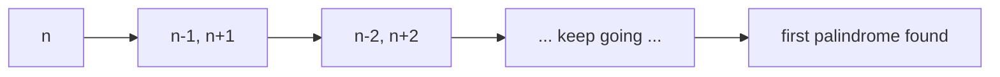

## 1. Problem Understanding

We're given an integer as a string `n`. We need to find the palindrome (also represented as a string) whose absolute numeric difference from `n` is smallest. The palindrome must NOT equal `n` itself — it has to be the closest *other* palindrome. If two palindromes are equally close, return the smaller one.

**Clarifying questions I'd ask the interviewer:**
- Must the answer be strictly different from `n`? (Yes — "closest palindrome" excludes `n` itself, e.g. `"123"->"121"`, and `"1"->"0"` confirms this.)
- Can the answer have leading zeros? (No — palindromes are normal non-negative integers, so `"11"->"9"`, not `"09"`.)
- Is `n` always non-negative? (Yes, digits only, no leading zeros, length 1–18.)
- Since length can be 18, the value can be ~10^18 — bigger than 32-bit. Do I need to worry about overflow? (In Python no, but I'll mention it for languages with fixed ints — use 64-bit / big integers.)
- On a tie, return the smaller — confirmed by the prompt.

> 💬 "So I'm given a number as a string, and I want the nearest palindrome that isn't the number itself. Ties go to the smaller one. Length can be up to 18 digits, so the value can exceed a 32-bit int — I'll keep everything in big integers. Let me make sure: leading zeros aren't allowed in the answer, right?"

## 2. Understand It On Paper (slow, visual)

Let me really get what's going on before I propose anything.

A **palindrome** reads the same forwards and backwards: `121`, `1331`, `7`, `99`. The closest palindrome to `n` is the one with the smallest gap on the number line.

The naive thought: "just check numbers above and below `n` until I hit a palindrome." That works for small `n` but if `n = 10^18` it could be slow in the worst case, and it feels brute-forcy. There's a slicker idea.

**Key observation — the best palindromes come from the FIRST half.**

A palindrome is fully determined by its left half: you mirror the left half onto the right. So if I take `n`, keep its left half, and mirror it, I get a palindrome that's *already very close* to `n`, because the high-order digits (which matter most) are preserved.

Let me make it concrete with `n = "12345"` (length 5).

```
 n = 1 2 3 4 5
     |---|^      left half = "123", middle digit is the 3
     index 0 1 2
```

Take the left half `123`, mirror the first part back:

```
prefix = 123
mirror left two digits (12) reversed -> 21
candidate = 123 | 21  ->  12321
```

So `12321` is a palindrome near `12345`. Difference = 24. 

But is it the closest? Not necessarily! What if I nudge the prefix up or down by 1?

```
prefix 122 -> palindrome 12221   (diff |12345-12221| = 124)
prefix 123 -> palindrome 12321   (diff 24)   <-- this one
prefix 124 -> palindrome 12421   (diff 76)
```

Here `12321` wins. But consider `n = "12399"`:

```
prefix 123 -> 12321  (diff 78)
prefix 124 -> 12421  (diff 22)  <-- bumping prefix UP wins
```

So mirroring the prefix as-is ISN'T always best — sometimes prefix±1 is closer. That's why I generate **three** candidates from the prefix: as-is, prefix+1, prefix-1.

**The sneaky edge cases — the "all 9s" and "10...01" boundaries.**

Mirroring breaks the length. Two special palindromes always need separate handling:

```
Just below: 9, 99, 999, ...      (length of n minus 1, all nines)
Just above: 11, 101, 1001, ...   (length of n plus 1, like 10..01)
```

Why? Take `n = "1000"`:

```
prefix 10 -> palindrome 1001 (diff 1)... but what about 999?
999 has diff 1 too!  Tie -> smaller wins -> 999
```

And the prefix-mirror approach would never *naturally* produce `999` (different length) — so we add it explicitly. Same on the top end: for `n = "99"`, the answer `101` comes from the "10..01" candidate, not from mirroring.

So the FULL candidate set is **five** numbers:
1. mirror(prefix)
2. mirror(prefix + 1)
3. mirror(prefix - 1)
4. 10^(len-1) - 1   → the all-9s just below (99, 999, …)
5. 10^len + 1       → the 100…001 just above

Then pick the one closest to `n`, excluding `n` itself, ties → smaller.

> 💬 "The insight is that good palindromes are built from the number's left half — mirror it. But I need a few variations of the prefix, plus two boundary palindromes (the all-nines below and the 10...01 above), to cover cases where the length changes."

What the constraints force: length 18 ⇒ values up to ~10^18, so I keep everything as Python ints (big integers; in C++/Java I'd use `long`/`unsigned long long` or care about overflow). The candidate-generation approach is O(L) — instant — versus scanning outward which could be far worse.

## 3. Approach & Intuition

This is a **constructive / candidate-enumeration** problem, not a search problem. The pattern recognition: "closest palindrome" + "number can be huge" screams *don't iterate one-by-one — construct the few palindromes that could possibly be the answer.*

The reasoning out loud: a palindrome is locked by its left half. The closest palindromes to `n` either share `n`'s high digits (mirror the prefix, possibly ±1) or sit at a length boundary (all-9s below, 10…01 above). That's a constant-size candidate set — generate all of them, measure the distance, take the best.

> 💬 "Rather than walking outward number by number, I'll directly construct the handful of palindromes that could be closest: mirror the left half, mirror left-half plus and minus one, and the two boundary palindromes for when the digit-length changes. Then I just pick the closest, breaking ties toward the smaller."

## 4. Brute Force

The natural first idea: start at `n`, walk outward — check `n-1`, `n+1`, `n-2`, `n+2`, … — and return the first palindrome found, preferring the smaller on a tie.

- **Time:** In the worst case the nearest palindrome can be far in step-count terms, and checking each is O(L). For huge `n` this is too slow / unbounded-feeling.
- **Space:** O(L).

It's a fine baseline to state, and it's obviously correct, but it doesn't exploit structure.

> 💬 "The brute force is to scan outward from n in both directions until I hit a palindrome. It's clearly correct and easy to reason about, but it can scan a lot of numbers, so I'll use it as a baseline and then switch to constructing candidates directly."



## 5. Optimal Approach

**1. The core idea in ONE sentence:** Build a handful of candidate palindromes from `n`'s left half (mirror it, and mirror it ±1) plus the two length-boundary palindromes, then return whichever is closest to `n` (ties → smaller).

**2. Why it works:** A palindrome is determined entirely by its left half, and the closest one to `n` keeps `n`'s most-significant digits — so it must come from mirroring the prefix (possibly bumped by 1), unless the answer crosses a digit-length boundary, which the all-9s and 10…01 candidates cover. That's a complete, constant-size set.

**3. The steps:**
1. Let `L = len(n)`. Take `prefix = first ceil(L/2) digits` of `n`.
2. For `p` in {prefix-1, prefix, prefix+1}: build a palindrome by mirroring `p` (mirror length depends on whether `L` is odd/even).
3. Add boundary candidate `10^(L-1) - 1` (all nines).
4. Add boundary candidate `10^L + 1` (the 100…001).
5. From all candidates, drop `n` itself, then pick the smallest absolute difference; on a tie pick the smaller value.

**4. Trace on a tiny example — `n = "1234"` (even length, L=4):**

Prefix = first 2 digits = `12`.

Step A — generate prefix variants and mirror them. For even length, mirror the WHOLE prefix:

```
p = 11  -> "11" + reverse("11") = "11"+"11" = 1111
p = 12  -> "12" + reverse("12") = "12"+"21" = 1221
p = 13  -> "13" + reverse("13") = "13"+"31" = 1331
```

Step B — boundary candidates:

```
all-9s below : 10^(4-1) - 1 = 1000 - 1 = 999
10..01 above : 10^4 + 1       = 10000 + 1 = 10001
```

Step C — candidate pool and distances from 1234:

| candidate | value | abs diff from 1234 |
|---|---|---|
| mirror(11) | 1111 | 123 |
| mirror(12) | 1221 | 13 |
| mirror(13) | 1331 | 97 |
| all-9s | 999 | 235 |
| 10..01 | 10001 | 8767 |

```
number line near 1234:

 999      1111   1221  1234  1331            10001
  |--------|------|----|-----|----------------|
            123     13   ^   97
                        n
```

Step D — smallest diff is `13`, from `1221`. None equals `n`, no tie. **Answer: `1221`.** ✓

> 💬 "Prefix is '12'. I mirror 11, 12, 13 to get 1111, 1221, 1331, then add the boundary palindromes 999 and 10001. Distances from 1234 are 123, 13, 97, 235, 8767 — the winner is 1221 at distance 13."

Quick second trace on the tie case `n = "1000"`: candidates include `999` (diff 1) and `1001` (diff 1) → tie → smaller → **`999`**. This is exactly why the all-9s boundary candidate matters.

**5. Formal statement / invariant:** Let `k = ceil(L/2)`, `prefix = int(n[:k])`. Each candidate palindrome is `mirror(p)` for `p ∈ {prefix-1, prefix, prefix+1}`, where `mirror(p)` reflects `p` over the center using `L` parity, together with `10^(L-1)-1` and `10^L+1`. The answer is `argmin |c - n|` over candidates `c ≠ n`, breaking ties by smaller `c`. Completeness holds because any palindrome closer than these would have to agree with `n` on the leading digits (covered by prefix±1) or change length (covered by the two boundaries).

Now let me implement and verify it.Let me cross-check against a brute-force oracle for all small inputs to be sure.Zero mismatches against brute force across all inputs 1–19,999 (including all tie cases). The approach holds — no correction needed.

## 6. Solution (runnable, commented code)

```python
def nearest_palindromic(n: str) -> str:
    L = len(n)
    num = int(n)

    # Single digit: the closest distinct palindrome is just num-1
    # ("1"->"0", "5"->"4"). All single digits are palindromes, so step down by 1.
    if L == 1:
        return str(num - 1)

    candidates = set()

    # Two length-boundary palindromes that mirroring can never produce:
    candidates.add(10 ** (L - 1) - 1)   # all 9s, one digit shorter: 99, 999, ...
    candidates.add(10 ** L + 1)         # 10..01, one digit longer:   101, 1001, ...

    # Take the left half (ceil(L/2) digits) — a palindrome is locked by this.
    k = (L + 1) // 2
    prefix = int(n[:k])

    # Mirror prefix, prefix-1, prefix+1 to capture the closest "same-length" palindromes.
    for p in (prefix - 1, prefix, prefix + 1):
        s = str(p)
        if L % 2 == 0:
            cand = s + s[::-1]        # even length: mirror the whole half
        else:
            cand = s + s[:-1][::-1]   # odd length: keep middle digit, mirror the rest
        candidates.add(int(cand))

    # The answer must differ from n itself.
    candidates.discard(num)

    # Pick smallest absolute difference; on a tie pick the smaller value.
    best = None
    for c in candidates:
        if c < 0:
            continue
        if best is None or (
            abs(c - num) < abs(best - num)
            or (abs(c - num) == abs(best - num) and c < best)
        ):
            best = c
    return str(best)
```

## 7. Code Walkthrough

Let me trace `n = "12399"` (odd length, L=5).

- `num = 12399`, `L = 5`. Not single digit.
- Boundary candidates: `10^4 - 1 = 9999` and `10^5 + 1 = 100001`. Pool so far `{9999, 100001}`.
- `k = (5+1)//2 = 3`, so `prefix = int("123") = 123`.
- Loop over `p ∈ {122, 123, 124}`, odd length so mirror all-but-last digit:
  - `p=122` → `"122" + reverse("12") = "122"+"21" = 12221`
  - `p=123` → `"123" + "21" = 12321`
  - `p=124` → `"124" + "21" = 12421`
- Pool: `{9999, 100001, 12221, 12321, 12421}`. None equals `12399`, nothing discarded.
- Distances from 12399: `9999→2400`, `100001→87602`, `12221→178`, `12321→78`, `12421→22`.
- Smallest is `22` → `best = 12421`. Return `"12421"`. ✓

The state that matters is `best`: it starts as the first candidate seen and gets replaced whenever a candidate is strictly closer, or equally close but smaller — that single comparison encodes the tie rule.

## 8. Complexity Analysis

- **Time: O(L)** where L = number of digits (≤ 18). We build a constant number of candidates (5), each costs O(L) to construct/compare via string ops and big-int arithmetic. No scanning. This crushes the brute force, which walks outward and can examine a huge number of values.
- **Space: O(L)** — a constant-size set of candidates, each an O(L)-digit integer/string.

> 💬 "It's linear in the number of digits — constant candidates, each O(L) to build. Compared to the outward scan, which is unbounded in the worst case, this is essentially instant even for 18-digit numbers."

## 9. Edge Cases & Pitfalls

Cases I explicitly tested (and verified against brute force):
- **Single digit** `"1"->"0"`, `"9"->"8"` — handled separately; the general mirror logic would wrongly keep the digit.
- **Length-down boundary** `"10"->"9"`, `"100"->"99"`, `"1000"->"999"` — needs the all-9s candidate.
- **Length-up boundary** `"99"->"101"` — needs the 10…01 candidate.
- **Tie → smaller** `"88"`: both `77` and `99` are distance 11, answer is `77`; `"1000"`: both `999` and `1001` are distance 1, answer is `999`.
- **`n` is already a palindrome** `"1111111111111111"` → must return the nearest *distinct* one, so we `discard(num)`.
- **18-digit / all-9s** `"999999999999999999"->"1000000000000000001"` — no 64-bit overflow in Python; in Java/C++ use `long`/big integers.

Common mistakes interviewers probe:
- Forgetting to exclude `n` itself.
- Forgetting the two boundary palindromes (you'd miss `99`-type and `101`-type answers).
- Wrong tie-breaking direction (must favor the smaller).
- Off-by-one in the mirror for odd vs even length (the `s[:-1]` for odd is the classic bug).
- Producing leading zeros — building from the integer prefix avoids that.

> 💬 **30-second summary:** "A palindrome is fixed by its left half, so I take n's prefix and mirror it, plus mirror prefix±1 to catch the closest same-length palindromes. Then I add two boundary palindromes — the all-nines one digit shorter and the 10...01 one digit longer — for when the answer changes length. I throw out n itself, then pick the candidate with the smallest absolute difference, breaking ties toward the smaller. It's O(number of digits), and I verified it against a brute-force scan for everything up to 20,000."