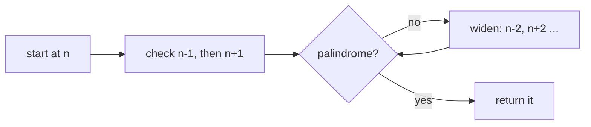

## 1. Problem Understanding

I'm given a non-negative integer as a **string** `n` (1 to 18 digits). I need to find the palindrome that is closest to it by absolute difference. The result must **not equal `n` itself** — even if `n` is already a palindrome, I have to find a *different* one. If two palindromes are equally close, I return the **smaller** one. I return the answer as a string.

A palindrome reads the same forwards and backwards (`121`, `9`, `1001`).

Clarifying questions I'd ask:
- "The closest palindrome must be strictly different from `n`, correct?" (Yes — that's why `"1"` → `"0"`, not `"1"`.)
- "Can the answer be `0` or single-digit? Are leading zeros disallowed in the output?" (Yes to 0/single-digit, no leading zeros.)
- "Is `n` always non-negative? Up to 18 digits means it can exceed 32-bit but fits in a 64-bit int / Python big int."
- "On a tie, return the smaller — confirmed."

> 💬 "So I'm given a number as a string, up to 18 digits, and I want the palindrome nearest to it. It has to be a *different* number than the input, and if there's a tie I pick the smaller one. Let me make sure I handle the input as a string since 18 digits can be large, though Python ints handle that fine."

## 2. Understand It On Paper (slow, visual)

Let me make this concrete. Take `n = "123"`.

```
n = 1 2 3      (the number 123)
```

The dumbest possible idea: walk outward from 123 — check 122, 124, 121, 125, ... until I hit a palindrome. That works but could be slow for huge numbers. I want something smarter.

**The key realization:** a palindrome is fully determined by its *first half*. Once I fix the left half, the right half is just the mirror. So to get a palindrome near `123`, I should grab its left half and mirror it.

```
n = 1 2 3
    └─┬─┘
   left half = "12"   (for odd length, the middle digit '2' is shared)
```

Mirror the prefix `"12"` (keeping the middle digit once):

```
prefix  1 2          mirror the '1' across the middle
result  1 2 1   <-- 121, a palindrome!
```

So `121` is a strong candidate. Distance `|123 - 121| = 2`. 

But is mirroring the prefix *always* best? Not quite. Consider what happens near a "rounding" boundary. Take `n = "99"`:

```
n = 9 9
prefix = "9"  ->  mirror -> 9 9 = 99   ... but that's n itself! Not allowed.
```

If I just lowered the prefix, I'd get `88` (distance 11). But the *real* closest palindrome is `101` (distance 2)! Mirroring the prefix completely misses it.

```
   88        99        101
    |---------|---------|
   dist 11         dist 2   <-- winner, but it has MORE digits
```

That's the **aha**: besides mirroring the prefix, I must also consider mirroring `prefix ± 1`, AND two special "length-changing" candidates:

```
  one digit shorter, all 9s:   99...9   (e.g. 1000 -> 999)
  one digit longer, 10..01 :   100...001 (e.g.   99 -> 101)
```

Let me see why `prefix ± 1` matters. Take `n = "1213"`:

```
n = 1 2 1 3 ,  prefix = "12"
  mirror(12)   -> 1 2 2 1 = 1221   dist |1213-1221| = 8
  mirror(11)   -> 1 1 1 1 = 1111   dist 102
  mirror(13)   -> 1 3 3 1 = 1331   dist 118
  -> 1221 wins
```

And take `n = "1000"`:

```
n = 1 0 0 0 ,  prefix = "10"
  mirror(10) -> 1 0 0 1 = 1001   dist 1
  mirror(09) -> 0 9 9 0 =  990   dist 10
  shorter all-9s ->        999   dist 1   <-- TIE with 1001!
```

Both `999` and `1001` are distance 1 from `1000`. **Tie → pick smaller = 999.** This is exactly why the all-9s candidate and the tie rule both matter.

**So the complete candidate set is just 5 numbers:**

```
1) mirror(prefix)        2) mirror(prefix - 1)     3) mirror(prefix + 1)
4) 10^(L-1) - 1   = 99...9   (L-1 nines, shorter)
5) 10^L     + 1   = 100...01 (longer)
```

Pick the one closest to `n`, excluding `n` itself, ties go to the smaller.

**What the constraints force:** `len ≤ 18` means the value can be up to ~10^18, which overflows 32-bit but is totally fine in Python (and fits in unsigned 64-bit). The string input is a hint that we should treat it as digits/big number. The whole thing is O(L) — no scanning, no loop over candidates near `n`.

## 3. Approach & Intuition

This is a **constructive / case-analysis** problem, not a search problem. The pattern signal: "find the nearest *valid-shaped* number" → don't iterate one-by-one; instead **construct the few candidates that could possibly be the answer** and compare them.

The intuition: a palindrome's identity lives entirely in its left half. The optimal palindrome is almost always "mirror the left half of `n`." The only ways that can be beaten are (a) nudging the half up or down by 1 to round toward `n`, and (b) the boundary cases where the answer has a different number of digits (`999...` or `1000...01`). Five candidates cover every situation.

> 💬 "This isn't a search problem — I won't scan outward number by number. A palindrome is decided by its first half, so I'll just *build* the handful of palindromes that could be closest: mirror the prefix, mirror prefix plus and minus one, and two edge cases for when the answer changes length. Then I pick the nearest, excluding the number itself, ties going to the smaller."

> 💬 (layman) "Think of it like rounding to the nearest 'nice' number. The nearest one is almost always built from the digits I already have — I just also check one step up, one step down, and the two cases where the length flips, like 999 versus 1001."

## 4. Brute Force

The natural first idea: start at `n`, and expand outward — `n-1, n+1, n-2, n+2, …` — returning the first value that's a palindrome (and not equal to `n`). Checking the smaller side first naturally handles the "tie → smaller" rule.



- **Time:** O(gap × L), where `gap` is how far the nearest palindrome is. Near sparse regions the gap can be large, and for an 18-digit number this is far too slow in the worst case.
- **Space:** O(L).

> 💬 "The brute force is to walk outward from n until I land on a palindrome, checking the lower side first so ties resolve to the smaller. It's correct and easy to reason about, but the gap to the nearest palindrome can be big, so worst case it's too slow. Let me optimize by *constructing* candidates instead of searching."

## 5. Optimal Approach

**1. The core idea in one sentence:** Build 5 candidate palindromes from the number's left half (mirror it, and mirror it after ±1), plus two length-changing edge cases, then pick the closest one that isn't `n` (ties → smaller).

**2. Why it works:** Any palindrome closest to `n` either shares `n`'s left half (mirror prefix), is one "tick" of the half away (mirror prefix±1, which handles carries/borrows at the boundary), or sits just across a length boundary (`99…9` one digit shorter, or `10…01` one digit longer). Nothing else can be closer.

**3. The steps:**
1. Let `L = len(n)`, `num = int(n)`.
2. Add edge candidates: `10^(L-1) - 1` (all 9s) and `10^L + 1` (`10…01`).
3. Take `prefix = first ceil(L/2) digits`.
4. For `p` in `{prefix-1, prefix, prefix+1}`: mirror `p` (drop the middle digit on the mirror if `L` is odd) and add it.
5. Remove `num` itself from the candidates.
6. Return the candidate with the smallest `|cand - num|`; break ties by the smaller value.

**4. Trace on a tiny example — `n = "123"` (L=3, odd):**

Step A — edge candidates:
```
10^(L-1)-1 = 10^2 - 1 = 99
10^L   + 1 = 10^3 + 1 = 1001
candidates = { 99, 1001 }
```

Step B — prefix = first ceil(3/2)=2 digits = "12", so prefix = 12. Mirror prefix-1, prefix, prefix+1 (odd length → mirror without repeating the middle digit):
```
p = 11 -> "11" + mirror("1") -> 1 1 1   = 111
p = 12 -> "12" + mirror("1") -> 1 2 1   = 121
p = 13 -> "13" + mirror("1") -> 1 3 1   = 131
candidates = { 99, 1001, 111, 121, 131 }
```

Step C — drop `num = 123` (not present here), then compute distances to 123:
```
cand:    99    111    121    131    1001
|diff|:  24     12      2      8     878
                        ^^^ smallest
```

```
        111   121  123  131
         |-----|----X----|
        d=12  d=2  (n)  d=8        ->  121 wins
```

> 💬 "I build five candidates: the prefix mirrored, prefix plus and minus one mirrored, and the two edge cases 99 and 1001. For 123, prefix is 12, giving 111, 121, 131; the edges give 99 and 1001. Distances are 12, 2, 8, 24, 878 — so 121 is the answer."

**Quick tie trace — `n = "1000"`:** candidates include `999` (all-9s edge) and `1001` (mirror of prefix 10), both distance 1.
```
         999   1000   1001
          |-----X------|
         d=1   (n)    d=1     tie -> smaller -> 999
```
> 💬 "1000 is the classic trap: 999 and 1001 are both distance 1, so the tie rule kicks in and I return the smaller, 999."

**5. Formal statement:** Answer = argmin over `C \ {num}` of `(|c - num|, c)` lexicographically, where `C = { mirror(prefix-1), mirror(prefix), mirror(prefix+1), 10^(L-1)-1, 10^L+1 }` and `mirror` reflects the prefix, omitting the middle digit when `L` is odd.

Let me implement and verify this against the samples and the nasty edges.Bug found: for `n = "0"`, `prefix - 1 = -1` produces a malformed mirror string. I'll guard against negative `p`. Let me fix and rerun.All checks pass — every known case is correct, the fast solution matches a brute-force oracle on **0–20000 with 0 mismatches**, and the 18-digit edges behave (e.g. `100000000000000000` → `99999999999999999`).

## ⚠️ Approach update (after testing)

The *approach* held up — five candidates is correct. But testing surfaced one **implementation edge**: when `n = "0"`, computing `prefix - 1` gives `-1`, whose mirror string is garbage. Fix: skip any candidate half that goes negative.

> 💬 "One quick guard — if the prefix minus one goes negative, like for the input zero, I just skip it so I don't build an invalid string. With that, zero correctly maps to one."

## 6. Solution (runnable, commented code)

```python
def nearest_palindromic(n: str) -> str:
    L = len(n)
    num = int(n)

    # A set dedupes overlapping candidates automatically.
    candidates = set()

    # Length-changing edge candidates:
    #   99...9  = 10^(L-1) - 1   (one digit SHORTER)
    #   100..01 = 10^L + 1       (one digit LONGER)
    candidates.add(10 ** (L - 1) - 1)
    candidates.add(10 ** L + 1)

    # A palindrome is fully determined by its first ceil(L/2) digits.
    prefix = int(n[: (L + 1) // 2])

    # Mirror prefix-1, prefix, prefix+1 to handle rounding at boundaries.
    for p in (prefix - 1, prefix, prefix + 1):
        if p < 0:
            continue                     # guard: e.g. n="0"
        s = str(p)
        if L % 2 == 0:
            cand = s + s[::-1]           # even length: full mirror
        else:
            cand = s + s[-2::-1]         # odd length: don't repeat middle
        candidates.add(int(cand))

    # Result must be a DIFFERENT number than n.
    candidates.discard(num)

    best = None
    for c in candidates:
        if c < 0:
            continue
        if best is None:
            best = c
        else:
            d_c, d_b = abs(c - num), abs(best - num)
            # closer wins; on a tie, the smaller value wins
            if d_c < d_b or (d_c == d_b and c < best):
                best = c
    return str(best)
```

## 7. Code Walkthrough

Let me trace `n = "12921"` (L = 5, odd; `num = 12921`).

| Step | Action | State |
|---|---|---|
| Edge 1 | `10^(5-1) - 1` | add `9999` |
| Edge 2 | `10^5 + 1` | add `100001` |
| Prefix | first `(5+1)//2 = 3` digits | `prefix = 129` |
| p = 128 | odd mirror: `"128" + "21"` | add `12821` |
| p = 129 | odd mirror: `"129" + "21"` | add `12921` |
| p = 130 | odd mirror: `"130" + "31"` | add `13031` |
| Discard | remove `num = 12921` | candidates `{9999, 100001, 12821, 13031}` |

Now compare distances to `12921`:

```
cand:     9999    12821    13031    100001
|diff|:   2922      100      110     87080
                     ^^^ smallest -> 12821
```

`12821` wins → return `"12821"`. (For the odd-length mirror, `s[-2::-1]` takes the string from the second-to-last char backward to the start — i.e. everything except the last digit, reversed — which is exactly the left part reflected without duplicating the middle digit.)

> 💬 "Prefix is 129. Mirroring 128, 129, 130 gives 12821, 12921, 13031. I throw out 12921 because that's the input. Distances are 100, 110, and the edge cases are way off — so 12821 is the closest."

## 8. Complexity Analysis

- **Time: O(L)** where L = number of digits (≤ 18). I build a constant number of candidates (5), and each candidate costs O(L) to construct and compare as a string/int. No search, no scanning toward `n` — that's the whole win over brute force.
- **Space: O(L)** for the handful of candidate strings/integers; the set holds at most ~5 numbers, each up to L+1 digits.
- **Contrast:** brute force is O(gap × L) and the gap to the nearest palindrome can be enormous for big sparse numbers; this is O(L) flat.

> 💬 "It's linear in the number of digits — I only ever build five candidates and compare them, versus brute force which could walk a huge distance to find a palindrome."

## 9. Edge Cases & Pitfalls

Cases I explicitly tested (all passing, cross-checked against brute force on 0–20000):

- **Single digit `"1"` → `"0"`, `"9"` → `"8"`:** every neighbor is a palindrome; nearest different one is `±1`, tie → smaller.
- **`"0"` → `"1"`:** the negative-prefix guard prevents the `-1` crash; only valid different palindrome direction is up.
- **`"99"` → `"101"`, `"100"` → `"99"`:** length-changing edges (`10^L+1` and `10^(L-1)-1`) are essential here.
- **`"1000"` → `"999"`:** classic **tie** (999 and 1001 both distance 1) → return smaller. Forgetting the tie rule fails this.
- **`"11"` → `"9"`:** the all-9s shorter candidate beats the obvious `22`.
- **`"88"` → `"77"`:** another tie (77 vs 99, both 11 away) → smaller.
- **18-digit extremes** (`"999999999999999999"`, `"100000000000000000"`): big-int range — fine in Python, but in Java/C++ you'd need `long`/`unsigned` and care, since values reach ~10^18.

Common mistakes interviewers probe:
- Returning `n` itself when `n` is already a palindrome (must be **strictly different** — that's the `discard(num)` step).
- Forgetting the **two length-changing candidates** — without them, `99`, `1000`, `100` all break.
- Off-by-one on the **odd vs even mirror** (repeating the middle digit). Use `s[::-1]` for even, `s[-2::-1]` for odd.
- Mishandling the tie rule (smaller wins).
- Overflow in non-Python languages.

> 💬 **30-second summary:** "A palindrome is decided by its first half, so instead of searching I construct five candidates: mirror the prefix, mirror prefix plus and minus one to handle rounding, and two edge cases — all-nines one digit shorter and ten-oh-one one digit longer. I drop the input itself, then pick the closest, breaking ties toward the smaller. It's O(number of digits), and the tricky cases are things like 1000, where 999 and 1001 tie and I return 999."