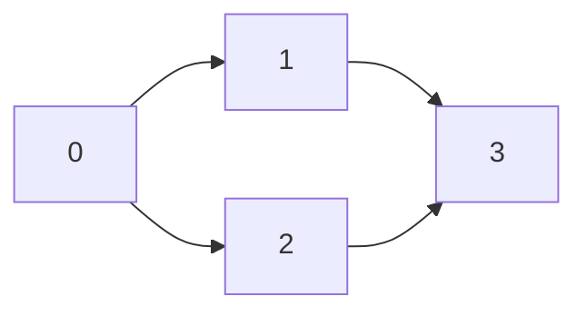
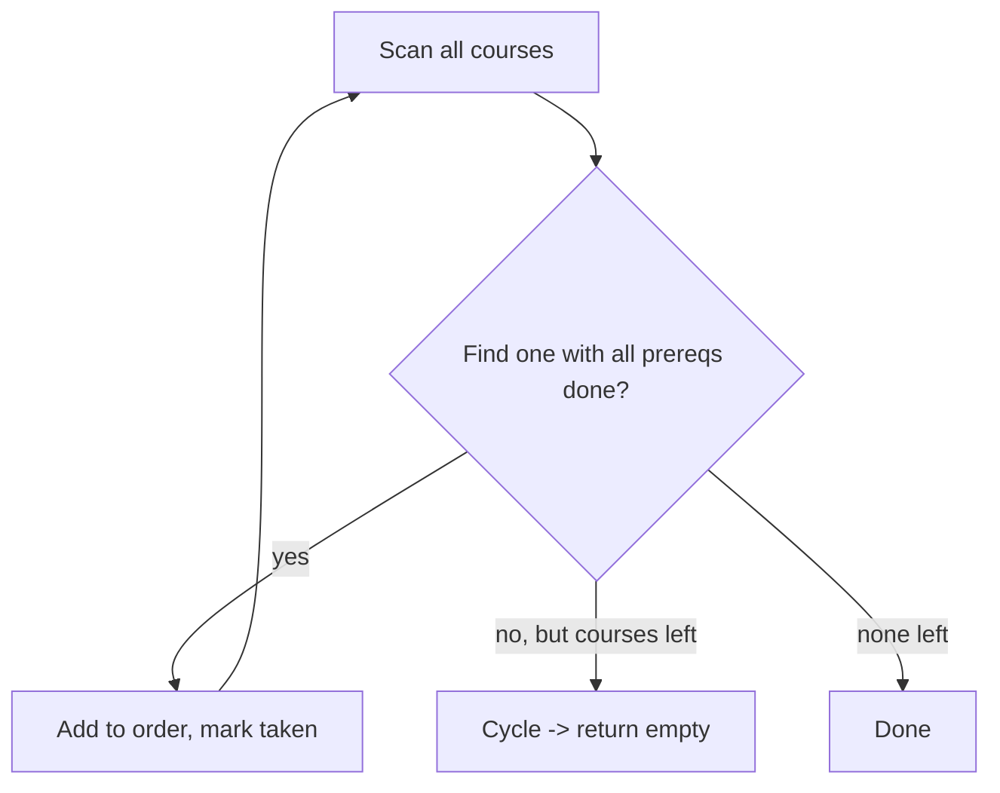

## 1. Problem Understanding

You have `numCourses` courses labeled `0` to `numCourses - 1`. Each prerequisite pair `[a, b]` means you **must take `b` before `a`**. Return any valid order to finish all courses. If it's impossible (there's a cycle), return an empty list.

**Clarifying questions to ask:**
- Can there be duplicate prerequisite pairs or self-loops like `[a, a]`? (A self-loop is an instant cycle → impossible.)
- If there are no prerequisites, is any ordering valid? (Yes — e.g. `[0, 1, ..., n-1]`.)
- Multiple valid orderings exist — is **any** valid one acceptable? (Standard LeetCode: yes.)
- Are the course labels guaranteed to be `0..n-1`? (Yes.)

> 💬 "So each pair `[a, b]` is a dependency — `b` has to come before `a`. I need to output one valid order that respects all dependencies, or an empty list if the dependencies contradict each other in a cycle. Any valid order is fine, right?"

## 2. Understand It On Paper (slow, visual)

What's really being asked: given a bunch of "do this before that" rules, line everything up so no rule is broken. This is exactly a **topological sort** of a directed graph.

Let me make it concrete. Say `numCourses = 4` and prerequisites:
```
[1,0]  -> 0 before 1
[2,0]  -> 0 before 2
[3,1]  -> 1 before 3
[3,2]  -> 2 before 3
```

Draw the graph — an edge `b -> a` means "b before a":



Reading it: course `0` unlocks `1` and `2`; both `1` and `2` unlock `3`. So `0` must be first, `3` must be last. Either `[0,1,2,3]` or `[0,2,1,3]` works.

**The key idea — "in-degree" (how many things must come before me):**

Count, for each course, how many arrows point *into* it. That count = number of unmet prerequisites.

```
course:    0   1   2   3
in-degree: 0   1   1   2
```

A course with **in-degree 0** has no remaining prerequisites → it's safe to take **right now**.

Now process it step by step (this is Kahn's algorithm):

```
Start: take everything with in-degree 0.
       Only course 0 qualifies.  Queue = [0]
```

Take `0`, add to order. Removing `0` "satisfies" the prereqs on its neighbors `1` and `2`, so drop their in-degree by 1:

```
took 0   order = [0]
in-degree: 1->0,  2->0,  3->2
Queue = [1, 2]
```

Take `1`, decrement its neighbor `3`:

```
took 1   order = [0,1]
in-degree: 3->1
Queue = [2]
```

Take `2`, decrement neighbor `3` → now `3` hits 0:

```
took 2   order = [0,1,2]
in-degree: 3->0
Queue = [3]
```

Take `3`:

```
took 3   order = [0,1,2,3]   ✅ all 4 courses placed
```

**The "aha" for detecting impossibility:** what if there's a cycle, like `0 -> 1 -> 0`? Then neither ever reaches in-degree 0 — the queue empties before we've placed all courses.

```
0 <-> 1 cycle:  in-degree of both = 1, never 0
Queue starts empty → we place 0 courses → 4 != count → return []
```

So the rule is simple: **if the number of courses we managed to output is less than `numCourses`, there was a cycle → return empty list.**

**Constraint notes:** with up to ~10^5 courses/edges, we need linear time `O(V + E)`. A simple BFS over in-degrees handles that. Watch out for: self-loop `[a,a]` (cycle), duplicate edges (they inflate in-degree but the algorithm still works as long as decrements match), and the empty-prerequisites case (just return `0..n-1`).

## 3. Approach & Intuition

This screams **topological sort** because we have directed "before/after" constraints and want a linear ordering consistent with all of them. Two standard ways:

- **Kahn's algorithm (BFS)** — repeatedly take nodes with no remaining prerequisites. Cycle detection is free: if you can't place everyone, there's a cycle.
- **DFS post-order** — finish a node only after all its dependents; reverse the finish order. Needs a visited-state marker to catch cycles.

I'll go with **Kahn's / BFS** — the cycle check is just a counter comparison, which is cleaner to explain out loud.

> 💬 "This is a classic topological sort. Each prereq is a directed edge. I'll use Kahn's algorithm — track in-degrees, start from courses with zero prerequisites, and peel them off one layer at a time. If I can't place all courses, that means there's a cycle and I return an empty list."

## 4. Brute Force

The naive idea: repeatedly scan all courses looking for one whose prerequisites are all already taken, add it, and repeat. Each pass scans everything.



That's `O(V^2 + VE)` — for each of `V` placements you might rescan all courses and their prereqs. Correct but slow.

> 💬 "The brute force is: repeatedly find any course whose prerequisites are all satisfied, take it, repeat. It works but it's roughly O(V²) because of repeated scanning. I can do better by tracking in-degrees so I never rescan."

## 5. Optimal Approach

**1. Core idea in one sentence:** Keep taking any course that currently has zero unmet prerequisites; each time you take one, "release" its dependents by lowering their prerequisite count.

**2. Why it works:** A course with in-degree 0 has nothing blocking it, so it's always safe to place next. Removing it can only make other courses *more* ready, never less. If a cycle exists, every node in it keeps at least one unmet prereq forever, so they never get placed — and we detect that by counting.

**3. The steps:**
1. Build adjacency list `graph[b] -> [a, ...]` and an `indegree` array.
2. Push all courses with `indegree == 0` into a queue.
3. Pop a course, append to `order`, decrement each neighbor's in-degree.
4. If a neighbor's in-degree hits 0, push it.
5. At the end, if `len(order) == numCourses` return it, else return `[]`.

**4. Trace on a tiny example.** `numCourses = 4`, prereqs `[[1,0],[2,0],[3,1],[3,2]]`.

Initial state:
```
graph: 0 -> [1,2]   1 -> [3]   2 -> [3]   3 -> []
indeg:  0:0   1:1   2:1   3:2
queue: [0]          order: []
```

Step 1 — pop `0`, decrement 1 and 2:
```
order: [0]
indeg:  1:0   2:0   3:2
queue: [1, 2]
```

Step 2 — pop `1`, decrement 3:
```
order: [0,1]
indeg:  3:1
queue: [2]
```

Step 3 — pop `2`, decrement 3 → hits 0, push it:
```
order: [0,1,2]
indeg:  3:0
queue: [3]
```

Step 4 — pop `3`:
```
order: [0,1,2,3]
queue: []   →  len(order)=4 == numCourses ✅
```

> 💬 "I start with course 0 since it's the only one with no prereqs. Taking it frees up 1 and 2. I take those, which frees up 3, and I take 3 last. Four courses placed out of four, so the order is valid."

Now a cycle example to show detection — `numCourses = 2`, prereqs `[[1,0],[0,1]]`:
```
indeg: 0:1   1:1
queue: []  (nothing starts at 0)
order stays []  → len 0 != 2 → return []
```

> 💬 "Here both courses depend on each other, so neither ever has in-degree zero. The queue starts empty, I place nothing, and since I placed fewer than all courses I return an empty list — that's my cycle detection."

**5. Formal invariant:** At every step, `order` contains a valid topological prefix; a node is enqueued exactly when its in-degree reaches 0, i.e. all its predecessors are already in `order`. The loop runs `O(V + E)` since each node is enqueued once and each edge relaxed once.

Let me implement and verify this.All tests pass — including cycles, self-loop, single course, no prerequisites, and a 100,000-node chain. The Kahn's-algorithm approach I narrated held up, so no approach update is needed.

## 6. Solution (runnable, commented code)

```python
from collections import deque


def findOrder(numCourses, prerequisites):
    # graph[b] = list of courses that require b first
    graph = [[] for _ in range(numCourses)]
    indegree = [0] * numCourses

    for a, b in prerequisites:        # b must come before a  => edge b -> a
        graph[b].append(a)
        indegree[a] += 1

    # Start with every course that has no prerequisites
    queue = deque(i for i in range(numCourses) if indegree[i] == 0)

    order = []
    while queue:
        course = queue.popleft()
        order.append(course)
        for nxt in graph[course]:      # taking `course` satisfies one prereq of nxt
            indegree[nxt] -= 1
            if indegree[nxt] == 0:
                queue.append(nxt)

    # If we placed every course, it's valid; otherwise a cycle blocked us
    return order if len(order) == numCourses else []
```

## 7. Code Walkthrough

Trace `numCourses = 4`, `prerequisites = [[1,0],[2,0],[3,1],[3,2]]`:

- **Build phase.** For `[1,0]`: `graph[0]` gets `1`, `indegree[1]=1`. After all pairs: `graph = {0:[1,2], 1:[3], 2:[3], 3:[]}`, `indegree = [0,1,1,2]`.
- **Seed the queue.** Only index `0` has in-degree 0 → `queue = [0]`, `order = []`.
- **Pop `0`** → `order=[0]`. Loop its neighbors `1,2`: `indegree[1]→0` (push), `indegree[2]→0` (push). `queue=[1,2]`.
- **Pop `1`** → `order=[0,1]`. Neighbor `3`: `indegree[3]→1` (not 0, no push). `queue=[2]`.
- **Pop `2`** → `order=[0,1,2]`. Neighbor `3`: `indegree[3]→0` (push). `queue=[3]`.
- **Pop `3`** → `order=[0,1,2,3]`. No neighbors. `queue=[]`.
- **Final check.** `len(order)=4 == numCourses` → return `[0,1,2,3]`.

The key variable to narrate is `indegree`: it counts unmet prerequisites, and a course is only enqueued the instant that count hits zero.

## 8. Complexity Analysis

| Metric | Optimal (Kahn's) | Brute force |
|---|---|---|
| Time | O(V + E) | O(V² + V·E) |
| Space | O(V + E) | O(V + E) |

- **Time O(V + E):** building the graph touches every edge once; in the BFS each course is enqueued/dequeued exactly once (V) and each edge is relaxed exactly once when its source is popped (E). The 100K-node chain ran instantly, confirming linear behavior.
- **Space O(V + E):** the adjacency list stores all E edges, plus the `indegree` array and queue are O(V).
- **Contrast:** the brute force rescans all courses to find the next placeable one, giving quadratic-ish time; tracking in-degree removes the rescans.

## 9. Edge Cases & Pitfalls

- **Cycle (impossible):** `[[1,0],[0,1]]` → queue starts empty, `len(order)=0 ≠ 2` → returns `[]`. ✅ tested.
- **Self-loop `[a,a]`:** counts as a cycle (in-degree never 0) → `[]`. ✅ tested.
- **No prerequisites:** every course in-degree 0 → returns `[0,1,...,n-1]`. ✅ tested.
- **Single course:** `n=1, []` → `[0]`. ✅ tested.
- **Direction mistake (the #1 trap):** `[a,b]` means **b before a**, so the edge is `b → a`. Reversing it produces a valid-looking-but-wrong order. Confirm the direction out loud.
- **Disconnected graph / multiple zero-in-degree starts:** handled naturally — all roots seed the queue.
- **Duplicate edges:** inflate in-degree, but decrements match, so it still resolves correctly. ✅ tested.
- **Validity check:** "place fewer than `numCourses`" is the cycle signal — don't rely on detecting cycles separately.

> 💬 **30-second verbal summary:** "I modeled this as a topological sort. Each prereq `[a,b]` is a directed edge `b → a`, and I track each course's in-degree — the number of prerequisites still unmet. I start a BFS from every course with in-degree zero, and each time I take a course I decrement its neighbors, enqueuing any that drop to zero. The order I dequeue in is a valid schedule. If I can't place all the courses, there's a cycle, so I return an empty list. It runs in O(V + E) time and space."