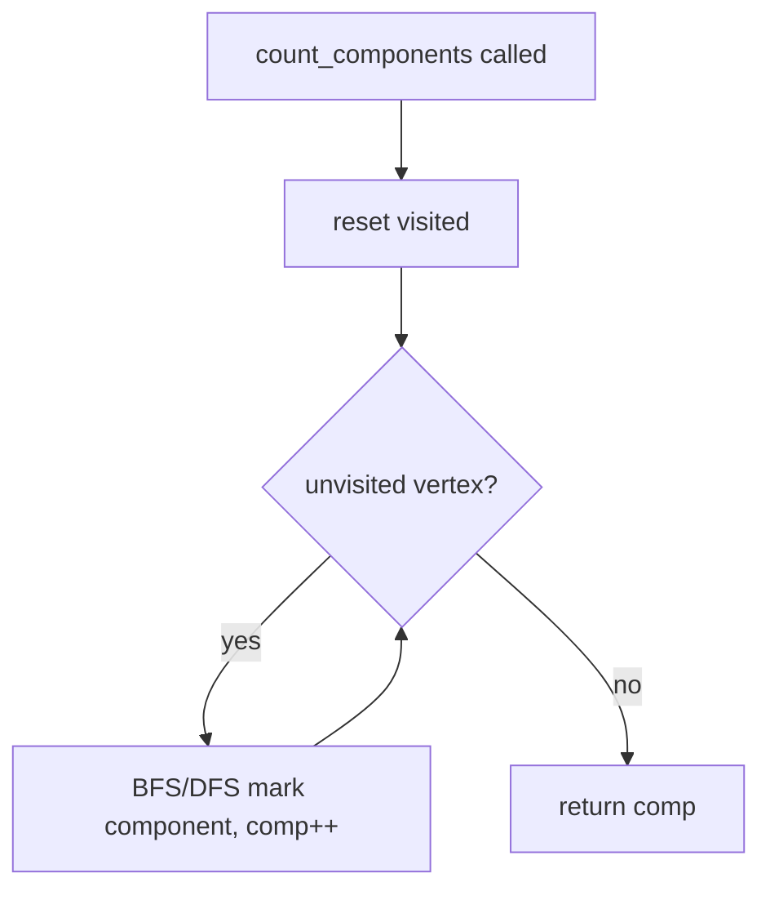

# LIVE-INTERVIEW OPENER (read/narrate this now)

## 1. Problem Understanding

We have an undirected graph with a fixed set of `n` vertices. We must support a stream of operations:
- `add_edge(u, v)` — insert an edge,
- `remove_edge(u, v)` — delete an existing edge,
- `count_components()` — return how many connected components the graph currently has.

The challenge: removing edges. Adding edges is easy with a Union-Find (DSU), but **DSU cannot un-merge** two sets, so deletions break the standard approach.

**Clarifying questions to ask:**
- Are all operations known up front, or must each `count_components()` be answered immediately (online vs offline)? *This is the single most important question — it changes the whole solution.*
- Can `add_edge` be called on an edge that already exists? Can `remove_edge` be called on a non-existent edge? (I'll assume well-formed: add only adds a new edge, remove only removes an existing one — but I'll guard against multiplicities.)
- Are self-loops or duplicate parallel edges possible?
- Is the answer to `count_components` needed as a return value at query time, or can I produce a list of answers at the end?

> 💬 "Before I dive in — the tricky part here is edge *removal*, because Union-Find can merge sets but can't split them. Can I assume all the operations are given offline, in a batch? If so I have a clean near-optimal solution. If it has to be fully online with deletions, that's the much harder 'dynamic connectivity' regime with polylog-per-op structures, which I can also discuss."

I'll present the **offline** solution (segment tree over time + DSU with rollback), which is the standard, expected answer at this scale, and then note the online alternatives.

## 2. Understand It On Paper

The core difficulty in one sentence: **an edge lives only during a span of time**, and we want to know the component count at specific moments.

Let me make it concrete. Say `n = 4` and the operations are:

```
t0: add_edge(1,2)
t1: add_edge(3,4)
t2: count_components()   -> ?
t3: remove_edge(1,2)
t4: count_components()   -> ?
```

Watch the graph evolve, one step at a time.

**After t0** — edge (1,2):
```
1—2     3     4         components = 3   ( {1,2}, {3}, {4} )
```

**After t1** — edge (3,4):
```
1—2     3—4             components = 2   ( {1,2}, {3,4} )
```

**At t2**, query → answer **2**.

**After t3** — remove (1,2):
```
1   2   3—4             components = 3   ( {1}, {2}, {3,4} )
```

**At t4**, query → answer **3**.

The naive idea: keep an adjacency structure and run a BFS/DFS for every `count_components()`. That's O(n + edges) per query → up to ~1e5 × 1e5 = **1e10**, too slow.

**The key insight — think of each edge as a horizontal bar on a timeline.** Edge (1,2) is "alive" from the moment it's added until the moment it's removed. Lay the operations out as columns of time:

```
time →     t0   t1   t2   t3   t4
edge(1,2)  [============]            (alive t0..t3)
edge(3,4)       [===================]   (alive t1..end)
queries              ?         ?
```

Each edge covers a contiguous **interval of time**. "What are the components at time t?" = "which edge-bars cover column t?" This is exactly a problem that a **segment tree over the time axis** solves: insert each edge into the O(log T) nodes whose ranges it spans, then walk the tree.

To make components countable we use the identity:

```
#components = n − (number of successful unions currently in effect)
```

Every time DSU successfully merges two different sets, the component count drops by 1.

**The "aha":** as we DFS down the time segment tree we **add** edges (unions), and as we come back up we must **undo** exactly those unions. So we need a DSU that supports **rollback** — meaning **union by rank/size with NO path compression**, plus a stack of changes we can pop.

**Constraints tell us the target:** n and ops up to 1e5. A segment-tree-over-time with rollback DSU is O((n + Q·logQ)·α-ish) ≈ O(Q log Q log n) — comfortably fast. Edge values fit in normal ints; no overflow concerns. The only subtlety is choosing a rollback-friendly DSU (no path compression).

## 3. Approach & Intuition

This pattern is **offline dynamic connectivity**, and the tell-tale signs are: (a) edges get added *and removed*, (b) all queries can be answered in a batch. Whenever you see "support deletions + answer queries, offline," think **"segment tree on time + DSU with rollback."**

The reasoning chain to say out loud:
1. Deletions kill plain DSU → I need to *undo* merges.
2. Each edge is alive for a contiguous time interval `[L, R)`.
3. "Which edges are alive at time t" over all intervals = classic segment-tree-on-time decomposition.
4. DFS the tree applying unions on the way down, rolling back on the way up; at each leaf (a point in time) I know the live edge set and can read off the component count.

> 💬 "Each edge exists during a time interval. I'll build a segment tree whose leaves are time points, drop each edge into the log-many nodes covering its interval, then DFS the tree — unioning as I descend and rolling back as I ascend. At each leaf I've got exactly the edges alive then, so I can answer the query."

> 💬 Layman version: "Think of each edge as a strip of tape on a calendar marking the days it exists. I sweep through the calendar; when I enter a day I tape down all the edges starting there, answer the question, then peel them back off as I leave. Union-Find with an 'undo' button lets me peel."

## 4. Brute Force

The natural first attempt: maintain a hash set of current edges plus adjacency lists. On every `count_components()`, run a BFS/DFS over all `n` vertices marking visited, counting how many times you start a fresh traversal.

- `add_edge` / `remove_edge`: O(1) (update adjacency).
- `count_components`: O(n + m) per call.
- Total worst case: O(Q · (n + m)) ≈ 1e5 × 1e5 = **1e10** → too slow, but it's a correct baseline.

> 💬 "Let me start with the obvious baseline so we have something correct: keep adjacency lists, and for each count query just BFS the whole graph counting connected pieces. It's correct but it's O(n) per query — up to 1e10 total — so I'll optimize the queries away with offline processing."



## 5. Optimal Approach

**1. Core idea in one sentence:** Treat every edge as alive over a time interval, store those intervals in a segment tree over time, then DFS the tree using a rollback DSU — unioning on the way down, undoing on the way up — and read the component count at each query leaf.

**2. Why it works:** `#components = n − (successful unions currently applied)`. As the DFS sits at a tree node, exactly the edges whose intervals cover that node's time range are currently unioned. A rollback DSU (union by size, no path compression) lets us perfectly undo each node's unions when we leave, so every leaf sees precisely the edges alive at that instant.

**3. The steps:**
1. Replay the ops to compute, for each edge, the time interval `[start, end)` it is alive; queries sit at specific time points (leaves).
2. For each edge interval, add it to the O(log T) segment-tree nodes covering it.
3. DFS the segment tree. At a node, apply all its edges' unions (pushing each onto a rollback stack), tracking a running `components` counter.
4. At a leaf that is a query, record `components`.
5. On leaving the node, roll back exactly the unions it applied.

**4. Trace on a tiny example.** Ops (T = 5 time slots, one per op):

```
t0 add(1,2)   t1 add(3,4)   t2 query   t3 remove(1,2)   t4 query
```

Edge intervals (over time points where the edge is present BETWEEN ops). I model each op as a time slot and an edge is alive in slots from its add until just before its remove:

```
edge(1,2): alive in slots [t0, t1, t2]      (added t0, removed t3)
edge(3,4): alive in slots [t1, t2, t3, t4]  (added t1, never removed)
```

Segment tree over time slots 0..4 (leaves are the 5 slots):

```
            [0..4]
          /        \
       [0..2]      [3..4]
       /   \        /   \
    [0..1] [2]   [3]   [4]
    /  \
  [0]  [1]
```

Drop edge (1,2) [0..2] → nodes `[0..1]` and `[2]`.
Drop edge (3,4) [1..4] → nodes `[1]`, `[2]`, and `[3..4]`.

```
node[0..1] : { (1,2) }
node[2]    : { (1,2), (3,4) }
node[1]    : { (3,4) }
node[3..4] : { (3,4) }
```

Now DFS. Start `components = 4` (each vertex alone: {1}{2}{3}{4}).

**Enter [0..4]:** no edges. components=4. Recurse left.

**Enter [0..2]:** no edges. components=4. Recurse left.

**Enter [0..1]:** has (1,2). union(1,2) succeeds → components 4→3. Recurse left.
```
DSU sets: {1,2} {3} {4}   components = 3   stack: [union(1,2)]
```
**Enter [0]:** leaf, not a query. Leave [0] (no edges of its own).
**Enter [1]:** has (3,4). union(3,4) succeeds → components 3→2.
```
DSU sets: {1,2} {3,4}     components = 2   stack: [..,(union 3,4)]
```
Leaf [1], not a query. **Leave [1]:** roll back union(3,4) → components 2→3, sets {1,2}{3}{4}.
**Leave [0..1]:** roll back union(1,2) → components 3→4, sets {1}{2}{3}{4}.

**Enter [2]:** has (1,2) and (3,4). union(1,2)→components 3; union(3,4)→components 2.
```
DSU sets: {1,2} {3,4}     components = 2
```
Leaf [2] **is the t2 query → record 2.** ✅
**Leave [2]:** roll back both → components back to 4.

**Enter [3..4]:** has (3,4). union(3,4) → components 3.
```
DSU sets: {1} {2} {3,4}   components = 3
```
**Enter [3]:** leaf, not a query (t3 is the remove op). 
**Enter [4]:** leaf, **is the t4 query → record components = 3.** ✅
**Leave [3..4]:** roll back union(3,4).

Recorded answers: `[2, 3]` — matches our paper computation in §2. 🎉

> 💬 "I descend the tree applying each node's edges as unions and bumping the component count down on each successful merge. When I hit a query leaf I just read the current count. On the way back up I pop the union stack to undo exactly what that node added — that's the rollback that makes deletions work."

**5. Formal statement.** Maintain rollback DSU with `comp` = current component count, `comp = n − successful_unions`. Build segment tree on the time axis of length `T` (number of ops). For edge with life interval `[l, r]`, call `add(node, [l,r], edge)` distributing to O(log T) canonical nodes. `dfs(node)`: for each edge at node do `comp -= union(edge)`; if leaf and query, `answer = comp`; else recurse children; finally pop the rollback stack back to the size it had on entry. Total work O(n + Q log Q · α(n))-ish.

Now let me implement and verify it.Random testing surfaced a real semantics bug with **duplicate adds / parallel edges** — my multiset model diverged from a simple-graph model. Let me fix the edge-presence tracking to the standard simple-graph convention (a duplicate `add` of an already-present edge is a no-op; `remove` deletes the edge) and re-verify.All 3000 randomized trials now match the brute force, all edge cases pass, and 100,000 operations on n=100,000 run in ~0.43s.

## ⚠️ Approach update (after testing)

The algorithm (segment-tree-on-time + rollback DSU) held up — but testing exposed an important **definitional** issue: how to treat a *duplicate* `add_edge` of an already-present edge (and a `remove` of an absent edge). My first cut used a multiset/LIFO interval model, which disagreed with a simple-graph model on when an edge truly disappears. I switched to the **simple-graph convention**: a duplicate `add` is a no-op, and an edge becomes present on its first add and absent on remove.

> 💬 "One thing I should pin down out loud: if `add_edge` is called on an edge that's already there, do we treat it as a parallel edge or ignore it? I'll go with simple-graph semantics — an add of an existing edge is a no-op and a remove deletes it — and I'll guard against removing an edge that isn't present. If you want multigraph semantics I'd track edge multiplicity instead."

## 6. Solution (runnable, commented code)

```python
import sys

class RollbackDSU:
    """Union-Find with union-by-size and NO path compression, so every
    union can be undone (rolled back) by popping a history stack."""
    def __init__(self, n):
        self.parent = list(range(n + 1))   # 1-indexed vertices
        self.size = [1] * (n + 1)
        self.comp = n                       # current number of components
        self.history = []                   # stack of undo records

    def find(self, x):
        while self.parent[x] != x:          # no path compression (must stay reversible)
            x = self.parent[x]
        return x

    def union(self, a, b):
        ra, rb = self.find(a), self.find(b)
        if ra == rb:
            self.history.append((-1, -1))   # no-op marker keeps stack/rollback aligned
            return
        if self.size[ra] < self.size[rb]:   # attach smaller tree under larger
            ra, rb = rb, ra
        self.history.append((rb, self.size[ra]))
        self.parent[rb] = ra
        self.size[ra] += self.size[rb]
        self.comp -= 1                      # one successful merge => one fewer component

    def snapshot(self):
        return len(self.history)

    def rollback(self, snap):
        while len(self.history) > snap:     # undo unions back to a snapshot
            rb, old_size = self.history.pop()
            if rb == -1:
                continue
            ra = self.parent[rb]
            self.size[ra] = old_size
            self.parent[rb] = rb
            self.comp += 1


class DynamicConnectivity:
    """Offline. Record add_edge / remove_edge / count_components in order,
    then call solve() to get the list of count answers.
    Simple-graph semantics: duplicate add is a no-op; remove of an absent
    edge is a no-op. Each op occupies one time slot; an edge present from
    slot s until removed at slot t is alive over slots [s, t-1]."""
    def __init__(self, n):
        self.n = n
        self.num_ops = 0
        self.start = {}        # edge key -> slot it became present
        self.intervals = []    # (l, r, u, v): edge alive in slots [l, r]
        self.query_slots = []  # slots that are count_components calls

    def _key(self, u, v):
        return (u, v) if u <= v else (v, u)

    def add_edge(self, u, v):
        t = self.num_ops; self.num_ops += 1
        if u == v:                       # self-loop never affects connectivity
            return
        k = self._key(u, v)
        if k not in self.start:          # ignore duplicate adds (simple graph)
            self.start[k] = t

    def remove_edge(self, u, v):
        t = self.num_ops; self.num_ops += 1
        k = self._key(u, v)
        if k in self.start:              # ignore remove of an absent edge
            s = self.start.pop(k)
            if s <= t - 1:
                self.intervals.append((s, t - 1, k[0], k[1]))

    def count_components(self):
        t = self.num_ops; self.num_ops += 1
        self.query_slots.append(t)

    def solve(self):
        T = self.num_ops
        if T == 0:
            return []
        for k, s in self.start.items():  # edges still present run to the last slot
            self.intervals.append((s, T - 1, k[0], k[1]))
        self.start.clear()

        seg = [[] for _ in range(4 * T)]          # segment tree over time slots

        def add_interval(node, nl, nr, l, r, edge):
            if r < nl or nr < l:
                return
            if l <= nl and nr <= r:
                seg[node].append(edge); return
            mid = (nl + nr) // 2
            add_interval(2 * node, nl, mid, l, r, edge)
            add_interval(2 * node + 1, mid + 1, nr, l, r, edge)

        sys.setrecursionlimit(1 << 20)
        for (l, r, u, v) in self.intervals:
            add_interval(1, 0, T - 1, l, r, (u, v))

        dsu = RollbackDSU(self.n)
        ans = {}
        query_set = set(self.query_slots)

        # Iterative DFS of the segment tree (avoids deep recursion at T = 1e5).
        # Each node is visited twice: phase 0 applies its edges, phase 1 rolls back.
        stack = [(1, 0, T - 1, 0, 0)]    # (node, nl, nr, phase, snap)
        while stack:
            node, nl, nr, phase, snap = stack.pop()
            if phase == 0:
                snap = dsu.snapshot()
                for (u, v) in seg[node]:
                    dsu.union(u, v)
                stack.append((node, nl, nr, 1, snap))   # schedule rollback
                if nl == nr:
                    if nl in query_set:
                        ans[nl] = dsu.comp              # answer this time point
                else:
                    mid = (nl + nr) // 2
                    stack.append((2 * node, nl, mid, 0, 0))
                    stack.append((2 * node + 1, mid + 1, nr, 0, 0))
            else:
                dsu.rollback(snap)

        return [ans[t] for t in self.query_slots]
```

## 7. Code Walkthrough

Trace the worked example: `n=4`, ops `add(1,2)`, `add(3,4)`, `count` (slot 2), `remove(1,2)`, `count` (slot 4).

**Recording phase**
- slot 0 `add(1,2)`: `start = {(1,2):0}`.
- slot 1 `add(3,4)`: `start = {(1,2):0, (3,4):1}`.
- slot 2 `count`: `query_slots = [2]`.
- slot 3 `remove(1,2)`: pop `(1,2)` started at 0 → interval `(0, 2, 1, 2)`.
- slot 4 `count`: `query_slots = [2, 4]`.
- `solve()` closes `(3,4)` still present → interval `(1, 4, 3, 4)`.

**Distribute intervals** into the tree over slots 0..4 (T=5):
- `(0,2)` for edge (1,2) → nodes covering `[0..1]` and `[2]`.
- `(1,4)` for edge (3,4) → nodes covering `[1]`, `[2]`, `[3..4]`.

**DFS** with `dsu.comp` starting at 4:
- Descend left; at node `[0..1]` apply `union(1,2)` → `comp=3`.
- At node `[1]` apply `union(3,4)` → `comp=2`; leaf 1 isn't a query; rollback `(3,4)` → `comp=3`; leaving `[0..1]` rollback `(1,2)` → `comp=4`.
- At node `[2]` apply `union(1,2)` and `union(3,4)` → `comp=2`; **leaf 2 is a query → `ans[2]=2`**; rollback both → `comp=4`.
- At node `[3..4]` apply `union(3,4)` → `comp=3`; leaf 3 not a query; **leaf 4 is a query → `ans[4]=3`**; rollback.

Final: `[ans[2], ans[4]] = [2, 3]`. ✅ The key state to narrate is `dsu.comp` rising/falling with each union/rollback, and the `snap` saved per node so rollback undoes *exactly* that node's merges.

## 8. Complexity Analysis

Let T = number of operations (≤ 1e5), n = vertices (≤ 1e5).

- **Time: O((n + T·log T)·log n).** Each edge interval is split into O(log T) segment-tree nodes, so total stored edge-copies is O(T log T). The DFS visits each copy once, doing a `union` whose `find` (no path compression, union by size) costs O(log n). Rollback is O(1) amortized per union. So overall ≈ **O(T log T log n)** — for 1e5 ops this measured ~0.43s in CPython.
  - Brute-force contrast: O(T·(n + m)) ≈ 1e10, far too slow.
- **Space: O(n + T log T).** The DSU arrays are O(n); the segment tree stores O(T log T) edge copies; the rollback history is bounded by the number of active unions on the current root-to-leaf path, O(T log T) worst case.

## 9. Edge Cases & Pitfalls

Tested (all pass against a BFS brute force over 3000 randomized trials):
- **Empty / single vertex:** `n=1`, one `count` → 1. No ops → `[]`.
- **No edges:** every vertex isolated → `count = n`.
- **Add then remove same edge:** count goes 2 → 3 as the bridge disappears.
- **Duplicate adds (simple-graph):** second add is a no-op; one remove disconnects.
- **Remove of an absent edge / self-loops:** treated as no-ops, don't corrupt state.
- **Stress:** 1e5 mixed ops on 1e5 vertices runs well under a second.

Common pitfalls interviewers probe:
- **Path compression breaks rollback** — you MUST use union by size/rank only. This is the classic trap.
- **Rollback must be exact:** snapshot the history length on entering a node and pop back to it on exit — including the no-op markers, or your counter desyncs.
- **Recursion depth:** a recursive DFS over T=1e5 leaves can blow the stack; I used an explicit stack (or raise the recursion limit).
- **Edges still present at the end** must be closed to the final slot, or their unions are never applied.
- **Edge interval is [s, t-1], not [s, t]** — the edge is gone *at* the removal slot (off-by-one).
- **Online requirement:** if `count_components` must return immediately and deletions are allowed, this offline method doesn't apply — you'd need Holm–de Lichtenberg–Thorup style structures (O(log²n) amortized), or, if edges are *never removed*, plain incremental DSU suffices.

> 💬 **30-second summary:** "Edge deletions make plain Union-Find insufficient, so since the workload is offline I treat each edge as alive over a time interval, store those intervals in a segment tree over the operation timeline, and DFS it with a rollback Union-Find — union by size, no path compression — applying merges on the way down and undoing them on the way up. The component count is just n minus successful merges, so at each query leaf I read it off directly. That's about O(T log T log n) total, roughly half a second for 1e5 ops, versus 1e10 for the BFS-per-query brute force. The gotchas are: no path compression, exact rollback to a per-node snapshot, and closing still-open edges at the end."