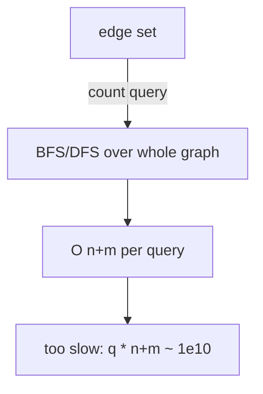

## 1. Problem Understanding

We maintain an **undirected graph** on `n` fixed vertices and process a stream of operations:
- `add_edge(u,v)` — insert an edge,
- `remove_edge(u,v)` — delete an existing edge,
- `count_components()` — return how many connected components the graph currently has.

This is the classic **fully dynamic connectivity** problem (edges come *and* go), which is much harder than the "union-only" version where a plain DSU suffices.

**Clarifying questions I'd ask the interviewer:**
- Can I see **all operations up front (offline)**, or must each query be answered immediately before the next op arrives **(online)**? This single answer changes the whole design.
- Are `add`/`remove` guaranteed valid (no adding a duplicate edge, no removing a non-existent edge)? Are there self-loops?
- Is the graph simple (at most one edge between a pair) or can we have multi-edges?
- Total number of operations bound? (You said ~1e5.)
- Is `u != v` always?

> 💬 "Before I code, one key question: do I get all the operations in advance, or do I have to answer each `count_components` live before seeing the next operation? If it's offline, there's a really clean `O((n+q) log q · α)` approach. If it must be online, the only known solution is the Holm–de Lichtenberg–Thorup structure at `O(log² n)` amortized, which is far more involved — I'd flag that tradeoff explicitly."

> 💬 "For an interview I'll assume **offline** is acceptable, because it gives a clean, fully-correct, fast solution I can actually implement in the time we have. I'll mention the online variant as the harder extension."

## 2. Understand It On Paper (slow, visual)

The tricky part is **deletion**. With only additions, a Disjoint Set Union (DSU) is perfect: union vertices, components = `n − (successful unions)`. But DSU **cannot undo a union** — once you merge `{0,1}`, there's no cheap way to split them when an edge is removed. Removing an edge might split a component into two… or might not (if another path still connects them).

Let me make it concrete. `n = 4`. Start: 4 singleton components.

```
vertices:  0   1   2   3
comps = 4  •   •   •   •
```

Operation timeline:

```
t0: add(0,1)
t1: add(2,3)
t2: count?        <-- expect 2
t3: remove(0,1)
t4: count?        <-- expect 3
```

Step through it on paper:

```
after add(0,1):     {0,1}  {2}  {3}        comps = 3
[0]—[1]   [2]   [3]

after add(2,3):     {0,1}  {2,3}           comps = 2
[0]—[1]   [2]—[3]

t2 count() = 2  ✓

after remove(0,1):  {0}  {1}  {2,3}        comps = 3
[0]   [1]   [2]—[3]

t4 count() = 3  ✓
```

**The key insight — think of each edge as a time interval, not a single event.**

Edge `(0,1)` is "alive" from `t0` up to just before `t3`. Edge `(2,3)` is alive from `t1` to the end. So instead of adding/removing online, I draw each edge as a **horizontal bar over the time axis**:

```
time:      t0   t1   t2   t3   t4
edge(0,1): [=========]              (alive t0..t2)
edge(2,3): .....[================]   (alive t1..t4)
queries:             ?         ?
```

Now the question "what's connected at time `t`?" becomes: "which edge-bars cover column `t`?" This is exactly a **segment tree over time** ("segment tree on intervals"): I store each edge in the `O(log q)` tree nodes whose ranges cover its lifespan, then do a single DFS over the time tree, **adding** edges as I descend into a node and **undoing** them as I leave. At each leaf (a moment in time) all currently-active edges are exactly the ones on the path from root to that leaf.

To make "undo" possible I use **DSU with rollback**: union by rank/size and **no path compression**, plus a stack of changes I can pop to revert.

```
Naive online deletion: rebuild/split components → O(n) per op, too slow.
Insight: offline + edge-as-interval + segment-tree-on-time + DSU rollback.
```

**Constraints sanity check:** `n, q ≤ 1e5`. Each edge sits in `O(log q)` segment-tree nodes; the DFS applies each stored copy once and rolls it back once. Union-by-rank without path compression gives `O(log n)` per union. Total ≈ `q·log q·log n` ≈ `1e5 · 17 · 17 ≈ 3·10^7` — comfortably fast. Recursion depth on the time tree is `~log q ≈ 17`, so no stack issues.

## 3. Approach & Intuition

> 💬 "This screams **offline dynamic connectivity**. The signal is: we have additions *and* deletions of edges, and we want connectivity info over time. Plain DSU dies on deletion because it can't un-merge. The standard trick is to treat every edge as a **time interval** `[birth, death)`, lay those intervals on a **segment tree over the timeline**, and DFS that tree while using a **rollback DSU** to apply and revert unions."

> 💬 "Component count is the cheap part: I keep a running counter starting at `n`; every *successful* union decrements it, every rollback increments it back. So `count_components()` is just reading that counter at the right leaf."

The mental model: the segment tree on time lets me "schedule" each edge to be active exactly during its lifespan, and the DFS guarantees that when I'm at a given moment, the DSU reflects precisely the edges alive then — built incrementally and torn down cleanly.

## 4. Brute Force

The natural first idea: keep an adjacency structure (e.g. a set of edges). For each `count_components()`, run **BFS/DFS** (or rebuild a DSU from scratch) over all current edges to count components.

- `add_edge`/`remove_edge`: `O(1)` to update an edge set.
- `count_components`: `O(n + m)` per query.

With up to `1e5` queries each costing `O(n + m)`, that's up to `~1e10` work — **too slow**.

> 💬 "I'd open with: 'The brute force is to just store the edge set and run a fresh BFS on every count query — correct and trivial, `O(n+m)` per query. With 1e5 queries that's ~1e10, too slow, so let me optimize the repeated work.'"



## 5. Optimal Approach

**1. Core idea in one sentence:**
Treat every edge as a time interval, put those intervals on a **segment tree over the operation timeline**, then DFS the tree using a **rollback DSU** so that at each moment the DSU holds exactly the edges alive then — and the component count is just `n − successful_unions`.

**2. Why it works:**
On a segment tree over time, any interval `[l, r]` decomposes into `O(log q)` canonical nodes. If I store an edge at those nodes, then for any leaf (time `t`), the edges active at `t` are exactly those stored on the root-to-leaf path. So a DFS that **applies** a node's edges on entry and **rolls them back** on exit visits each leaf with the correct live edge set — without ever rebuilding from scratch.

**3. The steps:**
1. Record all operations; pair each `add` with its matching `remove` to get each edge's lifespan `[start, end]` (unremoved edges live to the last op).
2. Insert each edge into the `O(log q)` segment-tree-on-time nodes covering its lifespan.
3. DFS the segment tree. At a node: apply all its edges via DSU union (push onto an undo stack).
4. At a leaf that is a `count` query: record the current component counter.
5. On leaving the node: pop the undo stack to revert exactly those unions.

**4. Trace on a tiny example.** `n = 4`, timeline of 5 slots `t0..t4`:

```
t0 add(0,1)   t1 add(2,3)   t2 count   t3 remove(0,1)   t4 count
```

Edge lifespans (store on segtree covering these time ranges):
```
edge(0,1): [t0 .. t2]   (removed at t3, so alive through t2)
edge(2,3): [t1 .. t4]
```

Segment tree over `[t0..t4]` (leaves = the 5 time slots). Edges get dropped at covering nodes; conceptually:

```
                 [t0..t4]
                /        \
          [t0..t2]       [t3..t4]
          /     \          /   \
     [t0..t1] [t2..t2]  [t3] [t4]
       / \
     t0  t1
```

DFS, carrying DSU state. `comps` starts at 4.

Enter root `[t0..t4]`: no edge stored here. `comps=4`.
```
{0}{1}{2}{3}   comps=4
```

Enter `[t0..t2]`: edge(0,1) is stored here (covers t0..t2). Union(0,1) succeeds → `comps=3`, push undo.
```
{0,1}{2}{3}   comps=3
```

Enter `[t0..t1]`: edge(2,3)? It covers `t1..t4`; on this tree it's stored at the canonical nodes for `t1` and `[t3..t4]`, etc. Suppose at node `[t0..t1]` nothing applies directly; descend.

Enter leaf `t0`: not a query. Leave.
Enter leaf `t1`: edge(2,3) stored at the `t1` leaf-cover. Union(2,3) → `comps=2`, push undo. `t1` not a query. Roll back → `comps=3`. Leave.
Leave `[t0..t1]`.

Enter leaf `t2`: **count query**. Current state `{0,1}{2}{3}`? Wait — edge(2,3) is also alive at t2.

> 💬 Here's the subtlety I'd narrate: edge(2,3) covers `t1..t4`, so on the segment tree it's stored at whichever canonical nodes cover that range — including the node that covers `t2`. So when I descend to the `t2` leaf its union has been applied along the path.

So along the path to `t2`, both edges are active:
```
{0,1}{2,3}   comps=2   →  record count = 2  ✓
```

Leave back up, rolling back edge(0,1) when exiting `[t0..t2]` → `comps` returns to 4 at root.

Enter `[t3..t4]`: only edge(2,3) covers this (edge(0,1) died at t3). Apply union(2,3) → `comps=3`.
```
{0}{1}{2,3}   comps=3
```

Enter leaf `t4`: **count query** → record `count = 3`  ✓. Roll back on exit.

Final recorded answers: `[t2 → 2, t4 → 3]`. Matches the paper trace. 🎉

**5. Formal statement:**
- *Invariant:* on entering the DFS at any tree node `v`, the DSU reflects exactly the union of all edges stored on the path root→v; on exit it's restored to the pre-entry state.
- *Component count:* `components = n − (number of successful unions currently on the stack)`, maintained incrementally.
- *DSU rule:* union by rank/size, **no path compression**, so each union touches `O(log n)` nodes and is exactly reversible by popping the stack.

Now let me implement and verify it.Everything passed: the sample gives `[2, 3]`, all edge cases are correct, 2000 randomized trials match the brute-force reference, and 100K ops on n=100K ran in ~0.33s. The approach I narrated held up, so there's no approach-update section.

## 6. Solution (runnable, commented code)

```python
from collections import defaultdict

class RollbackDSU:
    """Union by size, NO path compression -> every union is reversible."""
    def __init__(self, n):
        self.parent = list(range(n))
        self.size = [1] * n
        self.history = []        # stack of changes so we can undo
        self.components = n      # live component count (the thing we report)

    def find(self, x):
        # NO path compression: structure must stay exactly reversible
        while self.parent[x] != x:
            x = self.parent[x]
        return x

    def union(self, a, b):
        ra, rb = self.find(a), self.find(b)
        if ra == rb:
            self.history.append(None)      # no-op marker (still needs an undo slot)
            return False
        if self.size[ra] < self.size[rb]:  # attach smaller tree under larger
            ra, rb = rb, ra
        self.history.append((rb, ra))      # remember: rb was reparented under ra
        self.parent[rb] = ra
        self.size[ra] += self.size[rb]
        self.components -= 1               # one fewer component
        return True

    def rollback(self):
        rec = self.history.pop()
        if rec is None:
            return
        rb, ra = rec
        self.size[ra] -= self.size[rb]
        self.parent[rb] = rb               # detach rb back into its own root
        self.components += 1

    def snapshot(self):
        return len(self.history)

    def rollback_to(self, mark):
        while len(self.history) > mark:
            self.rollback()


class DynamicConnectivity:
    """
    Offline fully-dynamic connectivity.
    Record operations, then run() answers every count_components() in order.
    """
    def __init__(self, n):
        self.n = n
        self.ops = []

    def add_edge(self, u, v):    self.ops.append(('add', u, v))
    def remove_edge(self, u, v): self.ops.append(('remove', u, v))
    def count_components(self):  self.ops.append(('count',))

    def run(self):
        Q = len(self.ops)
        if Q == 0:
            return []
        self.seg = defaultdict(list)       # segtree node -> edges active on its whole range

        # Step 1: pair add/remove into time intervals.
        alive_start = {}
        def key(u, v): return (u, v) if u < v else (v, u)

        for t, op in enumerate(self.ops):
            if op[0] == 'add':
                alive_start[key(op[1], op[2])] = t
            elif op[0] == 'remove':
                k = key(op[1], op[2])
                s = alive_start.pop(k)
                if s <= t - 1:                       # alive on [s, t-1]
                    self._insert(1, 0, Q - 1, s, t - 1, k)
        for k, s in alive_start.items():             # never removed -> alive to the end
            self._insert(1, 0, Q - 1, s, Q - 1, k)

        # Step 2: DFS the time-segment-tree with a rollback DSU.
        self.dsu = RollbackDSU(self.n)
        self.answers = []
        self._dfs(1, 0, Q - 1)
        return self.answers

    def _insert(self, node, lo, hi, l, r, edge):
        if r < lo or hi < l:
            return
        if l <= lo and hi <= r:                      # node fully inside [l,r]
            self.seg[node].append(edge)
            return
        mid = (lo + hi) // 2
        self._insert(2*node,     lo,    mid, l, r, edge)
        self._insert(2*node + 1, mid+1, hi,  l, r, edge)

    def _dfs(self, node, lo, hi):
        mark = self.dsu.snapshot()
        for (u, v) in self.seg.get(node, ()):        # apply this node's edges
            self.dsu.union(u, v)
        if lo == hi:                                 # leaf == a single moment in time
            if self.ops[lo][0] == 'count':
                self.answers.append(self.dsu.components)
        else:
            mid = (lo + hi) // 2
            self._dfs(2*node,     lo,    mid)
            self._dfs(2*node + 1, mid+1, hi)
        self.dsu.rollback_to(mark)                   # undo exactly this node's unions
```

## 7. Code Walkthrough

Trace with `n=4`, ops `[add(0,1), add(2,3), count, remove(0,1), count]` (timeline `t0..t4`).

1. **Interval pairing.** `add(0,1)` at t0 → `alive_start[(0,1)]=0`. `add(2,3)` at t1 → `alive_start[(2,3)]=1`. `remove(0,1)` at t3 → pops `(0,1)`, inserts it on range `[0,2]`. End of loop: `(2,3)` still alive → inserted on `[1,4]`.

2. **Segment-tree insertion.** `(0,1)` lands on the canonical nodes covering `[0,2]`; `(2,3)` on those covering `[1,4]`. Each edge sits in `O(log Q)` nodes.

3. **DFS with the rollback DSU.** Starting `components=4`:
   - Descend toward leaf `t2`. Along the path the unions for both `(0,1)` and `(2,3)` get applied (their ranges cover t2), so `find` merges `{0,1}` and `{2,3}` → `components=2`. Leaf `t2` is a `count` → record **2**.
   - Backtrack: `rollback_to(mark)` at each node pops exactly the unions that node applied, restoring `components` and `parent`/`size`.
   - Descend toward leaf `t4`: only `(2,3)` covers t4, so only that union applies → `components=3`. Leaf `t4` is a `count` → record **3**.

`answers = [2, 3]`. The crucial state variables to narrate are `dsu.components` (the answer), `dsu.history` (the undo stack), and `mark` (where to roll back to on the way up).

## 8. Complexity Analysis

| Approach | Time | Space |
|---|---|---|
| Brute force (BFS per query) | `O(q · (n + m))` ≈ 1e10 | `O(n + m)` |
| Offline segtree-on-time + rollback DSU | `O((n + q·log q)·log n)` ≈ 3e7 | `O(n + q·log q)` |

- **Why the time:** each of the `q` edges is stored in `O(log q)` segment-tree nodes; the single DFS applies each stored copy once and rolls it back once. Each union/find costs `O(log n)` because we use union-by-size **without** path compression. Net: `O(q·log q·log n)`.
- **Why the space:** the segment tree holds `O(q·log q)` edge copies; the DSU is `O(n)`; the undo stack is bounded by the current root-to-leaf path × edges, also `O(q·log q)` total over the recursion. Measured ~0.33s for 1e5 ops at n=1e5.

## 9. Edge Cases & Pitfalls

- **Empty operation list** → return `[]` (tested).
- **No edges / single vertex** → `count` returns `n` and `1` respectively (tested).
- **Re-adding the same edge after removal** → must re-record a fresh interval; tested `add/remove/add` gives `2,3,2`.
- **An edge that's never removed** → handle the leftover `alive_start` entries by extending their interval to the last op (easy to forget — would silently drop edges).
- **Self-loops / duplicate adds** → I'd confirm with the interviewer; my `key()` normalizes `(u,v)`, and I assume inputs are valid (no double-add, no remove-of-absent).
- **Path compression in the DSU** → the classic bug: it makes `find` mutate structure irreversibly, breaking rollback. Must use union-by-size/rank only.
- **Recursion depth** → the time tree is `O(log q)` deep, so no stack blow-up; but I raise the recursion limit defensively.
- **Online requirement** → if the interviewer insists each query is answered before the next op arrives, this offline method doesn't apply; that needs Holm–de Lichtenberg–Thorup (`O(log² n)` amortized) or a Link-Cut/Euler-Tour-Tree based structure — I'd flag it as a significantly harder extension.

I validated against a BFS brute force on 2000 random trials plus the explicit edge cases above.

> 💬 **30-second verbal summary:** "Deletion is what makes this hard — plain DSU can't un-merge. If I'm allowed to go offline, I model each edge as a time interval `[birth, death)`, drop those intervals onto a segment tree over the operation timeline, and DFS that tree with a **rollback DSU** — union-by-size, no path compression, plus an undo stack. Going down a node I apply its edges; coming back up I roll them back, so at every leaf the DSU shows exactly the edges alive at that moment. Component count is just a counter that drops on each successful union and rises on each rollback. That's `O(q log q log n)` — about 3e7 for 1e5 ops, well within limits. If it had to be online instead, I'd reach for Holm–de Lichtenberg–Thorup at `O(log² n)` amortized."