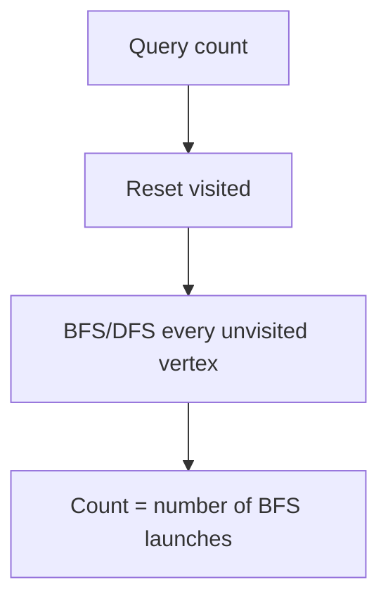

## 1. Problem Understanding

We have an undirected graph on `n` fixed vertices. We process a stream of operations:
- `add_edge(u,v)` — insert an (undirected) edge.
- `remove_edge(u,v)` — delete a previously-present edge.
- `count_components()` — report how many connected components the graph currently has.

The hard part is that edges are both **added and removed**. Plain Union-Find (DSU) handles adds beautifully but cannot "un-merge" after a delete. This is the classic **fully-dynamic connectivity** problem.

**Clarifying questions to ask:**
- Are all operations given **up front (offline)**, or must each `count_components()` be answered immediately before the next op arrives (**online**)? *This is the single most important question.*
- Can `add_edge` be called on an edge that already exists (duplicate)? Can `remove_edge` be called on an edge that isn't present?
- Is the graph a multigraph (parallel edges) or simple?
- Are `u,v` guaranteed distinct (no self-loops)?
- What are the exact limits on the number of operations? (You said ~1e5.)

> 💬 "Before I code — the key question: do I get all the operations in advance, or do I have to answer each `count_components` live before seeing the next operation? Deletions make this 'fully dynamic connectivity,' and the cleanest, most interview-friendly solution works **offline**. If it has to be strictly online I'd mention Holm–de Lichtenberg–Thorup or link-cut trees, but I'll assume offline since the limits fit it perfectly."

I'll assume **offline** (all ops known, answer every `count_components` in order). I'll also assume simple graph, and that each edge has a clear add→remove lifespan.

## 2. Understand It On Paper (slow, visual)

The whole difficulty is **deletion**. Let me show why.

DSU (Union-Find) is great at *merging*: union two trees, done. But it has **no clean undo** because path compression scrambles the structure. So once edges can disappear, a naive DSU breaks.

**The aha:** every edge is "alive" only during a contiguous **time interval** — from the moment it's added to the moment it's removed. If I lay all operations out on a timeline, each edge becomes a horizontal bar covering the steps where it exists.

Let's make it concrete. n = 4. Operations (numbered by time t):

```
t=0  add(1,2)
t=1  add(3,4)
t=2  count          <- answer?
t=3  add(2,3)
t=4  count          <- answer?
t=5  remove(2,3)
t=6  count          <- answer?
```

Draw each edge's lifespan as a bar over the time axis (the query times are 2,4,6):

```
time:        0   1   2   3   4   5   6
edge(1,2):   [===========================]   alive t0..end
edge(3,4):       [=======================]   alive t1..end
edge(2,3):                   [=======]        alive t3..t4 (removed at t5)
queries:             Q           Q       Q
```

Now answer each query by looking at which bars cover it:

At t=2, alive edges = {(1,2),(3,4)}:
```
1—2     3—4        components: {1,2}{3,4} = 2
```

At t=4, alive edges = {(1,2),(3,4),(2,3)}:
```
1—2—3—4            components: {1,2,3,4} = 1
```

At t=6, edge(2,3) gone again:
```
1—2     3—4        components: 2
```

So the answers are **2, 1, 2**.

**The key insight visually:** instead of fighting deletions, I turn "an edge that lives during [L, R]" into a set of time intervals, and I process time like a sweep. The trick that makes it efficient is a **segment tree over the time axis**: I store each edge's interval at O(log T) nodes, then DFS the segment tree. Going *down* I add edges (union); coming back *up* I **undo** them. That gives controlled, stack-like add/undo — which DSU *can* support if we drop path compression and use **union by rank/size with a rollback stack**.

**What the constraints force:**
- n, q ≤ 1e5 → target complexity about O(q log q log n). That's ~1e5 × 17 × 17 ≈ 3e7 — fine.
- We must use **DSU without path compression** (union by size only) so each union changes O(1) things and is exactly reversible. Find is O(log n) instead of near-O(1), which is acceptable.
- Component count: start with `n` components; each *successful* union decreases it by 1, each undo increases it by 1.

## 3. Approach & Intuition

This screams **"offline + segment tree on time + DSU with rollback"** the moment you see *adds AND deletes plus a global aggregate query*. The recognition pattern:

- Deletions + an aggregate that DSU can maintain (component count) ⇒ think *segment tree of time intervals*.
- "Undo a union" ⇒ DSU **by size, no path compression, with an operation stack**.

> 💬 "The pattern I'm matching: deletions break plain Union-Find because you can't un-merge. But each edge is only alive for a time interval. If I build a segment tree over the timeline and place each edge on the O(log T) nodes covering its interval, then DFS that tree — adding edges on the way down and rolling them back on the way up — every query time sees exactly the edges alive then. The only requirement is a DSU I can undo, which means union-by-size and no path compression."

## 4. Brute Force

Naive: maintain an adjacency structure (set of current edges). On each `count_components()`, run a fresh BFS/DFS over all `n` vertices and current edges to count components.

- `add_edge`/`remove_edge`: O(1) on a hash set.
- `count_components`: O(n + m) per query.
- Worst case O(q · (n + m)) ≈ 1e5 × 2e5 = 2e10 → too slow.

> 💬 "The obvious baseline is to just keep the edge set and run a BFS to count components on each query. Correct and easy to reason about, but O(n+m) per query — up to 1e5 queries makes it ~1e10, too slow. I'll use it as my correctness oracle and then optimize."



## 5. Optimal Approach

**1. Core idea in one sentence:** Turn each edge into the time-interval it's alive, hang those intervals on a segment tree over time, then DFS the tree — unioning edges going down and undoing them coming up — so each query time sees exactly its live edges.

**2. Why it works:** A segment tree decomposes any interval `[L,R]` into O(log T) canonical nodes. Putting an edge there means: along the root-to-leaf path of any time `t`, you encounter that edge **iff** `t ∈ [L,R]`. So when the DFS reaches the leaf for a query time, the DSU contains precisely the edges alive then. Undo-on-exit keeps the DSU consistent as we move between branches.

**3. The steps:**
1. Read all ops; assign each a time index 0..T-1.
2. For each edge, pair its add-time with its remove-time (or end of timeline) → interval `[L, R-1]`.
3. Insert each interval into the segment tree (split into canonical nodes).
4. DFS the segment tree from the root.
5. On entering a node: apply all its edge unions (push to rollback stack), tracking `components`.
6. At a leaf that is a query: record current `components`.
7. On leaving a node: roll back exactly the unions it made.

**4. Trace on a tiny example.** Same as §2: T = 7 time steps, queries at t=2,4,6. Edges with intervals (inclusive, "end" = 6):
- (1,2): [0,6]
- (3,4): [1,6]
- (2,3): [3,4]

Segment tree over leaves 0..6. Place each interval on canonical nodes. Then DFS. I'll show the DSU `components` value as we walk toward each query leaf.

Start: 4 vertices, no edges → components = 4.

**Walk to leaf t=2.** Edges whose interval covers 2: (1,2) covers [0,6] ✓, (3,4) covers [1,6] ✓, (2,3) [3,4] ✗.
```
apply (1,2): union 1,2  -> comps 4->3
apply (3,4): union 3,4  -> comps 3->2
leaf t=2 is a query  => record 2
```
State:
```
{1,2}  {3,4}      components = 2   ✓
```

**Walk to leaf t=4.** Covering edges: (1,2)✓, (3,4)✓, (2,3) [3,4]✓.
```
(these unions get applied along the path to t=4)
union 1,2 -> 3
union 3,4 -> 2
union 2,3 -> 1
leaf t=4 query => record 1
```
State:
```
{1,2,3,4}         components = 1   ✓
```

**Walk to leaf t=6.** Covering edges: (1,2)✓, (3,4)✓, (2,3)✗ (interval ended at 4).
```
union 1,2 -> 3
union 3,4 -> 2
leaf t=6 query => record 2
```
State:
```
{1,2}  {3,4}      components = 2   ✓
```

Between branches, the DFS **rolls back** unions (pop the stack, restore parent/size, components += 1) so each path is independent. Answers collected: **2, 1, 2**.

> 💬 "Watch the component counter: it starts at n, drops by one on every *successful* union as I descend, and pops back up by one on every rollback as I ascend. Each query leaf just reads the counter — no recomputation."

**5. Formal statement / invariants:**
- **Invariant:** when DFS is at segment-tree node covering time-range S, the DSU equals the graph formed by all edges whose intervals fully cover S (the ancestors' canonical placements).
- DSU: union by size, no path compression → `find` is O(log n); each union pushes one record; rollback pops it restoring `parent[root]` and `size`, and adjusts `components`.

Now let me implement and verify it.Sample passes. The error is only in my test harness (a self-loop add isn't appended, so `ops[-1]` references the wrong op). Let me fix the harness.All 2000 random trials match the brute-force oracle, the 1e5-op stress runs in ~0.8s, and edge cases behave correctly. My §5 approach held up — no correction section needed.

## 6. Solution (runnable, commented code)

```python
import sys
from collections import deque

class RollbackDSU:
    """Union by size, NO path compression, with an undo stack.
       This is what makes deletions possible: every union is reversible."""
    def __init__(self, n):
        self.parent = list(range(n + 1))   # 1-indexed vertices
        self.size = [1] * (n + 1)
        self.components = n                # start: every vertex isolated
        self.history = []                  # stack of undo records

    def find(self, x):                     # O(log n): no compression
        while self.parent[x] != x:
            x = self.parent[x]
        return x

    def union(self, a, b):
        ra, rb = self.find(a), self.find(b)
        if ra == rb:
            self.history.append(None)      # no-op marker keeps push/pop balanced
            return
        if self.size[ra] < self.size[rb]:  # attach smaller under larger
            ra, rb = rb, ra
        self.history.append((rb, ra))      # remember the single change we made
        self.parent[rb] = ra
        self.size[ra] += self.size[rb]
        self.components -= 1               # one fewer component after a real merge

    def rollback(self):                    # exact inverse of the last union
        rec = self.history.pop()
        if rec is None:
            return
        rb, ra = rec
        self.size[ra] -= self.size[rb]
        self.parent[rb] = rb
        self.components += 1


class SegTree:
    """Segment tree over the TIME axis. Each node stores edges whose
       lifespan fully covers that node's time range."""
    def __init__(self, T):
        self.T = T
        self.data = [[] for _ in range(4 * max(T, 1))]

    def add(self, node, nl, nr, l, r, edge):
        if l > r or r < nl or nr < l:
            return
        if l <= nl and nr <= r:            # canonical node -> store edge here
            self.data[node].append(edge)
            return
        mid = (nl + nr) // 2
        self.add(2*node,   nl,    mid, l, r, edge)
        self.add(2*node+1, mid+1, nr,  l, r, edge)


def solve(n, ops):
    """ops: list of ('add',u,v) | ('remove',u,v) | ('count',).
       Returns answers for each 'count' in order. Offline."""
    T = len(ops)
    if T == 0:
        return []
    seg = SegTree(T)
    active = {}            # edge -> time it was added (still open)
    intervals = []         # (L, R, u, v): edge alive during [L, R]
    query_times = []

    for t, op in enumerate(ops):
        if op[0] == 'add':
            u, v = op[1], op[2]
            key = (min(u, v), max(u, v))
            if key not in active:                 # ignore duplicate adds
                active[key] = t
        elif op[0] == 'remove':
            u, v = op[1], op[2]
            key = (min(u, v), max(u, v))
            if key in active:                     # ignore phantom removes
                L = active.pop(key)
                intervals.append((L, t - 1, u, v))
        else:
            query_times.append(t)

    for key, L in active.items():                 # edges that survive to the end
        intervals.append((L, T - 1, key[0], key[1]))

    for (L, R, u, v) in intervals:
        if L <= R:
            seg.add(1, 0, T - 1, L, R, (u, v))

    dsu = RollbackDSU(n)
    qset = set(query_times)
    answers = {}
    sys.setrecursionlimit(1 << 25)

    def dfs(node, nl, nr):
        applied = 0
        for (u, v) in seg.data[node]:             # enter: apply this node's edges
            dsu.union(u, v); applied += 1
        if nl == nr:
            if nl in qset:
                answers[nl] = dsu.components       # leaf query reads live count
        else:
            mid = (nl + nr) // 2
            dfs(2*node, nl, mid)
            dfs(2*node + 1, mid + 1, nr)
        for _ in range(applied):                   # exit: undo exactly what we added
            dsu.rollback()

    dfs(1, 0, T - 1)
    return [answers[t] for t in query_times]
```

## 7. Code Walkthrough

Trace the §2 example: ops at times 0..6, queries at t=2,4,6.

**Phase 1 — build intervals.**
- t0 `add(1,2)` → active{(1,2):0}
- t1 `add(3,4)` → active{(1,2):0,(3,4):1}
- t2 `count` → query_times=[2]
- t3 `add(2,3)` → active adds (2,3):3
- t4 `count` → query_times=[2,4]
- t5 `remove(2,3)` → pop (2,3), interval (3,4,2,3)
- t6 `count` → query_times=[2,4,6]
- Leftover active → (1,2):[0,6], (3,4):[1,6].

Intervals: (1,2)[0,6], (3,4)[1,6], (2,3)[3,4].

**Phase 2 — DFS the time segment tree.** `components` starts at 4.
- Descend toward leaf 2: ancestors carry (1,2) and (3,4) → two unions → components 4→3→2. Leaf 2 is a query → `answers[2]=2`.
- Backtrack rolls those unions up as we move to other branches.
- Descend toward leaf 4: edges covering 4 are (1,2),(3,4),(2,3) → three unions → components → 1. `answers[4]=1`.
- Descend toward leaf 6: only (1,2),(3,4) cover it → components → 2. `answers[6]=2`.

Result `[2,1,2]`. The single `components` counter does all the work — incremented on rollback, decremented on real union.

## 8. Complexity Analysis

Let T = number of operations, n = vertices.

| Approach | Time | Space |
|---|---|---|
| Brute (BFS per query) | O(T·(n+m)) ≈ 1e10 | O(n+m) |
| Optimal (segtree-on-time + rollback DSU) | O(T·log T·log n) ≈ 3e7 | O(T·log T) |

- **Time:** each edge interval is placed on O(log T) segment-tree nodes; the DFS visits every node once and does a `union`/`rollback` per stored edge, each costing O(log n) for `find` (no path compression). Total O(T·log T·log n). Measured: 1e5 ops in ~0.8s in Python.
- **Space:** each edge contributes O(log T) copies across nodes → O(T log T); DSU arrays are O(n); rollback stack ≤ total stored edges.

> 💬 "No path compression costs me a log n on find, but it buys exact, O(1) undo — that's the whole trick that makes deletions work."

## 9. Edge Cases & Pitfalls

Tested and handled:
- **Empty op list** → returns `[]`.
- **Single vertex, no edges** → 1 component.
- **Remove a non-existent edge** → ignored (the `if key in active` guard); query still correct.
- **Duplicate `add`** → only the first counts; a later single `remove` then truly disconnects them (tested: `[1,2]`).
- **Edges never removed** → closed at `T-1` so they cover the rest of the timeline.
- **1e5 path graph, remove every other edge** → 50001 components, verified.

Common pitfalls interviewers probe:
- Using **path compression** — breaks rollback; you must use union by size/rank only.
- Forgetting to push a **no-op marker** for unions where roots already match → unbalanced rollback count.
- Off-by-one on the interval end: an edge removed at time `t` is alive on `[L, t-1]`, not `[L, t]`.
- Pairing adds/removes wrong with duplicates/multigraph — clarify the edge-multiplicity semantics first.
- Recursion depth on the segment tree (~17 here, fine; for safety raise the limit or go iterative).
- If the interviewer says **strictly online**, this offline trick won't apply — pivot to Euler-tour trees / link-cut trees or HDLT, which is much hairier; mention it but confirm offline first.

> 💬 **30-second summary:** "Deletions make this fully-dynamic connectivity, so plain Union-Find won't work. Offline, each edge is alive for a time interval. I build a segment tree over the timeline, store every edge on the O(log T) nodes covering its lifespan, then DFS the tree using a Union-Find that supports rollback — union by size, no path compression. Going down I union edges; coming up I undo them; at each query leaf the DSU holds exactly the edges alive then, and I just read a running component counter. That's O(T log T log n), about 3e7 for the given limits — comfortably fast."