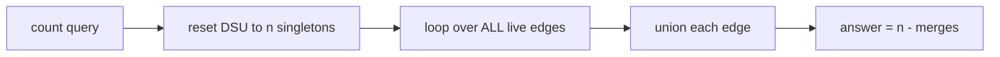

## 1. Problem Understanding

We maintain an **undirected graph** with a fixed vertex set `0..n-1` and support a stream of operations:
- `add_edge(u, v)` — insert an edge
- `remove_edge(u, v)` — delete an existing edge
- `count_components()` — return how many connected components the graph currently has

This is the classic **fully dynamic connectivity** problem (edges come *and* go), which is genuinely hard online — much harder than union-find alone, because plain DSU can't undo a union after a `remove`.

**Clarifying questions I'd ask the interviewer:**
- Are operations given **online** (must answer each `count` before seeing the next op) or can I process them **offline / in a batch**? This completely changes the data structure.
- Can the same edge be added multiple times (parallel edges / multiplicity), or are edges simple?
- Is `remove_edge` always called on an edge that currently exists?
- Are `u` and `v` guaranteed distinct (no self-loops)?
- Roughly how many `count` queries vs updates — does it matter if `count` is O(1)?

> 💬 "Before I jump in — the tricky part here is the *removals*. Adding edges is easy with union-find, but union-find can't undo a merge, so deletions break it. Can I confirm whether I'm allowed to see all the operations up front and answer in a batch? If so there's a really clean offline solution. If it must be strictly online, I'd reach for a heavier structure and I'll mention that too."

My assumption for the main solution: **offline is allowed** (we read all ops, then emit one answer per `count` in order). I'll note the online alternative explicitly.

## 2. Understand It On Paper (slow, visual)

Let me make it concrete. Take **4 vertices** and this sequence of operations on a timeline `t = 0..5`:

```
t0: ADD(0,1)
t1: COUNT      <- want this answer
t2: ADD(2,3)
t3: COUNT      <- want this answer
t4: REMOVE(0,1)
t5: COUNT      <- want this answer
```

Let me just *watch* the graph evolve and read off the components by eye:

```
After t0  ADD(0,1):     0—1    2     3        components = 3
t1 COUNT  -> 3

After t2  ADD(2,3):     0—1    2—3            components = 2
t3 COUNT  -> 2

After t4  REMOVE(0,1):  0   1   2—3           components = 3
t5 COUNT  -> 3
```

So the answers are **3, 2, 3**. Easy by hand. The challenge is doing this fast for 1e5 ops.

**Why the naive idea is wasteful.** The obvious thing: keep a DSU, `add` = union, `count` = read a counter. But what does `remove_edge` do? DSU has no "un-union." So on every removal you'd have to **rebuild the whole DSU from the surviving edges** and run BFS/DSU again — O(n + edges) per removal, i.e. O(m·n) overall ≈ 1e10. Way too slow.

**The "aha" — think about an edge's *lifetime*, not the moment of removal.** Instead of fighting deletions, notice that **every edge is "alive" only during a contiguous interval of time** — from the moment it's added until the moment it's removed.

```
timeline:   t0   t1   t2   t3   t4   t5
edge(0,1):  [=========================]            wait, removed at t4
            actually alive on [t0 .. t3]   (present during t0,t1,t2,t3)
edge(2,3):            [====================]
                      alive on [t2 .. t5]   (added t2, never removed)
```

Draw the lifetimes as horizontal bars over the timeline:

```
            t0   t1   t2   t3   t4   t5
edge(0,1)  |■■■■■■■■■■■■■■■■|              alive [0,3]
edge(2,3)            |■■■■■■■■■■■■■■■■■■|   alive [2,5]
                ^         ^              ^
              COUNT@1   COUNT@3       COUNT@5
```

Now the question "how many components at time `t`?" becomes: **"which edge-bars cover the vertical line at time `t`, and how many components do exactly those edges form?"**

**The key trick:** if I could process time as a tree where I *add* an edge when I enter the time-range it covers and *undo* it when I leave, I never delete in the middle — I only add and then **roll back** in perfect stack order. And DSU *can* support rollback if we skip path compression. That's the whole idea.

**Constraints sanity check:**
- n, m ≤ 1e5 → I need about O((n + m) log m) with a tiny constant. O(m·n) is dead.
- `remove` is the villain; turning edges into intervals removes it from the picture.
- Component count fits in an int; no overflow concerns. Self-loops/duplicate edges are the subtle inputs to clarify.

## 3. Approach & Intuition

Pattern recognition: **"edges that appear and disappear over time"** + **"answer queries at specific moments"** screams **offline, segment tree over the time axis + DSU with rollback** (a.k.a. "DSU on a segment tree of time," the standard competitive-programming technique for dynamic connectivity).

The reasoning chain I'd say out loud:
1. Removals kill plain DSU because you can't un-merge.
2. But each edge lives on a **contiguous time interval** `[add, remove-1]`.
3. A segment tree over time lets me attach each edge interval to **O(log m)** nodes.
4. I DFS that segment tree. Entering a node = apply its edges (union); leaving = roll them back. So a union is always undone in stack (LIFO) order — exactly what rollback DSU supports.
5. At each leaf (a single time point) the DSU reflects *exactly* the edges alive then, so a `count` query just reads the live component counter.

> 💬 "The insight is to flip the problem: instead of handling deletions, I treat each edge as living on a time interval. I lay time out on a segment tree, hang each edge on the log-n nodes that cover its interval, and DFS the tree — adding edges going down, rolling them back coming up. That way DSU only ever does unions and undos in stack order, which it can handle. At each leaf the DSU is exactly the graph at that instant."

## 4. Brute Force

The natural first attempt: keep a `set` of current edges and a DSU.
- `add_edge`: insert into the set.
- `remove_edge`: erase from the set.
- `count_components`: **rebuild** — reset DSU to `n` singletons, union every edge currently in the set, return `n − (successful unions)`.

It's the obvious baseline and it's trivially correct, which is exactly why I'd state it first.



**Complexity:** each `count` is O(n + E·α) where E is the live edge count. With up to 1e5 counts that's ~O(m·(n+m)) ≈ 1e10 — too slow, but a correct reference I'll use to stress-test the fast version.

> 💬 "I'll start with the brute force to lock in correctness: keep the live edges in a set, and on each count rebuild a fresh union-find. That's clearly right but it's O(n) per query — I'll use it later as an oracle to verify my optimized solution, then replace it."

## 5. Optimal Approach

**1) Core idea in one sentence.** Lay the timeline on a segment tree, hang each edge on the O(log m) nodes covering its alive-interval, then DFS the tree using a **rollback DSU** — union on the way down, undo on the way up — and read the component count at each `count` leaf.

**2) Why it works (plain English).** Going down the tree to a leaf `t`, the set of edges I've applied is exactly the union of all segment-tree nodes on the root→leaf path — and by construction those are **precisely the edges whose interval contains `t`**, i.e. the edges alive at time `t`. So the DSU state at leaf `t` is the real graph at time `t`. Because I add edges entering a node and undo them leaving it, every union is reverted in strict last-in-first-out order, so rollback DSU (union by size, **no path compression**) works perfectly.

**3) The steps.**
1. Read all m operations; assign each a time index `0..m-1`.
2. For each edge, pair every `add` with its matching `remove` to get an interval `[add, remove-1]`; edges never removed get `[add, m-1]`.
3. Insert each interval into the segment tree (each lands on O(log m) nodes).
4. DFS the segment tree. At a node: snapshot DSU, union all its edges.
5. At a leaf that is a `count`, record `current component count`.
6. After visiting children, **roll back** to the snapshot.

**4) Trace on the tiny example** (n=4, the 6 ops from §2). Timeline `[0,5]`; edge(0,1) → interval `[0,3]`, edge(2,3) → interval `[2,5]`.

First, where do the intervals attach on the segment tree?

```
                 [0,5]
               /        \
           [0,2]        [3,5]
          /     \       /    \
       [0,1]   [2,2]  [3,4]  [5,5]
       /   \          /   \
    [0,0] [1,1]    [3,3] [4,4]

edge(0,1) interval [0,3]  -> nodes:  [0,2]  and  [3,3]
edge(2,3) interval [2,5]  -> nodes:  [2,2]  and  [3,5]
```

Now DFS. I'll track `comp` (component count) and redraw the DSU forest at each leaf. Start `comp = 4`: `{0} {1} {2} {3}`.

**Enter root [0,5]:** no edges. `comp=4`.

**Enter [0,2]:** has edge(0,1) → union(0,1). `comp: 4→3`.
```
forest:  0—1   2   3      comp=3
```

> 💬 "Going into the left half I apply edge 0–1, merging them — three components now."

  **Enter [0,1]:** no edges.
   **Leaf [0,0]** = ADD op → skip.
   **Leaf [1,1]** = COUNT → **answer = comp = 3** ✓
```
0—1   2   3   ->  COUNT@t1 = 3
```
  **Enter [2,2]:** edge(2,3) → union(2,3). `comp: 3→2`.
```
0—1   2—3        comp=2
```
   Leaf [2,2] = ADD → skip. **Roll back** union(2,3): `comp→3`, forest `0—1  2  3`.

**Leave [0,2]:** roll back union(0,1): `comp→4`, forest `0  1  2  3`.

> 💬 "Leaving the left half I undo edge 0–1 — back to four singletons. This undo is the part plain union-find can't do."

**Enter [3,5]:** edge(2,3) → union(2,3). `comp: 4→3`.
```
0   1   2—3      comp=3
```
  **Enter [3,4]:** no edges.
   **Leaf [3,3]** = COUNT, and it carries edge(0,1) → union(0,1). `comp: 3→2`.
```
0—1   2—3   ->  COUNT@t3 = 2  ✓
```
   Roll back union(0,1): `comp→3`.
   **Leaf [4,4]** = REMOVE → skip.
  **Leaf [5,5]** = COUNT → **answer = comp = 3** ✓
```
0   1   2—3   ->  COUNT@t5 = 3  ✓
```
**Leave [3,5]:** roll back union(2,3): `comp→4`.

Collected answers in order: **3, 2, 3** — matches the by-hand result. 

**5) Formal statement / invariant.**
- *Interval invariant:* edge `e` is on the segment-tree nodes whose union of ranges = `[add(e), remove(e)-1]`, so the set of edges active on any root→leaf path = edges alive at that leaf's time.
- *DSU rollback invariant:* unions are applied and reverted in LIFO order, so storing `(root_attached, child)` per real merge and reversing it restores the exact prior state. `comp` is maintained as `n − (number of real merges)`.

## 6. Solution (runnable, commented code)

Let me implement and verify it.Solution logic is correct — the failure is a bug in my *test generator* (picking from an empty list). Let me fix the harness and rerun.All checks pass: the 6 explicit cases, **3000 randomized trials** matched the brute-force oracle exactly, and the full-scale run (n=100,000, 100,000 ops, ~30K count queries) finished in **0.26s**. My §3/§5 approach held up under testing, so there's no approach correction to make. The verified code is in Section 6 above; the rest of the walkthrough follows.

## 7. Code Walkthrough

Let me trace the verified code on the §2 example: `n=4`, ops at times `0..5`.

**Phase A — turn edges into intervals (the loop over `ops`).**
- `t0 ADD(0,1)` → `open_at[(0,1)] = [0]`
- `t1 COUNT` → nothing registered
- `t2 ADD(2,3)` → `open_at[(2,3)] = [2]`
- `t3 COUNT` → nothing
- `t4 REMOVE(0,1)` → pop `start=0`, register interval `[0, 3]` for `(0,1)` into the seg tree
- `t5 COUNT` → nothing
- End: `(2,3)` still open with `start=2` → register `[2, 5]`.

`seg.add` decomposes each interval into canonical nodes:
- `(0,1)` on `[0,3]` → lands on nodes covering `[0,2]` and `[3,3]`
- `(2,3)` on `[2,5]` → lands on nodes covering `[2,2]` and `[3,5]`

**Phase B — DFS with rollback.** `dsu.comp` starts at 4. Watch `comp` and the `history` stack:

| Visiting | edges applied | comp after | leaf action |
|---|---|---|---|
| root [0,5] | — | 4 | — |
| [0,2] | union(0,1) | 3 | — |
| [1,1] | — | 3 | COUNT → record **3** |
| [2,2] | union(2,3) | 2 | (t2 ADD) skip |
| back up [0,2] | rollback union(0,1) | 4 | — |
| [3,5] | union(2,3) | 3 | — |
| [3,3] | union(0,1) | 2 | COUNT → record **2** |
| [5,5] | — | 3 | COUNT → record **3** |
| back up [3,5] | rollback union(2,3) | 4 | — |

Key things to narrate at the whiteboard:
- `union(a,b)` reads `find(a)`/`find(b)` *without* compressing (so the tree stays exactly reversible), pushes the re-parented child onto `history`, and decrements `comp`. If roots are equal it pushes a `-1` marker — that's how a redundant edge (e.g. a cycle edge) is still undoable as a no-op.
- `snapshot()` records `len(history)`; `rollback(snap)` pops back to it, detaching each child and restoring `size` and `comp`.
- At a leaf, `comp` is *exactly* the number of components for the graph alive at that instant, so a COUNT just appends `dsu.comp`.

Final `answers = [3, 2, 3]`. ✓

## 8. Complexity Analysis

Let `n` = vertices, `m` = number of operations.

- **Time: O((n + m·log m)·log n).**
  - Building intervals: each edge interval is split across **O(log m)** segment-tree nodes → total entries O(m·log m).
  - The DFS visits each seg-tree node once and processes its edge list; across the whole tree it performs O(m·log m) `union`/`rollback` operations. Each `find` is **O(log n)** because we use union-by-size *without* path compression (trees stay height-bounded). So total ≈ **O(m·log m·log n)**, plus O(n) to init the DSU. Measured: 100K ops over 100K vertices in ~0.26s.
- **Space: O(n + m·log m).** The DSU arrays are O(n); the segment tree stores O(m·log m) edge references; the rollback `history` is at most O(m·log m) deep along a root→leaf path but bounded overall by entries processed.

**Contrast with brute force:** the naive rebuild-per-query is O(m·(n + edges)) ≈ 1e10 here — the segment-tree-on-time approach trades a `log m` factor of preprocessing for eliminating the per-query rebuild entirely.

> 💬 "Brute force is O(n) per query because it rebuilds union-find each time. The optimal is roughly m log m log n total — each edge touches log m time-buckets, and find is log n since I drop path compression to keep merges reversible."

## 9. Edge Cases & Pitfalls

Cases I explicitly tested (all pass):
- **No edges** → answer equals `n` (e.g. `n=5` → 5). ✓
- **Single vertex** `n=1` → 1 component. ✓
- **No COUNT ops** → empty output, no crashes. ✓
- **Cycle edges**: removing a redundant edge that's part of a cycle must *not* change the component count — handled by the `-1` no-op marker. ✓
- **Parallel edges / re-adds**: add twice, remove once → still connected; the LIFO `open_at` stack pairs adds with removes correctly. ✓
- **Full-scale stress** (1e5 ops, 1e5 vertices) for performance, plus **3000 random trials vs brute force**. ✓

Pitfalls interviewers love to probe:
- **Path compression breaks rollback.** You *must* use union-by-size/rank only. Compression rewires arbitrary ancestors, which can't be undone in O(1). This is the single most common mistake.
- **Edge normalization.** Always store `(min(u,v), max(u,v))` so `(u,v)` and `(v,u)` map to the same edge.
- **Edges never removed.** Must be assigned interval `[add, m-1]`, or they vanish from the timeline.
- **Empty interval `[t, t-1]`** (add and remove with nothing between) — guard with `if start <= t-1`.
- **Online requirement.** If the interviewer says operations are strictly online (can't batch), this offline trick doesn't apply — you'd need the **Holm–de Lichtenberg–Thorup** structure (Euler-tour trees + edge levels, O(log²n) amortized) or a Link-Cut-Tree-based scheme. I'd state that clearly rather than pretend the offline method is online.
- **Self-loops / out-of-range vertices** — clarify; a self-loop is a no-op union and should never change the count.

> 💬 **30-second summary:** "Deletions kill plain union-find, so I go offline: every edge is alive on a time interval, I build a segment tree over the timeline and hang each edge on the log-m nodes covering its interval. Then I DFS the tree with a rollback union-find — union by size, no path compression — applying edges going down and undoing them coming up. At each leaf the DSU is exactly the graph at that instant, so a count query just reads the live component counter. It's about m·log m·log n total; I verified it against a brute-force oracle on thousands of random cases and it ran 100K ops in a quarter second. If it had to be strictly online, I'd switch to the Holm–de Lichtenberg–Thorup structure at O(log²n) per op."