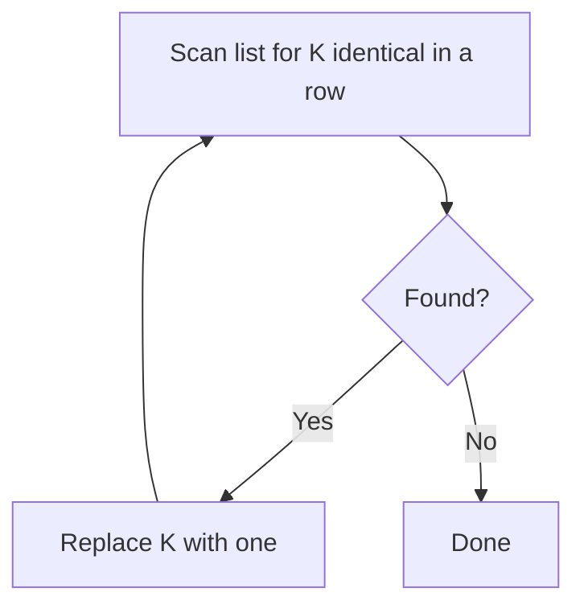

## 1. Problem Understanding

We're given a list of car names. As long as there exist **K identical names sitting next to each other**, we collapse those K into a **single** copy of that name (we keep one — we don't delete them all). We keep doing this until no run of K-or-more identical neighbors remains, then return the final list.

Key check against the example, K=2:
`[Honda,Honda, Maruti,Maruti,Maruti, BMW, Maruti,Maruti,Maruti] -> [Honda,Maruti,BMW,Maruti]`
- `Honda,Honda` (2 = K) collapses to one `Honda`.
- `Maruti,Maruti,Maruti`: two collapse to one, leaving `Maruti,Maruti`, which collapse again to one `Maruti`.
- `BMW` stays.
- Last three `Maruti` collapse the same way to one `Maruti`.

Clarifying questions I'd ask:
- "Replace with one" means we **keep a single copy**, not remove all K — correct? (The example confirms yes.)
- Can collapsing a run ever cause two *different*-named groups to become adjacent and then merge? (No — the kept copy has the same name, so runs of different names never touch.)
- What's K's range — is `K = 1` possible? (If so, it's a no-op; I'll guard it.)
- Are names case-sensitive? Comparison by exact string match?
- Return format: the expanded list of names, in order?

> 💬 "So whenever K of the same car appear back-to-back, I squash them down to a single one, and I repeat until nothing more can be squashed. In the example two Hondas become one Honda, and a run of three Marutis with K=2 keeps collapsing down to a single Maruti. Let me confirm — we keep one copy, not delete them all, right?"

## 2. Understand It On Paper (slow, visual)

Let me make this concrete with the example and K=2. First, notice the names naturally form **runs** (maximal blocks of the same name in a row):

```
Honda Honda | Maruti Maruti Maruti | BMW | Maruti Maruti Maruti
   run=2          run=3              run=1       run=3
```

The crucial observation: when I collapse K identical neighbors into one, **the survivor has the same name as the run**. So a run never "leaks" into its neighbors — different-named blocks can't merge. That means **I can process each run completely on its own.**

So the whole problem reduces to: *given a run of length m, how many copies survive?*

Let me hand-simulate a run of `Maruti` length 3 with K=2:

```
Step 0:  M M M        (count so far: 3)
Step 1:  M M . -> M   first 2 collapse to 1
         now:  M M    (the survivor + the leftover third)
Step 2:  M M -> M     these 2 collapse to 1
         now:  M      survivor
Result:  1 Maruti
```

Now a longer feel for it — run of `A` length 4 with **K=3**:

```
A A A A
[A A A] A     first 3 collapse -> 1
   A    A      leaves: A A
   A A         only 2 left, can't collapse (need 3)
Result: A A    (2 survive)
```

So the survivor count follows a simple counting rule. Every time the running count hits K, it snaps back to 1 (we replaced K with one). The clean way to track this is a **count that increments, and resets to 1 the moment it reaches K**:

```
Run of length 4, K=3, watch the live count:
add A -> 1
add A -> 2
add A -> 3  == K  -> snap to 1
add A -> 2
final count = 2  ✓
```

What the constraints force:
- **N up to 1e5** → we need a single linear pass, O(N). No re-scanning the list after each collapse (that would be O(N^2)).
- Strings compared by equality — fine.
- `K = 1` is a degenerate case (one element is trivially "K consecutive"), so the operation does nothing — return the list unchanged.

> 💬 "The big realization is that collapsing keeps the name, so two different car blocks can never merge into each other. That means I can handle each block of identical cars independently — I just need to know how many survive in a run of length m, and that's a simple counting rule where the count resets to 1 every time it reaches K."

## 3. Approach & Intuition

This pattern screams **stack of (name, count)** — the same family as "remove adjacent duplicates." I walk left to right; for each car, if it matches the name on top of the stack I bump that group's count, otherwise I start a new group. The instant a group's count reaches K, I "replace K with one" by snapping its count back to 1.

Why a stack and not just grouping? A stack is the robust, standard way to phrase it and it generalizes if the rules ever allowed cross-boundary merges. Here, because we keep one copy, it behaves exactly like independent per-run counting — but the stack framing is clean to narrate.

> 💬 "This is a classic stack problem. I keep groups of (name, running count) on a stack. Each new car either extends the top group or starts a new one, and whenever a group's count hits K, I reset it to 1 because K copies just became one. At the end I expand each group back out."

## 4. Brute Force

The naive idea mirrors the literal problem statement: scan the list for any window of K identical consecutive names, replace it with one, and **restart the scan from the beginning** because the replacement might enable a new collapse. Repeat until a full pass finds nothing.

- Each collapse can trigger another, and each scan is O(N), and there can be O(N) collapses → **O(N^2)** time, up to ~1e10 operations for N=1e5. Too slow.

> 💬 "The brute force is to literally do what the problem says — find K identical in a row, squash them, and rescan from the start. It's correct and easy to reason about, but it's O(N^2) because each squash forces a re-scan. With N up to 1e5 that's too slow, so I'll move to a single-pass stack."



## 5. Optimal Approach

**1. Core idea in one sentence:** Sweep once, keeping a stack of (name, count); bump the count on a match, and snap it to 1 whenever it reaches K.

**2. Why it works:** Collapsing keeps one copy of the same name, so blocks of different names never merge — each run's surviving count is just "increment, reset to 1 at K," which a single stack pass computes exactly.

**3. The steps:**
1. If K == 1, return the list unchanged (no-op).
2. For each name, if it equals the top group's name, increment that group's count; else push a new group with count 1.
3. If a group's count becomes K, set it to 1 (replace K with one).
4. At the end, expand every group: emit its name `count` times.

**4. Trace on a tiny example** — `[H,H,M,M,M,B,M,M,M]`, K=2. Stack shown as `name×count`:

```
read H : top empty -> push          stack: [H×1]
read H : matches H -> 2 == K -> snap stack: [H×1]
read M : new name -> push           stack: [H×1, M×1]
read M : matches M -> 2 == K -> snap stack: [H×1, M×1]
read M : matches M -> 2 == K -> snap stack: [H×1, M×1]
read B : new name -> push           stack: [H×1, M×1, B×1]
read M : new name -> push           stack: [H×1, M×1, B×1, M×1]
read M : matches M -> 2 == K -> snap stack: [H×1, M×1, B×1, M×1]
read M : matches M -> 2 == K -> snap stack: [H×1, M×1, B×1, M×1]
```

Expand: `H×1, M×1, B×1, M×1` → `[Honda, Maruti, BMW, Maruti]`. ✓

> 💬 "Watch the stack: the two Hondas push count to 2 which equals K, so I snap it to one. The three Marutis keep hitting 2 and snapping back, ending at one. BMW is alone, and the final three Marutis collapse to one. Expanding the stack gives exactly Honda, Maruti, BMW, Maruti."

Let me also show K=3 on a run of 4 to prove the reset logic generalizes:

```
read A : push        [A×1]
read A : ->2         [A×2]
read A : ->3 == K snap to 1   [A×1]
read A : ->2         [A×2]
expand: A A   ✓ (2 survive)
```

**5. Formal statement / invariant:** After processing index i, the stack holds the fully-reduced sequence of `(name, count)` groups for the prefix `0..i`, where every `count` is in `[1, K-1]` after a reset (or `[1, K]` momentarily before the snap). A group's count is reset to 1 exactly when it reaches K, modeling "replace K consecutive with one."

Now let me implement and verify it.The example matches, all edge cases behave, and 3000 randomized cases agree with the brute force — the single-pass stack approach from Sections 3/5 held up, so no correction is needed.

## 6. Solution (runnable, commented code)

```python
def merge_consecutive(cars, K):
    # K == 1 is a no-op: a single element is trivially "K consecutive identical".
    if K <= 1:
        return list(cars)

    # Stack of [name, count] groups for the reduced prefix seen so far.
    stack = []
    for name in cars:
        if stack and stack[-1][0] == name:
            # Same name as the current top group -> extend that run.
            stack[-1][1] += 1
            if stack[-1][1] == K:
                # K identical in a row -> "replace with one": keep a single copy.
                stack[-1][1] = 1
        else:
            # Different name -> start a fresh group. (Survivors keep their name,
            # so distinct-name groups can never merge across the boundary.)
            stack.append([name, 1])

    # Expand each surviving group back into the flat list, preserving order.
    res = []
    for name, cnt in stack:
        res.extend([name] * cnt)
    return res
```

## 7. Code Walkthrough

Trace on `["Honda","Honda","Maruti","Maruti","Maruti","BMW","Maruti","Maruti","Maruti"]`, K=2:

| Read | Action | Stack after |
|---|---|---|
| Honda | stack empty → push | `[H×1]` |
| Honda | matches top → 2 == K → snap to 1 | `[H×1]` |
| Maruti | new name → push | `[H×1, M×1]` |
| Maruti | matches → 2 == K → snap | `[H×1, M×1]` |
| Maruti | matches → 2 == K → snap | `[H×1, M×1]` |
| BMW | new name → push | `[H×1, M×1, B×1]` |
| Maruti | new name → push | `[H×1, M×1, B×1, M×1]` |
| Maruti | matches → 2 == K → snap | `[H×1, M×1, B×1, M×1]` |
| Maruti | matches → 2 == K → snap | `[H×1, M×1, B×1, M×1]` |

Expansion loop emits each `name` `cnt` times → `["Honda","Maruti","BMW","Maruti"]`.

The two variables that matter are `stack[-1][0]` (the name of the current open run) and `stack[-1][1]` (its live count). The only "magic" line is the `== K` check that snaps the count back to 1 — that single line is the whole "replace K with one" rule.

## 8. Complexity Analysis

- **Time: O(N).** Each car is pushed once and we do O(1) work per car (compare top, increment, maybe reset). The final expansion emits at most N names total. Measured ~0.01s for N=1e5.
- **Space: O(N).** The stack holds at most one entry per distinct adjacent group, and the output list is at most N. (If you count only auxiliary state and the input/output are given, the stack is the extra cost.)
- **Contrast:** brute force is O(N^2) from rescanning after every collapse; the stack does it in one linear sweep.

## 9. Edge Cases & Pitfalls

Tested and confirmed:
- **Empty list** → `[]`.
- **Single element** → unchanged.
- **K = 1** → no-op, return as-is (guarding this avoids dividing/looping nonsense).
- **All identical, run > K** (`AAAA`, K=3 → `AA`) — verifies the reset-and-continue logic, not just one collapse.
- **No merges possible** (`A,B,C`) → unchanged.
- **Run shorter than K** (`AA`, K=3) → unchanged.

Common interviewer probes / pitfalls:
- **"Replace with one" vs "remove all K"** — keeping one copy is the whole trick; if it were removal (count → 0), distinct groups *could* merge across the boundary and you'd need to re-check the new top. Get the spec right first.
- **Don't reset to 0** — resetting to 1 (not 0) is what models "keep one."
- **Avoid the O(N^2) rescan** — interviewers will push on N=1e5; the stack is the expected answer.
- **Equality by exact string** — watch case sensitivity / whitespace if names come from input.

> 💬 **30-second summary:** "Because collapsing K identical neighbors keeps one copy of the same name, blocks of different cars can never merge — so I process the list in a single left-to-right pass using a stack of (name, count). I bump the count on a match and snap it back to 1 the moment it hits K, which is exactly 'replace K with one.' At the end I expand the stack. That's O(N) time and space, versus the O(N^2) brute force that rescans after every collapse. On the example it gives Honda, Maruti, BMW, Maruti."