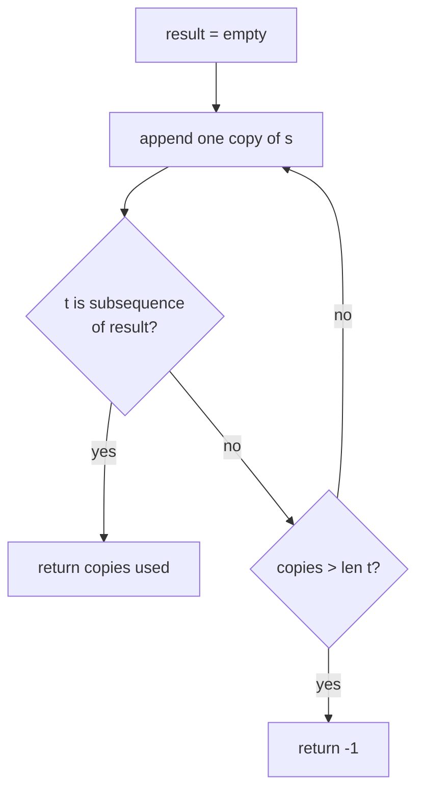

## 1. Problem Understanding

We're given two lowercase strings `s` and `t`. We can build a big string by writing `s` over and over (concatenating it to itself). We want the **minimum number of copies of `s`** so that `t` appears as a **subsequence** (characters in order, not necessarily contiguous) of that repeated string.

- `"boy"` + `"boy"` = `"boyboy"`; `t="oyb"` is a subsequence (o,y from first copy, b from second) → answer **2**.
- `"abc"` repeated → `"abcabc"`; `t="abcbc"` → answer **2**.

**Clarifying questions to ask:**
- If some character in `t` never appears in `s`, what do we return? (Standard: `-1`, since it's impossible.)
- Can `t` be empty? (Then answer is 0 or 1 — confirm.)
- Are both strictly lowercase a–z? Any spaces/unicode?
- Do we need the actual count of appends, or the count of copies? ("Appends" of `s` to itself once gives 2 copies — confirm whether they want copies or append-operations.)

> 💬 "So I'm repeating `s` end-to-end some number of times, and I need the fewest copies so that `t` can be read off as a subsequence — same order, gaps allowed. If a letter in `t` isn't in `s` at all, it's impossible and I'll return -1. Does that match what you intended?"

## 2. Understand It On Paper

The real question: as I scan `t` left to right, I'm "consuming" `s` left to right. Every time I run off the end of `s`, I grab a fresh copy and keep going. Count how many copies I touch.

Let me make it concrete with `s = "boy"`, `t = "oyb"`.

I lay out copies of `s` and walk a pointer through them, matching each letter of `t` in order:

```
t:   o   y   b
                     copy #1            copy #2
s:   b  o  y    |    b  o  y
     0  1  2         0  1  2
```

Step by step — I keep a pointer `i` into the current copy of `s`:

```
Step 0: need 'o'.  scan copy1 from i=0:  b(no) o(YES at idx1)
        ┌───────────┐
        b [o] y          i -> 2,  copies = 1
```

```
Step 1: need 'y'.  scan copy1 from i=2:  y(YES at idx2)
        ┌───────────┐
        b  o [y]         i -> 3 (= end),  copies = 1
```

```
Step 2: need 'b'.  i=3 is past end of copy1 -> take a NEW copy.
        copies becomes 2, reset i=0, scan copy2:  b(YES at idx0)
                            ┌───────────┐
   copy1: b o y  | copy2:  [b] o y       i -> 1,  copies = 2
```

`t` is fully matched. We used **2 copies**. ✅

**The key insight (the "aha"):** matching a subsequence is *greedy and one-directional*. You never benefit from skipping a usable match — taking the earliest possible position for each letter of `t` is always optimal. So you just sweep through `s`, and whenever you hit the end, you've "spent" one full copy and start the next. No backtracking, no DP needed.

Why the naive idea is wasteful: you could literally build `s` repeated up to `len(t)` times and run a subsequence check — but that's a lot of wasted string-building. The observation is that you only need to track *one pointer* and a *copy counter*.

**Constraints check:** lengths up to 1000. Worst case each char of `t` consumes most of an `s` scan → about `len(s) x len(t)` ≈ 1,000,000 operations, trivially fast. The answer can be at most `len(t)` copies (each copy contributes at least one matched char). Watch the impossible case: if any letter of `t` isn't in `s`, return -1 — check this up front with a set.

## 3. Approach & Intuition

This is a classic **greedy two-pointer / subsequence-matching** pattern. The tell: "is X a subsequence of Y" almost always means *one pointer walks Y, advancing a pointer in X on each match*. Here Y is unbounded (repeats of `s`), so instead of materializing Y, I wrap the pointer around `s` and count wraps.

> 💬 "This is a subsequence-matching problem, so my instinct is a greedy two-pointer scan. I walk a pointer through `s`; every time I match a character of `t` I advance. When my `s` pointer falls off the end, that means I've used up one copy of `s`, so I bump a copy counter and restart the pointer at 0. Greedy works because for subsequences, taking the earliest match is never worse."

## 4. Brute Force

Natural first idea: keep appending copies of `s` until `t` is a subsequence of the built string, checking after each append.

- Build `result = ""`. Loop: `result += s`, then test `isSubsequence(t, result)`. Stop when true; cap the loop at `len(t)` appends, else return -1.
- The subsequence test itself is a two-pointer scan, O(len(result)).

Cost: you may rebuild/re-scan strings of growing length — up to O(len(t) x len(s) x len(t)) in the clumsy version, and you waste memory holding a big concatenation.

> 💬 "I'll start with a brute force to get a baseline: keep gluing on another copy of `s` and re-check if `t` is a subsequence, stopping when it fits or after `len(t)` tries. It works, but it rebuilds and rescans a long string repeatedly, so I'll optimize by never materializing the big string."



## 5. Optimal Approach

**1. Core idea in one sentence:** Sweep a single pointer through `s` to match `t` greedily; every time the pointer wraps past the end of `s`, count one more copy.

**2. Why it works:** For subsequence matching, grabbing the *earliest* available position for each character of `t` always leaves you the most room afterward — greedy is provably optimal, so one left-to-right pass with wrap-around gives the minimum copies.

**3. The steps:**
1. If any character of `t` is not in `s`, return -1.
2. Set `copies = 1`, `i = 0` (pointer into current copy of `s`).
3. For each character `c` in `t`: advance `i` until `s[i] == c`.
4. If `i` reaches `len(s)` before finding `c`, do `copies += 1`, reset `i = 0`, then keep searching.
5. After matching `c`, move `i += 1`. When `t` is done, return `copies`.

**4. Trace on a tiny example** — `s = "abc"`, `t = "abcbc"`:

```
state: copies=1, i=0
t to match:  a b c b c
```

```
need 'a': s[0]='a' match.   i -> 1
copies=1   s: [a] b  c
                    i=1
```

```
need 'b': s[1]='b' match.   i -> 2
copies=1   s:  a [b] c
                       i=2
```

```
need 'c': s[2]='c' match.   i -> 3  (= end)
copies=1   s:  a  b [c]
                          i=3 (past end)
```

```
need 'b': i=3 is past end -> new copy.
copies=2, reset i=0, scan: s[0]='a'(no) s[1]='b' match. i -> 2
copies=2   s: a [b] c
```

```
need 'c': s[2]='c' match.  i -> 3
copies=2   s: a  b [c]
```

`t` fully matched → **2 copies**. ✅

> 💬 "Watch the pointer: it walks a-b-c, runs off the end, so I spend a second copy and restart at the front to grab the trailing b-c. Two copies total — and I never built the doubled string, I just counted the wrap."

**5. Formal invariant:** At any moment, `i` is the smallest index in the current copy such that the prefix of `t` processed so far is a subsequence of `(copies-1)` full copies of `s` plus `s[0..i)`. Greedy choice of earliest match preserves minimality of `copies`.

Now let me implement and verify it.All sample cases, edge cases, a 3000-iteration random cross-check against brute force, and the max-size (1000x1000) stress all pass — the greedy approach held up, so no correction needed.

## 6. Solution

```python
def min_appends(s, t):
    # If t needs a character that s doesn't have, it's impossible.
    sset = set(s)
    if any(c not in sset for c in t):
        return -1
    if not t:                      # empty t needs 0 copies
        return 0

    copies = 1
    i = 0                          # pointer into the CURRENT copy of s
    n = len(s)

    for c in t:                    # match each char of t in order, greedily
        # advance within the current copy to find c
        while i < n and s[i] != c:
            i += 1
        if i == n:                 # fell off the end -> start a fresh copy
            copies += 1
            i = 0
            while i < n and s[i] != c:
                i += 1
        i += 1                     # consume the matched character

    return copies
```

## 7. Code Walkthrough

Trace with `s = "boy"`, `t = "oyb"`:

| char of t | start i | scan in s | matched at | i after | copies |
|-----------|---------|-----------|------------|---------|--------|
| `o` | 0 | b≠o, o=o | idx 1 | 2 | 1 |
| `y` | 2 | y=y | idx 2 | 3 | 1 |
| `b` | 3 | i==n → new copy, reset i=0, b=b | idx 0 | 1 | 2 |

- The first `while` advances `i` past non-matching chars inside the current copy.
- When `i == n` (the `b` case), we've exhausted this copy, so `copies += 1`, reset `i = 0`, and the second `while` finds the char in the fresh copy.
- `i += 1` after each match makes sure the next search starts *after* the consumed character — that's what enforces subsequence order.

Final answer: `copies = 2`. ✅

> 💬 "I keep one pointer into `s`. For each letter of `t` I slide forward to find it; if I hit the end I rack up another copy and restart at the front. The running `copies` counter is my answer."

## 8. Complexity Analysis

- **Time: O(len(s) x len(t))** worst case. For each of the `len(t)` characters we might scan up to `len(s)` positions (when a char sits near the end forcing repeated wraps). The up-front "impossible" check is O(len(t)). At max sizes (1000x1000) this ran in well under a millisecond.
- **Space: O(1)** extra (plus an O(alphabet)=O(26) set for the membership check). We never materialize the repeated string — that's the whole win over brute force, which builds an O(len(t) x len(s)) string and re-scans it.

> 💬 "Linear in the product of the two lengths, constant extra space — and crucially I never build the giant concatenation, I just simulate walking through it."

*(Optional micro-optimization to mention: precompute, for each of the 26 letters, the sorted positions in `s`, then binary-search the next position ≥ i. That gives O(len(t) log len(s)). Overkill for n ≤ 1000, but good to name.)*

## 9. Edge Cases & Pitfalls

- **Char of `t` not in `s`** → return -1. Tested with `("abc","d")`. Easy to forget — without it the loop spins forever.
- **Empty `t`** → 0 copies (tested). Confirm the convention with the interviewer.
- **`t` longer than `s`, heavy repetition** → `("a","aaaa")` gives 4; make sure each match advances `i` so you don't match the same position twice.
- **Reversed order forcing a wrap** → `("ab","ba")` = 2, `("boy","oyb")` = 2. The classic case the wrap logic exists for.
- **All same char / single-char `s`** → handled; `copies` grows one per char.
- **Off-by-one pitfall:** forgetting `i += 1` after a match, which would let a character re-match itself and undercount copies.
- **Don't actually build the repeated string** for large inputs — it's wasteful and unnecessary.

> 💬 **30-second summary:** "Subsequence matching is greedy, so I walk one pointer through `s` to match `t` in order. Each time the pointer runs off the end of `s`, I've consumed a copy, so I bump a counter and restart at the front. I first check that every letter of `t` exists in `s`, else it's impossible and I return -1. It's O(len(s) x len(t)) time, O(1) space, and I never build the repeated string. For `boy`/`oyb` that's 2 copies."