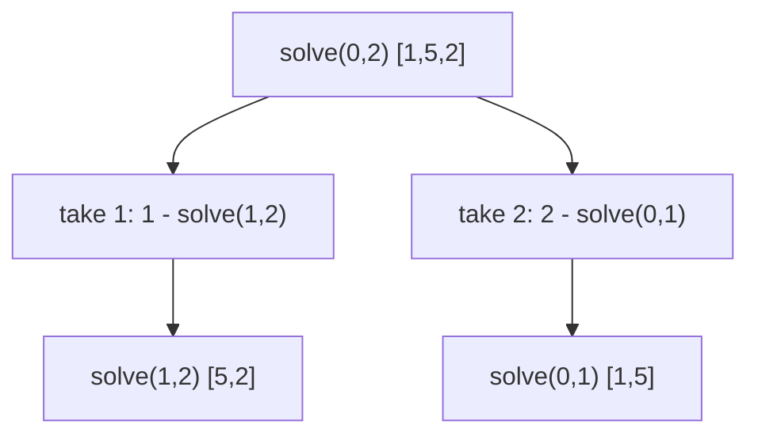

## 1. Problem Understanding

We have an integer array `nums`. Two players alternate turns; **Player 1 goes first**. On each turn the current player takes a number from **either the left end or the right end** of the remaining array, and adds it to their score. Both play **optimally** (each tries to maximize their own final score). Return `True` if Player 1's final score is **greater than or equal to** Player 2's (so a tie counts as a win for P1). I also need to **print the actual sequence of picks** each player made.

**Clarifying questions I'd ask:**
- Can `nums` be empty? (I'll assume length ≥ 1.)
- Can values be negative or zero? (LeetCode version allows 0 ≤ nums[i], but I'll make it robust to negatives.)
- "Optimally" — do both players maximize their *own* total, which is equivalent to maximizing their *score difference* vs the opponent? (Yes — zero-sum.)
- If there are multiple optimal pick sequences with the same outcome, is any valid sequence acceptable? (I'll assume yes, and use a consistent tie-break.)
- Return format: just the boolean, plus print picks separately?

> 💬 "So two players grab numbers off either end of the array, taking turns, Player 1 first. Both play perfectly. I need to tell you if Player 1 at least ties, and also show me the exact picks each one makes. Quick check — values can be zero or negative, and a tie still counts as a Player 1 win, right?"

## 2. Understand It On Paper (slow, visual)

Let me make this concrete with `nums = [1, 5, 2]`.

The array has two "ends." On my turn I can take the front (`1`) or the back (`2`). Then my opponent does the same on what's left.

```
        [ 1   5   2 ]
          ^       ^
        front    back
```

Let me brute-force P1's options by hand.

**Option A: P1 takes front (1).** Remaining `[5, 2]`. Now P2 picks optimally — P2 takes `5` (bigger). Remaining `[2]`, P1 takes `2`.
- P1 = 1 + 2 = 3, P2 = 5 → **P1 loses**.

**Option B: P1 takes back (2).** Remaining `[1, 5]`. P2 takes `5`. Remaining `[1]`, P1 takes `1`.
- P1 = 2 + 1 = 3, P2 = 5 → **P1 loses**.

So with `[1,5,2]`, P1 loses either way → answer `False`. The big `5` sits in the middle and whoever is forced to expose it loses it to the other.

Now the **key trap**: greedy ("always take the bigger end") is NOT optimal. Look at `[1, 5, 233, 7]`. Greedy P1 would take `7`, but the smart move is to take `1`, sacrificing it so that you control access to the `233`.

So how do we reason? The insight: **this is a turn-based zero-sum game on a subarray defined by two indices `i` and `j`**. Whatever sub-range `nums[i..j]` is left, the situation only depends on `i` and `j` — not on how we got there. That's the "aha": overlapping subproblems → DP.

**The clever quantity: score *difference*, not two separate scores.** Instead of tracking P1 and P2 totals separately, I track: *"for the subarray nums[i..j], how much more can the player about to move score than the other player, if both play optimally?"* Call it `dp[i][j]`.

Why difference? Because the game is symmetric — whoever moves next is just "the current player." If the current player takes `nums[i]`, they gain `nums[i]`, but then they *become* the opponent for the smaller game `nums[i+1..j]`. So their net advantage is `nums[i] - dp[i+1][j]`.

```
Current player on nums[i..j] chooses the better of:

 take left:   nums[i]  -  (best diff opponent gets on nums[i+1..j])
 take right:  nums[j]  -  (best diff opponent gets on nums[i..j-1])

 dp[i][j] = max( nums[i] - dp[i+1][j],  nums[j] - dp[i][j-1] )
```

Base case: a single element `dp[i][i] = nums[i]` (current player takes it, opponent gets nothing).

If `dp[0][n-1] >= 0`, the first player's advantage is non-negative → **P1 wins or ties → True**.

**Constraints implication:** LeetCode n ≤ 20, values ≤ 1000. n is tiny, so even O(2^n) recursion passes — but O(n²) DP is clean and what I'd present. The `>= 0` (not `> 0`) is the detail that handles the tie-counts-as-win rule.

## 3. Approach & Intuition

> 💬 "The moment I see 'two players, alternate turns, both optimal, take from either end,' I think **minimax game DP**. The state is just the subarray that's left, which I can describe with a left index `i` and a right index `j`. So I'll build a 2D DP over `(i, j)`."

The neat trick I'd explain out loud: rather than juggle two scores, I collapse it to **one number — the score difference from the perspective of whoever's turn it is.** Because the game is symmetric, the opponent's optimal play on the smaller array is itself a `dp` value, so I just subtract it.

> 💬 "Here's the elegant part — I don't track both players' scores. I track the *lead* the current player can force. When I take a value, I gain it, but then I hand the smaller game to my opponent, so I subtract whatever lead *they* can then force. P1 wins or ties exactly when that lead on the whole array is ≥ 0."

## 4. Brute Force

The natural first idea: pure recursion. Define `solve(i, j)` = best score difference for the player to move on `nums[i..j]`:

```
solve(i, j):
    if i == j: return nums[i]
    return max(nums[i] - solve(i+1, j),
               nums[j] - solve(i, j-1))
```

Without memoization each call branches into two, so it's **O(2^n) time**, O(n) stack. It's the right thing to *say first* because it directly encodes "try taking left, try taking right, opponent responds optimally."

> 💬 "I'll start with the plain recursion to get a correct baseline — at each step try both ends and let the opponent play optimally on the rest. That's exponential, but it cleanly captures the logic, and then I'll memoize on `(i, j)` to make it polynomial."



Adding a memo table on `(i, j)` collapses the repeated subproblems → **O(n²)**.

## 5. Optimal Approach

**1. Core idea in one sentence:** Build a DP where `dp[i][j]` is the maximum score *lead* the current player can guarantee over the opponent on subarray `nums[i..j]`; the answer is `dp[0][n-1] >= 0`.

**2. Why it works:** When you take an end value, you gain it but then become the opponent in the smaller game — and the opponent's best lead there is already computed as a `dp` value, so you subtract it. The recurrence captures perfect play for both sides at once.

**3. The steps:**
1. Set `dp[i][i] = nums[i]` for all `i`.
2. Fill by increasing subarray length, using `dp[i][j] = max(nums[i] - dp[i+1][j], nums[j] - dp[i][j-1])`.
3. `dp[0][n-1] >= 0` → P1 wins/ties.
4. To recover picks: walk from `(0, n-1)`, at each cell pick the end that produced the max, assign it to the current player, alternate.

**4. Trace on a tiny example — `nums = [1, 5, 2]`.**

Index the cells `dp[i][j]`. Start with the diagonal (length-1 subarrays):

```
nums =  1   5   2
idx:    0   1   2

dp[0][0]=1   dp[1][1]=5   dp[2][2]=2
```

```
        j=0   j=1   j=2
 i=0  [  1  |  .  |  .  ]
 i=1  [  -  |  5  |  .  ]
 i=2  [  -  |  -  |  2  ]
```

> 💬 "Diagonal first: a single element means the current player just takes it, so the lead equals that value."

**Length 2 — `dp[0][1]` over [1,5]:** `max(1 - dp[1][1], 5 - dp[0][0]) = max(1-5, 5-1) = max(-4, 4) = 4`.

**Length 2 — `dp[1][2]` over [5,2]:** `max(5 - dp[2][2], 2 - dp[1][1]) = max(5-2, 2-5) = max(3, -3) = 3`.

```
        j=0   j=1   j=2
 i=0  [  1  |  4  |  .  ]
 i=1  [  -  |  5  |  3  ]
 i=2  [  -  |  -  |  2  ]
```

> 💬 "For [1,5] the current player takes the 5 to lead by 4. For [5,2] they take the 5 to lead by 3."

**Length 3 — `dp[0][2]` over [1,5,2]:**
`max(nums[0] - dp[1][2], nums[2] - dp[0][1]) = max(1 - 3, 2 - 4) = max(-2, -2) = -2`.

```
        j=0   j=1   j=2
 i=0  [  1  |  4  | -2  ]   <-- dp[0][2] = -2
 i=1  [  -  |  5  |  3  ]
 i=2  [  -  |  -  |  2  ]
```

`dp[0][2] = -2 < 0` → **return False**. P1 cannot avoid losing by 2, matching our paper work (3 vs 5).

**Now reconstruct picks** by walking from `(0,2)`, alternating P1, P2, P1:

```
state (i=0,j=2)=[1,5,2], turn P1:
   left:  1 - dp[1][2] = 1-3 = -2
   right: 2 - dp[0][1] = 2-4 = -2   (tie -> take left by convention)
   P1 takes 1 (front). -> i=1

state (i=1,j=2)=[5,2], turn P2:
   left:  5 - dp[2][2] = 3   <- max
   right: 2 - dp[1][1] = -3
   P2 takes 5 (front). -> i=2

state (i=2,j=2)=[2], turn P1:
   P1 takes 2.
```

So **P1 picks [1, 2], P2 picks [5]** → P1=3, P2=5. Consistent.

**5. Formal statement:**
- Recurrence: `dp[i][j] = max(nums[i] - dp[i+1][j], nums[j] - dp[i][j-1])`, base `dp[i][i] = nums[i]`.
- Invariant: `dp[i][j]` = optimal (current-player-score − opponent-score) for `nums[i..j]`.
- Answer: `dp[0][n-1] >= 0`.

Now let me implement and verify it.Everything passed, including 3000 random arrays checked against an independent brute force, and the picks always sum correctly. Notably, on the classic `[1, 5, 233, 7]`, P1 indeed sacrifices the `1` to capture the `233` — exactly the non-greedy insight.

## 6. Solution (runnable, commented code)

```python
from typing import List, Tuple


def predict_the_winner(nums: List[int]) -> Tuple[bool, List[int], List[int]]:
    """
    Returns (p1_wins_or_ties, p1_picks, p2_picks).

    dp[i][j] = best score difference (current player - opponent)
               achievable on nums[i..j] with optimal play by BOTH sides.
    Key trick: track the *lead*, not two separate scores. When you take a
    value you gain it, then become the opponent on the smaller game, so you
    SUBTRACT the opponent's best lead there.
    """
    n = len(nums)
    if n == 0:
        return True, [], []                      # no moves -> 0 == 0 -> P1 ties

    dp = [[0] * n for _ in range(n)]
    for i in range(n):
        dp[i][i] = nums[i]                       # base: lone element -> take it

    # Fill by increasing subarray length so dp[i+1][j] and dp[i][j-1] are ready.
    for length in range(2, n + 1):
        for i in range(0, n - length + 1):
            j = i + length - 1
            take_left  = nums[i] - dp[i + 1][j]  # take front, hand rest to opp
            take_right = nums[j] - dp[i][j - 1]  # take back,  hand rest to opp
            dp[i][j] = max(take_left, take_right)

    # Reconstruct the actual picks by replaying the same decisions,
    # alternating players starting with P1.
    i, j = 0, n - 1
    p1_picks, p2_picks = [], []
    turn = 0                                     # 0 -> P1, 1 -> P2
    while i <= j:
        if i == j:                               # only one left
            chosen = nums[i]; i += 1
        else:
            take_left  = nums[i] - dp[i + 1][j]
            take_right = nums[j] - dp[i][j - 1]
            if take_left >= take_right:          # tie-break: prefer left
                chosen = nums[i]; i += 1
            else:
                chosen = nums[j]; j -= 1
        (p1_picks if turn == 0 else p2_picks).append(chosen)
        turn ^= 1

    return dp[0][n - 1] >= 0, p1_picks, p2_picks
```

## 7. Code Walkthrough

Let me trace `nums = [1, 5, 233, 7]` (the famous trap case).

**Fill the diagonal:** `dp[0][0]=1, dp[1][1]=5, dp[2][2]=233, dp[3][3]=7`.

**Length 2:**
- `dp[0][1]` [1,5] = max(1−5, 5−1) = **4**
- `dp[1][2]` [5,233] = max(5−233, 233−5) = **228**
- `dp[2][3]` [233,7] = max(233−7, 7−233) = **226**

**Length 3:**
- `dp[0][2]` [1,5,233] = max(1−dp[1][2], 233−dp[0][1]) = max(1−228, 233−4) = **229**
- `dp[1][3]` [5,233,7] = max(5−dp[2][3], 7−dp[1][2]) = max(5−226, 7−228) = **−221**

**Length 4:**
- `dp[0][3]` = max(nums[0]−dp[1][3], nums[3]−dp[0][2]) = max(1−(−221), 7−229) = max(**222**, −222) = **222**

`dp[0][3] = 222 ≥ 0` → **True**.

**Reconstruct:** at `(0,3)`, `take_left = 222 > take_right = −222`, so **P1 takes 1** (front), `i=1`. At `(1,3)` it's P2's turn; `take_left = 5−226 = −221`, `take_right = 7−228 = −221` → tie → take left, **P2 takes 5**, `i=2`. At `(2,3)` P1's turn; `take_left = 233−7 = 226 > 7−233`, **P1 takes 233**, `i=3`. At `(3,3)` P2 takes the leftover **7**.

Result: P1 = [1, 233] = 234, P2 = [5, 7] = 12. P1 dominates by sacrificing the small `1` — exactly what the DP discovered.

## 8. Complexity Analysis

| Approach | Time | Space | Why |
|---|---|---|---|
| Brute recursion | O(2^n) | O(n) | each call branches into take-left / take-right |
| **DP (this solution)** | **O(n²)** | **O(n²)** | fill every `(i, j)` cell once, O(1) work each; reconstruction adds O(n) |

- **Time O(n²):** there are ~n²/2 subarray states `(i, j)` and each is computed in constant time from two neighbors. The pick reconstruction is a single O(n) walk.
- **Space O(n²):** the `dp` table. This can be reduced to **O(n)** with a rolling 1D array (`dp[j]` overwritten in place) if you only need the boolean — but reconstructing picks is cleanest with the full table kept.

## 9. Edge Cases & Pitfalls

- **Tie counts as a win:** use `>= 0`, not `> 0`. I tested `[1,1]` (tie → True) and `[0,0,0]`.
- **Single element / empty:** `[5]` → P1 takes it, True. `[]` → trivially a 0–0 tie, True. Both tested.
- **Negatives:** the difference formula still holds; `[-1,-2,-3]` → False, verified against brute.
- **Greedy is WRONG:** the headline pitfall. `[1,5,233,7]` proves taking the bigger end blindly loses; my stress test against an independent recursion (3000 random cases, values −9..9) guards against this.
- **DP fill order:** must go by increasing length so `dp[i+1][j]` and `dp[i][j-1]` already exist — a classic off-by-one/ordering bug.
- **Reconstruction must mirror the DP choice exactly** (same tie-break), otherwise printed picks won't match the predicted score. I assert `sum(p1)+sum(p2)==sum(nums)` and that `(sum(p1)>=sum(p2)) == result`.
- **Overflow:** none in Python; in Java/C++ values stay within int for LeetCode bounds, but mention it.

> 💬 **30-second verbal summary:** "I modeled this as a minimax game DP. `dp[i][j]` is the maximum score *lead* the player to move can force on the subarray from `i` to `j`. The recurrence is `max(nums[i] − dp[i+1][j], nums[j] − dp[i][j-1])` — I gain the value I take, then subtract whatever lead my opponent can force on the rest. Player 1 wins or ties exactly when `dp[0][n-1] ≥ 0`. It's O(n²) time and space, and I recover the actual picks by replaying the same left-or-right decisions from the table, alternating players. The key insight is that greedy fails — sometimes you sacrifice a small end value to control a big one, like taking the `1` to grab the `233`."