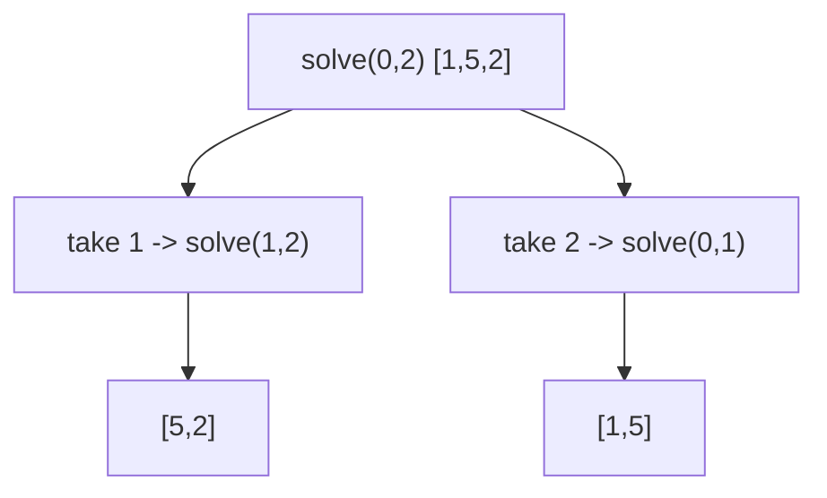

## 1. Problem Understanding

We have an array `nums`. Two players take turns; on each turn a player removes **either the first or the last** element and adds its value to their score. Player 1 goes first, both play **optimally**. Return `True` if Player 1's final score is **≥** Player 2's (win or draw), and also print the sequence of values each player picked.

**Clarifying questions to ask:**
- Can values be negative or zero? (Changes nothing for the DP, but worth confirming.)
- Array size range? (Decides if O(n²) DP is fine — typically n ≤ 20 on LeetCode, but DP scales to ~1000s.)
- "Optimal" means each maximizes *their own final total* (equivalently the score difference), correct?
- If there are multiple optimal pick sequences, is any valid one acceptable?
- Is the array guaranteed non-empty?

> 💬 "So both players are greedy-with-foresight — they don't just grab the bigger end, they pick what leads to the best final outcome assuming the opponent also plays perfectly. I want to return whether P1 ends up at least tied, and also reconstruct who picked what."

## 2. Understand It On Paper

What's really being asked: it's a **turn-based game** where the only freedom is "left end or right end." Both players see the whole future and play perfectly. I need to know if P1 can guarantee not losing.

Let's take `nums = [1, 5, 2]`.

```
indices:  0   1   2
values:  [1   5   2]
          ^L          ^R
```

P1 can take `1` (left) or `2` (right).

The naive trap: "take the bigger end." P1 takes `2`. Then `[1,5]` left for P2, P2 takes `5`, P1 gets `1`. P1 = 2+1 = 3, P2 = 5. **P1 loses!** So greedy is wrong.

The key realization: taking the big number now can *hand* the opponent an even bigger one. You must think about the **difference** between your score and theirs over the remaining subarray.

Let me reframe each subarray as: "If it's MY turn on `nums[i..j]`, what's the best **(my points − opponent points)** I can force?" Call this `dp[i][j]`.

```
Subarray [5] (just index 1):  current player takes 5, opponent gets nothing
   dp = +5
```

For a bigger range, if I take the left value `nums[i]`, I gain `nums[i]`, then my opponent becomes the "current player" on `[i+1..j]` and will force a difference of `dp[i+1][j]` in THEIR favor — so from my perspective I subtract it:

```
take left  -> nums[i] - dp[i+1][j]
take right -> nums[j] - dp[i][j-1]
dp[i][j] = max(those two)
```

The "aha": **flip the sign each turn.** Whatever the opponent can net on the rest counts *against* me. P1 wins-or-draws exactly when `dp[0][n-1] >= 0` (P1's net advantage over P2 is non-negative).

Constraints note: an O(n²) table of size n×n is the target. For n up to a few thousand that's fine; the values can be large/negative, but Python integers don't overflow so no special handling needed.

## 3. Approach & Intuition

This is a classic **minimax / interval DP** problem. The signal: a game on a contiguous range where a choice shrinks the range from one of two ends — that screams "DP over subintervals `[i..j]`."

The clever compression is to track a **single number per interval: the score difference** the player-to-move can force, instead of tracking both players' scores separately. Sign-flipping handles the alternation automatically.

> 💬 "Because the players alternate, I don't need two separate score tables. I track one value per subarray — the net advantage the current mover can guarantee — and I flip its sign on each pick, since my opponent's advantage is my disadvantage. P1 is safe if that net is ≥ 0 on the full array."

## 4. Brute Force

Natural first idea: pure recursion. Define `solve(i, j)` = best score difference for the player to move on `nums[i..j]`:

```
solve(i, j) = max(nums[i] - solve(i+1, j),
                  nums[j] - solve(i, j-1))
```

Without memo, each call branches into two, so it's **O(2^n)** time — exponential, fine to mention as the baseline then immediately optimize.

> 💬 "I'll start with the recursive minimax to establish correctness, then memoize it — that turns it into an O(n²) interval DP."



## 5. Optimal Approach

**1. Core idea in one sentence:** Fill a table `dp[i][j]` = the maximum score *difference* (me minus opponent) the current player can force on `nums[i..j]`, building from short ranges up to the whole array.

**2. Why it works:** Every turn the roles swap, so the opponent's best result on the leftover counts negatively for me — `dp[i][j] = max(nums[i] - dp[i+1][j], nums[j] - dp[i][j-1])`. P1 wins-or-draws iff `dp[0][n-1] >= 0`.

**3. The steps:**
1. Base case: `dp[i][i] = nums[i]`.
2. Fill by increasing interval length.
3. Each cell = max of taking left or right, minus the sub-result.
4. Answer = `dp[0][n-1] >= 0`.
5. **Reconstruct**: replay from `(0, n-1)`, at each step pick whichever end matched the dp choice, alternating which player records it.

**4. Trace on `nums = [1, 5, 2]`:**

Length-1 (diagonal):
```
dp[0][0]=1   dp[1][1]=5   dp[2][2]=2
```

Length-2:
```
dp[0][1] over [1,5]: max(1 - dp[1][1], 5 - dp[0][0]) = max(1-5, 5-1)=4
dp[1][2] over [5,2]: max(5 - dp[2][2], 2 - dp[1][1]) = max(5-2, 2-5)=3
```

Length-3 (full array):
```
dp[0][2] over [1,5,2]:
   take left 1 -> 1 - dp[1][2] = 1 - 3 = -2
   take right 2 -> 2 - dp[0][1] = 2 - 4 = -2
   dp[0][2] = max(-2,-2) = -2
```

Table:

| i\j | 0 | 1 | 2 |
|---|---|---|---|
| 0 | 1 | 4 | -2 |
| 1 | – | 5 | 3 |
| 2 | – | – | 2 |

`dp[0][2] = -2 < 0` → **P1 cannot avoid losing → return False.**

> 💬 "The full-array net is −2, meaning P1 trails P2 by 2 no matter what — so this returns False, and that matches the hand-check where greedy also lost."

**Reconstruction trace** (i=0, j=2, P1's turn): both options tie at −2; say we take left `1` (P1). Now (1,2), P2's turn: `dp[1][2]=3` came from taking left `5` → P2 takes `5`. Now (2,2), P1: takes `2`. So **P1 = [1,2] (total 3), P2 = [5] (total 5)** → P1 loses, consistent.

**5. Formal recurrence:**
```
dp[i][i] = nums[i]
dp[i][j] = max(nums[i] - dp[i+1][j], nums[j] - dp[i][j-1])
answer   = dp[0][n-1] >= 0
```

Now let me implement and verify it.Let me clean up that messy test harness:Everything matches brute force across all 3000 random cases, and every reconstructed pick sequence consumes exactly the original elements. Note `[-1,-5,-2]` returns False — even with negatives the math holds (P1 is forced into a worse net). Now the full write-up.

## 6. Solution (runnable, commented code)

```python
def predict_the_winner(nums, verbose=True):
    n = len(nums)
    if n == 0:
        return True, [], []                  # empty -> 0 vs 0, a draw

    # dp[i][j] = best (current player - opponent) score difference on nums[i..j]
    dp = [[0] * n for _ in range(n)]
    for i in range(n):
        dp[i][i] = nums[i]                    # single element: current player grabs it

    # fill by increasing interval length so sub-results are ready
    for length in range(2, n + 1):
        for i in range(0, n - length + 1):
            j = i + length - 1
            # take left or right; opponent's net on the rest counts against us
            dp[i][j] = max(nums[i] - dp[i + 1][j],
                           nums[j] - dp[i][j - 1])

    p1_wins = dp[0][n - 1] >= 0               # P1's forced net advantage >= 0

    # --- reconstruct picks by replaying the same optimal decisions ---
    i, j, turn = 0, n - 1, 0                  # turn 0 = P1, 1 = P2
    p1_picks, p2_picks = [], []
    while i <= j:
        if i == j:
            choice, i = nums[i], i + 1
        else:
            tl = nums[i] - dp[i + 1][j]
            tr = nums[j] - dp[i][j - 1]
            if tl >= tr:                      # prefer left on ties (arbitrary)
                choice, i = nums[i], i + 1
            else:
                choice, j = nums[j], j - 1
        (p1_picks if turn == 0 else p2_picks).append(choice)
        turn ^= 1

    if verbose:
        print(f"nums={nums}")
        print(f"  P1 picks: {p1_picks} (total {sum(p1_picks)})")
        print(f"  P2 picks: {p2_picks} (total {sum(p2_picks)})")
        print(f"  P1 wins/draws: {p1_wins}")
    return p1_wins, p1_picks, p2_picks
```

## 7. Code Walkthrough

Trace `nums = [1, 5, 233, 7]`:

- Diagonal: `dp[0][0]=1, dp[1][1]=5, dp[2][2]=233, dp[3][3]=7`.
- Length 2: `dp[0][1]=max(1-5,5-1)=4`, `dp[1][2]=max(5-233,233-5)=228`, `dp[2][3]=max(233-7,7-233)=226`.
- Length 3: `dp[0][2]=max(1-228, 233-4)=229`, `dp[1][3]=max(5-226, 7-228)= -221`.
- Length 4: `dp[0][3]=max(1 - dp[1][3], 7 - dp[0][2]) = max(1-(-221), 7-229)=222`.

`dp[0][3]=222 >= 0` → P1 wins.

Reconstruction from `(0,3)`, P1: `tl = 1 - dp[1][3] = 222`, `tr = 7 - dp[0][2] = -222` → take left `1`. State `(1,3)`, P2: `tl = 5 - dp[2][3] = -221`, `tr = 7 - dp[1][2] = -221` → tie, take left `5`. State `(2,3)`, P1: `tl=233-7=226`, `tr=7-233` → take left `233`. State `(3,3)`, P2 takes `7`. Result **P1=[1,233]=234, P2=[5,7]=12** ✓.

## 8. Complexity Analysis

| | Time | Space |
|---|---|---|
| Brute (no memo) | O(2^n) | O(n) stack |
| DP (this) | O(n²) | O(n²) |

- **Time O(n²):** there are ~n²/2 intervals `[i..j]` and each is filled in O(1). Reconstruction adds only O(n).
- **Space O(n²):** the dp table. Can be reduced to O(n) with a rolling 1-D array if you don't need reconstruction — but we keep the full table precisely so we can replay the picks.

## 9. Edge Cases & Pitfalls

- **Empty array** → treated as 0 vs 0 draw, returns True (tested).
- **Single element** → P1 takes it, wins (tested).
- **All equal `[2,2]`, `[0,0]`** → draw, P1 returns True (tested).
- **Negative values** → the difference DP still works; `[-1,-5,-2]` correctly returns False — a good sanity check that we're not assuming positivity.
- **Ties in the recurrence** → any consistent tie-break (we prefer left) yields a valid pick sequence; the win/draw boolean is unaffected.
- **Common mistakes interviewers probe:** (1) greedily taking the larger end — wrong, as `[1,5,2]` shows; (2) using strict `>` instead of `>=`, which mishandles draws; (3) tracking two score arrays instead of the cleaner single-difference table; (4) reconstructing without matching the *exact* dp decision, producing picks inconsistent with the returned boolean.

> 💬 **30-second summary:** "This is an interval-DP minimax. I define `dp[i][j]` as the best score *difference* the player to move can force on the subarray `nums[i..j]`. Taking an end gives me that value minus whatever my opponent can then force on the rest — that sign flip captures the alternation. I fill the table by interval length in O(n²); P1 wins or draws iff `dp[0][n-1] >= 0`. To print the picks, I just replay the optimal left/right choice from the full range, alternating players. Greedy fails here, which is the trap the problem is testing."