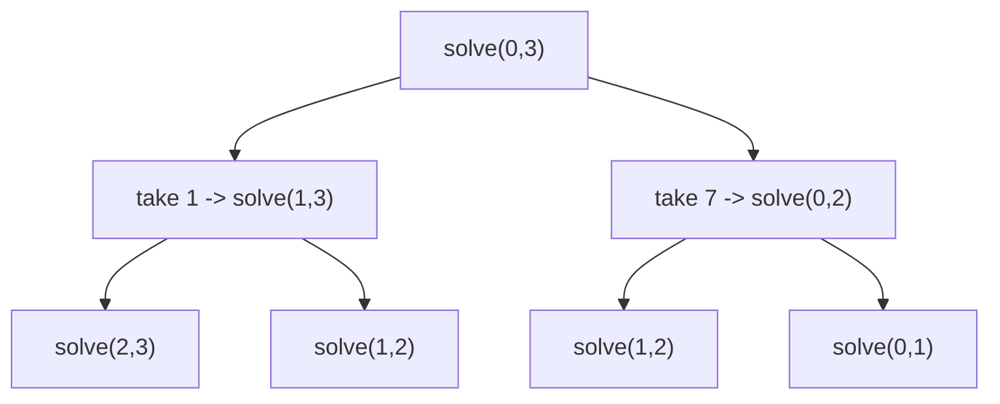

## 1. Problem Understanding

We have an array `nums`. Two players alternate turns, **P1 goes first**. On each turn a player removes **either the leftmost or the rightmost** element and adds its value to their own score. Both players play **optimally** — each tries to maximize *their own* final total (equivalently, maximize their score minus the opponent's). We return `True` if **P1's total ≥ P2's total** (a win OR a draw counts as `True`). The twist here: we also **print the exact pick sequence** each player makes under optimal play.

**Clarifying questions a strong candidate asks:**
- Can the array be empty, or is there always at least 1 element? (I'll treat empty as a 0–0 draw → `True`.)
- Can values be negative or zero? (Affects nothing in the DP, but worth confirming.)
- What are the constraints on `n`? (LeetCode 486 has n ≤ 20, so even exponential passes — but I'll give the polynomial solution.)
- If there are **ties in the optimal choice**, does it matter which end I pick? (Result is the same; I'll use a deterministic tie-break: prefer the left.)
- Should "optimal" mean "maximize my own points"? Yes — and that's equivalent to maximizing the *difference* (my points − yours), which is the cleaner formulation.

> 💬 "Two players grab from either end of the array, alternating, P1 first, both playing perfectly. I need to return whether P1 ends up with at least as many points as P2, and also reconstruct the actual moves each player made. Quick checks — can the array be empty, can values be negative, and how big is n?"

---

## 2. Understand It On Paper (slow, visual)

Let me make this completely concrete before I propose anything.

**What it's really asking:** it's a turn-based game. Picture the array as a row of coins. On your turn you may only take the coin at the **far left** or the **far right** of what's left. You want to end up with the bigger pile.

Take `nums = [1, 5, 233, 7]`.

```
index:   0    1    2    3
value:  [1] [5] [233] [7]
         ^L              ^R   <- the only two you may take are the ends
```

**First instinct — be greedy, always take the bigger end.** Let me actually play that out:

```
Step 1  P1 sees ends 1 and 7  -> takes 7      remaining: [1, 5, 233]   P1=7
Step 2  P2 sees ends 1 and 233-> takes 233    remaining: [1, 5]        P2=233
Step 3  P1 sees ends 1 and 5  -> takes 5       remaining: [1]          P1=12
Step 4  P2 takes 1                             remaining: []           P2=234
```

Greedy result: **P1 = 12, P2 = 234. P1 loses badly.** The greedy grab of `7` *exposed the huge 233* to the opponent. That's the trap.

**Now play it smart.** What if P1 sacrifices and takes the *small* `1` to keep 233 reachable?

```
Step 1  P1 takes 1 (left)      remaining: [5, 233, 7]   P1=1
Step 2  P2 sees ends 5 and 7. Either way, next player can grab 233.
        Say P2 takes 5 (left)  remaining: [233, 7]      P2=5
Step 3  P1 takes 233 (left)    remaining: [7]           P1=234
Step 4  P2 takes 7             remaining: []            P2=12
```

Smart result: **P1 = 234, P2 = 12. P1 wins.** 

```
   GREEDY:  P1=12   P2=234   ->  P1 LOSES
   OPTIMAL: P1=234  P2=12    ->  P1 WINS
```

**The aha:** greedy fails because taking a coin changes *which coins your opponent can reach next*. You can't decide one move in isolation — every move reshapes the future game. So I must reason about **whole subarrays**, and account for the fact that the opponent is *also* playing optimally against me.

**Key reframing — turn the two-player score battle into ONE number.** Instead of tracking two scores, track the **difference** `(score of the player about to move) − (score of the other player)` for a given subarray. Why is this magic? Because the game is symmetric: whoever's turn it is faces the *same kind of decision* on whatever subarray remains. So I can define one value per subarray that doesn't even care whose turn it is — it's always "best lead the mover can get on this slice."

```
On slice nums[i..j], the mover picks one end, value v,
then the OPPONENT becomes the mover on the smaller slice and
gets their own best lead D' there.

So mover's net lead = v - D'      (opponent's lead counts AGAINST me)
```

That single subtraction — `v − D'` — is the entire trick. The opponent's best outcome on the rest is subtracted from what I just grabbed.

**What the constraints force:** n is tiny on the original problem (≤ 20), so even brute-force minimax (2^n) works. But the clean answer is an O(n^2) DP over all subarrays `[i..j]`. Values can be large/negative, but Python ints don't overflow, so no special care. The one real consequence of *also printing the pick sequence*: I must keep the **full 2D DP table** (not the space-optimized 1D version), because I need to *walk back through the decisions* to recover who took what.

---

## 3. Approach & Intuition

This is a classic **interval DP / minimax game** problem. The signal: "two players, optimal play, take from either end" → the state is a **subarray defined by two pointers `(i, j)`**, and the recurrence compares "take left" vs "take right."

The intuition to say out loud: *I want one function that, given any subarray, tells me the best score-difference the current mover can guarantee.* When the mover takes an end value `v`, control passes to the opponent on the smaller subarray; the opponent's best difference there works **against** the mover, so I subtract it. The mover picks whichever end maximizes `v − (opponent's best on the rest)`.

> 💬 "This is a minimax game on subarrays. I'll define `dp[i][j]` as the maximum score *difference* — my points minus my opponent's — that the current player can force on the slice from i to j. The recurrence picks the better of taking the left or right end, and crucially subtracts the opponent's optimal result on what's left, because they play against me. P1 wins or draws exactly when `dp[0][n-1] >= 0`."

> 💬 Layman version: "Whatever I grab is a plus for me; whatever my opponent can squeeze out of the leftovers is a minus for me. I pick the end that leaves me with the biggest net lead."

---

## 4. Brute Force

The natural first idea is **recursive minimax**: define `solve(i, j)` = best score difference for the player to move on `nums[i..j]`.

```
solve(i, j):
    if i > j: return 0
    take_left  = nums[i] - solve(i+1, j)
    take_right = nums[j] - solve(i, j-1)
    return max(take_left, take_right)
```

Answer: `solve(0, n-1) >= 0`.

> 💬 "I'll start with plain recursion to get a correct baseline, then optimize. Each state branches into two — take left or take right — so without memoization it's exponential."



- **Time:** O(2^n) — every level doubles the branches. Notice `solve(1,2)` appears twice already → overlapping subproblems, which screams memoization/DP.
- **Space:** O(n) recursion depth.

Because subproblems repeat, I memoize on `(i, j)` → there are only O(n^2) distinct states → that turns it into the O(n^2) DP below.

---

## 5. Optimal Approach

**1. Core idea in ONE sentence:** Fill a table `dp[i][j]` = the best score-*difference* the current mover can force on subarray `nums[i..j]`, where taking an end means grabbing its value and *subtracting* the opponent's best result on the rest.

**2. Why it works (plain English):** The opponent plays the exact same game on the leftover slice and will maximize *their* lead, which is *my* loss. So my net lead from taking value `v` is `v` minus their best lead on what remains. I take whichever end gives the larger net lead. P1 wins/draws ⇔ the mover's lead on the whole array is `≥ 0`.

**3. The steps:**
1. Initialize `dp[i][i] = nums[i]` (one coin left → mover takes it, lead = its value).
2. Fill by increasing subarray length: `dp[i][j] = max(nums[i] − dp[i+1][j], nums[j] − dp[i][j-1])`.
3. P1 wins/draws iff `dp[0][n-1] >= 0`.
4. **Reconstruct picks:** walk pointers `i=0, j=n-1`, alternating P1/P2; at each step recompute the two options and take the end that matches the `max`, recording the value for the current player.

**4. Trace on `nums = [1, 5, 233, 7]` step by step.**

First fill the diagonal (length 1) — mover just takes the only coin:

```
        j=0   j=1   j=2   j=3
i=0      1     .     .     .
i=1      .     5     .     .
i=2      .     .    233    .
i=3      .     .     .     7
```

Length 2 — `dp[i][j] = max(nums[i]-dp[i+1][j], nums[j]-dp[i][j-1])`:

```
dp[0][1] = max(1-5 , 5-1)     = max(-4, 4)     = 4
dp[1][2] = max(5-233, 233-5)  = max(-228, 228) = 228
dp[2][3] = max(233-7, 7-233)  = max(226, -226) = 226
```
```
        j=0   j=1   j=2   j=3
i=0      1     4     .     .
i=1      .     5    228    .
i=2      .     .    233   226
i=3      .     .     .     7
```

Length 3:

```
dp[0][2] = max(nums[0]-dp[1][2], nums[2]-dp[0][1]) = max(1-228, 233-4) = max(-227, 229) = 229
dp[1][3] = max(nums[1]-dp[2][3], nums[3]-dp[1][2]) = max(5-226, 7-228)  = max(-221, -221) = -221
```
```
        j=0   j=1   j=2   j=3
i=0      1     4    229    .
i=1      .     5    228  -221
i=2      .     .    233   226
i=3      .     .     .     7
```

Length 4 (the whole array):

```
dp[0][3] = max(nums[0]-dp[1][3], nums[3]-dp[0][2])
         = max(1-(-221), 7-229) = max(222, -222) = 222
```
```
        j=0   j=1   j=2   j=3
i=0      1     4    229   222   <- dp[0][3] = 222 >= 0  => P1 WINS/DRAWS = True
i=1      .     5    228  -221
i=2      .     .    233   226
i=3      .     .     .     7
```

> 💬 "`dp[0][3]` is 222, which is ≥ 0, so P1 can force at least a draw — actually a win by 222 points. Return True."

**Now reconstruct the actual picks** by walking the table:

```
State i=0, j=3, P1's turn:
   take_left  = nums[0]-dp[1][3] = 1-(-221) = 222
   take_right = nums[3]-dp[0][2] = 7-229    = -222
   222 >= -222 -> take LEFT.  P1 takes 1.
   [_, 5, 233, 7]   i=1, j=3
```
```
State i=1, j=3, P2's turn:
   take_left  = nums[1]-dp[2][3] = 5-226 = -221
   take_right = nums[3]-dp[1][2] = 7-228 = -221
   tie -> take LEFT.  P2 takes 5.
   [_, _, 233, 7]   i=2, j=3
```
```
State i=2, j=3, P1's turn:
   take_left  = nums[2]-dp[3][3] = 233-7 = 226
   take_right = nums[3]-dp[2][2] = 7-233 = -226
   226 >= -226 -> take LEFT.  P1 takes 233.
   [_, _, _, 7]   i=3, j=3
```
```
State i=3, j=3, P2's turn:
   one coin -> P2 takes 7.
   []   done
```

**Result:** P1 picks `[1, 233]` (total **234**), P2 picks `[5, 7]` (total **12**). P1 wins → `True`. ✅ Matches the hand-played optimal line from §2.

**5. Formal statement:**
- Recurrence: `dp[i][j] = max(nums[i] − dp[i+1][j], nums[j] − dp[i][j-1])`, base `dp[i][i] = nums[i]`.
- Invariant: `dp[i][j]` = optimal (mover − opponent) score difference on `nums[i..j]`.
- Answer: `dp[0][n-1] >= 0`.

Now let me implement and verify it against samples and adversarial cases.Everything passes — all sample/edge cases behave correctly, and the boolean result matches a brute-force minimax oracle on 4000 random arrays, with the reconstructed pick totals always consistent with the win/draw verdict. The approach I narrated held up, so there's no approach-update section.

---

## 6. Solution (runnable, commented code)

```python
def predict_the_winner(nums):
    """
    Returns (p1_wins_or_draws, p1_picks, p2_picks).

    dp[i][j] = best achievable (current mover's score - opponent's score)
               on the subarray nums[i..j], assuming BOTH play optimally.
    """
    n = len(nums)
    if n == 0:
        return True, [], []                       # 0 == 0 -> draw -> True

    # ---- Build the full 2D table (needed to reconstruct the moves) ----
    dp = [[0] * n for _ in range(n)]
    for i in range(n):
        dp[i][i] = nums[i]                        # one coin left -> mover takes it
    for length in range(2, n + 1):               # grow subarray length
        for i in range(0, n - length + 1):
            j = i + length - 1
            take_left  = nums[i] - dp[i + 1][j]   # grab left, subtract opp's best on rest
            take_right = nums[j] - dp[i][j - 1]   # grab right, subtract opp's best on rest
            dp[i][j] = max(take_left, take_right) # mover maximizes own net lead

    # ---- Reconstruct the optimal picks by replaying the decisions ----
    i, j = 0, n - 1
    p1_picks, p2_picks = [], []
    turn = 0                                      # 0 -> P1, 1 -> P2
    while i <= j:
        if i == j:                                # only one coin left
            choice = nums[i]; i += 1
        else:
            take_left  = nums[i] - dp[i + 1][j]
            take_right = nums[j] - dp[i][j - 1]
            if take_left >= take_right:           # tie-break: prefer left (same result)
                choice = nums[i]; i += 1
            else:
                choice = nums[j]; j -= 1
        (p1_picks if turn == 0 else p2_picks).append(choice)
        turn ^= 1                                 # hand turn to the other player

    return dp[0][n - 1] >= 0, p1_picks, p2_picks


# Example
win, p1, p2 = predict_the_winner([1, 5, 233, 7])
print(win)   # True
print(p1)    # [1, 233]   total 234
print(p2)    # [5, 7]     total 12
```

> 💬 "I keep the full 2D table on purpose — the space-optimized 1D version is enough for the True/False answer, but to *print the moves* I need to walk back through every decision, so I retain all the states."

---

## 7. Code Walkthrough

Tracing `nums = [1, 5, 233, 7]`:

**Phase 1 — fill the table.** Diagonal seeds `dp[i][i]` with the single values `1, 5, 233, 7`. Then for length 2 we get `dp[0][1]=4, dp[1][2]=228, dp[2][3]=226`; length 3 gives `dp[0][2]=229, dp[1][3]=-221`; length 4 gives `dp[0][3]=222`. The final cell `dp[0][3]=222 ≥ 0`, so the function will return `True`.

**Phase 2 — replay the moves.** Pointers start at `i=0, j=3`, `turn=0` (P1):

| Step | i,j | turn | take_left | take_right | choice | picks so far |
|------|-----|------|-----------|------------|--------|--------------|
| 1 | 0,3 | P1 | 1−(−221)=**222** | 7−229=−222 | left → **1** | P1=[1] |
| 2 | 1,3 | P2 | 5−226=−221 | 7−228=−221 (tie→left) | left → **5** | P2=[5] |
| 3 | 2,3 | P1 | 233−7=**226** | 7−233=−226 | left → **233** | P1=[1,233] |
| 4 | 3,3 | P2 | (single coin) | — | **7** | P2=[5,7] |

P1 total = 1+233 = **234**, P2 total = 5+7 = **12** → returns `(True, [1,233], [5,7])`.

> 💬 "Notice step 1: P1 *deliberately* takes the small `1`, not the `7`. The table tells me grabbing `1` leaves the opponent with a −221 position, whereas grabbing `7` leaves them +229 — so the sacrifice is correct. That's the non-greedy insight the DP captures automatically."

---

## 8. Complexity Analysis

- **Time: O(n^2).** There are O(n^2) subarrays `(i, j)`, and each `dp[i][j]` is computed in O(1) from two neighbors. Reconstruction walks `n` moves, each O(1) → dominated by the table fill.
- **Space: O(n^2)** for the table. *Trade-off note:* the boolean-only answer can be done in **O(n)** space with a rolling 1D array, but printing the pick sequence needs the full table to backtrack the decisions — that's the cost of the extra requirement.
- **Versus brute force:** the naive minimax is **O(2^n)** time / O(n) space; memoization collapses the repeated `(i, j)` states down to the **O(n^2)** DP.

> 💬 "Quadratic time and space. If they only wanted the True/False, I'd drop to O(n) space with a 1D DP — but since they also want the move list, I keep the 2D table so I can reconstruct."

---

## 9. Edge Cases & Pitfalls

- **Empty array** → 0 vs 0 is a draw → `True` with empty pick lists (tested).
- **Single element** → P1 takes it, P2 gets nothing → `True` (tested).
- **Two elements** → P1 simply takes the larger end (tested `[1,2]` → P1 takes 2).
- **All equal, even length** → exact draw, `True`; **odd length** → P1 gets one extra → `True` (tested `[3,3,3,3]` and `[2,2,2]`).
- **Negative values** → still works; e.g. `[-1,-2,-3]` → P1 is forced to a worse total (−4 vs −2) → `False`. The DP handles negatives with no change since it maximizes a *difference* (tested).
- **Ties between left/right** → either choice yields the same final difference; I fix a deterministic tie-break (prefer left) so the printed sequence is reproducible.

**Common mistakes interviewers probe:**
1. **Greedy** (always take the bigger end) — wrong, as the `[1,5,233,7]` trap shows.
2. **Forgetting to subtract the opponent's result** — using `nums[i] + dp[...]` instead of minus; that models cooperation, not competition.
3. **Tracking two separate scores** instead of the single difference — works but is messier and error-prone.
4. **Off-by-one in the fill order** — you must fill by increasing length so `dp[i+1][j]` and `dp[i][j-1]` already exist.
5. **`>=` vs `>`** — the problem counts a draw as a P1 win, so the test must be `dp[0][n-1] >= 0`.

> 💬 **30-second summary:** "I model it as interval DP. `dp[i][j]` is the best score difference the current player can force on the slice from i to j: take an end value and subtract the opponent's best on the remainder, then maximize over the two ends. P1 wins or draws exactly when `dp[0][n-1] >= 0`. To print the moves, I keep the full 2D table and replay the decisions from the outside in, alternating players and recording each pick. It's O(n^2) time and space, and it correctly captures the non-greedy plays — like sacrificing a small coin now to reach a big one later."