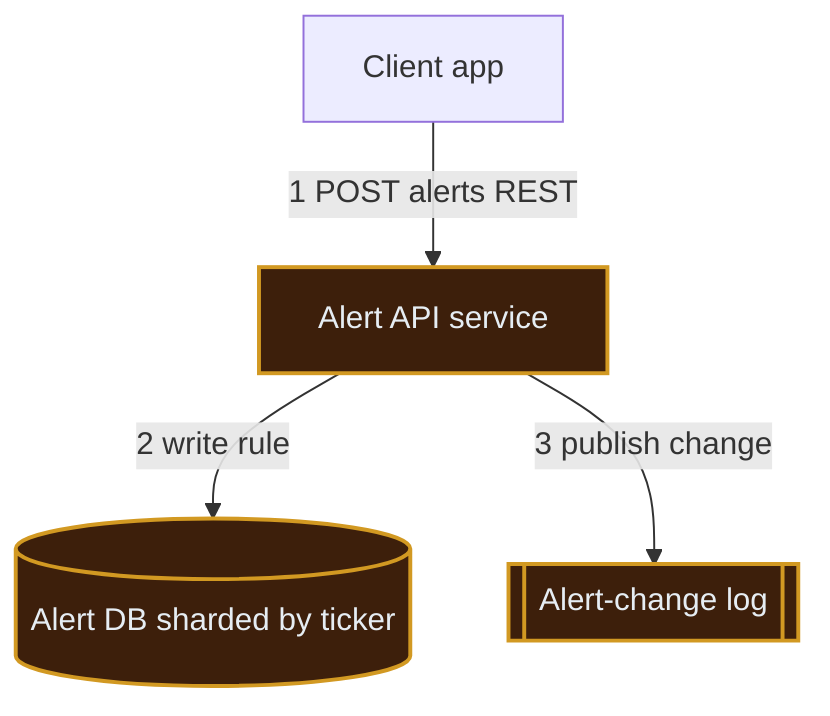
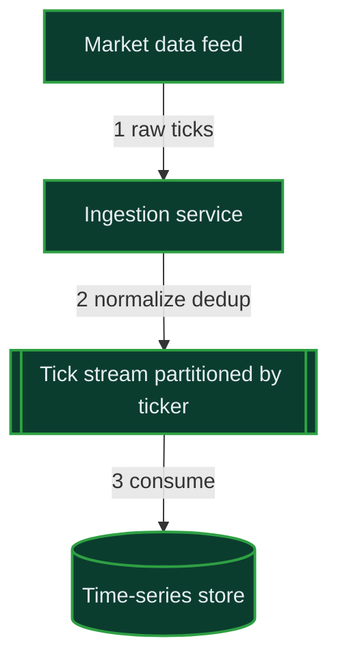
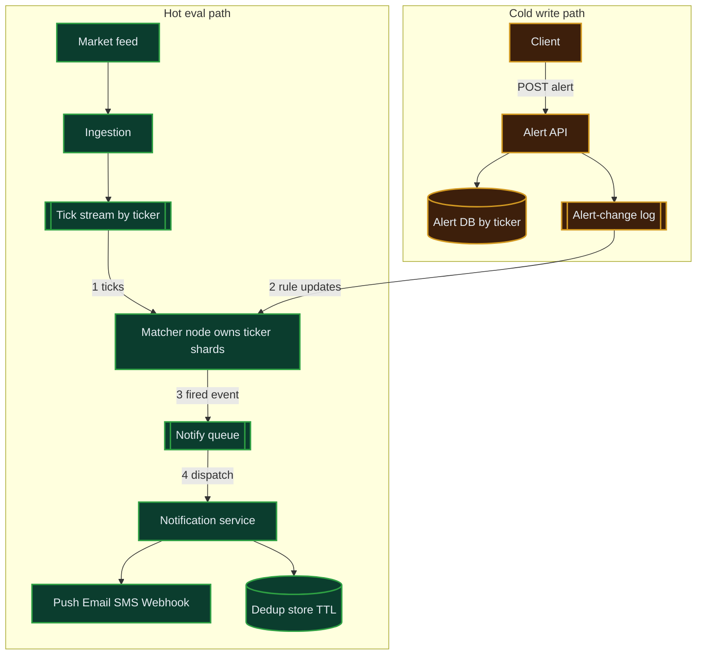
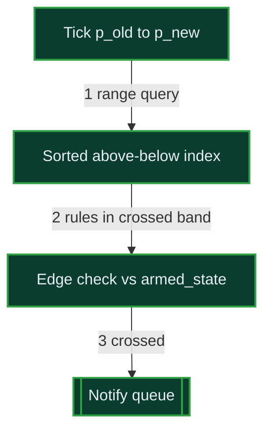
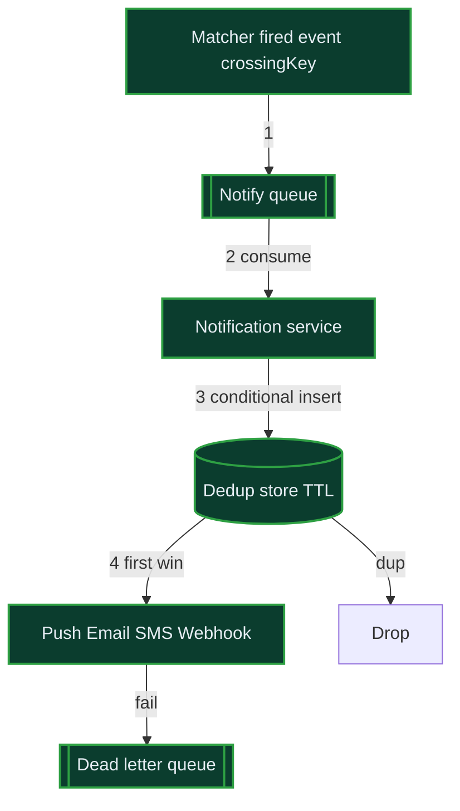

## 1. Requirements (Functional + Non-Functional)

> 🎙️ "Here's how I'll structure this: I'll lock the requirements and rough scale, sketch the API and data model, draw the high-level design one requirement at a time, then go deep on the two or three hardest parts — the tick-to-alert matching, the percent-change windowing, and exactly-once-ish notification delivery — checking in with you as I go. Sound good?"

The core tension: a **firehose of ticks** (read/eval heavy, sub-second) meets **millions of user-defined alert rules** — we must evaluate the right rules per tick **without scanning all of them**, and deliver notifications reliably without double-paging users.

**Functional (core flows — above the line):**
- **Users can create/manage alerts** per ticker: `price > X`, `price < X`, or `percent change ≥ P% within window W` — with a chosen channel (push/email/SMS/webhook).
- **System ingests real-time ticks** for thousands of symbols, sub-second, from market data feeds.
- **System evaluates matching alerts per tick** and fires a notification when a rule's condition flips false→true (edge-triggered, not re-firing every tick).

**Below the line (out of scope):** order execution/trading, charting UI, auth provider internals, billing, options/derivatives pricing. *(Optional)* historical tick query — I'll sketch it but won't deep-dive unless you want.

**Non-Functional (talkable targets):**
- **Low end-to-end latency:** p99 tick→notification-dispatched under ~1–2 seconds.
- **High availability, no SPOF:** target ~99.9% (three 9s); every tier replicated, no single coordinator that halts ingestion.
- **Consistency stance:** alert **config** is read-your-own-writes (a user must see their own just-created alert); tick **evaluation** is eventually-consistent best-effort on freshest tick.
- **Delivery guarantee:** at-least-once dispatch with **dedup** so a user isn't paged twice for the same crossing.
- **Scale:** thousands–tens of thousands of symbols; up to ~10M active alerts; tick rate up to a few hundred thousand/sec at open/close bursts.

**⚠️ Gaps I'd flag out loud:** true *exactly-once* notification is impossible across SMS/email gateways — I'll get to at-least-once + idempotent dedup and be explicit about it.

> 💬 "The hard part isn't storing alerts — it's that every single tick could match thousands of rules, and I can't scan 10 million rules per tick. So my whole design bends around an in-memory index keyed by ticker."

🎙️ **Script:** "So at its heart this is a rules engine sitting on a market-data firehose. Users register alerts per ticker — threshold or percent-change — and pick how they want to be told. We ingest ticks sub-second, and for each tick we need to find just the alerts watching that symbol and check if any condition just crossed. My targets are roughly a one-to-two second p99 from tick to notification, three nines of availability with no single point of failure, and at-least-once delivery with dedup so nobody gets paged twice. Trading and charting are out of scope."

## 2. Clarifying Questions & Assumptions

| Question | Why it matters to the design |
|---|---|
| How many symbols and what peak tick rate? | Sizes the ingestion tier and whether one matcher node can hold a symbol's rules. |
| How many active alerts, and skew per symbol (is AAPL hot)? | Hot-symbol shard is the binding bottleneck; drives partitioning. |
| Is the percent-change window seconds, minutes, or a trading-day? | Decides sliding-window memory and whether we keep per-symbol price history in RAM. |
| Edge-triggered or level-triggered alerts? Re-arm policy? | Whether we fire once per crossing or repeatedly; needs prior-state per alert. |
| Acceptable notification latency and dup tolerance? | Sets the delivery SLA and dedup window. |
| Who's the market data provider, and is the feed itself HA / replayable? | Affects ingestion dedup and gap-recovery. |

**Assumptions I'll proceed with:** ~10K symbols, ~200K ticks/sec peak, ~10M active alerts, percent-change windows up to ~15 min, **edge-triggered** (fire once when condition crosses, re-arm on reset), p99 ≤ ~1.5s, dup-tolerance "ideally zero, at-least-once acceptable." Google-style bar: I'll go deep on the matching/partitioning distributed-systems problem. Tell me if it's Amazon (I'll feature cost/ops) or a startup (I'll collapse to a monolith).

> 🤝 Checkpoint: "Before I size it — are these numbers in the right ballpark, or are we talking full-market US equities at millions of ticks a second? That changes whether one matcher node per symbol is enough."

## 3. Scale & Capacity (talkable numbers)

I'll defer full estimation and compute only the few numbers that drive a decision: per-tick fan-out, matcher node count, and alert-store footprint.

Let me compute these exactly.The runner returned a stale/cached result — let me re-run the actual file.| Metric | Value | Say-it-out-loud |
|---|---|---|
| Peak tick rate | 200K/s | "a couple hundred thousand ticks a second" |
| Naive evals/sec (scan all rules on symbol) | 2 x 10^8 | "200 million checks a second — no way" |
| Indexed touched/sec (sorted threshold index) | ~1M/s | "a million with an index — totally fine" |
| Alert RAM footprint | ~2 GB total | "tiny — all 10M rules fit in memory" |
| Hot symbol (top 5%) | ~500K alerts, ~10K ticks/s | "AAPL alone is the bottleneck" |
| Alert store on disk (3x repl) | ~9 GB | "trivial for any DB" |
| Optional 1-day tick history | ~0.9 TB/day | "the real storage cost is history" |

**The ONE number that forces the design:** naive evaluation is **200 million checks/sec** — impossible. With a per-symbol **sorted threshold index** we touch only ~**1M/sec** (the rules near the current price). That's the whole game. Flip threshold: if a single symbol's alert set won't fit on one matcher node (it does at ~2GB total, but the **hot symbol's 10K ticks/s × 500K rules** is the real risk), we split a symbol across matcher replicas by price-band.

> **QPS** = queries/requests per second. **TTL** = time-to-live, an auto-expiry. A **tick** = one price update for one symbol.

🎙️ **Script:** "If I did this naively — every tick scans every rule on its symbol — that's 200 million comparisons a second, dead on arrival. But if I keep each symbol's thresholds in a sorted structure, a tick only touches the handful of rules near the new price, so I'm down to about a million ops a second across the fleet. The rules themselves are only a couple gigs of RAM, so memory's free — my real enemies are the hot symbol like Apple, which alone takes ten thousand ticks a second against half a million rules, and the optional tick history at nearly a terabyte a day."

## 4. Core Entities

First draft of the nouns — I'll detail fields in the data model later:

- **Alert (Rule):** a user's condition on one ticker — type (above/below/pct-change), threshold, window, channel, armed-state.
- **User:** owner of alerts; has notification channels (device token, email, phone, webhook URL).
- **Symbol/Ticker:** the instrument; logical owner of a stream of ticks.
- **Tick:** one price update — symbol, price, volume, timestamp.
- **Notification:** a fired event — which alert, which crossing, dedup key, delivery status.
- **PriceWindow:** per-symbol recent price state used for percent-change evaluation.

🎙️ **Script:** "The key nouns are Alerts, Users with their channels, Symbols, the Ticks flowing in, the Notifications we emit, and a per-symbol price-window I keep in memory for percent-change rules. I'll firm up the exact fields once we've drawn the flow."

## 5. API / Interface

REST for config (CRUD, cacheable, simple); ticks come in over an internal streaming feed, not a public API.

| Endpoint | Serves which requirement | Notes |
|---|---|---|
| `POST /alerts` `{ticker, type, threshold, window, channel}` → `201 {alertId}` | Create alert | Caller from JWT — never trust a client `userId`. Accepts `Idempotency-Key` header so a retried create doesn't double-insert. |
| `GET /alerts?ticker=` → `200 [..]` | Manage alerts | Reads from primary after a write for read-your-own-writes. |
| `PUT /alerts/{id}` / `DELETE /alerts/{id}` | Edit/cancel | Ownership checked against JWT subject. |
| `GET /history?ticker=&from=&to=` → ticks | Optional historical query | Hits the time-series store, not the live path. |
| (internal) market-data feed → ingestion | Ingest ticks | Not user-facing; authenticated provider connection. |
| (outbound) webhook POST to user URL | Webhook channel | Signed payload (HMAC), retried with backoff. |

> 💬 "Config is plain REST. I identify the user from the JWT, and I put an Idempotency-Key on alert creation so a flaky mobile network retry doesn't create two identical alerts. Ticks never touch this API — they arrive on an internal feed."

🎙️ **Script:** "Users hit a normal REST API to create, list, edit, and delete alerts — I pull their identity from the token and never trust a client-supplied user id, and I take an idempotency key on creates. There's an optional history endpoint that reads the time-series store off the hot path. Ticks themselves arrive on an internal authenticated feed, and webhooks go out as signed, retried POSTs."

## 6. High-Level Design (built one requirement at a time)

### 6.1 "Users can create/manage alerts"

Start minimal: an API service writing to a durable alert store.

1. Client POSTs an alert; API authenticates via JWT.
2. API validates and writes the rule to the **Alert DB** — a SQL/NoSQL store **sharded by ticker** so all rules for a symbol live together.
3. API publishes the create/update/delete onto an **Alert-change log** *(a durable ordered stream — like Kafka — so matcher nodes can rebuild their in-memory index and stay in sync)*.

> 💬 "Write the rule durably, then publish the change so the live matchers learn about it. The DB is the source of truth; the matchers hold a fast in-memory copy."

### 6.2 "System ingests real-time ticks sub-second"

Add the ingestion tier feeding a partitioned tick stream.

1. The **Market data feed** pushes raw ticks.
2. **Ingestion service** normalizes (symbol, price, ts), dedups by sequence number, and publishes to a **Tick stream partitioned by ticker** — so the same symbol always lands on the same partition (ordering preserved per symbol).
3. A consumer also writes ticks to the **Time-series store** *(a store optimized for time-ordered data — like a TSDB or Cassandra — for the optional history query)*.

> 💬 "Partition the tick stream by ticker. That's the magic: ordering per symbol is preserved, and I can co-locate the rules for that symbol on the consumer reading that partition."

### 6.3 "Evaluate matching alerts per tick and fire notifications"

The heart. Matcher nodes subscribe to tick partitions AND the alert-change log, hold a per-symbol sorted index in memory, and emit fired notifications.

1. **Matcher node** consumes ticks for the ticker shards it owns; for each tick it queries its **in-memory sorted threshold index** for rules whose threshold the price just crossed, and updates the **per-symbol price-window** for percent-change rules.
2. In parallel it consumes the alert-change log to keep that index live (insert/update/delete rules).
3. On an **edge crossing** (condition false→true), it emits a fired event to the **Notify queue**.
4. **Notification service** consumes, checks the **Dedup store** (TTL keyed by alertId+crossing), and dispatches to the channel; webhooks/SMS retried with backoff.

> 💬 "Each matcher owns a set of ticker shards. A tick comes in, I look up only the rules near that price in a sorted index, fire on a true crossing, and hand it to a notifier that dedups before sending."

**Final (high-level):** the diagram above is the full skeleton. Load-bearing columns: Alert DB `(alertId, userId, ticker[shard key], type, threshold, window, channel, armed_state, version)`.

🎙️ **Script:** "Putting it together: writes go through the API into the alert DB and onto a change log. Ticks come through ingestion onto a stream partitioned by ticker. Matcher nodes each own some ticker shards — they keep that symbol's rules in a sorted in-memory index, kept fresh from the change log, and for every tick they only check the rules near the price. On a real crossing they drop a fired event on a queue, and the notification service dedups and fans out to push, email, SMS, or webhook. The hot green path is ticks-to-notification; the amber path is config."

> 🤝 Checkpoint: "That's the end-to-end skeleton. Want me to go deepest on the per-tick matching index, on the percent-change windowing, or on exactly-once-ish delivery? I'd default to the matching index since it's the bottleneck."

## 7. Data Model & Storage

| Entity | Key fields | Store + why |
|---|---|---|
| Alert | alertId, userId, ticker(shard key), type, threshold, window_sec, channel, armed_state, version, created_at | **NoSQL by ticker** (e.g. Cassandra/DynamoDB) — partition by ticker so a matcher loads one partition; ~9GB trivial. |
| User/Channel | userId, deviceTokens[], email, phone, webhookUrl, hmacSecret | **SQL/KV** — small, relational-ish, low QPS. |
| Tick | ticker(partition), ts(clustering), price, volume | **Time-series store** (TSDB / Cassandra) — append-only, time-ordered; ~1TB/day, TTL'd. |
| Notification | notifId, alertId, crossingKey(dedup), status, attempts, ts | **KV with TTL** for dedup + a log for audit. |
| PriceWindow | ticker → ring buffer of recent prices | **In-memory on matcher** (not persisted; rebuilt from tick stream replay). |

Per-operation consistency: alert config = strong / read-your-own-writes (read primary after write); ticks & windows = eventual, freshest-wins.

🎙️ **Script:** "Alerts go in a key-value store partitioned by ticker so a matcher can pull a whole symbol's rules as one partition — and it's only about nine gigs. Ticks go in a time-series store, append-only and TTL'd because that's the real volume. User channels sit in a small relational store. The price windows live only in matcher memory and are rebuildable by replaying the tick stream, so I don't pay to persist them."

## 8. Deep Dives — Bad → Good → Great

> 🆘 If you get stuck: go back to "200M naive checks vs 1M indexed" — every decision flows from killing the scan.

### How do we evaluate alerts per tick without scanning all rules?

#### Bad: scan every rule on the symbol per tick
**Approach:** for each tick, loop all rules for that ticker and test the condition.
**Challenges:** that's the **200M comparisons/sec** number — and the **⚠️ trap** is assuming "only rules for this symbol" is cheap; the hot symbol has 500K rules and 10K ticks/sec = 5 billion checks/sec on one symbol alone. Dead.

#### Good: per-symbol sorted threshold index
**Approach:** keep two sorted structures per symbol — `above` thresholds and `below` thresholds (a balanced tree or sorted array). When the price moves from `p_old` to `p_new`, you only fire the `above` rules in range `(p_old, p_new]` and `below` rules in `[p_new, p_old)`. That's O(log n + crossings) — typically a handful per tick.
**Challenges:** percent-change rules don't fit a static threshold; need the windowing approach below. Also one symbol must fit on one node.

#### Great: sorted index + price-band sub-sharding for hot symbols
**Approach:** keep the sorted index, but for hot symbols (AAPL) **split the rule set by price-band across matcher replicas** — each replica owns a contiguous threshold range and the same tick is broadcast to all replicas of that symbol; each only checks its band. This caps any single node's work and removes the hot-shard ceiling. Matchers are stateless-recoverable: index is rebuilt from the alert-change log + DB on startup.
**Challenges/Trade-offs:** broadcasting a hot symbol's tick to N replicas multiplies tick traffic for that symbol, but N is small (2–4) and only for hot symbols. This is what real systems do — partition by key, sub-shard the hot key.

🎙️ **Script:** "The trick is a sorted index of thresholds per symbol — above and below. When the price jumps from one value to another, I do a range lookup and only touch the rules in that band, so a tick is log-n plus a few crossings instead of a full scan. For a monster like Apple I split that symbol's rules across a couple of matcher replicas by price band and broadcast its ticks to them, so no single node melts. The index is just an in-memory cache of the DB, so a crashed matcher rebuilds it from the change log."

> 🧠 If they ask "why not just a DB query per tick?": "A DB round-trip per tick at 200K/sec is both too slow for sub-second and far too expensive; the rules are only 2GB so I keep them in RAM and treat the DB as durable backup."

### How do we evaluate percent-change-in-a-window rules?

#### Good: per-symbol sliding window in memory
**Approach:** keep a ring buffer / sorted-by-time deque of recent prices per symbol (up to max window, e.g. 15 min). On each tick, compute `(p_now - p_window_start) / p_window_start`; for percent rules, index them by their P% threshold and check crossings just like price thresholds, but against the computed change.
**Challenges:** memory grows with tick rate × window; need to evict expired points (slide the window). For 15-min windows at high tick rates, downsample to e.g. 1-second OHLC buckets to bound memory.

#### Great: bucketed windows + maintain running min/max
**Approach:** store 1-second aggregate buckets (open/high/low/close) per symbol; the window is a fixed-size ring of buckets. Maintain running reference price (window-start or window-min/max) so percent-change is O(1) per tick. Rebuild on restart by replaying the tick stream for the last W.
**Trade-offs:** bucketing loses sub-second granularity for percent rules — acceptable since percent-change-over-minutes doesn't need millisecond precision.

> 🧠 If they ask "what about windows spanning a restart?": "I replay the tick stream for the last W seconds on matcher startup to repopulate buckets before I resume firing — so I don't miss or falsely fire across a restart."

### How do we deliver notifications reliably without double-paging? (idempotency + delivery)

#### Bad: matcher calls the SMS/email API directly
**Approach:** matcher fires → directly calls Twilio/SES inline.
**Challenges:** blocks the hot path on a slow third party; on retry/crash you double-send. ⚠️ Trap: coupling eval latency to gateway latency.

#### Great: queue + idempotent consumer with dedup key
**Approach:** matcher emits a fired event with a deterministic **crossingKey** = `alertId + crossing-direction + armed-epoch`. Notification service consumes from the **Notify queue**, does a conditional insert into a **Dedup store with TTL**; if the key already exists, it's a duplicate and is dropped. Only on first-win does it dispatch. Webhooks/SMS retried with exponential backoff; channel failures go to a DLQ.
**Trade-offs:** at-least-once + dedup ≈ effectively-once for the user; true exactly-once across external gateways is impossible, so the dedup store is the guarantee. The crossingKey's `armed-epoch` increments on re-arm so the *next legitimate* crossing isn't suppressed.

🎙️ **Script:** "I never call the SMS provider from the hot path — the matcher just drops a fired event with a deterministic dedup key onto a queue. The notification service does a conditional insert into a dedup store keyed by alert plus crossing plus an arm-epoch; first writer wins and sends, everyone else is dropped. Failed sends retry with backoff and dead-letter after that. That gives the user effectively-once even though the underlying gateways are only at-least-once."

> 🧠 If they ask "why the arm-epoch in the key?": "Edge-triggered means I fire once per crossing. The epoch bumps when the condition resets and re-arms, so a genuine second crossing later still fires instead of being deduped as the same event."

### How do we avoid SPOF / stay HA?

Every tier replicated: ingestion is N stateless consumers; the tick & change streams are replicated partitions with leader election; matchers run as a partitioned consumer group — if one dies, its partitions are reassigned and the new owner rebuilds its index from the change log + DB; notification service is stateless behind the queue. No single coordinator gates ingestion — partition leadership is per-partition, so losing one broker affects only its partitions.

> 🧠 If they ask "what's your single point of failure?": "There isn't a global one — the closest is the alert-change log, but it's a replicated partitioned log, so a node loss is a partition failover, not a system outage."

## 9. Reliability, Failure Modes & Cost

- **Availability:** target ~99.9% (three 9s); config path can briefly degrade to read-only without stopping evaluation.
- **Graceful degradation:** market feed gap → ingestion detects sequence gaps and requests replay; matcher crash → partition reassignment + index rebuild (seconds); dedup store down → fail-closed to "send" (prefer a rare dup over a missed alert) or buffer — a product call; notification gateway down → queue buffers + DLQ, no eval impact.
- **RPO/RTO:** Alert DB RPO ≈ 0 (synchronous replication, it's the source of truth), RTO minutes via multi-AZ failover. Tick history RPO can tolerate seconds (replayable from feed). Matcher state RPO = 0 because it's rebuildable. Tested restore drills monthly.
- **Multi-AZ vs multi-region:** multi-AZ for HA; multi-region active-passive for DR — promote on regional loss; ticks are ephemeral so cross-region replication is just config + the change log.
- **Cost (rough monthly):** dominant driver is **tick history storage + ingestion compute**, not the tiny 9GB alert DB. ~1TB/day TTL'd to e.g. 30 days ≈ 30TB → low thousands $/mo; matcher/ingestion fleet (~32 cores) dominates compute. SMS is a per-message external cost — can dwarf infra if volume spikes, so rate-limit per user.
- **Observability:** SLO burn-rate alerts on tick→notify p99, per-partition consumer lag, dedup hit-rate, DLQ depth; distributed tracing tick→dispatch; runbooks for feed-gap and matcher-rebalance.

🎙️ **Script:** "Nothing is a global single point of failure — streams are replicated, matchers rebuild from the log, notifiers are stateless behind a queue. If the market feed gaps, I detect the sequence hole and replay; if a gateway is down, the queue absorbs it with no effect on evaluation. My biggest cost is tick history and ingestion compute, not the tiny alert DB, and I watch SMS spend because it's external per-message. I alert on consumer lag and on the tick-to-notify latency burning my SLO."

## 10. Trade-off Ledger

| Decision | Gave up | What would reverse it |
|---|---|---|
| In-memory sorted index on matchers (vs DB query per tick) | Operational simplicity; rebuild-on-restart complexity | If alerts grew past RAM per node (far beyond 10M) I'd move to a tiered/disk-backed index. |
| At-least-once + dedup (vs chasing exactly-once) | A theoretical perfect guarantee | If duplicates were truly intolerable (financial actions) I'd add a transactional outbox per channel. |
| Bucketed (1-sec) percent-change windows | Sub-second percent precision | If users needed millisecond percent-change, keep raw ticks in-window at higher memory cost. |
| Partition by ticker + sub-shard hot keys | Uniform-shard simplicity | If skew vanished (uniform symbols) plain ticker partitioning suffices, no sub-sharding. |

🎙️ **Script:** "The calls I'd most want to revisit: keeping the index in RAM is great until alerts massively outgrow a node; I chose effectively-once over true exactly-once because the gateways can't promise it anyway; and I bucket percent-change windows to a second, which I'd undo only if someone needed millisecond precision. All of these flip on a clear scale or product trigger, not on a whim."

## 11. Likely Interviewer Questions & Answers

**1. How does a tick find only the rules it crosses?**
Each matcher holds per-symbol sorted `above`/`below` threshold structures. A price move from p_old to p_new is a range query returning only thresholds in that band, O(log n + crossings). This turns 200M naive checks/sec into ~1M.
> 💬 "Sorted thresholds, range-query the crossed band — I never touch rules far from the price."

**2. What about the hot symbol (AAPL) overwhelming one node?**
I sub-shard that symbol's rules by price-band across 2–4 matcher replicas and broadcast its ticks to them; each checks only its band. It bounds per-node work at the cost of small tick fan-out for hot symbols only.
> 💬 "I split the hot symbol's rules across replicas by price band so no one node carries all 500K rules."

**3. A matcher crashes mid-stream — do we lose or double-fire alerts?**
Partitions reassign to a surviving node, which rebuilds the in-memory index from the alert DB + change log and replays recent ticks for windows before resuming. Dedup keys prevent double-fires across the handoff, and edge-state is re-derived from current price vs threshold.
> 💬 "Reassign the partition, rebuild the index from the log, replay the window — the dedup store stops any double page."

**4. How do you guarantee a user isn't paged twice?**
A deterministic crossingKey (alert + direction + arm-epoch) is conditionally inserted into a TTL dedup store; first writer sends, duplicates drop. It's at-least-once delivery made effectively-once for the user.
> 💬 "Deterministic dedup key, conditional insert, first-win sends — retries can't double-send."

**5. Edge vs level triggered — won't it fire every tick above the threshold?**
Alerts are edge-triggered: I store armed_state and fire only on false→true. It re-arms when the condition resets (price falls back below), bumping the arm-epoch so the next genuine crossing fires.
> 💬 "I fire on the crossing, not while it stays true — and re-arm when it resets."

**6. How do percent-change windows survive a restart?**
Windows are rebuildable: on startup the matcher replays the last W seconds of the tick stream into its buckets before resuming firing, so it neither misses nor falsely fires across the restart.
> 💬 "I replay the last window from the tick stream before I start firing again."

**7. What's the consistency model for alert creation?**
Config is strongly consistent and read-your-own-writes — I read from primary right after a write. Propagation to matchers is async via the change log, typically sub-second, so there's a tiny window where a brand-new alert isn't yet live; I surface "active" state to the user.
> 💬 "You always see your own alert immediately; it goes live on the matchers within a second."

**8. What if the market data feed has gaps or sends duplicates?**
Ingestion dedups by sequence number and detects gaps, requesting a replay from the provider or a secondary feed. Per-symbol ordering is preserved by partitioning by ticker.
> 💬 "Sequence numbers dedup and detect gaps; I replay from a backup feed and keep per-symbol order."

**9. How do you scale ingestion to millions of ticks/sec (full market)?**
Add partitions and stateless ingestion consumers linearly; matchers scale by adding nodes to the consumer group. The bottleneck shifts to per-symbol hot shards, handled by price-band sub-sharding.
> 💬 "Partitions and consumers scale horizontally; the only non-trivial part is hot symbols, which I sub-shard."

**10. How do webhooks stay reliable and secure?**
Outbound webhooks are signed with an HMAC the user can verify, retried with exponential backoff, and dead-lettered after N attempts; we rate-limit per endpoint to avoid hammering a slow consumer.
> 💬 "Signed payloads, backoff retries, dead-letter on giving up — and we never block eval on them."

**11. How do you stop a user from creating millions of alerts / abuse?**
Per-user quotas enforced at the API, rate-limit on creates, and per-user notification rate caps (especially SMS, which costs real money). Abnormal patterns trip alarms.
> 💬 "Quotas and rate limits at the API, plus a hard cap on SMS per user because that's a real-dollar cost."

**12. Why not evaluate alerts with a stream processor like Flink instead of custom matchers?**
**Flink** *(a stateful stream-processing engine that maintains keyed state and handles windowing/recovery for you)* is a legitimate alternative — keyed-by-ticker state and built-in windows map well. I'd choose it if I wanted managed windowing/checkpointing; I described a custom matcher to control the sorted-index data structure and hot-key sub-sharding precisely, but Flink is the "buy" answer.
> 💬 "Flink could host this with keyed state and windows — I went custom for the index control, but that's a fair build-vs-buy."

**13. Optional history query — how without hurting the live path?**
Ticks are written to a separate time-series store off the hot path; history queries hit that store, fully isolated from ingestion and matching, with its own read replicas and TTL'd retention.
> 💬 "History reads a separate time-series store, totally off the live evaluation path."

🎙️ **60-second verbal summary:** "This is a rules engine on a market-data firehose. Users create per-ticker alerts — thresholds or percent-change — through a REST API that writes to a ticker-sharded store and publishes onto a change log. Ticks arrive through ingestion onto a stream partitioned by ticker. Matcher nodes own ticker shards, keep each symbol's rules in an in-memory sorted threshold index kept fresh from the change log, and per tick they range-query only the rules near the price — turning 200 million naive checks a second into about a million. Percent-change uses per-symbol bucketed windows. On a true edge crossing they emit a fired event with a deterministic dedup key onto a queue; the notification service dedups and fans out to push, email, SMS, or webhook, at-least-once but effectively-once. Hot symbols like Apple are sub-sharded by price band. Everything's replicated with no global single point of failure, matchers rebuild state from the log, and my real costs are tick history and ingestion compute, not the tiny alert database."