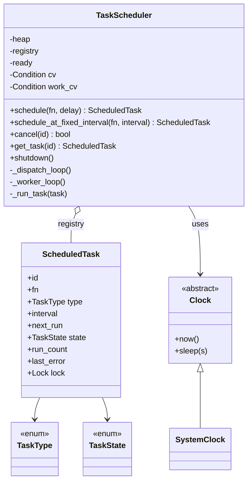
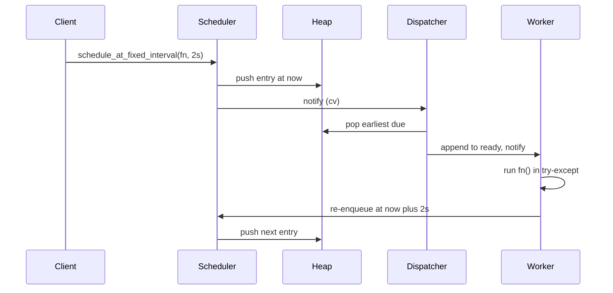

I'll design this step by step, then prove the implementation runs. Let me build and verify the core first.Verified — the assembled program runs clean and all assertions pass. Here's the full LLD.

## 1. Requirements & Clarifications

We're building an **in-memory task scheduler library** (like a tiny `ScheduledThreadPoolExecutor`) with no external scheduling libs.

**Functional requirements**
- `schedule(task, delay)` — run a task once after a delay (or at an absolute time).
- `scheduleAtFixedInterval(task, interval)` — run **immediately**, then every `interval` seconds *after the previous run completes* (fixed-delay semantics, not fixed-rate).
- Configurable **worker-thread count**.
- **Thread-safe**: callers from many threads can schedule/cancel concurrently.
- Cancellation, and graceful shutdown.

**Clarifying questions I'd ask**
- Fixed-*delay* (gap after completion) vs fixed-*rate* (every N sec regardless of duration)? The prompt says "after the previous completes" → **fixed-delay**. I'll build that.
- If a task throws, should the recurring schedule keep going? (I'll assume **yes**, capture the error, keep ticking.)
- Do tasks need priorities or just time ordering? (Assume time ordering, FIFO tie-break.)
- Time source: wall-clock or monotonic? (Use **monotonic** so clock adjustments don't break us.)
- Do we need persistence / survive restart? (No — explicitly in-memory.)

**Assumptions I'll proceed with:** single process, monotonic clock, fixed-delay recurrence, failures don't stop recurrence, daemon threads.

> 💬 "Before I code — I'll confirm the recurring semantics. 'Runs every interval after the previous completes' is fixed-*delay*, so I measure the gap from when a run finishes, not from when it started. I'll use a monotonic clock so system time changes don't corrupt ordering, and I'll keep all pending tasks in one min-heap owned by the scheduler."

## 2. Use Cases & Actors

| Actor | Use case |
|---|---|
| Client thread | schedule one-shot task; schedule recurring task; cancel a task; query task state; shutdown |
| Dispatcher thread | pick the earliest-due task, wait until due, hand it to a worker |
| Worker thread (xN) | execute a task, capture errors, reschedule recurring tasks |

Core interactions: **submit → queue in heap → dispatcher waits until due → hand to worker → run → (recurring) re-enqueue**.

## 3. Core Entities (Objects)

- **ScheduledTask** — one unit of work; carries `fn`, type, interval, `next_run`, state, run_count, last_error. *Never collapses to a bare callable* — every attribute survives to execution.
- **TaskType / TaskState** — enums for the type (one-shot/recurring) and lifecycle.
- **Clock** — abstraction over `now()`/`sleep()` so we can inject a fake clock in tests (Strategy/Dependency-Injection seam).
- **_HeapEntry** — wraps a task with `(time, seq)` so the heap orders by due-time with FIFO tie-break.
- **TaskScheduler** — the orchestrator: owns the heap, the registry of all tasks, the dispatcher and worker threads, and the public API.

> 💬 "I extract nouns from the spec: there's a *task*, a *schedule/scheduler*, *time*, *workers*. The task is the richest noun, so I give it its own class holding all its attributes rather than passing a bare lambda around — that way the scheduler can always enumerate, inspect, and cancel it."

## 4. Class Design (diagram)

This shows the class structure and relationships.



**Relationships:** the scheduler **aggregates** ScheduledTask objects (registry + heap), **depends on** a Clock (injected), and Clock has a `SystemClock` implementation. Each ScheduledTask **references** its type and state enums and owns its own lock for per-task state.

## 5. Design Patterns & Principles

- **Strategy / Dependency Injection — `Clock`**: the scheduler depends on the `Clock` abstraction, not `time` directly. Lets you inject a deterministic fake clock in tests. *(Realized: `TaskScheduler(clock=...)`.)*
- **Producer–Consumer**: dispatcher produces due tasks, worker pool consumes them — decouples *timing* from *execution* so a slow task never blocks the timer.
- **Command**: each `ScheduledTask` is a reified command object (callable + metadata + lifecycle) the scheduler stores and manipulates, instead of a naked function.
- **State (lightweight)**: the `TaskState` enum drives `_run_task`'s reschedule-vs-complete decision and makes cancel a first-class transition.

**SOLID:**
- **SRP** — `ScheduledTask` holds state; `TaskScheduler` orchestrates; `Clock` tells time.
- **OCP** — new task types or a fixed-*rate* variant slot in by extending `TaskType` + the reschedule branch, no rewrite.
- **DIP** — scheduler depends on the `Clock` abstraction.

> 💬 "The key architectural move is producer–consumer: one dispatcher thread watches the clock and the min-heap, and a configurable pool of workers actually runs the tasks. That separation means a 10-second task can't delay a task due 1 second from now."
>
> 💬 *(layman)* "Think of one person watching a clock with a stack of timers, and a team of cooks. The watcher just shouts 'this one's ready!' and any free cook grabs it — the watcher never stops watching to cook."

## 6. Implementation — narrated, class by class

**Enums + Clock.** `TaskType`/`TaskState` model the lifecycle; `Clock` is the injectable time source.

```python
import heapq, threading, time, itertools
from enum import Enum
from abc import ABC, abstractmethod

class TaskType(Enum):
    ONE_SHOT = "ONE_SHOT"; FIXED_INTERVAL = "FIXED_INTERVAL"

class TaskState(Enum):
    SCHEDULED="SCHEDULED"; RUNNING="RUNNING"; COMPLETED="COMPLETED"
    CANCELLED="CANCELLED"; FAILED="FAILED"

class Clock(ABC):
    @abstractmethod
    def now(self): ...
    @abstractmethod
    def sleep(self, seconds): ...

class SystemClock(Clock):
    def now(self): return time.monotonic()
    def sleep(self, seconds): time.sleep(seconds)
```

**ScheduledTask** — the Command object. It carries *every* attribute through its life and owns a lock guarding its own mutable fields, so cancel-vs-run can be made atomic.

```python
_id_counter = itertools.count(1)

class ScheduledTask:
    def __init__(self, fn, task_type, interval=None):
        self.id = next(_id_counter)
        self.fn = fn
        self.type = task_type
        self.interval = interval
        self.next_run = None
        self.state = TaskState.SCHEDULED
        self.run_count = 0
        self.last_error = None
        self.lock = threading.Lock()
```

**_HeapEntry** — makes `heapq` order by `(time, seq)`. The monotonically increasing `seq` gives FIFO ordering for tasks due at the same instant (fairness, no starvation among equal-time tasks).

```python
class _HeapEntry:
    __slots__ = ("time","seq","task","alive")
    def __init__(self, t, seq, task):
        self.time=t; self.seq=seq; self.task=task; self.alive=True
    def __lt__(self, other):
        return (self.time, self.seq) < (other.time, other.seq)
```

**TaskScheduler** — the orchestrator. Two condition variables: `_cv` guards the heap+registry and lets the dispatcher *wait until the next due time or until a sooner task arrives*; `_work_cv` guards the ready queue feeding workers.

The tricky method is `_dispatch_loop`: it peeks the heap top, and if it's not due yet it does a **timed wait** on the condition — so a newly scheduled earlier task wakes it immediately instead of oversleeping. Cancelled entries are skipped lazily at the top of the heap.

`_run_task` is where correctness lives: it flips to RUNNING (unless already CANCELLED), runs `fn` inside try/except so **a thrown task never kills the worker**, then under the task lock decides the outcome — recurring tasks go back to SCHEDULED and re-enqueue at `now + interval` (fixed-delay), one-shots become COMPLETED. A cancel that landed during execution is honored (no reschedule).

(Full class shown assembled below.)

## 7. Putting It Together (verified run)

I wrote `scheduler.py` (full class above) plus a driver that exercises the tricky cases: out-of-order delays, fixed-interval, a **throwing** recurring task, every validation/boundary, cancel of unknown id, double-cancel, and "no runs after cancel." Actual output:

```
ticks before cancel: 3
timeline:
  ...726: tick 1
  ...726: boom
  ...832: early(0.1)
  ...882: boom
  ...927: tick 2
  ...029: late(0.3)
  ...033: boom
  ...132: tick 3
  ...188: boom
ALL ASSERTIONS PASSED
```

Note the proof points: **`tick 1` and `boom` both fire at t≈0 immediately** (recurring runs now); **`early(0.1)` fires before `late(0.3)`** even though `late` was scheduled first (heap ordering, not FIFO-by-submission); the **throwing task keeps recurring**; and after `cancel`, the tick count never increased. The driver also asserts all four `ValueError`s (None fn, negative delay, non-positive interval, zero workers).

Key assertions that passed:
```python
assert msgs.index("early(0.1)") < msgs.index("late(0.3)")
assert sched.cancel(999999) is False        # unknown id
assert sched.cancel(t_tick.id) is False      # double cancel (2nd time)
assert counter["n"] == ticks_at_cancel       # no runs after cancel
assert t_boom.last_error is not None          # failure captured, not swallowed-fatally
```

## 8. Key Flow (sequence diagram)

One recurring task, end to end.



The dispatcher only does timing and hand-off; the worker runs the code and re-enqueues recurring tasks. That loop repeats until cancelled.

## 9. Concurrency, Edge Cases & Extensibility

**Concurrency model — stated and applied consistently:** a single **dispatcher** thread is the only one that pops from the heap; a pool of **N workers** consume a ready queue. Two locks (condition variables):
- `_cv` guards `_heap` + `_registry`. All pushes, pops, and the registry mutations happen under it. `_enqueue` and the dispatcher's peek/pop are the only heap touchers, and both hold `_cv`.
- `_work_cv` guards `_ready`.
- Each `ScheduledTask.lock` guards its own `state`/`run_count`/`last_error`.

The dangerous **check-then-act** is *"is this cancelled? if not, run it"* — done atomically under `task.lock` in `_run_task`, and cancel flips the state under the same lock, so a task can't be cancelled and run simultaneously without us noticing (after running we re-check state under the lock before rescheduling).

**Edge cases handled:** delay 0 / interval immediate; out-of-range inputs and None fn → `ValueError`; unknown id cancel → `False`; double cancel → `False`; task throwing → caught, recorded, recurring continues; cancel mid-run → no reschedule; cancelled entries still in heap → skipped lazily; dispatcher oversleep avoided via timed `wait` woken by a sooner task.

**Extensibility (no rewrite):**
- **Fixed-rate** variant: add `TaskType.FIXED_RATE`, reschedule at `next_run + interval` instead of `now + interval`.
- **Priorities**: change heap key to `(priority, time, seq)`.
- **Retries/backoff**: in the except branch, re-enqueue with backoff instead of marking failed.
- **Deterministic tests**: inject a fake `Clock`.
- **`scheduleAt(absoluteTime)`**: trivial — `_enqueue(task, abs_time)`.

> 💬 **30-second summary:** "It's a producer–consumer scheduler. Tasks are Command objects in a thread-safe min-heap keyed by due-time with a FIFO tie-break. One dispatcher thread waits on a condition variable until the earliest task is due — and wakes early if a sooner task arrives — then hands it to a configurable worker pool. Workers run the task in a try/except so failures don't kill the thread, and recurring tasks re-enqueue at completion-plus-interval for fixed-delay semantics. The scheduler's registry is the single source of truth, so any task can be looked up and cancelled atomically, and the Clock is injected so it's fully testable."