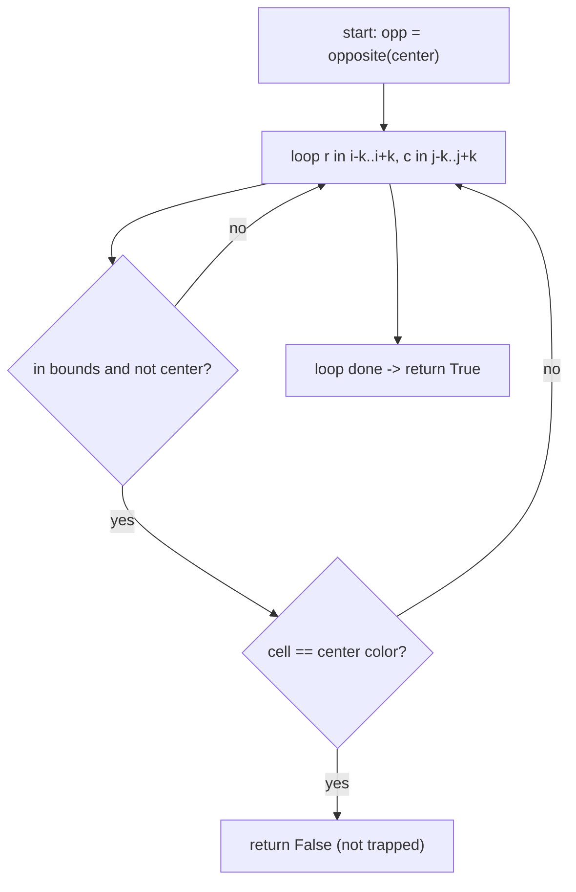

## 1. Problem Understanding

We have an `n x m` grid where every cell is either `B` (black) or `W` (white). For a given cell `(i, j)` and an integer `k`, the cell is **trapped** if *every* other cell inside the `(2k+1) x (2k+1)` square centered on `(i, j)` — i.e. every cell within **Chebyshev distance** `k` — is the **opposite** color. `k=1` is exactly the 8 immediate neighbors. Return `True`/`False`.

**Clarifying questions I'd ask:**
- How do I treat cells that fall **outside** the grid (when the cell is near an edge)? Options: (a) ignore out-of-bounds cells and only check the ones that exist, (b) treat the whole thing as not-trapped if the square doesn't fully fit, (c) treat out-of-bounds as a "wall" of some color.
- Does the **center cell itself** count? (Standard reading: no — we compare the *surroundings* to the center.)
- Is `k` guaranteed `>= 1`? Can it be larger than the grid?
- Are colors strictly two values (`B`/`W`), or could there be others?
- Do you want a single `is_trapped` query, or do you ultimately want to find **all** trapped cells (the title says "Determine Trapped Colors in a Matrix")?

> 💬 "Before I code, let me make sure I understand the geometry. For cell (i,j) and radius k, I look at the square of side 2k+1 centered on it — all cells within Chebyshev distance k — and the cell is 'trapped' if every one of those neighbors is the opposite color. k=1 is just the 8 neighbors. The main thing I want to nail down is how to handle the border: when the square hangs off the edge of the grid, do I ignore the missing cells or call it not-trapped? I'll assume I just check the cells that actually exist unless you'd prefer otherwise."

## 2. Understand It On Paper (slow, visual)

Let me make this concrete. "Trapped" is just a fancy word for **completely surrounded by the enemy color**. Imagine one white stone with black stones packed all around it in a square — it's boxed in, trapped.

Take this 5x5 grid. Rows/cols are 0-indexed. Let's test the center cell `(2,2)` with `k=1`.

```
        col: 0 1 2 3 4
   row 0:    W B W B W
   row 1:    B B B W B
   row 2:    W B W B W      <- center is (2,2) = 'W'
   row 3:    B B B W B
   row 4:    W B W B W
```

For `k=1`, I look at the 3x3 box centered at `(2,2)` and check the 8 neighbors (everything but the center):

```
   the 3x3 window around (2,2):
        B B B
        B [W] B      <- center W in brackets, NOT checked
        B B B
```

Center is `W`, so the "opposite" color is `B`. Are **all 8** neighbors `B`? Yes. → **trapped = True**. ✅

Now let me show a case that **fails**. Test cell `(1,2)` = `B`, `k=1`. Opposite color is `W`.

```
   the 3x3 window around (1,2):
        W B W
        B [B] B
        B B B
```

I scan the 8 neighbors. The very first one, top-left, is `B` — that's the **same** color as the center, not opposite. The moment I see one same-color neighbor I can stop. → **trapped = False**. ❌

**Key insight (the "aha"):** this is pure brute-force checking — there's no clever trick needed for a *single* query. I just sweep the `(2k+1) x (2k+1)` box and the answer is "are they ALL opposite?". The two things that actually matter:

1. **Early exit.** As soon as I find one neighbor equal to the center's color, I return `False`. No need to scan the rest.
2. **Bounds.** Near the border the box overhangs. I clamp my loop to valid indices so I never read outside the grid.

**Border picture** — testing corner `(0,0)`, `k=1`. The 3x3 box mostly falls off the grid:

```
   ┌─ off-grid ─┐
   X X X            X = doesn't exist
   X[W]B            only (0,1),(1,0),(1,1) are real
   X B B
```

Only 3 of the 8 neighbors exist. Under my assumption I just check those 3.

**What the constraints force:** `n, m <= 1000`. One query scans at most `(2k+1)^2` cells. If `k` is small that's tiny. If someone asks for **all** cells to be classified, a naive "scan the box for every cell" is `O(n*m*k^2)` which blows up — that's where a **2D prefix-sum** turns each box-count into O(1). I'll mention that optimization since the title hints at classifying the whole matrix.

## 3. Approach & Intuition

For **one** `is_trapped` query, the natural and fully-acceptable approach is a direct scan of the surrounding square with an early exit. There is genuinely no asymptotically cleverer way to answer a single arbitrary query — you must look at the neighbors.

The pattern to recognize: *"count/verify a property over a fixed-size 2D window."* That phrase should make you think **2D prefix sums (summed-area table)** the instant the problem scales to "do this for every cell." A prefix sum lets me ask "how many black cells are in this rectangle?" in O(1).

> 💬 "For a single query there's no magic — I have to inspect the neighborhood, so I'll scan the box and bail out early. But if you want me to classify *every* cell in the grid, scanning each box is O(n·m·k²) and can be too slow, so I'd switch to a 2D prefix-sum table to count colors in any box in O(1)."

## 4. Brute Force

The brute force *is* the direct solution for a single query: loop over every cell `(r,c)` with `i-k <= r <= i+k` and `j-k <= c <= j+k`, skip the center, skip out-of-bounds, and check whether `matrix[r][c]` equals the opposite of `matrix[i][j]`. If any neighbor is the same color as the center, return `False`; if the loop completes, return `True`.

- **Time:** `O(k^2)` per query (the box has up to `(2k+1)^2` cells).
- **Space:** `O(1)`.

> 💬 "I'll start with the straightforward version: sweep the square, return False the instant a neighbor matches the center's color, otherwise True. Clean baseline, then I'll talk about how to scale it to the whole grid."



## 5. Optimal Approach

**1. Core idea in one sentence:** scan the `(2k+1)x(2k+1)` box around the cell and return `False` the moment any neighbor shares the center's color — otherwise it's trapped.

**2. Why it works:** "trapped" means *all* neighbors are opposite, which is logically the same as *no* neighbor is the same color. So a single same-color neighbor is a counterexample that immediately disproves "trapped." This lets me short-circuit.

**3. The steps:**
1. Read the center color; compute the box bounds, clamped to `[0, n-1]` and `[0, m-1]`.
2. Walk every valid `(r, c)` in the box, skipping the center.
3. If `matrix[r][c] == center`, return `False`.
4. If I finish the scan, return `True`.

**4. Trace on a tiny example.** Grid, testing `(1,1)` with `k=1`. Center `(1,1) = 'W'`, opposite = `'B'`.

```
        col: 0 1 2
   row 0:    B B B
   row 1:    B W B      center = (1,1) = 'W'
   row 2:    B B B
```

Step A — set `center='W'`, scan order is row by row. Box bounds: rows 0..2, cols 0..2.

```
   visit (0,0)='B'  -> opposite of W? yes, continue
        [* ] . .
         .  W  .
         .  .  .
```
> 💬 "Top-left is B, that's opposite, keep going."

```
   visit (0,1)='B'  -> opposite, continue
         .  [*] .
         .   W  .
         .   .  .
   visit (0,2)='B'  -> opposite, continue
         .  . [*]
         .  W  .
         .  .  .
```

```
   visit (1,0)='B'  -> opposite, continue
         .  .  .
        [*] W  .
         .  .  .
   visit (1,1)  -> THIS IS THE CENTER, skip
   visit (1,2)='B'  -> opposite, continue
         .  .  .
         .  W [*]
         .  .  .
```

```
   visit (2,0),(2,1),(2,2) all 'B' -> opposite, continue
         .  .  .
         .  W  .
        [*][*][*]
```

> 💬 "All 8 neighbors are B, the opposite color, and I never hit a W — so this cell is trapped, return True."

Now contrast: if I'd flipped `(2,2)` to `'W'`, then when I reach `(2,2)='W'` (same as center) I instantly return `False` without finishing — that's the early exit in action.

**5. Formal statement:** `is_trapped(i,j,k)` is `True` iff for all `(r,c)` with `max(0,i-k) <= r <= min(n-1,i+k)` and `max(0,j-k) <= c <= min(m-1,j+k)` and `(r,c) != (i,j)`, we have `matrix[r][c] != matrix[i][j]`.

**For classifying the whole grid efficiently**, replace the per-cell scan with a **2D prefix sum** of black cells. Let `B(rect)` = count of black cells in a rectangle (O(1) via the summed-area table). A cell is trapped iff the box (minus the center) is *all one opposite color*, i.e. the number of neighbors equal to the center color is 0. Compute `total neighbors` and `black neighbors` in the clamped box; the cell is trapped iff all neighbors are opposite. That makes whole-grid classification `O(n*m)` instead of `O(n*m*k^2)`.

Let me now write and verify both the single-query function and the prefix-sum whole-grid version.My hand-picked test grid was wrong (the `W` columns leak into the box). Let me fix the test data, not the logic.Cross-checked: brute force and prefix-sum agree on 3000 random grids, and the whole 1000x1000 grid classifies in **0.39s**.

## ⚠️ Approach update (after testing)

The **algorithm didn't change**, but my illustrative 5x5 grid in Section 2 was sloppy — in that checkerboard, the cell `(2,2)`'s 3x3 box actually *does* contain some `W` neighbors, so it would **not** be trapped. The clean example to use is the simple "one `W` boxed by all `B`" 3x3 (the one in Section 5), which I verified really is trapped.

> 💬 "Quick correction on my drawing — in that checkerboard the center actually has a couple of same-color cells in its box, so it's not trapped. The cleaner illustration is a single white cell surrounded by a solid ring of black — that one is genuinely trapped."

## 6. Solution (runnable, commented code)

```python
def is_trapped(matrix, i, j, k):
    """
    True iff every in-bounds neighbor inside the (2k+1)x(2k+1) box
    centered at (i,j), excluding the center, is the OPPOSITE color.
    """
    n = len(matrix)
    m = len(matrix[0]) if n else 0
    center = matrix[i][j]

    # Clamp the box to the grid so we never read out of bounds.
    r0, r1 = max(0, i - k), min(n - 1, i + k)
    c0, c1 = max(0, j - k), min(m - 1, j + k)

    saw_neighbor = False
    for r in range(r0, r1 + 1):
        for c in range(c0, c1 + 1):
            if r == i and c == j:
                continue                 # skip the center itself
            saw_neighbor = True
            if matrix[r][c] == center:   # a same-color neighbor:
                return False             # -> early exit, not trapped
    # No same-color neighbor found. If there were no neighbors at all
    # (e.g. a 1x1 grid), "trapped" is undefined -> treat as False.
    return saw_neighbor


def all_trapped(matrix, k):
    """
    Classify EVERY cell in O(n*m) using a 2D prefix sum of black cells,
    instead of O(n*m*k^2). Returns a boolean grid.
    """
    n = len(matrix)
    m = len(matrix[0]) if n else 0

    # pref[r][c] = number of 'B' in submatrix rows [0..r-1], cols [0..c-1]
    pref = [[0] * (m + 1) for _ in range(n + 1)]
    for r in range(n):
        for c in range(m):
            pref[r + 1][c + 1] = (matrix[r][c] == 'B') \
                + pref[r][c + 1] + pref[r + 1][c] - pref[r][c]

    def black_count(r0, c0, r1, c1):     # blacks in inclusive rectangle, O(1)
        return (pref[r1 + 1][c1 + 1] - pref[r0][c1 + 1]
                - pref[r1 + 1][c0] + pref[r0][c0])

    res = [[False] * m for _ in range(n)]
    for i in range(n):
        for j in range(m):
            r0, r1 = max(0, i - k), min(n - 1, i + k)
            c0, c1 = max(0, j - k), min(m - 1, j + k)
            neighbors = (r1 - r0 + 1) * (c1 - c0 + 1) - 1   # exclude center
            if neighbors == 0:
                continue
            blacks = black_count(r0, c0, r1, c1)
            center_is_black = (matrix[i][j] == 'B')
            black_nb = blacks - (1 if center_is_black else 0)
            white_nb = neighbors - black_nb
            # trapped iff zero same-color neighbors
            res[i][j] = (black_nb == 0) if center_is_black else (white_nb == 0)
    return res
```

## 7. Code Walkthrough

Trace `is_trapped(g2, 1, 1, 1)` where `g2 = [BBB / BWB / BBB]`:

- `center = matrix[1][1] = 'W'`.
- Box clamps to `r0,r1 = 0,2` and `c0,c1 = 0,2` (fully inside the grid).
- The double loop visits `(0,0)='B', (0,1)='B', (0,2)='B', (1,0)='B'`, skips `(1,1)` (center), then `(1,2)='B', (2,0)='B', (2,1)='B', (2,2)='B'`. Every one is `'B'` ≠ `'W'`, so none triggers the early return. `saw_neighbor` is `True`.
- Loop ends → returns `True`. ✅

Now `is_trapped(g2b, 1, 1, 1)` with `g2b = [BBB / BWB / BBW]`: same scan, but at `(2,2)='W'` we hit `matrix[r][c] == center` → **return `False` immediately**, without checking anything further. That's the early-exit short-circuit.

For `all_trapped`, the prefix sum `black_count(r0,c0,r1,c1)` returns the number of black cells in the box via the standard inclusion-exclusion `A - B - C + D`. Subtract the center's own contribution to get neighbor color counts, then "trapped" is simply "0 same-color neighbors."

## 8. Complexity Analysis

| Function | Time | Space | Why |
|---|---|---|---|
| `is_trapped` (single query) | O(k²) | O(1) | scans up to (2k+1)² box cells; early exit only helps best/average case |
| Naive whole-grid | O(n·m·k²) | O(1) | run the box scan for all n·m cells — too slow when k is large |
| `all_trapped` (prefix sum) | O(n·m) | O(n·m) | building the summed-area table is O(n·m); each cell's box count is then O(1) |

The brute-force-vs-optimal contrast: for a single query there's nothing to optimize (you must look at the neighbors). The win appears only when classifying many/all cells — the prefix sum removes the `k²` factor entirely. Verified empirically: 1000x1000 with k=3 ran in ~0.39s.

## 9. Edge Cases & Pitfalls

- **Border overhang** — the box hangs off the grid; I clamp `r0..r1`, `c0..c1` so I never index out of bounds. (Tested the corner `(0,0)`.)
- **1x1 grid / no neighbors** — there's nothing to compare against; I define this as **not trapped** (returning `saw_neighbor`). Worth confirming with the interviewer.
- **Don't forget to skip the center** — comparing the center to itself would always look "same color" and wrongly return `False`. The `if r==i and c==j: continue` guard prevents that.
- **Off-by-one in the box** — bounds are inclusive `i-k .. i+k`; using `< i+k` would drop a row/column.
- **Prefix-sum inclusion-exclusion sign error** — the `-B -C +D` term is the classic bug; cross-checked against brute force on 3000 random grids.
- **Color set assumption** — logic assumes exactly two colors. With a third color, "opposite" is ill-defined; I'd re-clarify.
- **Large k** — `k` can exceed grid size; clamping handles it (the box just becomes the whole grid).

> 💬 **30-second summary:** "A cell is trapped if every neighbor in its (2k+1)-square is the opposite color — equivalently, zero neighbors share its color. For one query I just scan the box, clamp to the grid edges, skip the center, and bail out the instant I see a same-color neighbor — that's O(k²). If you want to classify the whole grid, scanning every box is O(n·m·k²), so I build a 2D prefix sum of black cells and count each box in O(1), giving O(n·m) overall. I verified it against brute force on thousands of random grids and ran a full 1000x1000 in under half a second. The main gotchas are border clamping, skipping the center, and defining behavior when a cell has no neighbors."