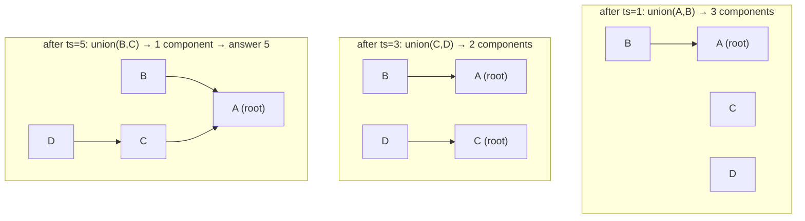
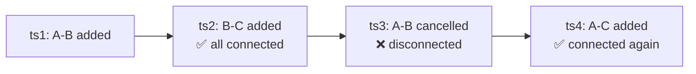

# Deep Dive — DSA #1: Ride-Log Connectivity (DSU) + the deletion follow-up
> Uber's most repeated DSA question (3+ times last year, SDE-1 and SDE-2)
> Solution code: `../solutions/graphs_dsu.py` · Mock: `../mocks/dsa_01_dsu_logs.py`
> Pattern doc: `../learn/01_dsu_union_find.md`

---

## 1. The problem in simple words
Chronological logs: `<ts> A shared_ride B` connect two users. Connectivity is
transitive (A–B and B–C ⇒ A–C). **Earliest timestamp when ALL users form one
group**, else −1.

## 2. How to THINK about it (the narration that scores)

1. "Connections are only ADDED over time → groups only ever MERGE → this is
   the textbook Union-Find shape."
2. "I need 'are we all one group yet?' after each log → track a **component
   counter**: starts at N users, every successful union decrements it; the
   log that brings it to 1 is the answer."
3. Brute alternative to mention then dismiss: BFS over current edges after
   each log = O(m·(V+E)) — too slow for 10^6 logs.

## 3. Watching DSU work (the forest picture)

Logs: `1 A-B`, `3 C-D`, `5 B-C`. Users {A,B,C,D}, components start at 4.



`find(D)` at the end walks D→C→A; **path compression** then re-points D
directly at A, so the forest flattens itself as it's used. **Union by size**
hangs the smaller tree under the bigger so chains never get long. Together:
amortized O(α(n)) ≈ constant — say "inverse Ackermann" calmly.

## 4. The solution (15 lines that matter)

```python
def earliest_full_connectivity(logs):
    users = {u for line in logs for u in (line.split()[1], line.split()[3])}
    dsu = DSU(users)                       # components = len(users)
    for line in logs:
        ts, a, _, b = line.split()
        dsu.union(a, b)
        if dsu.components == 1:
            return int(ts)
    return -1
```
Two details graded: seed ALL users first (or components-count is wrong), and
`union` returns False on self-union so the counter never over-decrements.

## 5. Complexity
O(m α) after O(m) parsing · space O(users). Done in ten minutes — the round
is really about what comes next.

---

## 6. THE FOLLOW-UP: `cancelled_ride` removes a connection. Now what?

This follow-up is why the question repeats — it separates levels cleanly.

### 6a. Sentence #1 you MUST say: "DSU cannot delete"
Union physically merges two trees into one; there is no record of which
edges caused the merge, so there's no un-merge. Trying to "remove from DSU"
silently caps you at Lean Hire.

### 6b. Sentence #2 (the Strong Hire one): "connectivity is no longer monotonic — so binary search dies too"



With additions only, "connected?" over time looks like 000111 — binary
searchable. With deletions it can be 010011… The tempting optimization
("binary search the answer timestamp, check connectivity at the midpoint")
is WRONG, and most candidates propose it. Catching that yourself is the
biggest signal available in this interview.

### 6c. The accepted interview solution: rebuild
Maintain an edge **multiset** (counts, not booleans — A,B can share rides
twice and cancel once):

```python
edges[key] += 1   # shared_ride      (key = sorted pair)
edges[key] -= 1   # cancelled_ride, floor at 0
# after each event: fresh DSU over {edges with count > 0}; components==1 → ts
```
Complexity O(m²α) worst case — say it honestly, then bound it: "early-exit
on first success if we only need the EARLIEST; also only recheck after
cancellations if we were connected, and after additions if we weren't."
(That last optimization is a nice flourish: state changes need the matching
event type.)

### 6d. The name-drop (don't implement)
"Offline dynamic connectivity / segment-tree-on-time / link-cut trees handle
deletions in O(log) — out of interview scope, but that's the real tool."
One sentence, zero code, full credit.

## 7. BONUS PROBES seen with this question
- **Stream version** ("are we connected NOW?" queries between events):
  additions-only → incremental DSU + counter answers in O(1); with
  cancellations → same rebuild caveat.
- **"What unit tests?"** self-ride (A,A) · duplicate edges · cancel of a
  never-added edge · cancel one of two duplicate edges (multiset proof) ·
  single user (answer = its first timestamp? define!) · users appearing
  only in cancels.
- **Timestamps repeat**: process the whole same-ts group before checking,
  or accept either — but SAY which.

## 8. What the interviewer writes down
✓ DSU + component counter unprompted · ✓ α(n) stated · ✓ "DSU can't delete"
explicit · ✓ non-monotonicity → binary search rejected · ✓ multiset rebuild
with honest complexity · ✓ offline-dynamic-connectivity name-drop.
