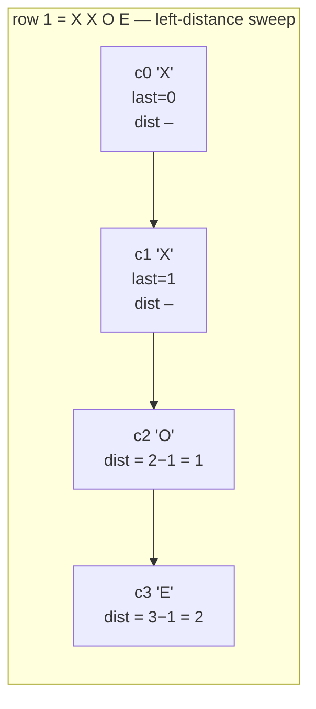
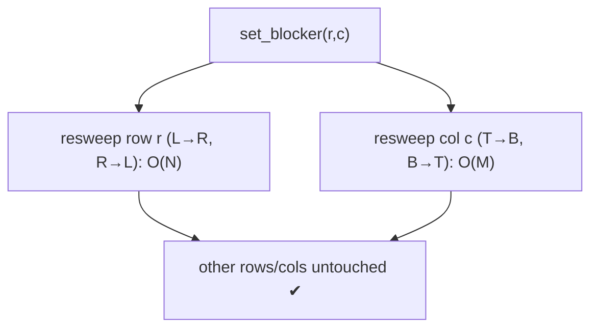

# Deep Dive — DSA #2: Robots in a Grid (blocker distance query)
> Uber-house original, repeated since Sep 2024 across SDE-2/3/Senior loops;
> one candidate "bombed it onsite, solved it at home" — pressure question
> Solution: `../solutions/grids_bfs.py` · Mock: `../mocks/dsa_02_robots_grid.py`

---

## 1. The problem in simple words
Grid of `O` (robot), `E` (empty), `X` (blocker); **outside the grid counts
as blocker**. Query `[left, top, bottom, right]` = minimum required distance
from a robot to its nearest blocker in each direction. Return all robots
meeting ALL four minimums.

Distance definition (nail it FIRST — the #1 source of bombs): distance =
number of steps to reach the blocking cell/boundary. A blocker immediately
left = distance 1. Robot at column 0 → boundary at column −1 → left
distance 1.

## 2. Hand-trace before any code (the real interviewer made candidates do this)

```
        col:  0    1    2    3
row 0:        O    E    E    X
row 1:        X    X    O    E
row 2:        E    X    O    X
```
Robot (0,0): left → boundary at c=−1 → **1** · top → boundary r=−1 → **1**
· bottom → X at (1,0) → **1** · right → X at (0,3) → **3**.
Robot (1,2): left → X at (1,1) → **1** · top → no X above in col 2 →
boundary → **2** · bottom → (2,2) is a ROBOT not a blocker → boundary →
**2** · right → (1,3) E then boundary → **2**.

That last cell is the clarifying question that wins the round:
**"Do robots block other robots?" → No, only X and boundary block.**
Asking it is explicitly noted by interviewers.

## 3. How to THINK about it — two ladders

### Ladder 1: brute force (CODE THIS FIRST, say its cost)
For each robot, walk each of the 4 directions until you hit X or the edge.
O(R · (M+N)), with the parameterized form the real interviewer asked for:
**O(M·N·D)** where D = max distance walked. Fine to code in 10 minutes;
correctness here banks the round.

### Ladder 2: the O(M·N) sweeps (SAY it, code if time)
The insight: "nearest blocker to the LEFT" for every cell in a row is
computable in ONE left-to-right pass by carrying "where was the last X":



Four sweeps (L→R, R→L per row; T→B, B→T per column), each O(M·N), give four
distance matrices; then one pass filters robots. The pattern's name to say:
**directional DP / prefix scans** — "BFS answers 'nearest by path'; sweeps
answer 'nearest along a straight line'. This is the latter."

```python
last = -1                          # boundary as a blocker at col -1
for c in range(m):
    if row[c] == 'X': last = c
    else: left[r][c] = c - last
```
The other three directions are the same loop mirrored. Most bugs are mirror
bugs — write one direction, TEST it, then copy-mirror deliberately.

## 4. Complexity
Brute O(M·N·D) → sweeps **O(M·N)** total, O(M·N) space (or O(N) per row if
you filter on the fly). Query check per robot O(1).

---

## 5. FOLLOW-UP 1: "Q queries arrive, different distance vectors, same grid"
The sweeps don't depend on the query → compute ONCE, store the four
matrices + the robot list. Each query = O(#robots) filtering.
Total: O(M·N + Q·R). This follow-up exists to check you separated
*precomputation* from *query* — restructure your code into
`preprocess(grid)` + `query(minimums)` and say why.

## 6. FOLLOW-UP 2: "The grid mutates: set_blocker(r, c) between queries"
A new X at (r,c) only changes left/right distances **in row r** (cells to
its right until the next X, and none to its left… careful: right-distances
of cells LEFT of it) and top/bottom distances **in column c**. So:
recompute row r's two sweeps + column c's two sweeps = O(M+N) per mutation.



Trade-off to voice: heavy mutation + rare queries → skip precomputation,
brute-force per query instead. "Which dominates, reads or writes?" — asking
THAT back is the senior move.

## 7. FOLLOW-UP 3: "Find robots within distance D of a blocker" (inverted variant)
Flips the tool: nearest blocker by **path/any direction** = multi-source BFS
from all X cells (O(M·N)), then filter robots by dist ≤ D. Recognizing the
inversion (straight-line sweeps vs path BFS) closes the loop with
`../learn/02_bfs_grids.md`.

## 8. Pressure notes (this question's real failure mode)
The candidate who bombed it knew everything at home. What goes wrong live:
fuzzy distance definition → index math wobbles → panic. Antidote ritual:
1. Trace ONE robot's four numbers by hand on their example (§2).
2. Write the distance formula down: `dist = c - last_blocker_col`.
3. Code ONE direction, assert it against the hand-trace, then mirror.
Banking a correct brute force first also defuses the panic spiral —
working code on screen changes the room's energy.

## 9. What the interviewer writes down
✓ asked robots-block-robots · ✓ hand-traced before coding · ✓ brute coded +
sweep articulated (or coded) · ✓ O(M·N·D) parameterization · ✓ preprocess/
query split on follow-up 1 · ✓ row+col local resweep on mutation.
