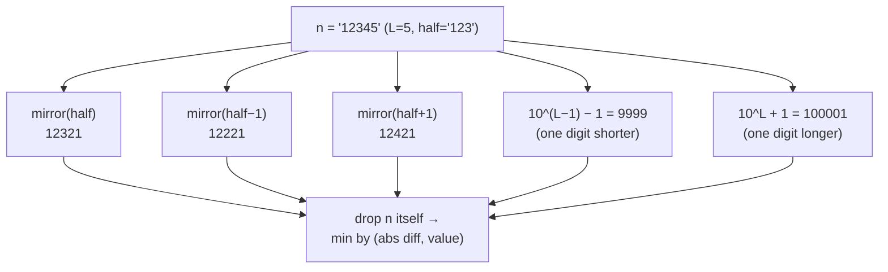

# Deep Dive — DSA #3: Closest Palindrome (+ next-palindrome variant)
> Asked **3x** last year: screening, SDE-4 **bar-raiser**, SDE-2 DSA ·
> edge cases ARE the interview
> Solution: `../solutions/dp_math.py` · Mock: `../mocks/dsa_03_closest_palindrome.py`
> Pattern doc: `../learn/07_palindromes_digit_math.md`

---

## 1. The problem in simple words
n as a string (up to 18 digits). Find the closest palindrome by absolute
difference; ties → smaller; the answer must NOT be n itself.

## 2. Why the "obvious" approaches die (know the graveyard)
- **Walk outward n±1, n±2, … checking is-palindrome**: distance to the
  nearest palindrome can be ~10^(L/2) for L digits — the bar-raiser asks
  for an 18-digit input specifically to kill this.
- **Ad-hoc digit surgery** ("mirror it, then patch the 9s case, then patch
  the 10 case…"): every patch breaks another case; candidates drown one
  probe at a time. The probes exist to sink exactly this.

## 3. The candidate-set method (the safe path)

**Core fact: a palindrome is fully determined by its left half.** So instead
of searching numbers, enumerate the only halves that can matter:



Why exactly these five — the proof sketch (FOLLOW-UP 1, asked verbatim):
- Any closest palindrome either has the **same length** as n or crosses a
  length boundary.
- Same length: its left half must be half, half−1, or half+1 — a half ≥2
  away is dominated (changing the half by 1 already moves the palindrome
  past n on that side).
- Different length: the largest L−1-digit palindrome is 99…9; the smallest
  L+1-digit palindrome is 10…01. Those two cover all boundary crossings.

Mirroring with parity (memorize):
```python
s = str(h)
pal = s + s[::-1]      if L even      # '12'  -> '1221'
pal = s + s[-2::-1]    if L odd       # '123' -> '12321'
```
Tie-break for free: `min(candidates, key=lambda c: (abs(c-num), c))`.

## 4. The probe table — work each ONCE by hand (the bar-raiser's exact list)

| n | candidates (after drop-n) | answer | why it's a probe |
|---|---|---|---|
| `10` | 00→0, 11, 22, **9**, 101 | **9** | half−1 shrinks the half |
| `11` | 00→0, 22, **9**, 101 | **9** | n itself excluded; 9 beats 22 |
| `99` | 88, 1001, 9, **101** | **101** | length-up boundary wins |
| `100` | 9, **99**, 101, 111, 1001 | **99** | tie 99 vs 101 → smaller |
| `1000` | 99, 1001, 1111, **999**, 10001 | **999** | tie 999 vs 1001 → smaller |
| `12121` | 12021, 12221, 9999, 100001 | **12021** | already-palindrome input |
| `1` | 0, 2, 11 | **0** | single digit, tie → smaller |

If your code passes all seven on first run, you've Strong-Hired this round.

## 5. Complexity
O(digits) — five candidates, each built in O(L). Space O(1). One breath.

---

## 6. FOLLOW-UP 2: "k-th closest palindrome" (reasoning probe)
Fixed candidate set can't enumerate k results. The generator view: each
palindrome ↔ its half; palindromes near n correspond to halves near
half(n). So: a **two-pointer/heap walk over halves** — start at half(n),
expand half−1, half+1, half−2, … convert each to its palindrome, push into
a heap by |pal − n|, pop k times. Boundary-length candidates enter the heap
the same way. They want the "palindrome ↔ half bijection lets me walk
neighbors in order" sentence, not perfect code.

## 7. FOLLOW-UP 3 (asked at Uber as its own question): "smallest palindrome STRICTLY GREATER than n"
Same machinery, one-sided:
candidates = {mirror(half), mirror(half+1), 10^L + 1}, keep `> n`, take min.
Worked examples from the actual round: 123 → **131** (mirror 121 ≤ n →
half+1 = 13 → 131) · 99 → **101** · 121 → **131** (must exclude equality —
"strictly" is the trap word) · 9 → **11**.
Why mirror(half−1) is gone: we only ever move UP. Two-line derivation —
deliver it fast and the follow-up takes ninety seconds.

## 8. FOLLOW-UP 4: "prove your tie-break and ≠n handling are in the CODE"
Bar-raisers check whether edge handling is structural or patched:
- ≠n: `candidates.discard(num)` once — not an if-else at the end.
- tie→smaller: the `(abs_diff, value)` tuple key — not a special case.
Structural handling of edge cases is literally what they write in the
debrief ("edge cases in first version vs after probing").

## 9. What the interviewer writes down
✓ rejected ±1 walking with the 18-digit reason · ✓ five families + why
sufficient · ✓ parity mirroring fluent · ✓ probe table survives first run ·
✓ tuple tie-break structural · ✓ next-palindrome variant in 2 minutes.
