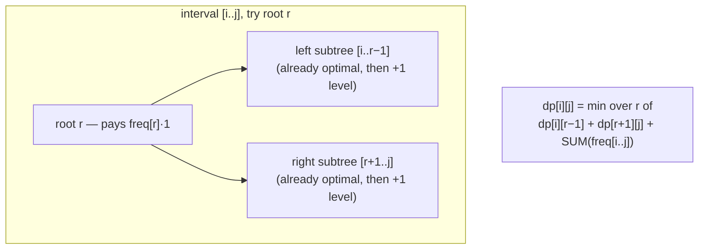

# Deep Dive — DSA #4: Optimal BST (the "toughest screening round")
> Asked **2x** as Uber's Round-1 Screening (Nov 2025 & May 2026) — both
> candidates called it their hardest round; one passed with memoization and
> got the offer
> Solution: `../solutions/dp_math.py` · Mock: `../mocks/dsa_04_optimal_bst.py`
> Pattern doc: `../learn/06_dp_patterns.md`

---

## 1. The problem in simple words
Sorted words + how often each is searched. Build a BST holding all of them
(inorder must equal sorted order) minimizing
**Σ frequency × depth** (root depth = 1 = one comparison).
Frequently-searched words should sit near the top.

## 2. UNLOCK #1 (say it in the first five minutes)
**"The words are a red herring."** A BST's inorder traversal IS sorted
order — the sequence is fixed; only the tree's **shape** is free. So the
input is really just the frequency array. Candidates who keep thinking
about strings burn 15 minutes; this sentence is the difference between
the two real candidates' experiences.

## 3. UNLOCK #2: what choosing a root does

For the interval of words [i..j], pick index r as root: left part [i..r−1]
becomes the left subtree, right part [r+1..j] the right subtree — **and
every node in both subtrees sinks one level deeper.**

"One level deeper for everyone in the subtree" costs exactly
`sum(freq[i..j])` extra (each node pays its own frequency once more):



Why `+sum` covers everything including the root: the root's own freq×1 is
inside sum(i..j), and each subtree's nodes pay (their depth within the
subtree) via dp + (the extra level) via sum. **Forgetting +sum is the #1
bug** — it silently treats depth as free and your hand-check catches it.

## 4. Hand-trace [3, 2, 4] (the 2026 interview's exact example — they checked by hand)

Base: dp[i][i] = freq[i] → dp00=3, dp11=2, dp22=4.
Pairs (sum included):
- [0,1] sum 5: root0 → 0+dp11+5 = 7; root1 → dp00+0+5 = 8 → **dp01 = 7**
- [1,2] sum 6: root1 → 0+dp22+6 = 10; root2 → dp11+0+6 = 8 → **dp12 = 8**
Full [0,2], sum 9:
- root0: dp12 + 9 = 17
- root1: dp00 + dp22 + 9 = 3+4+9 = **16** ✔
- root2: dp01 + 9 = 16 … also 16! (tie — both shapes cost 16; answer 16)

Matches the official answer: banana(2)·1 + apple(3)·2 + cherry(4)·2 = 16.
Do this table OUT LOUD in the interview — the real interviewer hand-checked.

## 5. The code (memoized — the version that got the offer)

```python
from functools import lru_cache
def optimal_bst_cost(freq):
    prefix = [0]
    for f in freq: prefix.append(prefix[-1] + f)
    rng = lambda i, j: prefix[j+1] - prefix[i]

    @lru_cache(maxsize=None)
    def dp(i, j):
        if i > j: return 0
        return rng(i, j) + min(dp(i, r-1) + dp(r+1, j) for r in range(i, j+1))
    return dp(0, len(freq) - 1)
```
Prefix sums make `rng` O(1) — without them you add an O(n) factor.
Tabulated by-span version in `../solutions/dp_math.py` (avoids recursion
limits past n≈1000).

## 6. Complexity
States O(n²), transitions O(n) → **O(n³) time, O(n²) space.** n ≤ 250 fits.
The flourish: "**Knuth's optimization** exploits monotonicity of the optimal
root to cut it to O(n²) — I wouldn't code it here." Name, don't build.

---

## 7. FOLLOW-UP 1: "Why doesn't greedy (highest frequency at root) work?"
Greedy ignores how a root choice **unbalances everything else** — it
optimizes one node's depth while potentially pushing many medium-frequency
nodes deep. Honest answer structure: "greedy makes a locally-best choice
with global consequences the recurrence prices but greedy doesn't; I can't
prove an exchange argument for it, and DP over all roots is cheap here."
(For the curious: counterexamples exist but are fiddly to produce live —
saying you can't PROVE greedy is itself the right move.)

## 8. FOLLOW-UP 2: "Return the actual tree, not just the cost"
Store the argmin: `root[i][j] = r` that achieved dp[i][j]. Rebuild
recursively: node = words[root[i][j]], left = build(i, r−1), right =
build(r+1, j). O(n²) extra space, O(n) rebuild. Sketch, don't fully code.

## 9. FOLLOW-UP 3: "Frequencies change online — rebuild every time?"
The honest ladder:
1. This DP doesn't incrementalize — one freq change can reshape everything.
2. Practical: batch updates, rebuild periodically (cost O(n³)/rebuild,
   amortized fine if queries ≫ updates).
3. The real-world named answer: **self-adjusting trees (splay trees)** get
   within a constant of optimal *without knowing frequencies* — "if
   frequencies drift, I'd reach for splay-tree-style adaptivity instead of
   recomputing optimality." Judgment > formula here.

## 10. FOLLOW-UP 4 (the round's design tail): "Where does this matter in a real system?"
Credible connections (pick one, go one level deep):
- **Autocomplete / search-suggestion trees** weighted by query frequency.
- Hot-key dictionary layout — frequently accessed keys cheaper to reach.
- Huffman-coding cousin: same "frequent = shallow" energy, different
  constraint (Huffman has no ordering requirement — BST does; that ordering
  constraint is exactly why we need interval DP instead of a greedy merge).
That contrast sentence (Huffman-greedy works because order is free; here
order is fixed so DP) ties the whole round together beautifully.

## 11. What the interviewer writes down
✓ "words are a red herring" early · ✓ +sum term present & explained ·
✓ hand-check [3,2,4]=16 done unprompted · ✓ memoized working code ·
✓ O(n³)/Knuth name-drop · ✓ splay-tree judgment on follow-up 3.
The real offer-getter's bar: working memoized solution + clear narration,
even with time pressure. That's YOUR bar.
