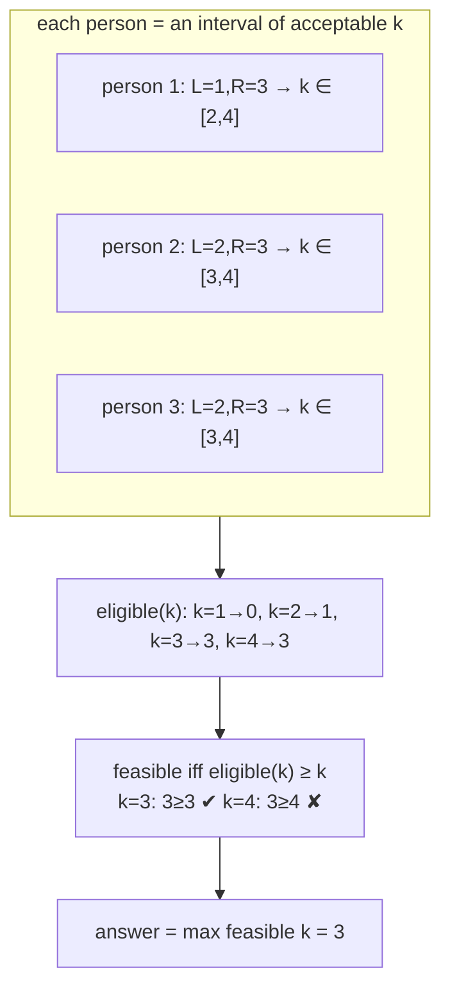

# Deep Dive — DSA #5: Haunted House (max group under [L,R] constraints)
> Asked **3x** last year: elimination round, hiring-drive Coding Round 1,
> SDE-3 DSA · an off-by-one minefield by design
> Solution: `../solutions/arrays_windows.py` · Mock: `../mocks/dsa_05_haunted_house.py`

---

## 1. The problem in simple words
N people. Person i joins a group of size k only if the number of OTHERS
(= k−1) satisfies `L[i] ≤ k−1 ≤ R[i]`. Find the largest feasible group size.
N up to 2·10^5 → need O(n log n) or O(n).

## 2. How to THINK about it (the 3-step chain that wins)

**Step 1 — flip the question.** Don't ask "who should go?" Ask:
**"for a FIXED group size k, who is even eligible?"**
Person i is eligible iff `L[i] ≤ k−1 ≤ R[i]`, i.e. **k ∈ [L[i]+1, R[i]+1]**.
Every person is just an interval of group sizes they'd accept:



**Step 2 — the justification (this is what separates Hire from Strong
Hire, and the interviewer kit probes it):** if eligible(k) ≥ k, can we just
pick ANY k eligible people? **Yes — because eligibility depends only on k,
not on WHO else goes.** Each chosen person sees a group of size k, their
condition holds by eligibility, done. (Contrast: if constraints referenced
specific people, this collapses — see follow-up 4.)

**Step 3 — compute eligible(k) for ALL k at once.** Each person adds +1 to
a RANGE of k values → **difference array**:

```python
def max_group_size(L, R):
    n = len(L)
    diff = [0] * (n + 2)
    for l, r in zip(L, R):
        lo, hi = l + 1, min(r + 1, n)      # clamp: k can't exceed n
        if lo <= hi:
            diff[lo] += 1
            diff[hi + 1] -= 1
    best = cur = 0
    for k in range(1, n + 1):
        cur += diff[k]                      # cur == eligible(k)
        if cur >= k:
            best = k
    return best
```
O(n) total. The alternative (sort by L + binary search / two pointers,
O(n log n)) is equally accepted.

## 3. The off-by-one map (this problem's REAL difficulty)
Three different quantities live one apart — write them on the pad:
| quantity | meaning |
|---|---|
| k | group size INCLUDING person i |
| k−1 | what L/R constrain (the OTHERS) |
| [L+1, R+1] | person i's interval in k-space |
Plus the clamp `min(R+1, n)` (intervals beyond n are meaningless) and the
guard `lo ≤ hi`. The mock's edge tests exist for exactly these:
`L=[2],R=[3]` → alone means k−1=0 < 2 → **0** · `L=[0,0],R=[0,0]` → only a
SINGLE person works (k=2 would mean 1 other > R=0) → **1**.

## 4. Complexity
O(n) time, O(n) space (diff array). Brute force O(n²) — fine to state
first, then the size 2·10^5 forces the upgrade.

---

## 5. FOLLOW-UP 1: "Output WHO goes, not just the count"
For the winning k: one pass collecting indices with `L[i]+1 ≤ k ≤ R[i]+1`,
take the first k of them (ANY k work — restate the step-2 justification).
O(n). The probe is checking you actually believed your own proof.

## 6. FOLLOW-UP 2 (the trap): "Is the feasible set of k contiguous? Binary search it?"
**No — feasibility is NOT monotonic in k.** Counterexample, three people
all with L=2, R=2 (each wants exactly 2 others):
- k=3: all three eligible, 3 ≥ 3 ✔ feasible
- k=2: nobody eligible (k−1=1 ∉ [2,2]), 0 ≥ 2 ✘ infeasible
- k=1: ✘
Feasible set = {3} with holes below it → plain binary search on k is WRONG.
Many candidates confidently propose it; catching this is a Strong Hire
marker. (Same lesson as DSU-deletion: check monotonicity BEFORE binary
searching anything.)

## 7. FOLLOW-UP 3: "People arrive one at a time (stream); report the max after each arrival"
Maintain the eligible-counts as a structure supporting **range add** (new
person's interval) and then find max k with count(k) ≥ k:
- Easy: keep the diff array, recompute the prefix scan O(n) per arrival →
  O(n²) total. Honest and acceptable.
- Better: a BIT/segment tree gives range-add + point-query in O(log n), but
  "max k with eligible(k) ≥ k" still needs a scan — unless the segment tree
  stores max(eligible(k) − k) per node, then descend to the rightmost
  position with value ≥ 0: **O(log n) per arrival**. Sketching that segment-
  tree-descent idea (not coding it) is full credit.

## 8. FOLLOW-UP 4: "Some pairs refuse to go together"
The clean counting argument DIES — eligibility now depends on WHO goes, not
just how many. Say that explicitly, then scope it: forbidden pairs form a
graph; we need a max subset of size k that's an independent set in the
conflict graph among eligible(k) people → independent-set flavored → NP-hard
in general; with FEW pairs, inclusion-exclusion or "at most one of each
pair" matching arguments work. Reasoning is graded, not a polynomial
solution (there isn't one).

## 9. What the interviewer writes down
✓ flipped to fixed-k counting · ✓ "any k eligible work" justified ·
✓ diff-array O(n) with clamps right · ✓ single-person edge cases pass ·
✓ non-monotonicity counterexample on follow-up 2 · ✓ stream/segment-tree
sketch · ✓ k vs k−1 hygiene throughout (they literally grade this).
