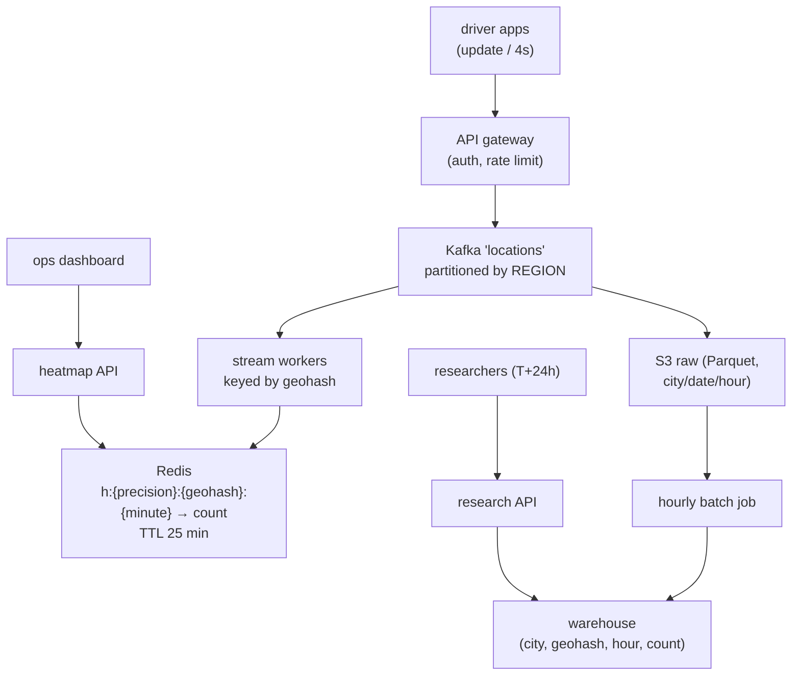

# Deep Dive — HLD #1: Real-Time Driver Heatmap (+ every probe answered)
> THE Uber archetype (~10 design rounds last year were this shape) ·
> Playbook (compact): `../hld/01_realtime_heatmap_topk.md` · Mock: `../mocks/hld_01_heatmap_INTERVIEWER.md`
> This doc = the UNDERSTANDING version: why each piece exists + full probe answers.

---

## 1. The problem, and what's secretly being tested
"Drivers send locations every few seconds; show a density heatmap."
Secretly tested: (a) do you ask before drawing (a senior was rejected for
not doing this), (b) can you handle a **write firehose** that no OLTP
database survives, (c) do you know geo-indexing, (d) windowed aggregation.

## 2. Why naive designs die (build intuition by elimination)
- **"Insert each update into Postgres, query with GROUP BY"**: 250K-1M
  writes/sec melts row-based OLTP; the GROUP BY over billions of rows per
  viewport read is worse. Numbers kill it — which is why you estimate first.
- **"Cache the GROUP BY"**: still recomputed from raw rows; the problem is
  doing aggregation at READ time at all.
- The fix that defines the architecture: **aggregate at WRITE time** (stream
  processing), serve precomputed counts at read time. Reads become MGETs.

## 3. The two consumers (the requirement people fail to discover)
Real round had BOTH: ops dashboard (last 20 min, minute buckets, ~seconds
fresh) AND researchers (after 24h, hourly buckets, exact). Two freshness
contracts ⇒ **two paths over one ingest** (lambda shape):



## 4. Geohash — actually understand it (2 minutes)
Encode (lat,lng) by repeatedly halving the world: each bit says "left or
right half". Group bits into base-32 chars → a string like `tdr1y` where
**longer prefix = smaller cell, shared prefix = nearby**. So:
- a zoom level ⇔ a precision (5 ≈ 5km, 6 ≈ 1.2km, 7 ≈ 150m)
- "all counts in this viewport" = enumerate cells covering the box at that
  precision → MGET those keys. No geometry at read time.
- Caveat to volunteer: neighboring points across a cell boundary can have
  very different hashes → for nearest-X queries fetch the 8 neighbors too
  (for heatmap counts it doesn't matter — we want per-cell counts anyway).
- At Uber, name **H3** (their own hexagonal system; hexagons = uniform
  neighbor distances). One sentence = free credibility.

## 5. The write path, hop by hop (walk this in the interview)
1. App posts {driver, lat, lng, ts} every 4s → gateway auths → **202
   immediately** (fire-and-forget; the driver app must never block).
2. Kafka append, partition by region → ordering within a region, horizontal
   scale across regions.
3. Stream worker consumes its region, computes geohash at precisions 5/6/7,
   increments 3 counters for (precision, cell, current-minute).
4. Counters flushed to Redis continuously; keys carry TTL 25 min — the
   "window" cleans itself up, no deletion job.

End-to-end freshness math (PROBE: "exactly how stale?"): app cadence 0-4s +
ingest ~100ms + worker flush ≤1s + UI poll ≤5s ⇒ **~5-10s worst case**.
Walking this chain unprompted is a Strong Hire move.

## 6. PROBE ANSWERS (the six from the kit, fully worked)

**P1 — "Why partition Kafka by region, not driver_id?"**
The aggregation key is (cell, minute). With driver_id partitioning, one
cell's updates scatter across ALL partitions → every worker holds partial
counts for every cell → you need a second shuffle/merge stage. Region
partitioning gives **locality**: one cell's data lands on one worker; its
counter is complete. Cost: hot regions — answered in P2.

**P2 — "Stadium event: one cell gets 100×. What melts first?"**
Order of failure: the partition consumer lags (one Kafka partition = one
consumer's throughput cap) → then the single Redis counter key becomes a
hot key. Fixes, increasing effort:
1. Sub-partition hot regions (region+hash(driver)%8) — accept the merge for
   those cells.
2. **Salted counters**: write to `key:{0..7}` round-robin, SUM 8 keys on
   read. Classic sharded-counter; say it by name.
3. If keys are unbounded (top-K skins): **count-min sketch** per window —
   fixed memory, small overcount, fine for rendering.

**P3 — "Zoom-out = whole city: how many Redis reads? Make it cheap."**
At precision 7 a city is ~10^5 cells × 20 minutes — too many. That's WHY we
precompute **multiple precisions**: zoomed out reads precision 5 (~hundreds
of cells). Plus: per-(viewport, zoom, minute) short-TTL response cache, and
batch MGET (one round trip). The lesson to state: "zoom levels are a
read-time problem solved at write time."

**P4 — staleness:** §5 chain.

**P5 — "APIs please":**
```
POST /v1/location {driver_id, lat, lng, ts} -> 202
GET  /v1/heatmap?bbox=a,b,c,d&zoom=12&window=20m
 -> {"cells":[{"geohash":"tdr1y","minute":"...T10:41","count":137},...]}
```
zoom → precision mapping lives server-side; response is render-ready.

**P6 — "30 days of hourly Mumbai data?"** Warehouse table partitioned by
(city, date) → a partition-pruned scan, NOT Redis (TTL'd long ago). This is
why the batch path exists; the probe checks you didn't treat it as
decoration.

## 7. Reliability corner (volunteer one of these)
Worker crash → Kafka replays from last offset → recompute increments:
**at-least-once + idempotency question**. For a heatmap, honest answer:
small overcounts acceptable (SAY it as a choice); if exactness mattered,
dedupe by event-id or use exactly-once sinks. Redis down → serve last
rendered frame + stale banner (degrade, never 500). Late events →
event-time windows + 5-10s watermark; later → drop in RT path, batch path
stays exact.

## 8. The top-K twin (same skeleton, different aggregate)
Trending dishes / heavy hitters: replace per-cell counters with per-window
count maps + a size-K min-heap (`../learn/04_heaps_topk_streams.md`);
unbounded keys → count-min sketch + candidate heap; batch path reconciles
exact top-K later. If you can tell the heatmap story, you can tell this one
by substitution — rehearse the mapping once.
