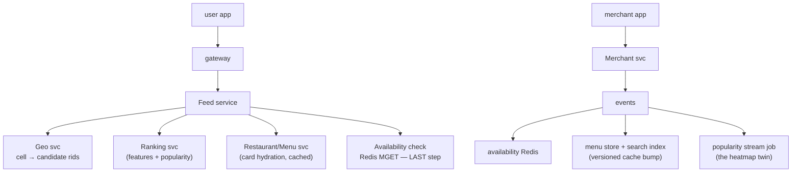

# Deep Dive — HLD #2: Uber Eats Homepage (+ train variant, every probe answered)
> Asked 3x (once bar-raiser; stated focus: "FR/NFR, entities, DB & caching
> deep dives") · Playbook: `../hld/02_uber_eats_homepage.md` · Mock: `../mocks/hld_02_uber_eats_INTERVIEWER.md`

---

## 1. The one idea that organizes everything: the FRESHNESS SPLIT
Different data on the same screen has different staleness budgets:
| Data | Budget | Consequence |
|---|---|---|
| restaurant open/closed, item 86'd | **seconds** | hot KV (Redis), event-driven writes, checked LAST before render |
| ranking/popularity | minutes | stream-computed scores, cached generously |
| menus, names, images | hours | document store + versioned cache + CDN |

Say this split in minute 6 and the whole round tilts your way — every cache
question afterward has a principled answer ("which freshness class is it?").

## 2. Why one database fails (the elimination reasoning)
MySQL-for-everything probe: menus are deeply nested docs (sections → items →
options) → join explosion or JSON blobs; availability is a tiny hot flag
written 10K+/sec at mealtimes → row churn + replication lag exactly where
freshness matters most; geo-nearby needs spatial indexing. Three workloads,
three stores — justified per workload, not by fashion.

## 3. Architecture



### The feed request, hop by hop (rehearse this walk)
1. `GET /home?lat,lng` → Feed svc.
2. Geo svc: lat/lng → cell (geohash/H3) → **precomputed candidate set**
   (~200 rids per cell, refreshed every few minutes) — this is what absorbs
   the lunch spike; no per-request geo query.
3. Ranking: blend popularity score + user features → order candidates;
   **timeout 50ms → fallback to popularity order** (degrade, never fail).
4. Hydrate top ~40 cards from menu/restaurant cache.
5. **Availability MGET as the FINAL filter** — closed restaurants never
   render, regardless of every upstream cache being stale.
Order matters and is gradeable: rank on cheap cached data first, spend the
fresh check only on what the user will actually see.

## 4. Data model (concrete, with keys)
```
restaurants(rid PK, name, geo, hours, cuisine, rating)        — Postgres
menus: doc store  { rid, version, sections:[{items:[...]}] }  — by rid
availability: Redis  av:{rid} → {open:bool, items_86:set}     — TTL none; event-written
geo index: cell → [rid,...]  (precomputed, refreshed)         — Redis/ES
popularity: pop:{city}:{rid} → score                          — stream-updated
```
APIs (the round demands bodies):
```
GET /v1/home?lat&lng&cursor →
 {"sections":[{"id":"fast","title":"Fastest near you",
   "items":[{"rid":"r1","name":"...","eta_min":25,"rating":4.4,"fee":29}],
   "next":"c2"}]}
GET /v1/restaurants/{rid}/menu → sections/items + availability flags
```

## 5. PROBE ANSWERS (fully worked)

**P1 — "Restaurant closes RIGHT NOW: exactly how long until users stop
seeing it?"** Walk the chain: merchant taps close → event → Redis write
(~1s). New feeds: availability is the last-step filter → gone within ~1s ✔.
Already-rendered screens: stale until refresh — but tapping the menu
re-checks availability → "currently closed" state + alternatives. So:
**~1s for new renders, one-screen staleness max for old ones, and a failed
ORDER is impossible** because checkout re-validates. Layer-by-layer chains
like this are exactly what the bar-raiser wanted.

**P2 — "Ranking service is down":** circuit breaker on the ranker; serve
popularity-only ordering from cache; log + alert. The page is degraded, not
down. Generalize once: "every personalization dependency gets a
non-personalized fallback."

**P3 — "Write the home response body"** — §4. Have it ready; the real round
demanded request/response shapes explicitly.

**P4 — "Why a document store for menus?"** — §2 elimination.

**P5 — "How do you avoid recomputing nearby-restaurants per request?"**
Precomputed cell → candidates (§3 step 2). Refresh strategy: periodic job +
event-triggered for new/closed restaurants. The general principle: move
read-time work to write time when reads ≫ writes (same line as the parking
lot counters — patterns rhyme across rounds, SAY so).

**P6 — cache stampede/hot key:** lunch spike on one city's cells →
single-flight recompute + jittered TTLs; celebrity restaurant menu → salt
the cache key or replicate; versioned menu keys make invalidation raceless:
`menu:{rid}:{version}` — update bumps version, old keys age out, no purge
race window. "Versioned keys" is the phrase that lands.

## 6. THE TRAIN VARIANT (asked as its own round: "Uber Eats for train travelers via PNR")
What changes (and ONLY this — say it calmly):
1. PNR lookup → route: list of (station, ETA) for the journey.
2. Geo query becomes **route-aware**: for each upcoming station within the
   meal window → that station's precomputed candidate set (cells around the
   station — same geo machinery, station-keyed).
3. New feasibility filter: `prep_time(restaurant) + buffer <
   time_to_station` — a restaurant is only shown if food can be READY when
   the train arrives.
4. Feed groups sections BY STATION ("Arriving Surat 12:40 — order by 12:10")
   — deadline becomes a first-class field in the response.
5. New failure mode: train delayed → ETA updates re-validate pending
   feasibility; orders tied to a station get re-confirmed or auto-moved.
Everything else (freshness split, caches, availability-last) carries over
unchanged — demonstrating WHAT TRANSFERS is the real test of the variant.

## 7. Sentences that score (memorize three)
- "I'm splitting freshness: availability seconds-fresh, ranking
  minutes-fresh, menus hours-fresh — they get different stores and caches."
- "Availability is my LAST filter before render, so upstream staleness can
  never show a closed restaurant."
- "Menu cache keys are versioned — invalidation without purge races."
- "On ranker timeout I serve popular-only; the home page never 500s."
