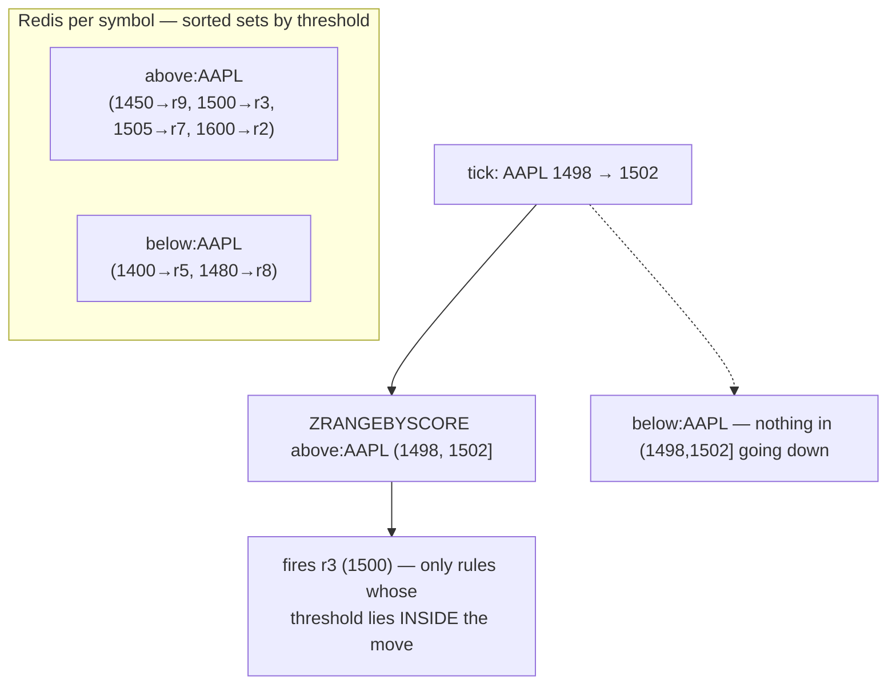
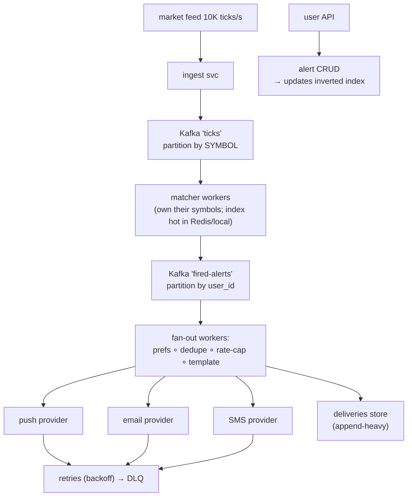

# Deep Dive — HLD #3: Stock Price Alerting / Notification System
> Real Uber SDE-2 HLD round (stock skin); generic notification skin in
> another loop; webhook skin in a third — one design, three skins
> Playbook: `../hld/03_notification_system.md` · Mock: `../mocks/hld_03_notifications_INTERVIEWER.md`

---

## 1. The problem and its hidden core
"Users set alerts: notify me when AAPL crosses 1500." 50M users × 5 alerts
= **250M rules**; market feed ~10K ticks/sec. The hidden core: **for each
tick, find which of 250M rules fire — without scanning them.** Everything
else (fan-out, channels, retries) is standard plumbing around that lookup.

## 2. The matching engine: an INVERTED INDEX on (symbol, threshold)

Naive: tick → scan rules WHERE symbol=AAPL → still millions. The unlock:
group rules by symbol AND **sort them by threshold** so a price move maps
to a RANGE of fired rules:



Per tick: O(log n + matches). The sentence: "price movement is an interval;
sorted thresholds turn 'who fires?' into a range query." That sentence IS
the round.

## 3. Crossing vs level semantics (the probe that exposes spam)
Rule "above 1500", ticks 1501, 1502, 1503 → how many notifications?
**One.** Fire on **crossing** (prev < 1500 ≤ now), not on level (now ≥
1500). Implementation: keep last_price per symbol; query the interval
(prev, now]. One-shot rules then deactivate; repeating rules get a cooldown
or re-arm only after crossing back. Miss this and probe #2 sinks the round.

## 4. Architecture end to end



**Why partition ticks by symbol** (and say it): one symbol = one matcher →
the read-modify-write on last_price and the deactivation of one-shot rules
are single-threaded per symbol — **the race disappears by partitioning**,
no distributed lock needed. This is the architectural version of "one lock
per topic" from the LLD broker; connecting them out loud is gold.

## 5. Delivery reliability (the honest chain)
- Matcher crash after match, before send → Kafka redelivers → duplicate?
  **Dedupe key (rule_id, crossing_ts)** checked with Redis SETNX (TTL 24h)
  before the provider call: at-least-once + idempotent send ≈
  effectively-once.
- Provider succeeded but ack lost → rare duplicate; log attempt BEFORE call,
  accept the trade-off out loud (the alternative — exactly-once to a phone —
  doesn't exist).
- Retries: backoff with jitter (1m → 5m → 30m), max N → **DLQ** + alarm.
- Spam control: per-user token bucket (10/hr push) + collapse keys ("3 AAPL
  alerts → 1 digest") + quiet hours → digest queue.

## 6. PROBE ANSWERS (fully worked)

**P1 — "Walk ONE tick end to end, with costs."** Tick AAPL 1498→1502 →
matcher (its partition) → two ZRANGEBYSCORE (above interval up, below
interval down) O(log n + m) → m fired events → Kafka → fan-out workers ~m
lookups (prefs O(1), dedupe O(1)) → provider calls. Total per tick: index
range query + O(matches). No step touches 250M rows.

**P2 — crossing probe:** §3 — answer "one," then explain crossing.

**P3 — "Market crashes; every 'below' alert fires in one minute."**
The burst is in MATCHES (millions), not ticks. What melts in order: fan-out
workers (scale horizontally — stateless), then providers (per-provider rate
limits, prioritize push > email, shed marketing-class first). Kafka absorbs
the spike as a buffer — that's WHY the queue sits between matcher and
fan-out. Per-symbol matchers don't melt: their work is still range queries.

**P4 — "matcher crashed mid-work: lost or duplicate? Pick one."**
Pick duplicate (at-least-once) and defend: offsets commit AFTER produce of
fired events; dedupe key absorbs the replays. "I'd rather explain a rare
duplicate than a missed sell signal" — judgment line that lands.

**P5 — APIs:**
```
POST /v1/alerts {symbol,"condition":{"type":"price_above","value":1500},
                 "mode":"one_shot","channels":["push"]} → {alert_id}
GET /v1/alerts?user= · DELETE /v1/alerts/{id}
```
Index update on CRUD: ZADD/ZREM in the symbol's sorted set, transactional
with the rules-store write (outbox if strict).

**P6 — "% change in a day" vs absolute:** absolute compares to a CONSTANT
(static index works); percent compares to a MOVING reference (open price /
24h-ago) → effective threshold = reference × (1±p) changes as the reference
moves → either recompute affected index entries when the reference shifts
(cheap: once per symbol per day for open-based) or index in percent-space
keyed by reference snapshot. Acknowledge the extra moving part honestly —
that's all the probe wants.

## 7. The webhook skin (one paragraph to have ready)
Replace providers with customer endpoints: HMAC-sign payloads (shared
secret), timeout 3-5s, retries on 5xx/timeouts only (never 4xx except 429),
exponential backoff, **per-endpoint circuit breaker** (failing 30 min →
disable + email owner), per-endpoint FIFO partition + sequence numbers if
ordering asked. Same skeleton, different last mile.
