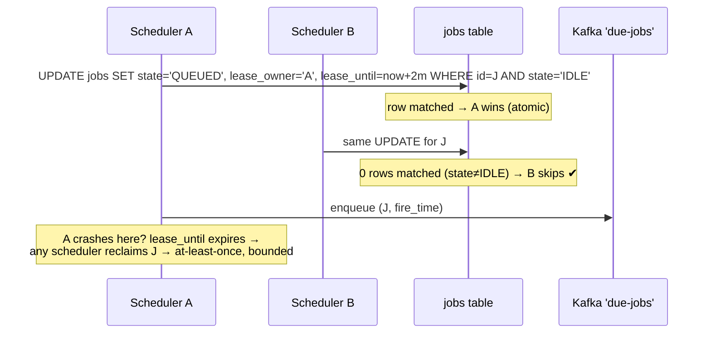
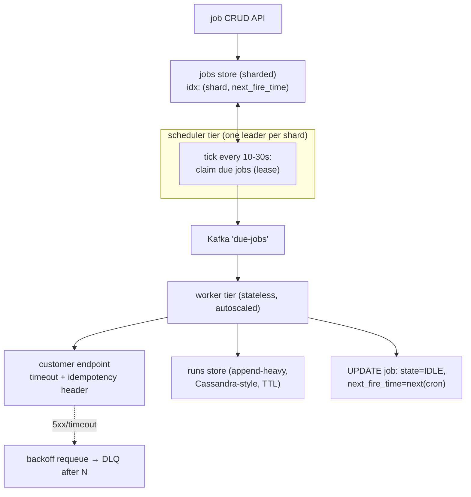

# Deep Dive — HLD #4: Distributed Job Scheduler (cron at 100M/day)
> Asked verbatim in an Uber SDE-4 loop ("100M tasks/day, 1-min granularity,
> strong guarantees"; push-vs-pull explicitly probed)
> Playbook: `../hld/04_distributed_job_scheduler.md` · Mock: `../mocks/hld_04_job_scheduler_INTERVIEWER.md`

---

## 1. The problem and the two sentences that frame it
Users register `cron + HTTP callback`; we fire on schedule. Frame it
immediately with two honest sentences:
1. "**Exactly-once execution over HTTP doesn't exist** — the call leaves my
   system. I'll guarantee at-least-once with an idempotency key the receiver
   can dedupe on."
2. "Cron load is **spiky by design** — everyone schedules midnight. Average
   1.2K/sec means nothing; I design for the 00:00 minute."

## 2. The core idea: the schedule lives in ONE INDEXED COLUMN
Never "evaluate 100M cron expressions every minute." After each fire,
compute the job's **next_fire_time** and store it. Scheduling collapses to:
```sql
SELECT ... FROM jobs WHERE next_fire_time <= now AND state='IDLE' LIMIT batch
```
over an index on `(shard, next_fire_time)`. Cron expressions are only ever
parsed twice per fire: once to compute the next time, never to scan.

## 3. The duplicate-fire problem (where the round is won or lost)
Two scheduler replicas must not both dispatch job J. The mechanism:
**atomic claim with a lease** —



Three things to articulate:
- The claim is a **conditional UPDATE** (or `SELECT … FOR UPDATE SKIP
  LOCKED` — name it; it's the Postgres-native version, and SKIP LOCKED is
  precisely "don't fight over claimed rows").
- The **lease** (not a lock) covers scheduler death: expiry → reclaim. A
  lock without expiry = a crashed owner wedges the job forever.
- Result: **exactly-one-dispatcher, at-least-once-execution.** Crisp.

## 4. Full architecture



**Push vs pull (the explicitly-probed question)** — answer per hop:
- Scheduler → queue: **push** (scheduler knows WHEN things are due; latency
  matters at the fire moment).
- Queue → workers: **pull** (workers know their own capacity; pull =
  natural backpressure — a slow day's backlog never overwhelms them).
One sentence each direction; don't pick a side religiously.

## 5. The midnight spike, with numbers
1M jobs due at 00:00, 1-minute granularity:
1. **Jitter**: unless a job is marked strict, fire within [0, 30s) of the
   minute — flattens the instantaneous peak ~30×. (Per-tenant jitter seed →
   deterministic.)
2. **Sharded scans**: each shard's scheduler claims its own due rows in
   parallel; batch size tuned (e.g., 1000/claim).
3. **Workers autoscale on queue lag** — the queue absorbs what workers
   haven't drained; lag is the scaling signal.
4. **Per-destination concurrency caps** — one tenant with 1M self-inflicted
   jobs must not consume the global worker pool (probe #5's answer too).

## 6. PROBE ANSWERS (fully worked)

**P1 — "two replicas, what stops double fire?"** §3 verbatim.

**P2 — "worker dies mid-HTTP-call":** Kafka redelivers after the visibility/
ack timeout → another worker repeats the call → the receiver may execute
twice → that's WHY every call carries `Idempotency-Key: {job_id}:{fire_time}`
— "same contract as Stripe webhooks; receivers dedupe." If they push
"but did the first call execute?": "unknowable from my side — that's the
CAP-flavored truth of remote calls; at-least-once + receiver dedupe is the
only honest contract."

**P3 — midnight timeline:** §5 with the 30× jitter number.

**P4 — push vs pull:** §4.

**P5 — "an endpoint hangs 60s every call; blast radius?"** timeout 5s
(hang → timeout → retry-with-backoff → DLQ); per-destination concurrency
cap (e.g., 10) caps pool damage at 10 workers × 5s; circuit-break the
endpoint after sustained failure; alert the owner. Blast radius: that
tenant only. Isolation answers = senior answers.

**P6 — "scheduler down 10 minutes; missed fires?"** Name **misfire policy**,
per-job: `skip` (telemetry pings), `fire_once_coalesced` (most crons:
10 missed hourly runs → 1 catch-up), `catch_up_all` (billing-grade).
On recovery the due-scan naturally finds everything overdue; policy decides
what to enqueue. Knowing the word "misfire policy" (Quartz vocabulary) is
an instant credibility chip.

**P7 — APIs:**
```
POST /v1/jobs {cron, url, method, body, retry:{max:3,backoff:"exp"},
               misfire:"coalesce", jitter_ok:true} → {job_id}
GET /v1/jobs/{id}/runs?from= → [{fire_time, status, attempts, code, latency}]
```

## 7. Storage notes (one breath each)
jobs: sharded SQL — needs the transactional claim; 100GB total is easy.
runs: append-heavy, time-series-ish → Cassandra-style + TTL retention.
Clock truth: claims compare against **DB time**, not worker clocks (skew).

## 8. Connect it back (cross-round story)
This is the LLD scheduler/broker family at planet scale: the lease = the
lock's distributed cousin; the queue = the Condition variable's distributed
cousin; idempotency key = the dedupe set. Saying one of these mappings out
loud ties your LLD and HLD rounds into one coherent engineer.
