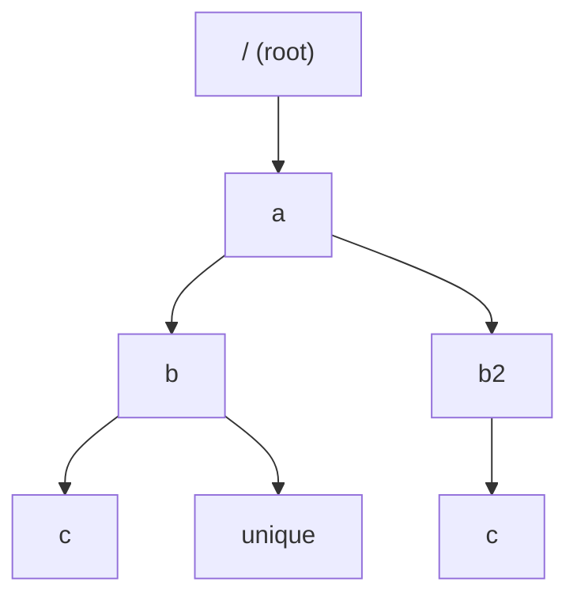
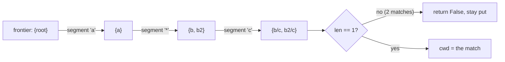
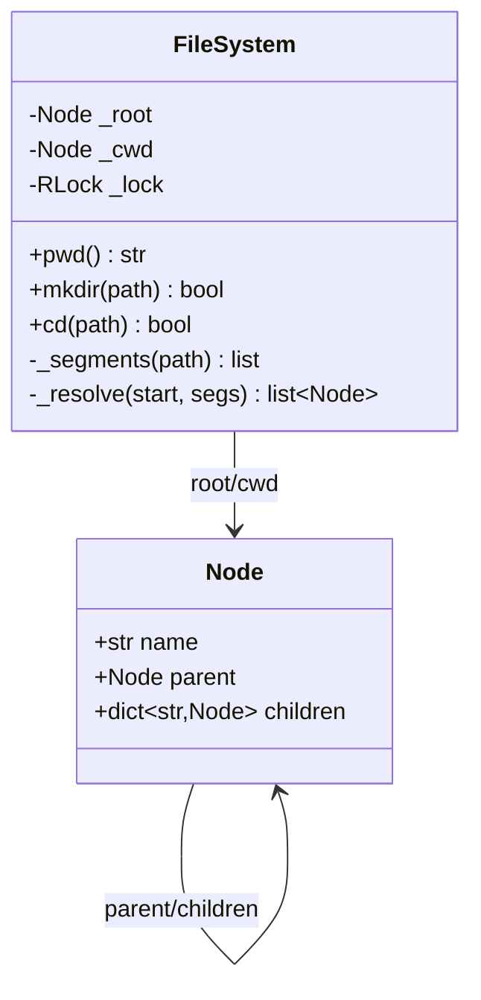
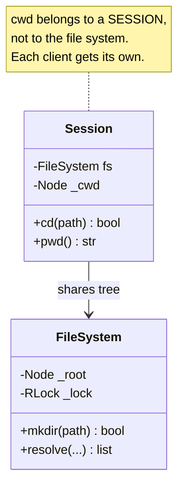

# Deep Dive — LLD #1: File System (mkdir / cd / pwd + wildcard)
> Asked **4x** at Uber last year · Machine Coding round · 45 min
> Reference code: `../lld/file_system.py` · Mock: `../mocks/lld_01_file_system.py`

---

## 1. The problem in simple words

Build an in-memory directory system:
- `mkdir("/a/b/c")` → create folders, creating missing parents on the way
- `pwd()` → where am I right now ("/a/b")
- `cd(path)` → move around; supports absolute (`/a/b`), relative (`b/c`),
  `.` (stay), `..` (go up), and `*` (wildcard matching exactly ONE folder name)

The wildcard rule that makes it interesting: `cd("/a/*/c")` succeeds **only
if exactly one** real path matches. Zero matches or two matches → return
False and **don't move at all** (no partial moves).

## 2. How to THINK about it (the reasoning path)

**Step 1 — what IS a file system?** A tree. Every directory is a node with a
name and children. That single sentence decides 80% of the design:



**Step 2 — what does each operation become on a tree?**
| Operation | Tree meaning |
|---|---|
| mkdir | walk down, create missing child at each step |
| pwd | walk UP from current node to root, collect names, reverse |
| cd | RESOLVE the path to a node; if success, move the "current" pointer |

**Step 3 — the key design insight (this is the Strong Hire move):**
separate **resolving** a path (find which node(s) it points to) from
**acting** on the result (moving cwd). Why?
- "No partial moves" becomes trivial: resolve fully FIRST, move only on success.
- Wildcard = resolution returning a *list* of nodes instead of one.
- Future ops (`ls`, `rm`) reuse the same resolver.

**Step 4 — wildcard = frontier search.** Resolving `/a/*/c` segment by
segment, keep a SET of possible nodes (a frontier):



This is breadth-first expansion over path segments — exactly like
multi-source BFS, but over name patterns.

## 3. The design



Why each choice:
- **`parent` pointer on Node** → `pwd()` and `..` become trivial upward walks.
  Without it you'd need to track the path as a list during cd — doable, but
  parent pointers are cleaner and survive follow-ups better.
- **`children` as dict** (name → Node) → O(1) lookup per segment.
- **`_resolve` returns a list** → wildcard ambiguity check is just `len != 1`.

### Walkthrough of the resolver (the heart)

```python
def _resolve(self, start, segs):
    frontier = [start]
    for s in segs:
        nxt = []
        for node in frontier:
            if s == ".":      nxt.append(node)
            elif s == "..":   nxt.append(node.parent or node)  # root stays root
            elif s == "*":    nxt.extend(node.children.values())
            elif s in node.children:
                nxt.append(node.children[s])
        frontier = dedupe(nxt)        # '..' patterns can create duplicates
        if not frontier: return []
    return frontier
```

Line-by-line intent:
- Plain segment: frontier either follows the child or that branch dies.
- `*`: frontier fans out to ALL children — this is the only place the
  frontier can grow.
- Dedupe matters: `/a/*/..` — both `b` and `b2` collapse back to `a`;
  without dedupe you'd wrongly count 2 matches of the same node.

### Conventions you must STATE (interviewers accept either, but you must pick)
- `cd("..")` at root → stays at root (alternative: return False).
- `mkdir` containing `*`/`.`/`..` → invalid, False.
- Trailing slashes ignored (`split('/')` + filter empties handles it free).

## 4. Worked trace (the mock's ambiguity case)

State: tree above, cwd = `/a/b2`. Call `cd("/a/*/c")`:
1. Absolute → start at root. Segments: `[a, *, c]`.
2. frontier {root} → `a` → {a} → `*` → {b, b2} → `c` → {b/c, b2/c}.
3. len == 2 → **False**, cwd still `/a/b2`. ✔ (no partial move was ever
   possible because we never touched cwd during resolution)

Then `mkdir("/a/b/unique")`, `cd("/a/*/unique")`:
frontier ends as {b/unique} → len 1 → cwd moves. ✔

## 5. Complexity
- `mkdir`/plain `cd`: **O(depth)**.
- `pwd`: O(depth).
- Wildcard cd: **O(paths matching the pattern)** — worst case
  O(branching^(#wildcards) × depth). State this honestly; it leads into
  follow-up 4.

---

## 6. FOLLOW-UP 1: "Walk me through cd('/a/*/c') with two matches"
Answered in §4 — the key sentence: *"resolution never mutates state; cwd is
written once, only after the full path resolved to exactly one node — so
partial moves are impossible by construction."*

## 7. FOLLOW-UP 2: "Add ls(path) with wildcard support"
Because resolve/act are separated, `ls` is ~4 lines:
```python
def ls(self, path):
    matches = self._resolve(self._start_for(path), self._segments(path))
    if len(matches) != 1: return None      # or merge: see below
    return sorted(matches[0].children.keys())
```
Design conversation to have out loud: for `ls("/a/*/c")` with MULTIPLE
matches, is the right answer an error, or a merged listing grouped by path
(like shell globbing)? Shell-style answer: return
`{path_of(node): sorted(children)}` for each match. Saying "depends on the
contract — shell merges, strict API errors" shows judgment.

## 8. FOLLOW-UP 3 (the real one from the loop): "Multiple threads call mkdir/cd concurrently — what breaks? Fix it."

Three distinct problems — name all three:

**(a) Tree mutation races.** Two `mkdir("/a/x")` threads both see `x` missing
and both insert → one insert lost (dict races) or duplicate nodes.
Fix: one lock around mkdir's walk-and-create.

**(b) Read-during-write.** `cd` walking the tree while `mkdir` mutates
children → inconsistent view / RuntimeError (dict changed during iteration).
Fix: same lock covers reads (or an RW lock if reads dominate — say the
trade-off, don't build it).

**(c) THE SUBTLE ONE — cwd is shared state.** Two threads `cd`-ing fight
over a single cwd; even with a lock, thread A's cd silently changes where
thread B's next relative path resolves. A lock makes it "not corrupt" but
still semantically wrong.



The fix is structural: **split FileSystem (shared tree + lock) from Session
(per-client cwd)** — exactly like every shell process having its own working
directory over one shared disk. Delivering this unprompted = Strong Hire.

**Lock granularity question (always follows):** per-node locks? Answer:
"No — lock-ordering complexity with `..` traversal invites deadlocks, and
critical sections here are microseconds. One coarse RLock; RW lock if
profiling shows read contention." Confidence in NOT over-engineering scores.

## 9. FOLLOW-UP 4: "10^6 directories, deep paths — can wildcard cd degrade?"
Yes: `/*/*/*/x` explores branching³ paths. Mitigations to discuss:
- Cap wildcards per pattern (API contract).
- Early termination: the moment frontier size exceeds 1 at the FINAL
  segment, you can stop (ambiguous already) — small but real optimization.
- For `ls`-style queries at scale: maintain an inverted index name → nodes,
  intersect by depth. (Mention, don't build.)

## 10. What the interviewer writes down
✓ tree + parent pointers · ✓ resolve/act separation · ✓ ambiguity = len≠1,
no partial moves · ✓ conventions stated · ✓ session-vs-filesystem cwd insight
· ✓ ran the code with asserts. Miss the session insight but get the rest →
Hire. Wildcard buggy/untested → Lean Hire.
