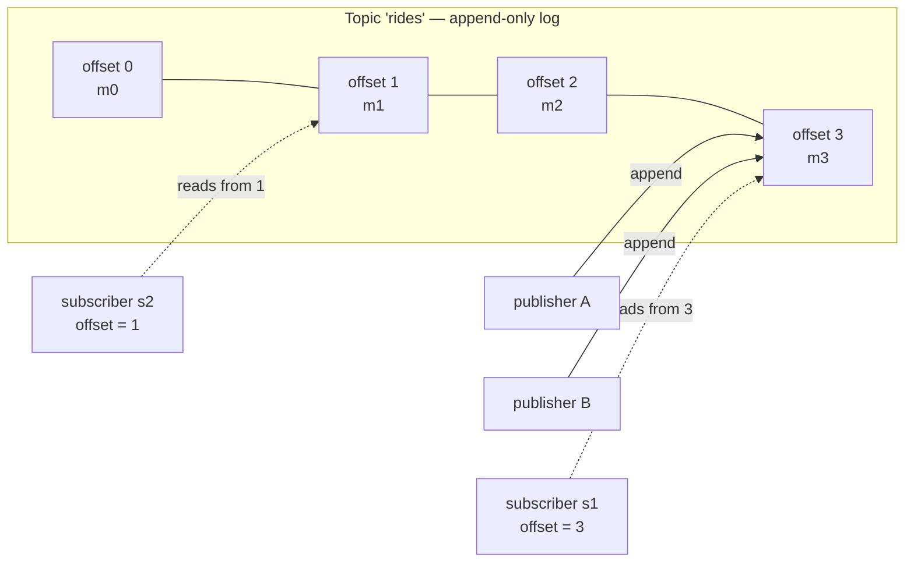
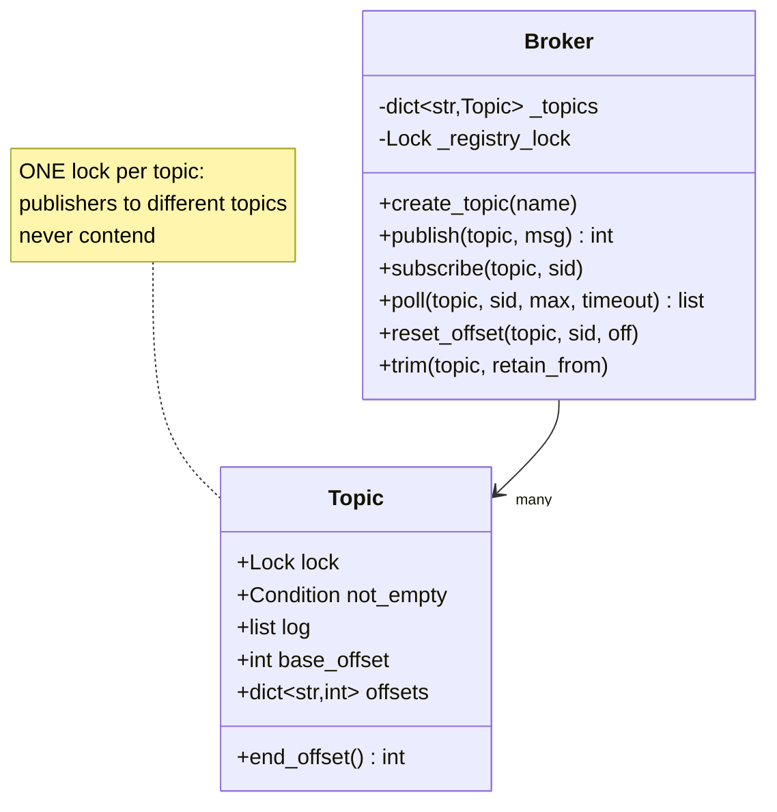
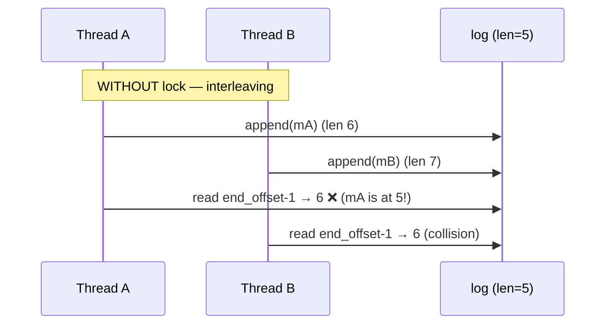
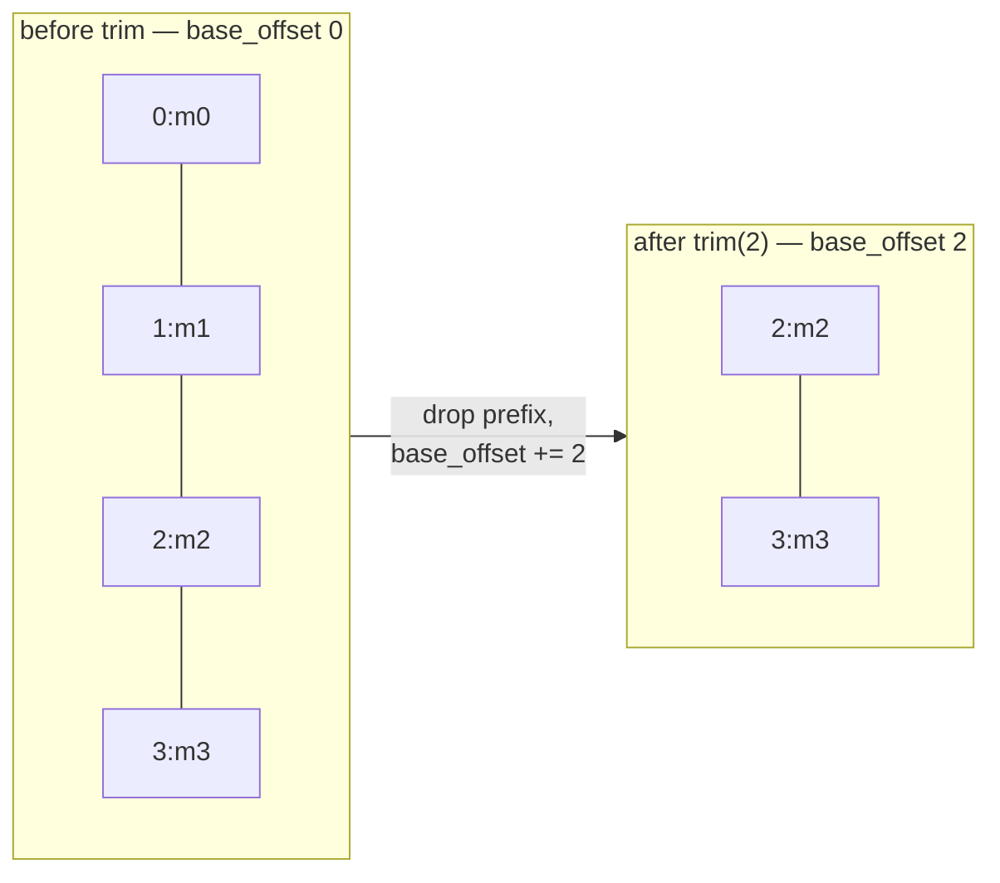
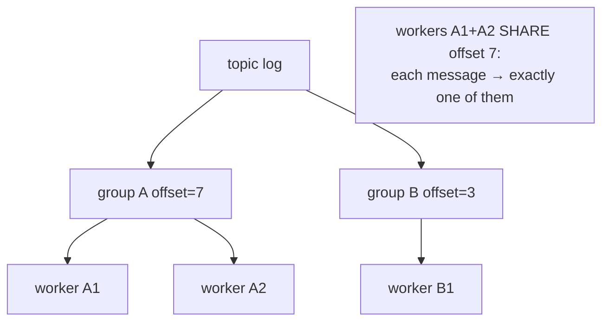

# Deep Dive — LLD #2: Thread-Safe Pub-Sub Message Broker (Kafka-lite)
> Asked **3x** at Uber last year ("design Kafka with concurrency support") ·
> Machine Coding round · 45 min · the only weak round in one all-YES loop
> Reference code: `../lld/pubsub_broker.py` · Mock: `../mocks/lld_02_pubsub_broker.py`
> HLD twin: `../hld/05_kafka_lite_broker.md` (same ideas at planet scale)

---

## 1. The problem in simple words

An in-memory "post office for services":
- Publishers `publish(topic, msg)` — many at once, concurrently.
- Subscribers `subscribe(topic, sid)` then `poll(topic, sid)` to receive
  every message published **after** they subscribed.
- **Fan-out semantics**: every subscriber gets every message (newspaper),
  NOT "each message to one consumer" (job queue). Asking which one is wanted
  is THE first clarifying question.
- `reset_offset(topic, sid, offset)` — rewind and replay old messages.

## 2. The single insight that unlocks everything

**Don't give each subscriber a queue. Give the topic ONE append-only log,
and give each subscriber just a NUMBER (their offset = how far they've read).**



Why this beats per-subscriber queues:
| | per-subscriber queues | shared log + offsets |
|---|---|---|
| publish cost | O(subscribers) copies | **O(1)** append |
| memory | message × subscribers | message × 1 |
| replay | impossible (consumed = gone) | **free** (offset -= n) |
| late subscriber sees old msgs? | needs special code | natural: start offset = current end |

Replay being *free* is the giveaway that the log model is what the
interviewer wants — `reset_offset` is in the requirements precisely to push
you here.

## 3. The design



Key decisions and their WHY:
- **Lock per Topic, not per Broker** — publishing to "rides" shouldn't block
  publishing to "eats". Registry has its own tiny lock just for topic
  creation. (Saying "lock per topic" unprompted is the difference between
  Hire and Strong Hire here.)
- **`offsets: dict[sid → next index to read]`** — subscriber state is 8 bytes,
  not a queue.
- **`base_offset`** — exists for retention (follow-up 3); offsets are
  *logical* and never reused even after old messages are deleted.
- **`Condition not_empty`** — built on the same lock, powers blocking poll
  (follow-up 2).

### publish / poll under the lock

```python
def publish(self, topic, message):
    t = self._topic(topic)
    with t.lock:
        t.log.append(message)
        offset = t.end_offset - 1
        t.not_empty.notify_all()     # wake blocked pollers
        return offset

def poll(self, topic, sid, max_messages=10):
    t = self._topic(topic)
    with t.lock:
        start = max(t.offsets[sid], t.base_offset)
        end   = min(start + max_messages, t.end_offset)
        msgs  = t.log[start - t.base_offset : end - t.base_offset]
        t.offsets[sid] = end
        return list(msgs)
```

The `- t.base_offset` translation: logical offset → physical list index.
Draw it once for yourself: after trimming 2 messages, logical offset 5 lives
at list index 3.

## 4. Worked trace (subscription semantics)

```
publish m0            log=[m0]            (nobody subscribed)
subscribe s1          offsets={s1:1}      ← starts at END (=1), so m0 invisible
publish m1, m2        log=[m0,m1,m2]
poll(s1)              returns [m1,m2], offsets={s1:3}
subscribe s2          offsets={s2:3}
publish m3
poll(s1) → [m3]       poll(s2) → [m3]     ← independent fan-out ✔
reset_offset(s1, 1)   poll(s1) → [m1,m2]  ← replay ✔
```

## 5. Complexity
publish **O(1)** · poll **O(k)** for k returned · subscribe/reset **O(1)** ·
memory O(total retained messages) — leads into follow-up 3.

---

## 6. FOLLOW-UP 1: "Two threads publish simultaneously — prove no loss/duplication"

Without the lock, `append` then `end_offset-1` is a read-modify-write pair:



With the lock, append + offset read are one atomic unit → each message gets
a unique, correct offset. **GIL disclaimer to say**: "list.append alone is
atomic under the GIL, but my INVARIANT (append + compute offset + notify) is
multi-step — the GIL can switch threads between steps, so the lock is
mandatory."

## 7. FOLLOW-UP 2: "Make poll BLOCK until a message arrives, with timeout"

The wrong answer (instant downgrade): `while not messages: sleep(0.1)`.
The right tool: **Condition variable** on the topic's lock.

```python
def poll(self, topic, sid, max_messages=10, timeout=None):
    t = self._topic(topic)
    with t.lock:
        t.not_empty.wait_for(
            lambda: t.offsets[sid] < t.end_offset, timeout=timeout)
        ...same read as before...
```

How it works (say this): `wait_for` atomically **releases the lock and
sleeps**; `publish`'s `notify_all` wakes it; it re-acquires the lock and
re-checks the predicate. Two probe-proof details:
- `wait_for(predicate)` not bare `wait()` → spurious wakeups handled.
- `notify_all` not `notify` → multiple subscribers may wait on the same
  topic; waking just one might wake the wrong one.

## 8. FOLLOW-UP 3: "Memory grows forever — add retention without breaking reset_offset"

Trim the log's head, remember how much was trimmed:



- Logical offsets never change meaning → existing subscriber offsets stay valid.
- `reset_offset(sid, 0)` with base_offset 2 → **policy decision**: raise
  error vs clamp to base. Pick one out loud ("I'll raise — silent clamping
  hides data loss from the caller").
- Retention policy choices: by count, by age, or "min over subscriber
  offsets" (never delete unread) — the last one risks one dead subscriber
  pinning memory forever → mention a max-lag eviction for dead subscribers.

## 9. FOLLOW-UP 4: "Consumer GROUPS — N workers share a subscription, each message to exactly one"

This flips fan-out → queue semantics **per group**:
- Keep ONE offset per **group** (not per worker).
- Workers of a group poll under the same topic lock → each message claimed
  by exactly one (the lock serializes the offset bump).
- Mention real-Kafka's version: partitions assigned to workers, rebalancing
  on join/leave — "out of 45-min scope, but that's the production shape."



## 10. FOLLOW-UP 5: "What would you monitor in production?"
Per-subscriber **lag** = end_offset − offset (the #1 health metric),
publish rate, poll latency, retained bytes per topic, subscriber liveness
(time since last poll). Lag growing while polls happen = slow consumer;
lag growing with no polls = dead consumer.

## 11. What the interviewer writes down
✓ log + offsets model (not queues) · ✓ per-topic locking with reasoning ·
✓ Condition-based blocking poll · ✓ base_offset retention · ✓ groups =
offset-per-group · ✓ concurrency test passing. Single global lock + correct
behavior → Hire. "GIL makes it safe" → Lean Hire cap.
