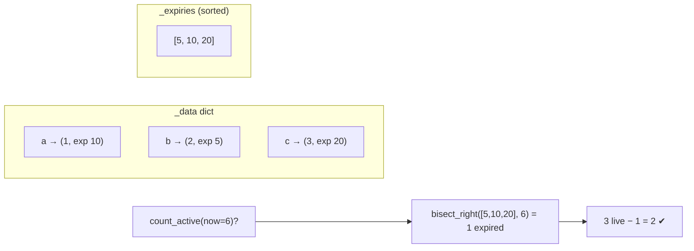
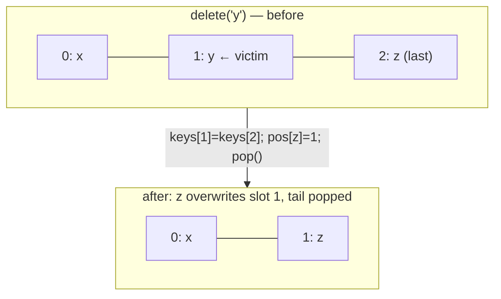

# Deep Dive — LLD #3: TTL Store + Thread-Safe RandomizedDict
> Both asked as standalone Uber rounds (SDE-4 Jan-2026; SDE-2 LLD) ·
> the "design a data structure" family — complexity discussion IS the round
> Reference: `../lld/ttl_random_store.py` · Mock: `../mocks/lld_03_ttl_random_store.py`

---

# PART A — TTLStore

## 1. The problem in simple words
A key-value store where every key has an expiry time:
- `put(key, value, expire_at)` — call timestamps strictly increase
- `get(key, now)` — value if the key is still alive at `now`, else None
- `count_active(now)` — how many keys are alive — **must beat O(n)**

## 2. How to THINK about it

`put`/`get` are easy (a dict). The whole question is `count_active` in
O(log n). Reasoning chain:

1. "Count of keys alive at `now`" = total live keys − keys already expired.
2. If all expiry times sat in a **sorted list**, "how many expired ≤ now" is
   one **binary search** (`bisect_right`). That's the O(log n).
3. So: dict for data + sorted list of expiry times, kept in sync.

## 3. The trap the round is built around: UPDATES create stale expiries

`put("a", 9, expire_at=30)` when `a` already had expire 10:
if you just insort 30, the sorted list holds BOTH 10 and 30 for one key →
count_active is wrong forever after.

Two valid strategies — name both, implement one:
| Strategy | put cost | count cost | catch |
|---|---|---|---|
| **Eager remove** old expiry (bisect + list.pop) | O(n) worst (list shift) | O(log n) exact | simple, correct — fine for interview if you SAY the O(n) |
| **Lazy/stale counter**: leave old entry, remember it's stale | O(log n) | O(log n) ± adjust stale bookkeeping; rebuild when stale > 50% | the "production" answer; more code |

(Outside interviews: a balanced BST / `sortedcontainers.SortedList` gives
O(log n) removes — SAY "in Java this is a TreeMap" for instant credibility.)

## 4. The boundary convention (a deliberate probe)

Is a key with `expire_at == now` alive? **Either answer is fine; pick one
and make code + tests consistent.** Reference picks "expires AT expire_at"
(alive while `now < expire_at`), so:
`count_active(now) = len(expiries) − bisect_right(expiries, now)`.
Defining this unprompted is a Strong Hire micro-signal.

## 5. Complexity summary to state
get O(1) · put O(log n) insert (+O(n) removal if eager — say it) ·
count_active **O(log n)** · memory O(live keys + stale entries if lazy).

---

# PART B — RandomizedDict (all ops O(1), uniform get_random)

## 1. Why a dict alone fails
`random.choice(list(d.keys()))` copies all keys → **O(n)** per call. The
challenge: uniform random in O(1) needs **index-addressable** storage
(an array), but delete from an array's middle is O(n). Resolve the tension.

## 2. The classic trick: swap-with-last

Keep an array of keys + a dict key→index. To delete index i:
**copy the LAST element into slot i, then pop the tail.** Order is destroyed
— but random doesn't care about order!

All four ops:
- `set`: append + record index (or overwrite value if key exists) — O(1)
- `get`: dict lookup — O(1)
- `delete`: swap-with-last + pop + fix the moved key's index — O(1)
- `get_random`: `randrange(len)` → array index — O(1), uniform because every
  live key occupies exactly one slot

Edge people fumble: deleting the LAST element itself (swap with itself —
guard `if i != last`), and updating `pos[moved_key]` (forget it → corruption
that only shows on the NEXT delete; add an assert in tests).

## 3. Thread-safety (the round's stated requirement)

Where exactly are the races? Be precise — vagueness here is what they grade:
1. `delete` (multi-step swap) vs `get_random` (index read) → get_random can
   read a stale length → IndexError, or catch a key mid-swap.
2. Two `set`s on the same NEW key → double append, two indices, corruption.
3. `len` check then `randrange` → list emptied between → crash.

Fix: ONE `threading.Lock` over every method (critical sections are
nanoseconds). Then the discussion answer: "read-heavy? RW lock so get/
get_random share; but Python's stdlib has no RW lock — I'd justify the
dependency or stay coarse." And the GIL line: *"single dict ops are
GIL-atomic, but my invariant spans dict + two lists — lock required."*

---

## FOLLOW-UP 1: "Show me count_active stays correct after a TTL update"
Walk the eager path: put(a, exp 30) → bisect_left finds old 10 → pop →
insort 30. List = [5, 20, 30]: count_active(25) = 3 − bisect_right(…,25)=2
→ 1 (only a)... and verify by hand: b dead (5), c dead (20), a alive (30) ✔.
If lazy instead: stale=[10], count = live_bisect − stale_bisect — show the
two-array subtraction.

## FOLLOW-UP 2: "Merge A and B: getRandom must skip expired keys — still O(1)?"
The honest answer (this is a trade-off probe, not a trick):
- Uniform O(1) over only-live keys + lazy expiry **conflict**: expired
  entries pollute the array.
- Option A — amortized: draw random; if expired, swap-delete it and redraw.
  O(1) amortized (each expired key pays once), worst-case spiky.
- Option B — exact: segregate by expiry buckets / accept O(log n).
SAY: "I'd take A and state the amortized bound; B if worst-case latency
matters." Choosing WITH the reason is the pass.

## FOLLOW-UP 3: "What unit tests? What breaks at 10M keys?"
Tests: same-timestamp boundary (exp == now), update-then-count, delete-last-
element, delete-then-get_random distribution (chi-square-ish sanity: 200
draws over 2 keys → both seen), random ops vs a brute-force model (the mock
does exactly this pattern).
At 10M: stale entries from updates (lazy) → rebuild threshold; GC pressure
from list pops → preallocated arrays; lock contention → shard the structure
by key-hash into 16 sub-stores, each with its own lock (this "sharded locks"
line is the senior close).

## What the interviewer writes down
✓ sorted-expiries + bisect insight · ✓ stale-update trap handled · ✓ boundary
convention stated · ✓ swap-with-last fluent, moved-index fixed · ✓ races
named precisely, lock scoped · ✓ amortized-vs-exact trade-off articulated.
