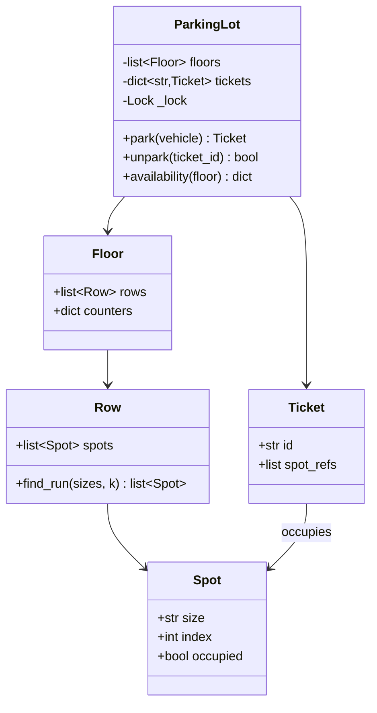
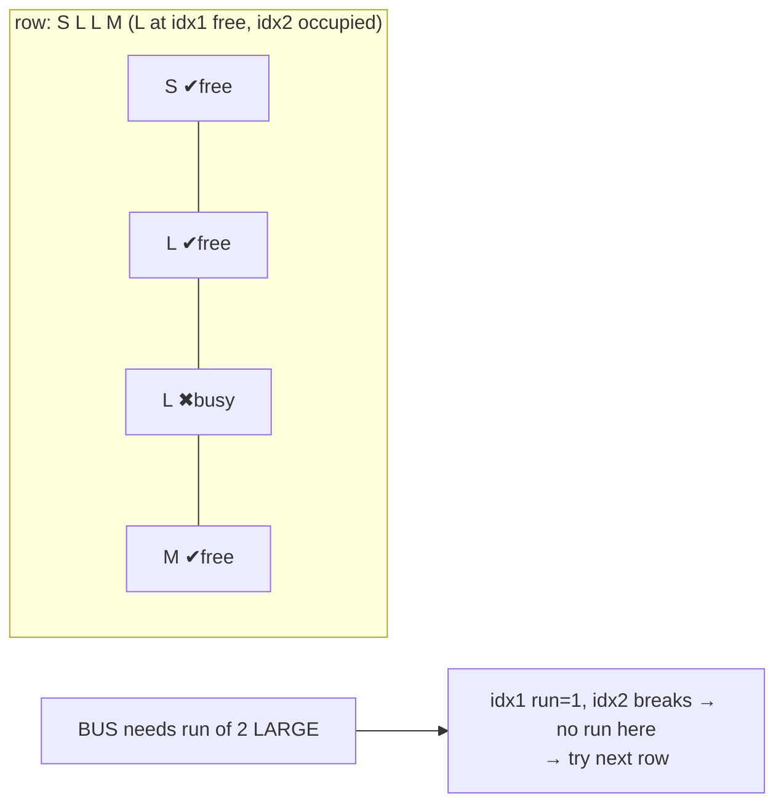
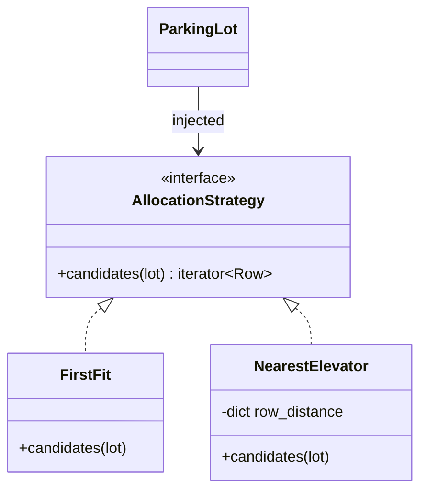
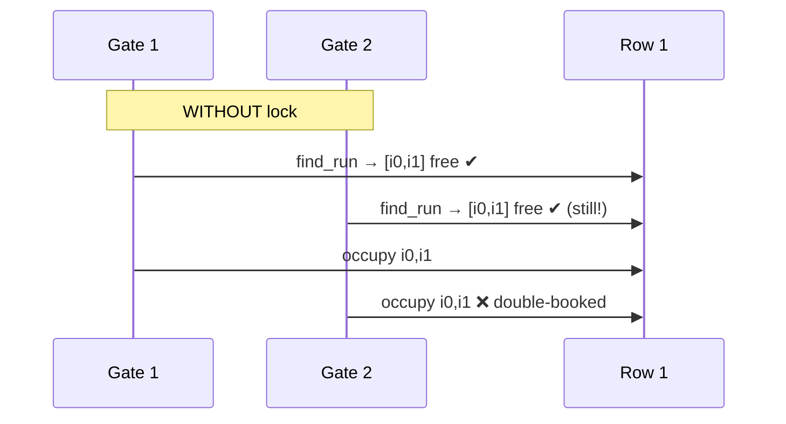

# Deep Dive — LLD #4: Parking Lot (with bus adjacency)
> The classic that still rejects people — cut a strong SDE-1 last year;
> appeared in an intern offer loop · 45 min machine coding
> Mock: `../mocks/lld_04_parking_lot.py`

---

## 1. The problem in simple words
Multi-floor lot; spots are SMALL/MEDIUM/LARGE; vehicles:
- BIKE fits any spot · CAR fits MEDIUM or LARGE
- **BUS needs 2 ADJACENT LARGE spots in the same row** ← the differentiator
Ops: `park(vehicle) → Ticket|None` (first-fit: lowest floor → row → index),
`unpark(ticket_id)`, `availability(floor)`.

## 2. How to THINK about it

**Step 1 — model the domain as data, not if-else.** "What can park where" is
a TABLE, not scattered conditions:

```python
FITS = {"BIKE": {"SMALL", "MEDIUM", "LARGE"},
        "CAR":  {"MEDIUM", "LARGE"},
        "BUS":  {"LARGE"}}          # quantity handled separately
NEEDS = {"BIKE": 1, "CAR": 1, "BUS": 2}   # adjacent count
```
Adding a TRUCK later = one line per table. If-else chains = one new branch
per method. This single choice decides follow-up 4.

**Step 2 — treat allocation as ONE concept.** A vehicle needs **k adjacent
suitable free spots in one row** (k=1 for bike/car). Don't special-case the
bus; generalize: scan each row for a run of k consecutive spots that are
free AND of allowed size. Bus stops being scary; it's just k=2.

**Step 3 — entities.**



Why Ticket holds a LIST of spots: the bus occupies two; unpark must free
both. Modeling tickets as (vehicle, single spot) is the design bug that
surfaces only when unparking a bus — think in lists from minute one.

## 3. The allocation walk (the core 15 lines)

```python
def park(self, vehicle):
    sizes, k = FITS[vehicle], NEEDS[vehicle]
    with self._lock:
        for floor in self.floors:
            for row in floor.rows:
                run = row.find_run(sizes, k)      # first k-window of free+fit
                if run:
                    for s in run: s.occupied = True
                    floor.counters_dec(run)        # see follow-up 3
                    t = Ticket(new_id(), run)
                    self.tickets[t.id] = t
                    return t
    return None
```

`find_run`: slide over the row counting consecutive spots that are free and
`spot.size in sizes`; reset the count on any miss; return when count == k.
First-fit ordering (floor → row → index) falls out of the loop order — say
that, it sounds deliberate because it is.



## 4. Worked trace (the mock's flow)
Floor0: row0 `[S, L, L, M]`, row1 `[L, L, L, S]`.
- park(BIKE) → S@r0i0. park(CAR) → first M-or-L free = L@r0i1.
- park(BUS) → r0: L-run is i1(busy now)…i2 → max run 1 → fail; r1: i0,i1 ✔
  → ticket{spots r1i0, r1i1}.
- park(BUS) again → r1 has only i2 large free → run 1 → None ✔
- unpark(bus ticket) frees BOTH spots → park(BUS) succeeds again ✔

## 5. Complexity
park O(total spots) worst case (fine; see follow-up 3 for the counters that
keep availability O(1)) · unpark O(k) · availability O(1) with counters.

---

## 6. FOLLOW-UP 1: "Product wants NEAREST-TO-ELEVATOR allocation, configurable per lot"

This is the Strategy-pattern probe. If allocation order is welded into
`park`'s loops, this hurts; if it's isolated, it's 10 minutes:



`park` becomes: `for row in self.strategy.candidates(self): ...` — the
find_run/occupy logic untouched. In Python the "interface" can literally be
a callable returning an iterator of rows. Sentence to say: "the strategy
owns ORDER, park owns CORRECTNESS — they change for different reasons."

## 7. FOLLOW-UP 2: "Two entry gates park simultaneously — what breaks?"

Classic **check-then-act**: both gates' `find_run` sees r1i0-i1 free; both
mark them; two buses, one pair of spots.



Fix: the lot-level lock already in §3 — find_run + occupy are one atomic
unit. Granularity discussion: per-floor locks work (allocation never spans
floors) and gates usually target different floors → real win; per-ROW locks
tempt deadlock questions for little gain. Land on: "coarse → per-floor if
contention is measured; never finer." Plus the GIL line as always.

## 8. FOLLOW-UP 3: "availability(floor) is called 1000×/sec — complexity? fix it"

Scanning spots per call = O(spots) × 1000/sec = waste. Fix: **maintain
counters** — `floor.free_count[size]` decremented on park, incremented on
unpark, returned by value in O(1). The general principle to name:
*"move cost from read time to write time when reads dominate"* — the same
idea as materialized views. Bonus probe-proofing: counters must be updated
inside the SAME critical section as occupy/free, or they drift.

## 9. FOLLOW-UP 4: "EV spots with chargers — what changes?"

Test of whether the type model extends or explodes:
- Spot gains a `features: set[str]` (e.g., {"EV_CHARGER"}).
- Vehicle requirement gains `required_features: set`.
- find_run's fit check: `spot.size in sizes and required ⊆ spot.features`.
Three lines, because fit was already DATA (step 1). If you'd written
if-else chains, this follow-up is a rewrite — which is exactly why they ask
it. Mention pricing/EV billing is a separate concern (ticket decorates).

## 10. What the interviewer writes down
✓ fit-as-data tables · ✓ bus = generalized k-run (not special-cased) ·
✓ Ticket → list of spots · ✓ counters for O(1) availability · ✓ strategy
isolation · ✓ race named + scoped lock · ✓ ran the asserts.
SDE-1 bar: everything above minus the strategy polish. The real rejected
SDE-1 had UML but incomplete code — RUN something.
