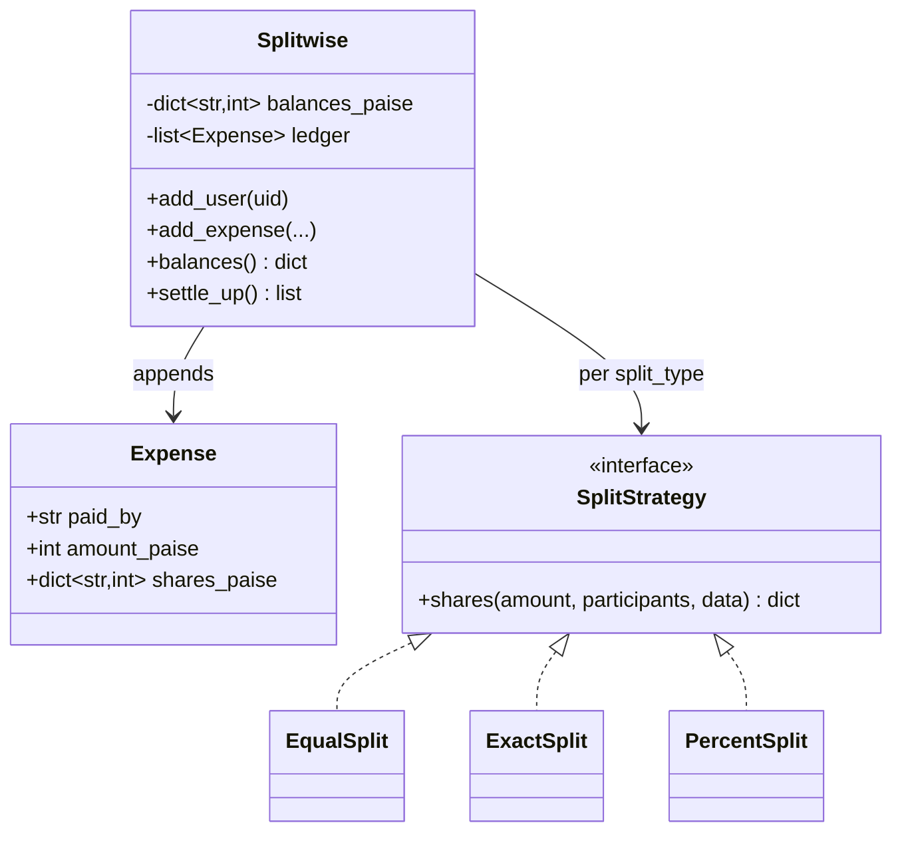
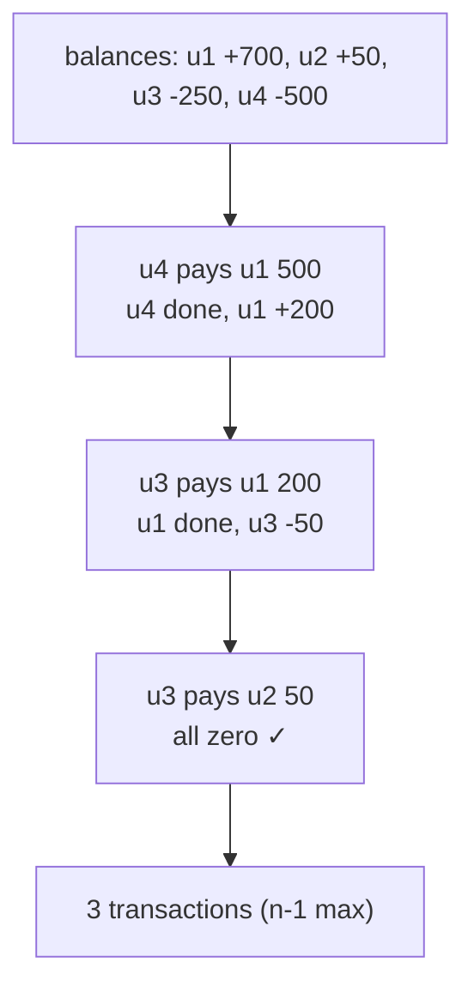

# Deep Dive — LLD #5: Splitwise Engine (expenses, balances, settlement)
> Asked at Uber in a 2026 offer loop (HLD whose heart was this logic) +
> Uber Eats pricing-calculator variants · 45 min
> Mock: `../mocks/lld_05_splitwise.py`

---

## 1. The problem in simple words
- `add_expense(paid_by, amount, participants, split_type, split_data)` —
  EQUAL / EXACT / PERCENT splits
- `balances()` — net per user (+ means others owe them)
- `settle_up()` — list of (debtor → creditor, amount) transactions that
  zero everyone, with as FEW transactions as possible

## 2. The two insights that carry the round

**Insight 1 — store NET balances, not who-owes-whom pairs.**
An expense updates one number per participant:
payer gets `+(amount − own_share)`, each other participant gets `−share`.
Invariant to state and assert: **Σ balances == 0 always.**

**Insight 2 — money is INTEGER paise, never floats.**
`0.1 + 0.2 != 0.3` in floats; after 50 expenses balances drift and
settle_up won't zero out. Convert at the API boundary (`round(x*100)`),
compute in ints, convert back for display. The interviewer WILL probe with
33.33/33.33/33.34 — design for it from minute one.

### Rounding policy for EQUAL (state it unprompted)
1000 paise ÷ 3 = 333.33… → shares [333, 333, 333], leftover 1 paisa.
Policy: **leftover goes to the payer's share** (they're already up; nobody
else over-pays). Any consistent stated policy passes; an unstated one fails
the probe.

## 3. The design

- **SplitStrategy** instead of if-else: each split type is one small class/
  function computing `{uid: share_paise}` + validating (EXACT sums to
  amount; PERCENT sums to 100). Follow-up 1 (add SHARES type) becomes ~5
  lines. This is Strategy *earning* its name — say that.
- **Ledger (append-only expense list) + balances (derived)**: balances are a
  running materialization. Matters for follow-up 4 and for "edit/delete an
  expense" extensions (recompute or apply inverse).

## 4. settle_up — the algorithm with a picture

Greedy: repeatedly match the **largest debtor** with the **largest creditor**;
transfer `min(|debt|, credit)`; one of them hits zero and drops out.

Why ≤ n−1 transactions: every transaction zeroes out at least one person.
**The bonus sentence** (real differentiator): "true minimum-transaction
settlement is NP-hard — it's subset-sum: finding a subgroup whose balances
sum to zero lets you settle them internally with fewer edges. Greedy's n−1
is the practical answer; Splitwise itself does roughly this."

Implementation: two heaps (max-debtor, max-creditor) or sort once and
two-pointer — O(n log n) either way.

## 5. Worked trace (the mock's numbers, in paise)
- u1 pays 100000 EQUAL among 4 → shares 25000 each → u1: +75000, others −25000.
- u2 pays 30000 EXACT {u1:10000, u3:20000} → u2: −25000+30000=+5000,
  u1: 75000−10000=65000, u3: −25000−20000=−45000. Σ = 65000+5000−45000−25000 = 0 ✔

## 6. Complexity
add_expense O(participants) · balances O(users) · settle_up O(n log n).

---

## 7. FOLLOW-UP 1: "Add a SHARES split (2:1:1)"
With Strategy: one new class — `share_i = amount * w_i // Σw`, distribute
the integer remainder (largest-fractional-part first, or payer). ~5 lines +
validation (weights positive). If your splits were if-else, this is where
the refactor tax comes due — which is the point of the probe.

## 8. FOLLOW-UP 2: "Two concurrent add_expense for the same group — what corrupts?"
- `balances[uid] += share` is read-modify-write → lost updates.
- Ledger append + balance update must be atomic TOGETHER, else a crash
  between them leaves ledger ≠ balances.
Fix: one lock per group around (validate → append ledger → apply shares).
**Senior bonus — idempotency**: client retries a timed-out add_expense →
expense applied twice. Give each expense a client-generated `expense_id`;
reject duplicates. ("Same contract as payment APIs.") Mentioning retries
unprompted reads as production experience.

## 9. FOLLOW-UP 3: "Is fewer transactions always better?" (judgment probe)
No single right answer — reason out loud:
- Netting changes WHO pays WHOM: u3 might owe u2 socially, but greedy routes
  u3's money to u1. Pairwise semantics carry social meaning; min-edges
  optimizes math, not relationships.
- Group settle vs running pairwise debts are different product modes
  (Splitwise has both: "simplify debts" is opt-in!).
Conclusion shape: "I'd keep the pairwise ledger as truth and offer
simplification as a VIEW — reversible, opt-in." Reasoning > answer here.

## 10. FOLLOW-UP 4: "10M users, groups of 1000 — where does it strain?"
- Per-group balances stay tiny — the unit of locking and storage is the
  GROUP. Shard by group_id.
- Global "all my balances across groups" = aggregation across shards →
  **ledger (source of truth) + materialized per-user rollups** updated
  async. The phrase "append-only ledger + materialized balance view" is
  the signal; it also gives audit/history for free.
- Hot group (1000-person trip) → its lock serializes writes: fine (writes
  are human-speed); reads from a snapshot.

## 11. What the interviewer writes down
✓ integer paise + stated rounding policy · ✓ Σ==0 invariant asserted ·
✓ Strategy splits, SHARES added live · ✓ greedy settle + NP-hard remark ·
✓ group lock + idempotent expense ids · ✓ ledger/materialized-view answer.
Floats with no policy → capped at Hire. PERCENT rounding broken & unflagged
→ Lean Hire.
